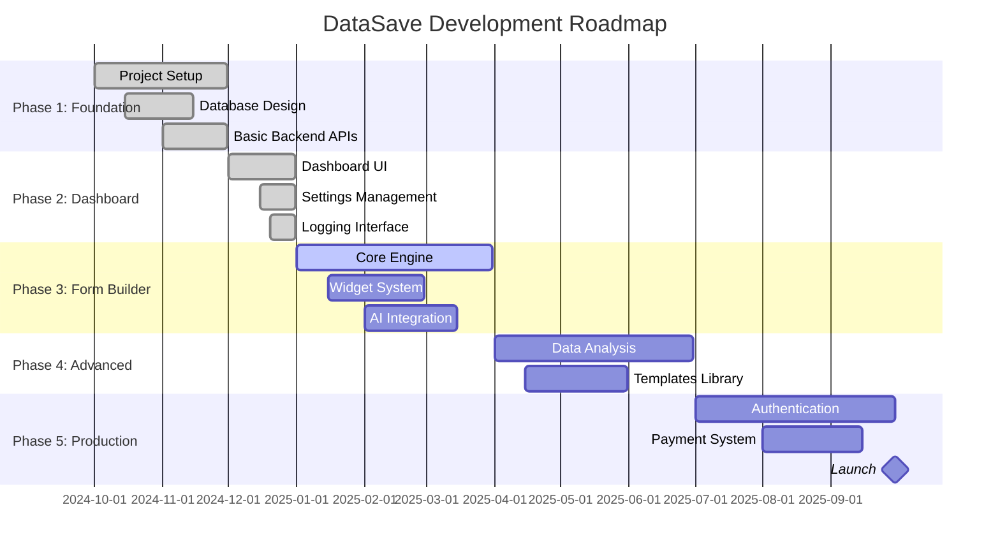

# نقشه راه توسعه - Development Roadmap

## 📊 Document Information
- **Created:** 2025-01-09
- **Last Updated:** 2025-01-09
- **Version:** 1.0
- **Maintainer:** DataSave Development Team
- **Related Files:** Project planning documents, GitHub milestones

## 🎯 Overview
نقشه جامع توسعه DataSave از آغاز پروژه تا راه‌اندازی تجاری کامل، شامل تمام فازها، milestone‌ها و اهداف کلیدی.

## 📋 Table of Contents
- [نمای کلی پروژه](#نمای-کلی-پروژه)
- [فاز 1: بنیان‌گذاری](#فاز-1-بنیانگذاری)
- [فاز 2: Dashboard و رابط اولیه](#فاز-2-dashboard-و-رابط-اولیه)
- [فاز 3: موتور فرم‌ساز](#فاز-3-موتور-فرمساز)
- [فاز 4: ویژگی‌های پیشرفته](#فاز-4-ویژگیهای-پیشرفته)
- [فاز 5: راه‌اندازی تجاری](#فاز-5-راهاندازی-تجاری)
- [فاز 6: توسعه و بهینه‌سازی](#فاز-6-توسعه-و-بهینهسازی)

## 🗺️ نمای کلی پروژه - Project Overview

### Timeline کلی


### Status Overview
| فاز | وضعیت | تکمیل | مدت زمان | اولویت |
|-----|-------|-------|----------|---------|
| **Phase 1: Foundation** | ✅ COMPLETED | 100% | 2 months | CRITICAL |
| **Phase 2: Dashboard** | ✅ COMPLETED | 100% | 1 month | HIGH |
| **Phase 3: Form Builder** | 🔄 IN PROGRESS | 25% | 3 months | CRITICAL |
| **Phase 4: Advanced Features** | 📅 PLANNED | 0% | 3 months | HIGH |
| **Phase 5: Production** | 🔮 FUTURE | 0% | 3 months | CRITICAL |
| **Phase 6: Enhancement** | 🔮 FUTURE | 0% | Ongoing | MEDIUM |

## 🏗️ فاز 1: بنیان‌گذاری - Foundation Phase

### 📅 Timeline: مهر - آذر 1403 (Oct - Nov 2024)
### 🎯 Status: ✅ COMPLETED

### Objectives
پایه‌گذاری معماری، ساختار پروژه، و ایجاد زیرساخت‌های اولیه برای توسعه.

### ✅ Completed Tasks

#### 1. Project Setup & Architecture
```yaml
✅ Completed Tasks:
  - Flutter Web project initialization
  - Clean Architecture structure implementation  
  - Dependency injection setup with Provider
  - Git repository setup with proper gitignore
  - Development environment configuration
  
Duration: 2 weeks
Challenges: Learning Clean Architecture pattern
Success Metrics: 
  - ✅ Proper folder structure implemented
  - ✅ Build system working correctly
  - ✅ Hot reload functionality active
```

#### 2. Database Design & Implementation
```yaml
✅ Completed Tasks:
  - MySQL database design with utf8mb4_persian_ci
  - system_settings table for configuration
  - system_logs table with partitioning
  - Database connection class with PDO
  - Basic CRUD operations

Schema Created:
  - system_settings (9 initial records)
  - system_logs (with date-based partitioning)

Duration: 2 weeks  
Success Metrics:
  - ✅ Database connectivity established
  - ✅ Persian text handling working
  - ✅ Logging system operational
```

#### 3. Backend APIs Foundation
```yaml
✅ Completed Tasks:
  - RESTful API structure design
  - CORS configuration for web requests
  - ApiResponse standardized class
  - Logger class for backend operations
  - Error handling middleware

APIs Implemented:
  - GET /api/settings/get.php
  - POST /api/settings/update.php
  - GET /api/system/info.php
  - Logging APIs (list, create, clear, stats)

Duration: 2 weeks
Success Metrics:
  - ✅ APIs responding correctly
  - ✅ JSON responses standardized
  - ✅ Error handling implemented
```

#### 4. Core Infrastructure
```yaml
✅ Completed Tasks:
  - Logger service with multiple output types
  - Configuration management system
  - Persian RTL layout foundation
  - Material Design 3 theme setup
  - Vazirmatn font integration

Duration: 1 week
Success Metrics:
  - ✅ Logging working across all layers
  - ✅ Persian text rendering correctly
  - ✅ Theme system operational
```

### Key Achievements Phase 1
- ✅ Solid architectural foundation established
- ✅ Database with Persian support operational
- ✅ Backend API framework ready for expansion
- ✅ Frontend structure prepared for UI development
- ✅ Development workflow optimized for productivity

### Lessons Learned
- **Clean Architecture**: Significant learning curve but provides excellent separation
- **Persian Support**: utf8mb4_persian_ci essential for proper Persian text handling
- **Flutter Web**: Some differences from mobile development, but manageable
- **API Design**: Standardized responses crucial for frontend integration

## 🎨 فاز 2: Dashboard و رابط اولیه - Dashboard & Initial Interface

### 📅 Timeline: آذر 1403 (Dec 2024)
### 🎯 Status: ✅ COMPLETED

### Objectives
ایجاد رابط کاربری اصلی، سیستم مدیریت تنظیمات، و پنل مدیریت لاگ‌ها.

### ✅ Completed Tasks

#### 1. Dashboard UI Implementation
```yaml
✅ Completed Components:
  - Main dashboard layout with navigation
  - StatCard widgets for system statistics
  - Responsive design for multiple screen sizes
  - Persian RTL layout implementation
  - Material Design 3 color scheme

Features Implemented:
  - Real-time system statistics
  - Navigation between sections
  - Loading states and error handling
  - Persian typography with Vazirmatn font

Duration: 1 week
Success Metrics:
  - ✅ Dashboard fully functional
  - ✅ Responsive on mobile, tablet, desktop
  - ✅ Persian RTL working correctly
```

#### 2. Settings Management System
```yaml
✅ Completed Features:
  - Settings page with categorized sections
  - OpenAI API key management with encryption
  - Language preferences (Persian/English)
  - Theme selection (Light/Dark)
  - Database configuration interface

Settings Categories:
  - OpenAI Integration (API key, model, tokens)
  - Application (language, theme, auto-save)
  - System (logging, backup, maintenance)

Duration: 1 week
Success Metrics:
  - ✅ All settings saved to database
  - ✅ Real-time settings updates
  - ✅ Encrypted sensitive data storage
```

#### 3. Logging Interface
```yaml
✅ Completed Features:
  - Log viewer with real-time updates
  - Log filtering by level and category  
  - Log statistics dashboard
  - Log clearing functionality
  - Export logs capability

Log Management:
  - View logs with pagination
  - Filter by DEBUG, INFO, WARNING, ERROR, CRITICAL
  - Real-time log count statistics
  - Clear old logs functionality

Duration: 1 week  
Success Metrics:
  - ✅ Logs displayed correctly
  - ✅ Real-time updates working
  - ✅ Filtering and search operational
```

#### 4. OpenAI Integration Testing
```yaml
✅ Completed Integration:
  - OpenAI API connection testing
  - Persian language prompt testing
  - Error handling for API failures
  - Rate limiting awareness
  - Response validation

Test Results:
  - ✅ GPT-4 responding in Persian
  - ✅ API key validation working
  - ✅ Error messages in Persian
  - ✅ Timeout handling implemented

Duration: 3 days
Success Metrics:
  - ✅ AI API fully functional
  - ✅ Persian responses working
  - ✅ Error handling robust
```

### Key Achievements Phase 2
- ✅ Complete dashboard interface operational
- ✅ Settings management system with database persistence
- ✅ Comprehensive logging system with UI
- ✅ OpenAI integration tested and working
- ✅ Persian RTL support fully implemented

### Phase 2 Statistics
- **Lines of Code**: ~3,000 lines (Frontend + Backend)
- **API Endpoints**: 8 fully functional endpoints
- **Database Tables**: 2 tables with sample data
- **UI Components**: 15+ reusable widgets
- **Test Coverage**: Manual testing completed

## 🔧 فاز 3: موتور فرم‌ساز - Form Builder Core Engine

### 📅 Timeline: دی - اسفند 1403 (Jan - Mar 2025)  
### 🎯 Status: 🔄 IN PROGRESS (25% Complete)

### Objectives
پیاده‌سازی هسته اصلی فرم‌ساز با قابلیت تولید فرم از طریق هوش مصنوعی.

### 🔄 Current Progress

#### 1. Form Builder Core Engine
```yaml
🔄 In Progress Tasks:
  - Form structure definition (JSON schema)
  - Form builder UI components
  - Drag & drop interface for widgets
  - Form preview functionality
  - Form validation engine

Progress: 25% Complete
Current Focus:
  - Defining form schema structure
  - Creating base widget classes
  - Implementing form renderer

Estimated Completion: February 2025
```

#### 2. Widget System Implementation
```yaml
📅 Planned Widgets:
  - TextInput (single-line, multi-line)
  - NumberInput (with Persian number support)
  - DatePicker (Persian calendar)  
  - Dropdown (single/multi-select)
  - RadioButton groups
  - Checkbox groups
  - FileUpload
  - Signature pad
  - Rating widgets

Architecture:
  - BaseWidget abstract class
  - Widget factory pattern
  - JSON serialization support
  - Validation system integration

Progress: 10% Complete (Base classes defined)
Estimated Completion: February 2025
```

#### 3. AI Form Generation
```yaml
🔄 AI Integration Features:
  - Natural language processing for Persian
  - Form structure generation from description
  - Widget type recommendation
  - Validation rule generation
  - Field labeling and help text

AI Capabilities:
  - Parse Persian form descriptions
  - Generate appropriate field types
  - Create validation rules
  - Suggest form layout
  - Generate help text

Progress: 15% Complete (Basic integration)
Estimated Completion: March 2025
```

#### 4. Real-time Preview
```yaml
📅 Planned Features:
  - Live form preview during building
  - Mobile/tablet/desktop preview modes
  - Form interaction testing
  - Validation preview
  - Response simulation

Technical Implementation:
  - Preview component architecture
  - Real-time form rendering
  - Device-specific previews
  - Interactive form testing

Progress: 5% Complete (Planning phase)
Estimated Completion: March 2025
```

### Current Challenges & Solutions

#### Challenge 1: Widget Architecture Complexity
```yaml
Problem: Creating flexible widget system supporting all form elements
Solution: 
  - Implement plugin-style architecture
  - Use factory pattern for widget creation
  - JSON-based configuration system
  - Standardized validation interface

Timeline: Addressing in January 2025
```

#### Challenge 2: Persian AI Form Generation
```yaml
Problem: Ensuring GPT-4 generates proper Persian forms
Solution:
  - Specialized Persian prompts
  - Form structure validation
  - Persian-specific field types
  - Cultural context integration

Timeline: Testing throughout February 2025
```

#### Challenge 3: Performance Optimization
```yaml
Problem: Real-time preview performance with complex forms
Solution:
  - Optimized rendering pipeline
  - Virtual scrolling for large forms
  - Lazy loading of widgets
  - Efficient state management

Timeline: Optimization in March 2025
```

### Phase 3 Milestones

#### Milestone 3.1: Widget System Foundation
```yaml
Target Date: January 31, 2025
Deliverables:
  - [ ] Complete widget base classes
  - [ ] 5 basic widgets implemented
  - [ ] Widget factory system
  - [ ] JSON serialization working
  - [ ] Basic form rendering

Success Criteria:
  - All base widgets render correctly
  - Form can be saved/loaded from JSON
  - Widget properties configurable
```

#### Milestone 3.2: AI Form Generation
```yaml  
Target Date: February 28, 2025
Deliverables:
  - [ ] Persian language form generation
  - [ ] Widget type auto-selection
  - [ ] Validation rule generation
  - [ ] Form structure optimization
  - [ ] Error handling for AI failures

Success Criteria:
  - Can generate form from Persian description
  - Generated forms are functional
  - AI suggestions are relevant
```

#### Milestone 3.3: Complete Form Builder
```yaml
Target Date: March 31, 2025
Deliverables:
  - [ ] Full form builder interface
  - [ ] Real-time preview system
  - [ ] Form saving/loading
  - [ ] Export functionality
  - [ ] Mobile-responsive design

Success Criteria:
  - Can build complete forms via UI
  - Preview works on all devices
  - Forms can be saved and shared
```

## 🚀 فاز 4: ویژگی‌های پیشرفته - Advanced Features

### 📅 Timeline: فروردین - خرداد 1404 (Apr - Jun 2025)
### 🎯 Status: 📅 PLANNED

### Objectives
اضافه کردن ویژگی‌های پیشرفته برای تحلیل داده، مدیریت قالب‌ها و بهینه‌سازی عملکرد.

### 📅 Planned Features

#### 1. Data Analysis Dashboard
```yaml
Planned Components:
  - Form response analytics
  - Real-time data visualization
  - Export to Excel/PDF
  - Custom report generation
  - Persian chart libraries

Analytics Features:
  - Response rate tracking
  - Completion time analysis
  - Drop-off point identification
  - User behavior insights
  - Performance metrics

Duration: 6 weeks
Priority: HIGH
```

#### 2. Form Templates Library
```yaml
Template Categories:
  - Business forms (contact, registration, etc.)
  - Educational forms (surveys, assessments)
  - Government forms (applications, requests)
  - Event forms (registration, feedback)
  - Healthcare forms (appointments, intake)

Template Features:
  - Pre-built form templates
  - Industry-specific designs
  - Customizable templates
  - Template sharing system
  - Template marketplace (future)

Duration: 4 weeks
Priority: MEDIUM
```

#### 3. Advanced Widget Types
```yaml
Specialized Widgets:
  - Location picker with map
  - Signature capture
  - Image annotation
  - Multi-step forms
  - Conditional logic
  - Calculation fields
  - Persian calendar widgets
  - QR code generation

Widget Features:
  - Complex validation rules
  - Inter-widget dependencies
  - Dynamic field generation
  - Custom styling options

Duration: 8 weeks
Priority: HIGH
```

#### 4. Performance Optimization
```yaml
Optimization Areas:
  - Large form handling
  - Image/file upload optimization
  - Database query optimization
  - Caching implementation
  - PWA performance enhancement

Technical Improvements:
  - Virtual scrolling
  - Lazy loading
  - Image compression
  - Database indexing
  - CDN integration preparation

Duration: 4 weeks
Priority: MEDIUM
```

## 🏢 فاز 5: راه‌اندازی تجاری - Production Launch

### 📅 Timeline: تیر - مهر 1404 (Jul - Sep 2025)
### 🎯 Status: 🔮 FUTURE

### Objectives
آماده‌سازی سیستم برای راه‌اندازی تجاری با سیستم احراز هویت، پرداخت و مدیریت کاربران.

### 🔮 Future Implementation

#### 1. Authentication & User Management
```yaml
User System Features:
  - User registration/login
  - Email verification
  - Password reset system
  - Profile management
  - Role-based access control

Authentication Methods:
  - JWT token-based
  - Social login (Google, etc.)
  - Two-factor authentication
  - Persian mobile number verification

Duration: 4 weeks
Priority: CRITICAL
```

#### 2. Multi-tenant Architecture  
```yaml
Multi-tenancy Features:
  - Tenant isolation
  - Custom branding per tenant
  - Resource limitations
  - Billing per tenant
  - Data segregation

Technical Implementation:
  - Database schema modification
  - Tenant-aware APIs
  - Subdomain routing
  - Resource quotas
  - Backup segregation

Duration: 6 weeks
Priority: CRITICAL
```

#### 3. Payment Integration
```yaml
Payment Features:
  - Subscription plans
  - Persian payment gateways
  - Invoice generation
  - Usage tracking
  - Billing automation

Supported Gateways:
  - ZarinPal (Primary)
  - Mellat Bank
  - Parsian Bank
  - International gateways (future)

Duration: 4 weeks
Priority: HIGH
```

#### 4. Production Infrastructure
```yaml
Infrastructure Requirements:
  - Production server setup
  - SSL certificate configuration
  - CDN implementation
  - Database clustering
  - Backup system automation
  - Monitoring and alerting

DevOps Implementation:
  - CI/CD pipeline
  - Docker containerization
  - Load balancer configuration
  - Auto-scaling setup
  - Log aggregation system

Duration: 6 weeks
Priority: CRITICAL
```

## 🔄 فاز 6: توسعه و بهینه‌سازی - Enhancement & Optimization

### 📅 Timeline: مهر 1404 به بعد (Oct 2025 onwards)
### 🎯 Status: 🔮 FUTURE

### Long-term Development Goals

#### 1. Mobile Applications
```yaml
Native App Development:
  - iOS native app
  - Android native app
  - Cross-platform considerations
  - App store optimization
  - Push notification system

Features:
  - Offline form creation
  - Sync with web platform
  - Mobile-specific widgets
  - Camera integration
  - GPS location support

Timeline: 6 months
Priority: HIGH
```

#### 2. Advanced AI Features
```yaml
AI Enhancement:
  - Smart form suggestions
  - Automatic data analysis
  - Predictive form completion
  - Intelligent validation
  - Form optimization recommendations

Machine Learning:
  - User behavior analysis
  - Form performance prediction
  - Automatic A/B testing
  - Response quality scoring

Timeline: Ongoing
Priority: MEDIUM
```

#### 3. Integration Ecosystem
```yaml
Third-party Integrations:
  - CRM systems (Salesforce, etc.)
  - Email marketing platforms
  - Payment processors
  - Analytics platforms
  - Government systems

API Marketplace:
  - Public API for developers
  - Webhook system
  - Developer portal
  - SDK development
  - Partner program

Timeline: 12 months
Priority: MEDIUM
```

## 📊 Success Metrics & KPIs

### Development Metrics
```yaml
Code Quality:
  - Test Coverage: >80%
  - Code Review: 100% PRs reviewed
  - Documentation: All APIs documented
  - Performance: <2s page load times

User Experience:
  - Time to First Form: <5 minutes
  - Form Creation Success Rate: >95%
  - User Satisfaction: >4.5/5
  - Support Ticket Volume: <5% users
```

### Business Metrics
```yaml
Growth Targets:
  - Year 1: 1,000 active users
  - Year 2: 10,000 active users
  - Year 3: 50,000 active users

Revenue Targets:
  - Year 1: Break-even
  - Year 2: $100k ARR
  - Year 3: $500k ARR

Market Share:
  - Top 3 Persian form builders
  - 20% market share in target industries
```

## ⚠️ Important Notes

### Risk Factors
- **AI API Costs**: OpenAI usage can become expensive with scale
- **Competition**: New competitors entering market
- **Technology Changes**: Framework updates requiring migration
- **Regulatory Changes**: Data protection law changes

### Mitigation Strategies
- **Cost Management**: Implement usage monitoring and optimization
- **Competitive Advantage**: Focus on Persian language superiority
- **Technical Debt**: Regular refactoring and updates
- **Compliance**: Stay updated with regulations

## 🔄 Related Documentation
- [Project Vision](./project-vision.md)
- [Technical Requirements](./technical-requirements.md)
- [System Architecture](../01-Architecture/system-architecture.md)
- [Current Progress Reports](../Smart-Prompts/)

---
*Last updated: 2025-01-09*  
*File: /docs/00-Project-Overview/development-roadmap.md*
