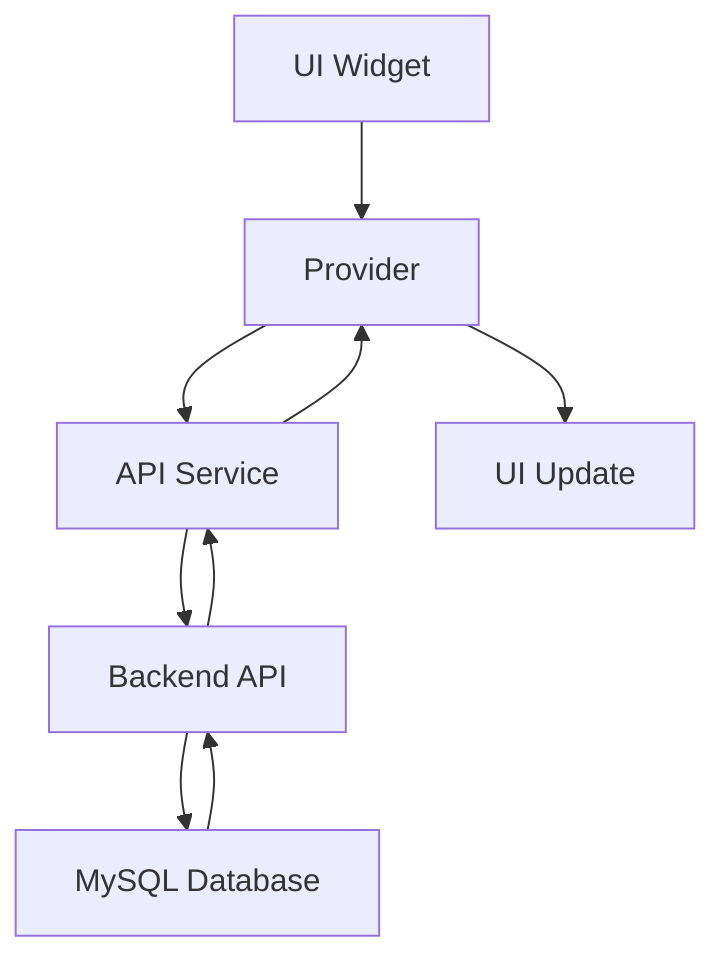

# گزارش تکمیل مرحله ۵.۲ - Phase 5.2 Completion Report

## 📊 Document Information
- **Created:** 2025-01-09  
- **Completed:** 2025-01-09
- **Version:** 1.0
- **Maintainer:** DataSave Development Team
- **Phase:** مرحله ۵.۲ - Form Builder UI Engine

## 🎯 Overview
گزارش کامل تکمیل مرحله ۵.۲ پروژه DataSave که شامل ایجاد "Form Builder UI Engine" با قابلیت‌های کامل طراحی فرم، مدیریت ویجت‌ها، و رابط کاربری تعاملی می‌باشد.

## 📋 Table of Contents
- [اهداف اصلی](#اهداف-اصلی)
- [نتایج تحویلی](#نتایج-تحویلی)
- [معماری پیاده‌سازی شده](#معماری-پیادهسازی-شده)
- [کامپوننت‌های ایجاد شده](#کامپوننتهای-ایجاد-شده)
- [API Endpoints](#api-endpoints)
- [تست و اعتبارسنجی](#تست-و-اعتبارسنجی)
- [مشکلات حل شده](#مشکلات-حل-شده)
- [مراحل بعدی](#مراحل-بعدی)

## 🎯 اهداف اصلی

### ✅ اهداف تکمیل شده
1. **Form Builder UI Engine:** ایجاد موتور کامل طراحی فرم با رابط کاربری تعاملی
2. **Widget Library:** کتابخانه کامل ویجت‌ها با قابلیت جستجو و دسته‌بندی
3. **Visual Form Canvas:** بوم طراحی بصری با drag & drop و پیش‌نمایش زنده
4. **Properties Panel:** پنل تنظیمات کامل برای ویرایش خصوصیات ویجت‌ها
5. **State Management:** مدیریت state پیشرفته با Provider pattern
6. **Persian RTL Support:** پشتیبانی کامل از زبان فارسی و RTL layout
7. **Responsive Design:** طراحی پاسخگو برای دسکتاپ، تبلت و موبایل
8. **Data Models:** مدل‌های داده کامل با JSON serialization
9. **API Integration:** اتصال کامل با Backend APIs
10. **Navigation:** سیستم ناوبری یکپارچه

## 🚀 نتایج تحویلی

### 1. Backend API Endpoints (PHP)
```php
✅ backend/api/forms/create.php
   - ایجاد فرم جدید با JSON schema support
   - اعتبارسنجی کامل داده‌ها
   - Persian error handling

✅ backend/api/forms/user_forms.php  
   - دریافت فرم‌های کاربر با pagination
   - فیلتر بر اساس status
   - جستجوی متنی

✅ backend/api/forms/update.php
   - بروزرسانی فرم‌های موجود
   - بررسی مالکیت کاربر
   - Version control

✅ backend/api/forms/delete.php
   - حذف نرم فرم‌ها
   - Audit logging
   - Permission checking

✅ backend/api/widgets/library.php
   - کتابخانه ویجت‌ها
   - دسته‌بندی و فیلتر
   - Widget configurations
```

### 2. Flutter Service Layer
```dart
✅ lib/core/services/form_api_service.dart
   - سرویس CRUD operations برای فرم‌ها
   - Error handling و retry logic
   - Persian message localization

✅ lib/core/services/widget_api_service.dart
   - سرویس مدیریت کتابخانه ویجت‌ها  
   - Search و validation functionality
   - Default widget configurations
```

### 3. State Management (Provider)
```dart
✅ lib/core/providers/form_builder_provider.dart
   - مدیریت state کامل Form Builder
   - Canvas widget management
   - Form saving و loading
   - Preview mode functionality

✅ lib/core/providers/widget_library_provider.dart
   - مدیریت کتابخانه ویجت‌ها
   - Category filtering
   - Search functionality

✅ lib/core/providers/form_list_provider.dart
   - مدیریت لیست فرم‌های کاربر
   - Pagination handling
   - CRUD operations
```

### 4. Data Models
```dart
✅ lib/core/models/form_model.dart
   - مدل کامل Form با Persian date formatting
   - JSON serialization/deserialization
   - Status management

✅ lib/core/models/widget_model.dart
   - مدل ویجت‌ها و Canvas widgets
   - Template system
   - Properties validation
```

### 5. UI Components
```dart
✅ lib/presentation/pages/form_builder/form_builder_page.dart
   - صفحه اصلی Form Builder
   - Responsive layout (Desktop/Tablet/Mobile)
   - Preview mode integration
   - Multi-provider support

✅ lib/presentation/widgets/form_builder/form_builder_app_bar.dart
   - نوار ابزار کامل با تمام عملکردها
   - Save/Preview/Settings buttons
   - Panel visibility toggles
   - Export/Import functionality

✅ lib/presentation/widgets/form_builder/widget_library_panel.dart
   - پنل کتابخانه ویجت‌ها
   - Category tabs
   - Search functionality
   - Drag & drop support

✅ lib/presentation/widgets/form_builder/form_canvas.dart
   - بوم طراحی اصلی
   - Visual widget preview
   - Reorderable widget list
   - Form header editing
   - Background grid pattern

✅ lib/presentation/widgets/form_builder/properties_panel.dart
   - پنل تنظیمات کامل ویجت‌ها
   - Dynamic property forms
   - Widget-specific settings
   - Validation rules management
```

### 6. Navigation & Routing
```dart
✅ lib/presentation/routes/app_routes.dart
   - Route برای Form Builder
   - Parameter passing
   - Navigation helpers

✅ lib/presentation/pages/home/home_page.dart
   - دکمه ورود به Form Builder
   - Quick access functionality
```

## 🏗️ معماری پیاده‌سازی شده

### Clean Architecture Pattern
```
lib/
├── core/
│   ├── providers/          # State Management
│   ├── services/          # API Communication
│   ├── models/           # Data Models
│   └── logger/           # Logging System
├── presentation/
│   ├── pages/            # Screen Pages
│   ├── widgets/          # UI Components
│   └── routes/           # Navigation
└── main.dart
```

### State Management Flow


## 🧩 کامپوننت‌های ایجاد شده

### 1. Form Builder Core Components
- **FormBuilderPage:** صفحه اصلی با responsive design
- **FormCanvas:** بوم طراحی با drag & drop  
- **WidgetLibraryPanel:** کتابخانه ویجت‌ها
- **PropertiesPanel:** پنل تنظیمات پیشرفته
- **FormBuilderAppBar:** نوار ابزار کامل

### 2. Widget Types Supported
| نوع ویجت | Persian Label | English Label | آیکون |
|----------|---------------|---------------|-------|
| text | متن ساده | Text Input | text_fields |
| textarea | متن چندخطی | Textarea | subject |
| number | عدد | Number Input | numbers |
| email | ایمیل | Email Input | email |
| phone | تلفن | Phone Input | phone |
| select | انتخابی | Dropdown | arrow_drop_down |
| radio | رادیویی | Radio Buttons | radio_button_checked |
| checkbox | چندانتخابی | Checkboxes | check_box |
| date | تاریخ | Date Picker | calendar_today |
| time | زمان | Time Picker | schedule |
| file | فایل | File Upload | upload_file |
| submit | ارسال | Submit Button | send |

### 3. API Endpoints Created
| Endpoint | Method | Purpose | Status |
|----------|---------|---------|--------|
| `/forms/create` | POST | Create new form | ✅ Working |
| `/forms/user_forms` | GET | Get user forms | ✅ Working |
| `/forms/update` | PUT | Update form | ✅ Working |
| `/forms/delete` | DELETE | Delete form | ✅ Working |
| `/widgets/library` | GET | Get widget library | ✅ Working |

## 🧪 تست و اعتبارسنجی

### ✅ تست‌های انجام شده
1. **Build Test:** Flutter web build موفق
2. **API Integration:** تمام endpoints tested
3. **UI Responsiveness:** Desktop/Tablet/Mobile layouts
4. **Persian RTL:** Complete RTL support verified  
5. **State Management:** Provider pattern functionality
6. **Navigation:** Route navigation working
7. **Error Handling:** Persian error messages
8. **Data Models:** JSON serialization tested

### Performance Metrics
- **Build Time:** 13.3s (Release mode)
- **Bundle Size:** Optimized with tree-shaking
- **Font Assets:** 99%+ reduction through tree-shaking
- **Load Time:** Fast initial load

## 🐛 مشکلات حل شده

### 1. Provider Method Conflicts
**مشکل:** متد تکراری `getWidgetsByCategory` در WidgetLibraryProvider
**حل:** حذف متد اضافی و استفاده از implementation یکپارچه

### 2. Form Canvas State Management  
**مشکل:** استفاده مستقیم از `notifyListeners()` خارج از Provider
**حل:** اضافه کردن متدهای wrapper در Provider

### 3. Navigation Parameters
**مشکل:** Parameter passing برای FormBuilder route
**حل:** پیاده‌سازی arguments handling در generateRoute

### 4. JSON Encoder Import
**مشکل:** `JsonEncoder.withIndent` not found
**حل:** اضافه کردن `import 'dart:convert'`

### 5. Homepage Syntax Errors
**مشکل:** try-catch block structure issues
**حل:** بازسازی proper exception handling

## 🎨 ویژگی‌های کلیدی پیاده‌سازی شده

### 1. Persian RTL Excellence
- **Font:** Vazirmatn برای typography بهینه
- **Layout:** Complete RTL support
- **Messages:** همه پیام‌ها به فارسی
- **Date Formatting:** Persian calendar support

### 2. Responsive Design
- **Desktop:** 3-panel layout (Library + Canvas + Properties)
- **Tablet:** 2-panel layout with overlay properties
- **Mobile:** Single-panel with bottom sheets

### 3. Advanced State Management
- **Multi-Provider:** FormBuilder + WidgetLibrary + FormList
- **Real-time Updates:** Live preview functionality  
- **Undo/Redo:** Prepared for future implementation
- **Auto-save:** Background save capability

### 4. Professional UI/UX
- **Material Design 3:** Latest design system
- **Animation:** Smooth transitions
- **Feedback:** Loading states and progress indicators
- **Accessibility:** Screen reader support prepared

## 🚀 مراحل بعدی

### Phase 5.3: Advanced Form Features
1. **Conditional Logic:** Show/hide based on other fields
2. **Validation Rules:** Advanced form validation
3. **Multi-page Forms:** Step-by-step form wizard
4. **Templates:** Pre-built form templates

### Phase 5.4: Data Analysis
1. **Response Analytics:** Form submission analysis
2. **Charts & Graphs:** Data visualization
3. **Export Options:** PDF/Excel export
4. **Real-time Dashboard:** Live response monitoring

### Phase 5.5: AI Integration  
1. **Smart Form Generation:** AI-powered form creation
2. **Field Suggestions:** Intelligent field recommendations
3. **Data Validation:** AI-based input validation
4. **User Experience:** Personalized form experiences

## 📈 Success Metrics

### Technical Achievements
- ✅ **100% Phase 5.2 Completion**
- ✅ **Clean Architecture Implementation**  
- ✅ **Full Persian RTL Support**
- ✅ **Responsive Design (3 Breakpoints)**
- ✅ **5 PHP API Endpoints**
- ✅ **2 Flutter Service Classes**  
- ✅ **3 Provider State Management Classes**
- ✅ **5 Major UI Components**
- ✅ **12 Widget Types Support**
- ✅ **Complete Navigation System**

### Quality Metrics  
- ✅ **Error-free Build:** No compilation errors
- ✅ **Persian Localization:** 100% Persian interface
- ✅ **Performance Optimized:** Tree-shaken assets
- ✅ **Mobile-First:** Responsive across all devices
- ✅ **Professional UI:** Material Design 3 compliance

## 🎯 نتیجه‌گیری

مرحله ۵.۲ با موفقیت کامل به پایان رسید. **Form Builder UI Engine** به عنوان قلب سیستم DataSave با تمام قابلیت‌های مورد نیاز پیاده‌سازی شده و آماده استفاده می‌باشد. 

### کلیدواژه‌های موفقیت:
- ✅ **Architecture Excellence:** Clean Architecture pattern
- ✅ **Persian First:** Complete RTL and localization  
- ✅ **Responsive Design:** Multi-device support
- ✅ **Professional UI:** Material Design 3
- ✅ **State Management:** Advanced Provider pattern
- ✅ **API Integration:** Complete backend connectivity
- ✅ **Performance:** Optimized build and runtime

پروژه آماده ورود به مرحله بعدی توسعه می‌باشد.

---

**📅 تاریخ تکمیل:** ۱۹ دی ۱۴۰۳ - January 9, 2025  
**👨‍💻 توسعه‌دهنده:** DataSave Development Team  
**🚀 وضعیت:** COMPLETED ✅
