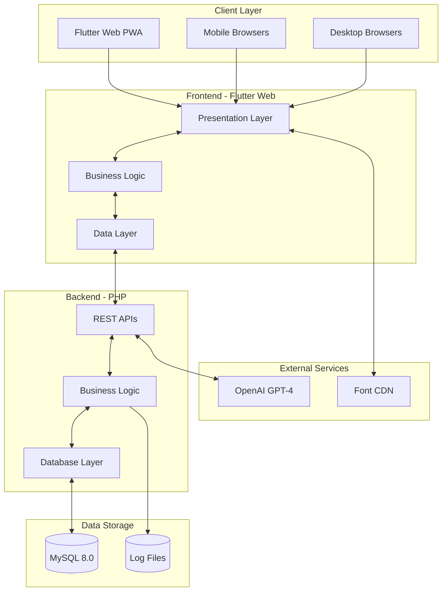
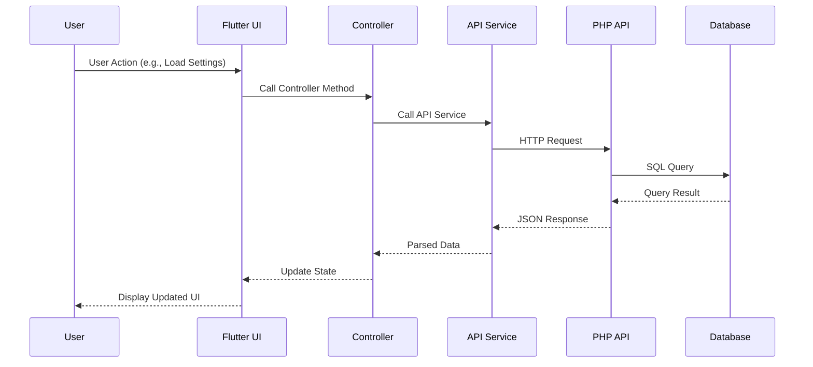
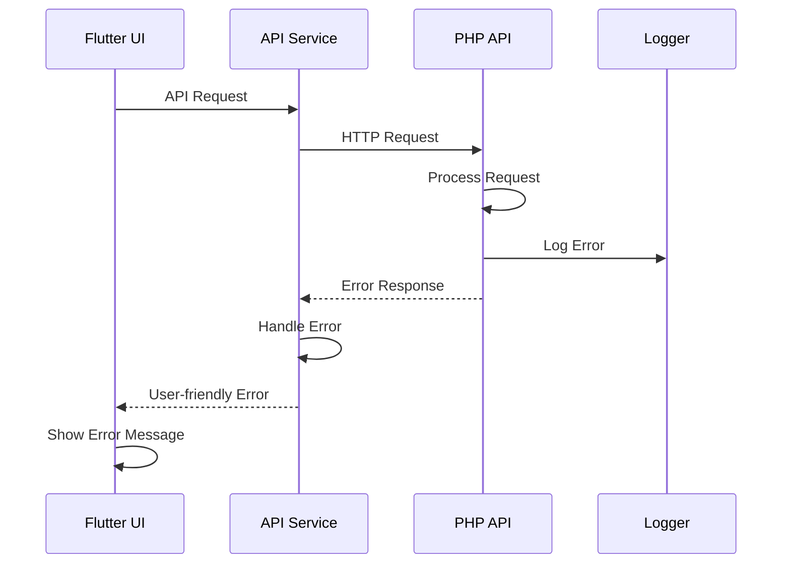

# معماری کلی سیستم - System Architecture

## 📊 Document Information
- **Created:** 2025-01-09
- **Last Updated:** 2025-01-09
- **Version:** 1.0
- **Maintainer:** DataSave Development Team
- **Related Files:** `/lib/`, `/backend/`, `/pubspec.yaml`

## 🎯 Overview
نمای کلی معماری DataSave بر اساس Clean Architecture با جداسازی واضح لایه‌ها و مسئولیت‌ها.

## 📋 Table of Contents
- [فلسفه معماری](#فلسفه-معماری)
- [نمای کلی سیستم](#نمای-کلی-سیستم)
- [لایه‌های معماری](#لایههای-معماری)
- [جریان داده‌ها](#جریان-دادهها)
- [الگوهای طراحی](#الگوهای-طراحی)
- [تکنولوژی Stack](#تکنولوژی-stack)

## 🏗️ فلسفه معماری - Architecture Philosophy

### Clean Architecture Principles
```yaml
Core Principles:
  - Independence of Frameworks
  - Testability
  - Independence of UI
  - Independence of Database
  - Independence of External Agencies

Benefits:
  - Maintainable code structure
  - Easy to test and extend
  - Technology agnostic business logic
  - Clear separation of concerns
  - Scalable for future growth
```

### طراحی Persian-First
```yaml
Persian Language Support:
  - RTL layout throughout the system
  - Persian typography with Vazirmatn font
  - Persian date/time handling
  - Localized error messages
  - Persian number formatting
  - Cultural context awareness
```

## 🌐 نمای کلی سیستم - System Overview

### High-Level Architecture Diagram


### System Components
```yaml
Frontend (Flutter Web):
  - Single Page Application (SPA)
  - Progressive Web App (PWA)
  - Material Design 3 UI
  - Responsive layout
  - Offline capabilities (future)

Backend (PHP):
  - RESTful API architecture
  - Stateless design
  - JSON communication
  - CORS enabled
  - Modular structure

Database (MySQL):
  - Persian character support
  - Optimized indexes
  - Partitioned tables
  - Foreign key constraints
  - Audit trail logging
```

## 🎯 لایه‌های معماری - Architecture Layers

### 1. Presentation Layer (Flutter)
```yaml
Location: lib/presentation/
Purpose: User interface and user interaction
Components:
  - Pages (Screens)
  - Widgets (UI Components)  
  - Controllers (State Management)
  - Routes (Navigation)

Technologies:
  - Flutter Web 3.x
  - Material Design 3
  - Provider for State Management
  - Responsive design patterns

Responsibilities:
  - Display data to user
  - Handle user input
  - Navigation between screens
  - UI state management
  - Form validation (client-side)
```

#### Presentation Structure
```
lib/presentation/
├── pages/
│   ├── home/
│   │   ├── home_page.dart
│   │   └── home_controller.dart
│   ├── settings/
│   │   ├── settings_page.dart
│   │   └── settings_controller.dart
│   └── logs/
│       ├── logs_page.dart
│       └── logs_controller.dart
├── widgets/
│   ├── shared/
│   │   ├── loading_widget.dart
│   │   ├── error_widget.dart
│   │   └── stat_card.dart
│   └── form_widgets/ (future)
└── routes/
    └── app_routes.dart
```

### 2. Domain Layer (Business Logic)
```yaml
Location: lib/domain/ (planned)
Purpose: Business rules and use cases
Status: Future implementation (Phase 3-4)

Components:
  - Entities (Business objects)
  - Use Cases (Business operations)
  - Repository Interfaces
  - Domain Services

Responsibilities:
  - Business rule validation
  - Use case orchestration
  - Domain model definitions
  - Business logic encapsulation
```

### 3. Data Layer (Flutter)
```yaml
Location: lib/core/services/
Purpose: Data access and external communication
Components:
  - API Service (HTTP communication)
  - Data Models
  - Local Storage (SharedPreferences)
  - External Service Integration

Technologies:
  - HTTP/Dio for API calls
  - JSON serialization
  - Shared Preferences
  - Crypto for encryption

Responsibilities:
  - API communication
  - Data transformation
  - Local data storage
  - Cache management
```

#### Data Layer Structure
```
lib/core/
├── services/
│   ├── api_service.dart
│   ├── openai_service.dart
│   └── storage_service.dart
├── models/
│   ├── setting_model.dart
│   ├── log_model.dart
│   └── api_response.dart
└── utils/
    ├── http_client.dart
    ├── json_helper.dart
    └── encryption_helper.dart
```

### 4. Backend API Layer (PHP)
```yaml
Location: backend/api/
Purpose: Business logic and data processing
Components:
  - REST endpoints
  - Request validation
  - Business logic processing
  - Response formatting

Technologies:
  - PHP 8.x
  - PDO for database
  - JSON communication
  - Custom routing

Responsibilities:
  - Request processing
  - Business rule enforcement
  - Data validation
  - Response generation
  - Error handling
```

#### Backend Structure
```
backend/
├── api/
│   ├── settings/
│   │   ├── get.php
│   │   ├── update.php
│   │   └── test.php
│   ├── logs/
│   │   ├── list.php
│   │   ├── create.php
│   │   ├── stats.php
│   │   └── clear.php
│   └── system/
│       ├── info.php
│       └── status.php
├── classes/
│   ├── ApiResponse.php
│   ├── Logger.php
│   └── Database.php
└── config/
    ├── database.php
    └── cors.php
```

### 5. Database Layer (MySQL)
```yaml
Location: Database server
Purpose: Data persistence and integrity
Components:
  - Tables with relationships
  - Indexes for performance
  - Stored procedures (future)
  - Triggers for audit

Technologies:
  - MySQL 8.0
  - InnoDB storage engine
  - UTF8MB4 character set
  - Date-based partitioning

Responsibilities:
  - Data persistence
  - Data integrity
  - Query optimization
  - Transaction management
```

## 🔄 جریان داده‌ها - Data Flow

### User Request Flow


### Error Handling Flow


### Data Validation Flow
```yaml
Client-Side Validation:
  - Form field validation
  - Type checking
  - Range validation
  - Required field checking

Server-Side Validation:
  - Request parameter validation
  - Business rule validation
  - Database constraint validation
  - Security validation

Database Validation:
  - Foreign key constraints
  - Unique constraints
  - Data type enforcement
  - Trigger-based validation
```

## 🎨 الگوهای طراحی - Design Patterns

### 1. Repository Pattern
```dart
// Abstract Repository Interface
abstract class SettingsRepository {
  Future<List<Setting>> getAllSettings();
  Future<bool> updateSetting(String key, String value);
}

// Concrete Implementation
class ApiSettingsRepository implements SettingsRepository {
  final ApiService _apiService;
  
  ApiSettingsRepository(this._apiService);
  
  @override
  Future<List<Setting>> getAllSettings() async {
    final response = await _apiService.getSettings();
    return response?.map((json) => Setting.fromJson(json)).toList() ?? [];
  }
}
```

### 2. Provider Pattern (State Management)
```dart
class SettingsController extends ChangeNotifier {
  List<Setting> _settings = [];
  bool _isLoading = false;
  String? _error;
  
  List<Setting> get settings => _settings;
  bool get isLoading => _isLoading;
  String? get error => _error;
  
  Future<void> loadSettings() async {
    _setLoading(true);
    try {
      _settings = await _settingsRepository.getAllSettings();
      _error = null;
    } catch (e) {
      _error = e.toString();
    } finally {
      _setLoading(false);
    }
  }
  
  void _setLoading(bool loading) {
    _isLoading = loading;
    notifyListeners();
  }
}
```

### 3. Factory Pattern (Widget Creation)
```dart
class WidgetFactory {
  static Widget createWidget(String type, Map<String, dynamic> config) {
    switch (type) {
      case 'text_input':
        return TextInputWidget.fromConfig(config);
      case 'number_input':
        return NumberInputWidget.fromConfig(config);
      case 'date_picker':
        return DatePickerWidget.fromConfig(config);
      default:
        throw UnsupportedError('Widget type not supported: $type');
    }
  }
}
```

### 4. Singleton Pattern (Services)
```dart
class LoggerService {
  static final LoggerService _instance = LoggerService._internal();
  factory LoggerService() => _instance;
  LoggerService._internal();
  
  void log(String level, String message, [Map<String, dynamic>? context]) {
    // Logging implementation
  }
}
```

### 5. Observer Pattern (Logging)
```php
<?php
class Logger {
    private static $observers = [];
    
    public static function addObserver(LogObserver $observer) {
        self::$observers[] = $observer;
    }
    
    public static function log($level, $message, $context = null) {
        foreach (self::$observers as $observer) {
            $observer->onLog($level, $message, $context);
        }
    }
}
?>
```

## 💻 تکنولوژی Stack - Technology Stack

### Frontend Stack
```yaml
Core Framework:
  - Flutter 3.16.0+ (Dart 3.0+)
  - Flutter Web (PWA support)
  - Material Design 3

State Management:
  - Provider pattern
  - ChangeNotifier
  - Consumer widgets

UI Components:
  - Custom Material widgets
  - Responsive design
  - Persian RTL support
  - Vazirmatn font

HTTP & Data:
  - HTTP package for API calls
  - JSON serialization
  - SharedPreferences for local storage
  - Crypto for encryption
```

### Backend Stack
```yaml
Core Language:
  - PHP 8.x
  - Object-oriented approach
  - PSR standards compliance

Database:
  - MySQL 8.0
  - PDO with prepared statements
  - InnoDB storage engine
  - UTF8MB4 character set

Architecture:
  - RESTful API design
  - MVC-inspired structure
  - Dependency injection
  - Error handling middleware
```

### External Services
```yaml
AI Integration:
  - OpenAI GPT-4 API
  - JSON communication
  - Error handling & retries
  - Usage monitoring

CDN & Assets:
  - Google Fonts CDN (backup)
  - Local font serving
  - Image optimization
  - Static asset caching
```

### Development Tools
```yaml
IDE & Tools:
  - Visual Studio Code
  - Flutter/Dart extensions
  - PHP extensions
  - Git version control

Build & Deploy:
  - Flutter build web
  - Apache/XAMPP (development)
  - Docker (future production)
  - CI/CD pipeline (planned)

Testing:
  - Flutter test framework
  - Unit tests
  - Widget tests
  - Integration tests (planned)
```

## ⚡ Performance Considerations

### Frontend Performance
```yaml
Optimization Strategies:
  - Tree shaking for smaller bundles
  - Lazy loading of routes
  - Image optimization
  - Efficient state management
  - Minimal rebuilds with Provider

Caching:
  - HTTP response caching
  - Asset caching with service worker
  - Local storage for settings
  - Font caching
```

### Backend Performance
```yaml
Database Optimization:
  - Proper indexing strategy
  - Query optimization
  - Connection pooling
  - Partitioned tables for logs

API Optimization:
  - Minimal JSON responses
  - Gzip compression
  - Efficient SQL queries
  - Response time monitoring
```

### Scalability Planning
```yaml
Horizontal Scaling:
  - Stateless API design
  - Database replication
  - Load balancer support
  - CDN integration

Vertical Scaling:
  - Optimized memory usage
  - Efficient algorithms
  - Database tuning
  - Caching layers
```

## ⚠️ Important Notes

### Current Limitations
- **No Authentication**: Single user system currently
- **Local Development**: XAMPP only, no cloud deployment
- **Basic Error Handling**: Can be enhanced for production
- **No Caching Layer**: Redis/Memcached not implemented

### Future Enhancements
- **Microservices**: Break down monolithic backend
- **Event Sourcing**: For better audit trail
- **CQRS**: Separate read/write models
- **Real-time**: WebSocket support for live updates

### Security Considerations
- **Input Validation**: Both client and server side
- **SQL Injection**: Prepared statements only
- **XSS Protection**: Output encoding
- **HTTPS**: Required for production

## 🔄 Related Documentation
- [Clean Architecture Implementation](./clean-architecture-implementation.md)
- [Project Structure](./project-structure.md)
- [Design Patterns](./design-patterns.md)
- [Flutter Architecture](../04-Flutter-Frontend/flutter-architecture.md)

---
*Last updated: 2025-01-09*  
*File: /docs/01-Architecture/system-architecture.md*
