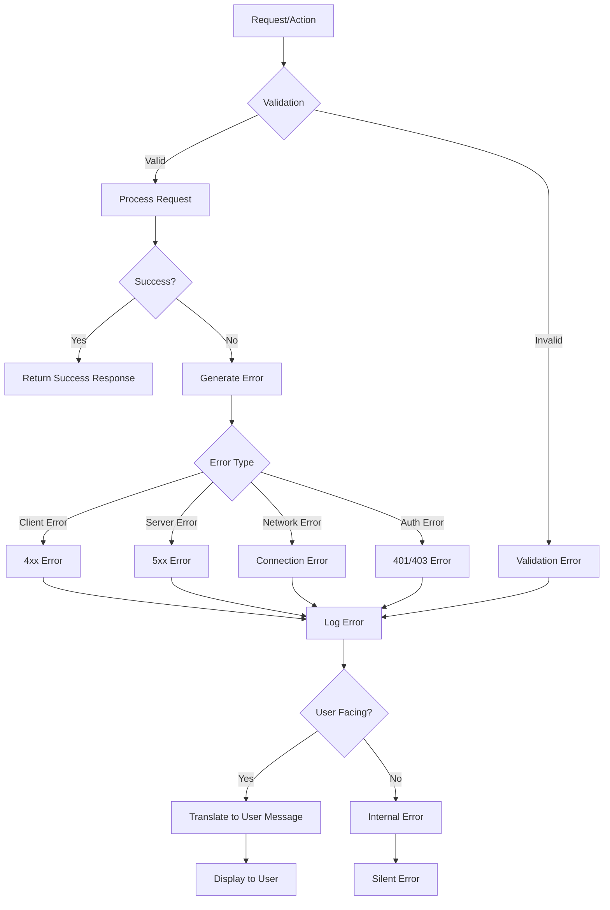

# مدیریت خطا - Error Handling

## 📊 Document Information
- **Created:** 2025-09-01
- **Last Updated:** 2025-09-01
- **Version:** 1.0
- **Maintainer:** DataSave Development Team
- **Related Files:** `/backend/classes/ApiResponse.php`, `/lib/core/services/api_service.dart`

## 🎯 Overview
مستندات کامل مدیریت خطا در Backend و Frontend پروژه DataSave، شامل استانداردهای پاسخ API، خطاهای HTTP، مدیریت استثناها، و نمایش خطا به کاربر با پشتیبانی کامل از زبان فارسی.

## 📋 Table of Contents
- [استراتژی مدیریت خطا](#استراتژی-مدیریت-خطا)
- [استانداردهای پاسخ API](#استانداردهای-پاسخ-api)
- [دسته‌بندی خطاها](#دسته‌بندی-خطاها)
- [مدیریت خطا در Backend (PHP)](#مدیریت-خطا-در-backend-php)
- [مدیریت خطا در Frontend (Flutter)](#مدیریت-خطا-در-frontend-flutter)
- [لاگینگ خطاها](#لاگینگ-خطاها)
- [نمایش خطا به کاربر](#نمایش-خطا-به-کاربر)
- [توصیه‌های امنیتی](#توصیه‌های-امنیتی)

## 🚦 استراتژی مدیریت خطا

### اصول مدیریت خطا
```yaml
Error Handling Principles:
  1. Fail Fast, Fail Explicitly: تشخیص سریع خطا و اعلام صریح آن
  2. Comprehensive Error Information: اطلاعات کامل خطا برای توسعه‌دهندگان
  3. User-Friendly Messages: پیام‌های مناسب و فارسی برای کاربران
  4. Centralized Error Handling: مدیریت متمرکز خطا
  5. Consistent Error Format: فرمت یکسان برای تمام خطاها
  6. Security-First Approach: عدم افشای اطلاعات حساس در پیام‌های خطا
  7. Complete Logging: ثبت تمام خطاها برای تحلیل
  8. Graceful Degradation: ادامه کار برنامه در صورت امکان
```

### Error Flow Diagram


## 📝 استانداردهای پاسخ API

### فرمت استاندارد پاسخ API
```json
// پاسخ موفق
{
  "success": true,
  "data": { ... },
  "message": "عملیات با موفقیت انجام شد"
}

// پاسخ خطا
{
  "success": false,
  "error": {
    "code": "ERR_VALIDATION",
    "message": "اطلاعات وارد شده معتبر نیست",
    "details": { ... },
    "trace_id": "err_123456"
  },
  "message": "خطا در پردازش درخواست"
}
```

### کلاس ApiResponse (PHP)
```php
<?php
/**
 * کلاس پاسخ استاندارد API
 */
class ApiResponse {
    /**
     * ایجاد پاسخ موفق
     */
    public static function success($data = null, string $message = "عملیات موفق", int $statusCode = 200): void {
        header('Content-Type: application/json; charset=utf-8');
        http_response_code($statusCode);
        
        echo json_encode([
            'success' => true,
            'data' => $data,
            'message' => $message
        ], JSON_UNESCAPED_UNICODE);
        exit;
    }
    
    /**
     * ایجاد پاسخ خطا
     */
    public static function error(string $message, string $errorCode, array $details = null, int $statusCode = 400): void {
        header('Content-Type: application/json; charset=utf-8');
        http_response_code($statusCode);
        
        // ایجاد شناسه یکتا برای خطا
        $traceId = 'err_' . uniqid();
        
        // لاگ خطا با جزئیات کامل
        $logger = new Logger();
        $logger->error('API', $message, [
            'error_code' => $errorCode,
            'details' => $details,
            'trace_id' => $traceId,
            'status_code' => $statusCode
        ]);
        
        echo json_encode([
            'success' => false,
            'error' => [
                'code' => $errorCode,
                'message' => $message,
                'details' => $details,
                'trace_id' => $traceId
            ],
            'message' => 'خطا در پردازش درخواست'
        ], JSON_UNESCAPED_UNICODE);
        exit;
    }
    
    /**
     * خطای اعتبارسنجی
     */
    public static function validationError(array $errors): void {
        self::error(
            'اطلاعات وارد شده معتبر نیست',
            'ERR_VALIDATION',
            ['validation_errors' => $errors],
            422
        );
    }
    
    /**
     * خطای احراز هویت
     */
    public static function authError(string $message = 'احراز هویت ناموفق بود'): void {
        self::error($message, 'ERR_AUTHENTICATION', null, 401);
    }
    
    /**
     * خطای دسترسی
     */
    public static function accessDenied(string $message = 'شما دسترسی لازم را ندارید'): void {
        self::error($message, 'ERR_AUTHORIZATION', null, 403);
    }
    
    /**
     * خطای منبع یافت نشد
     */
    public static function notFound(string $resource = 'منبع'): void {
        self::error("$resource مورد نظر یافت نشد", 'ERR_NOT_FOUND', null, 404);
    }
    
    /**
     * خطای سرور
     */
    public static function serverError(string $message = 'خطای داخلی سرور', array $details = null): void {
        self::error($message, 'ERR_SERVER', $details, 500);
    }
}
?>
```

## 🔍 دسته‌بندی خطاها

### کدهای خطای استاندارد
```yaml
# کدهای خطای کلیدی سیستم
Error Codes:
  # خطاهای کاربر (4xx)
  Client Errors:
    ERR_VALIDATION: "خطای اعتبارسنجی داده‌ها" # 422
    ERR_AUTHENTICATION: "خطای احراز هویت" # 401
    ERR_AUTHORIZATION: "خطای دسترسی" # 403
    ERR_NOT_FOUND: "منبع یافت نشد" # 404
    ERR_BAD_REQUEST: "درخواست نامعتبر" # 400
    ERR_DUPLICATE: "داده تکراری" # 409
    ERR_TOO_MANY_REQUESTS: "درخواست بیش از حد مجاز" # 429
    
  # خطاهای سرور (5xx)
  Server Errors:
    ERR_SERVER: "خطای داخلی سرور" # 500
    ERR_DATABASE: "خطای دیتابیس" # 500
    ERR_CONFIGURATION: "خطای تنظیمات" # 500
    ERR_EXTERNAL_SERVICE: "خطای سرویس خارجی" # 502
    
  # خطاهای شبکه
  Network Errors:
    ERR_CONNECTION: "خطای اتصال"
    ERR_TIMEOUT: "پایان زمان انتظار"
    
  # خطاهای بیزینس
  Business Errors:
    ERR_FORM_LIMIT: "محدودیت تعداد فرم"
    ERR_INVALID_OPENAI_KEY: "کلید نامعتبر OpenAI"
    ERR_QUOTA_EXCEEDED: "پایان اعتبار"
```

### HTTP Status Codes
```yaml
HTTP Status Codes:
  - 200 OK: درخواست موفق
  - 201 Created: ایجاد موفق منبع جدید
  - 400 Bad Request: درخواست نامعتبر
  - 401 Unauthorized: احراز هویت ناموفق
  - 403 Forbidden: دسترسی غیرمجاز
  - 404 Not Found: منبع یافت نشد
  - 409 Conflict: تداخل در داده‌ها
  - 422 Unprocessable Entity: داده‌های نامعتبر
  - 429 Too Many Requests: تعداد درخواست بیش از حد مجاز
  - 500 Internal Server Error: خطای داخلی سرور
  - 502 Bad Gateway: خطا در سرویس خارجی
  - 503 Service Unavailable: سرویس در دسترس نیست
  - 504 Gateway Timeout: تایم‌اوت درخواست
```

## 🐘 مدیریت خطا در Backend (PHP)

### استفاده از try-catch
```php
<?php
// نمونه استفاده از try-catch در API endpoint

// api/settings/update.php
require_once '../../classes/ApiResponse.php';
require_once '../../classes/Logger.php';
require_once '../../config/database.php';

try {
    // دریافت داده‌های ورودی
    $data = json_decode(file_get_contents('php://input'), true);
    
    // اعتبارسنجی داده‌ها
    if (!isset($data['setting_key']) || !isset($data['setting_value'])) {
        ApiResponse::validationError([
            'setting_key' => 'کلید تنظیمات الزامی است',
            'setting_value' => 'مقدار تنظیمات الزامی است'
        ]);
    }
    
    // اتصال به دیتابیس
    $db = Database::getConnection();
    
    // بروزرسانی تنظیمات
    $stmt = $db->prepare("UPDATE system_settings SET setting_value = :value, updated_at = NOW() WHERE setting_key = :key");
    
    $success = $stmt->execute([
        'key' => $data['setting_key'],
        'value' => $data['setting_value']
    ]);
    
    if (!$success) {
        throw new Exception("خطا در بروزرسانی تنظیمات");
    }
    
    if ($stmt->rowCount() === 0) {
        ApiResponse::notFound('تنظیمات');
    }
    
    // لاگ موفقیت
    $logger = new Logger();
    $logger->info('Settings', 'تنظیمات با موفقیت بروزرسانی شد', [
        'setting_key' => $data['setting_key'],
        'new_value' => $data['setting_value']
    ]);
    
    // پاسخ موفق
    ApiResponse::success(null, 'تنظیمات با موفقیت بروزرسانی شد');
    
} catch (PDOException $e) {
    // خطای دیتابیس
    ApiResponse::error(
        'خطا در اتصال به دیتابیس',
        'ERR_DATABASE',
        ['debug' => $e->getMessage()],
        500
    );
} catch (Exception $e) {
    // سایر خطاها
    ApiResponse::error(
        $e->getMessage(),
        'ERR_SERVER',
        ['debug' => $e->getMessage()],
        500
    );
}
?>
```

### اعتبارسنجی داده‌ها
```php
<?php
// اعتبارسنجی داده‌ها قبل از پردازش

function validateFormData($data) {
    $errors = [];
    
    if (empty($data['form_name'])) {
        $errors['form_name'] = 'نام فرم الزامی است';
    } elseif (strlen($data['form_name']) > 100) {
        $errors['form_name'] = 'نام فرم نباید بیشتر از 100 کاراکتر باشد';
    }
    
    if (empty($data['form_title'])) {
        $errors['form_title'] = 'عنوان فرم الزامی است';
    }
    
    if (isset($data['form_structure']) && !is_array($data['form_structure'])) {
        $errors['form_structure'] = 'ساختار فرم باید به صورت آرایه باشد';
    }
    
    return $errors;
}

// استفاده
$errors = validateFormData($formData);
if (!empty($errors)) {
    ApiResponse::validationError($errors);
}
```

## 📱 مدیریت خطا در Frontend (Flutter)

### کلاس ApiException
```dart
// lib/core/exceptions/api_exception.dart

class ApiException implements Exception {
  final String message;
  final String errorCode;
  final int? statusCode;
  final Map<String, dynamic>? details;
  final String? traceId;

  ApiException({
    required this.message,
    required this.errorCode,
    this.statusCode,
    this.details,
    this.traceId,
  });

  factory ApiException.fromJson(Map<String, dynamic> json, {int? statusCode}) {
    final error = json['error'] ?? {};
    return ApiException(
      message: error['message'] ?? json['message'] ?? 'خطای نامشخص',
      errorCode: error['code'] ?? 'ERR_UNKNOWN',
      statusCode: statusCode,
      details: error['details'],
      traceId: error['trace_id'],
    );
  }

  factory ApiException.network() {
    return ApiException(
      message: 'خطا در اتصال به سرور. لطفاً اتصال اینترنت خود را بررسی کنید.',
      errorCode: 'ERR_CONNECTION',
    );
  }

  factory ApiException.timeout() {
    return ApiException(
      message: 'زمان پاسخگویی سرور به پایان رسید. لطفاً مجدداً تلاش کنید.',
      errorCode: 'ERR_TIMEOUT',
    );
  }

  factory ApiException.server() {
    return ApiException(
      message: 'خطای داخلی سرور. لطفاً بعداً مجدداً تلاش کنید.',
      errorCode: 'ERR_SERVER',
      statusCode: 500,
    );
  }

  @override
  String toString() => 'ApiException: [$errorCode] $message';
}
```

### مدیریت خطا در API Service
```dart
// lib/core/services/api_service.dart

class ApiService {
  static final _client = http.Client();
  static const _baseUrl = 'http://localhost/datasave/backend/api';
  static const _timeout = Duration(seconds: 10);

  /// دریافت تنظیمات
  static Future<Map<String, dynamic>> getSettings() async {
    try {
      final response = await _client
          .get(Uri.parse('$_baseUrl/settings/get.php'))
          .timeout(_timeout);
      
      return _handleResponse(response);
    } on SocketException {
      throw ApiException.network();
    } on TimeoutException {
      throw ApiException.timeout();
    } catch (e) {
      LoggerService.error('ApiService', 'خطا در دریافت تنظیمات', e);
      rethrow;
    }
  }

  /// بروزرسانی تنظیمات
  static Future<Map<String, dynamic>> updateSetting(
      String key, String value) async {
    try {
      final response = await _client
          .post(
            Uri.parse('$_baseUrl/settings/update.php'),
            headers: {'Content-Type': 'application/json'},
            body: jsonEncode({
              'setting_key': key,
              'setting_value': value,
            }),
          )
          .timeout(_timeout);
      
      return _handleResponse(response);
    } on SocketException {
      throw ApiException.network();
    } on TimeoutException {
      throw ApiException.timeout();
    } catch (e) {
      LoggerService.error('ApiService', 'خطا در بروزرسانی تنظیمات', e);
      rethrow;
    }
  }

  /// پردازش پاسخ API
  static Map<String, dynamic> _handleResponse(http.Response response) {
    try {
      final data = jsonDecode(utf8.decode(response.bodyBytes)) as Map<String, dynamic>;
      
      if (response.statusCode >= 200 && response.statusCode < 300) {
        if (data['success'] == true) {
          return data;
        }
      }
      
      // پردازش خطا
      throw ApiException.fromJson(data, statusCode: response.statusCode);
    } on FormatException {
      LoggerService.error(
        'ApiService', 
        'خطا در پردازش پاسخ JSON', 
        {'body': response.body, 'statusCode': response.statusCode}
      );
      throw ApiException(
        message: 'خطا در پردازش پاسخ سرور',
        errorCode: 'ERR_JSON_PARSING',
        statusCode: response.statusCode,
      );
    }
  }
}
```

### نمایش خطا در UI
```dart
// lib/presentation/widgets/shared/error_handler.dart

class ErrorHandler {
  /// نمایش خطا به کاربر
  static void showError(BuildContext context, dynamic error) {
    String message = 'خطای نامشخص رخ داده است.';
    
    if (error is ApiException) {
      message = error.message;
    } else if (error is String) {
      message = error;
    } else if (error is Exception) {
      message = error.toString();
    }
    
    // لاگ خطا
    LoggerService.error('UI', 'نمایش خطا به کاربر', {'error': error.toString()});
    
    // نمایش اسنک‌بار
    ScaffoldMessenger.of(context).showSnackBar(
      SnackBar(
        content: Text(message),
        backgroundColor: Colors.red[700],
        behavior: SnackBarBehavior.floating,
        action: SnackBarAction(
          label: 'تلاش مجدد',
          textColor: Colors.white,
          onPressed: () {
            // عملیات تلاش مجدد (در صورت نیاز)
          },
        ),
      ),
    );
  }
  
  /// نمایش دیالوگ خطا
  static void showErrorDialog(BuildContext context, dynamic error) {
    String message = 'خطای نامشخص رخ داده است.';
    String title = 'خطا';
    
    if (error is ApiException) {
      message = error.message;
      if (error.errorCode.startsWith('ERR_AUTHENTICATION')) {
        title = 'خطای احراز هویت';
      } else if (error.errorCode.startsWith('ERR_NETWORK')) {
        title = 'خطای شبکه';
      }
    }
    
    showDialog(
      context: context,
      builder: (context) => AlertDialog(
        title: Text(title),
        content: Text(message),
        actions: [
          TextButton(
            onPressed: () => Navigator.pop(context),
            child: Text('متوجه شدم'),
          ),
        ],
      ),
    );
  }
}
```

## 📝 لاگینگ خطاها

### لاگینگ خطاها در Backend
```php
// لاگینگ خطاها با اطلاعات کامل

$logger = new Logger();

try {
    // کد
} catch (Exception $e) {
    $logger->error('Database', 'خطا در اجرای کوئری', [
        'query' => $sql,
        'params' => $params,
        'error_message' => $e->getMessage(),
        'error_code' => $e->getCode(),
        'file' => $e->getFile(),
        'line' => $e->getLine(),
        'trace' => $e->getTraceAsString()
    ]);
    
    // ارسال پاسخ خطا به کاربر بدون افشای اطلاعات حساس
    ApiResponse::error('خطا در ارتباط با دیتابیس', 'ERR_DATABASE');
}
```

### لاگینگ خطاها در Frontend
```dart
// نمونه مدیریت و لاگینگ خطا در یک Controller

class SettingsController with ChangeNotifier {
  // ...

  Future<void> updateSetting(String key, String value) async {
    try {
      _setLoading(true);
      _clearError();
      
      // لاگ عملیات
      LoggerService.info('SettingsController', 'شروع بروزرسانی تنظیمات', {
        'key': key,
        'value': value
      });
      
      final result = await ApiService.updateSetting(key, value);
      
      // لاگ موفقیت
      LoggerService.info('SettingsController', 'تنظیمات با موفقیت بروزرسانی شد', {
        'key': key,
        'response': result
      });
      
      // بروزرسانی UI
      _loadSettings();
      notifyListeners();
      
    } on ApiException catch (e) {
      // لاگ خطای API
      LoggerService.error('SettingsController', 'خطا در بروزرسانی تنظیمات (API)', {
        'error_code': e.errorCode,
        'message': e.message,
        'trace_id': e.traceId,
        'status_code': e.statusCode,
        'details': e.details
      });
      
      _setError(e.message);
    } catch (e, stack) {
      // لاگ سایر خطاها
      LoggerService.error('SettingsController', 'خطا در بروزرسانی تنظیمات', {
        'error': e.toString(),
        'stack_trace': stack.toString()
      });
      
      _setError('خطای غیرمنتظره در بروزرسانی تنظیمات');
    } finally {
      _setLoading(false);
    }
  }

  // ...
}
```

## 👁️ نمایش خطا به کاربر

### اصول نمایش خطا به کاربر
```yaml
User Error Display Principles:
  1. زبان ساده و قابل فهم (بدون اصطلاحات فنی)
  2. راهنمایی برای رفع مشکل
  3. امکان تلاش مجدد در صورت امکان
  4. عدم نمایش جزئیات فنی خطا
  5. استفاده از رنگ و آیکون مناسب
  6. پشتیبانی کامل از متن فارسی
  7. حفظ حریم خصوصی و امنیت
```

### نمونه پیام‌های خطای کاربرپسند
```yaml
User-Friendly Error Messages:
  - Technical: "ERR_CONNECTION: Could not establish connection to database server"
    User: "اتصال به سرور برقرار نشد. لطفاً اتصال اینترنت خود را بررسی کنید."
    
  - Technical: "ERR_VALIDATION: Invalid email format"
    User: "لطفاً یک آدرس ایمیل معتبر وارد کنید."
    
  - Technical: "ERR_AUTHENTICATION: Invalid JWT token"
    User: "نشست شما منقضی شده است. لطفاً دوباره وارد شوید."
    
  - Technical: "ERR_SERVER: Database query timeout"
    User: "در حال حاضر سیستم با مشکل مواجه است. لطفاً دقایقی دیگر مجدداً تلاش کنید."
    
  - Technical: "ERR_DUPLICATE: Unique constraint violation"
    User: "این نام کاربری قبلاً ثبت شده است. لطفاً نام کاربری دیگری انتخاب کنید."
```

### کامپوننت ErrorView
```dart
// lib/presentation/widgets/shared/error_view.dart

class ErrorView extends StatelessWidget {
  final String message;
  final String? actionLabel;
  final VoidCallback? onAction;
  final IconData icon;
  
  const ErrorView({
    Key? key,
    required this.message,
    this.actionLabel,
    this.onAction,
    this.icon = Icons.error_outline,
  }) : super(key: key);

  @override
  Widget build(BuildContext context) {
    return Center(
      child: Padding(
        padding: const EdgeInsets.all(16.0),
        child: Column(
          mainAxisSize: MainAxisSize.min,
          children: [
            Icon(
              icon,
              size: 64,
              color: Colors.red[700],
            ),
            const SizedBox(height: 16),
            Text(
              message,
              textAlign: TextAlign.center,
              style: Theme.of(context).textTheme.titleMedium,
            ),
            if (onAction != null) ...[
              const SizedBox(height: 24),
              ElevatedButton(
                onPressed: onAction,
                child: Text(actionLabel ?? 'تلاش مجدد'),
              ),
            ],
          ],
        ),
      ),
    );
  }
}
```

## 🔒 توصیه‌های امنیتی

### امنیت در مدیریت خطا
```yaml
Security Recommendations:
  1. عدم افشای اطلاعات حساس در پیام‌های خطا
     - مسیر فایل‌ها و ساختار پروژه
     - جزئیات کوئری‌های SQL
     - اطلاعات دیباگ در محیط Production
     
  2. محدودیت دسترسی به لاگ‌های خطا
     - دسترسی فقط برای ادمین‌ها
     - رمزنگاری اطلاعات حساس در لاگ‌ها
     
  3. جلوگیری از حملات
     - احراز هویت برای API‌های حساس
     - محدودیت تعداد درخواست (Rate Limiting)
     - اعتبارسنجی دقیق ورودی‌ها
     
  4. پاسخ‌های امن
     - عدم افشای نسخه نرم‌افزار و فریم‌ورک
     - یکسان‌سازی زمان پاسخ‌دهی برای جلوگیری از حملات زمان‌سنجی
     - حذف هدرهای اضافی و مشخص‌کننده
```

### نمونه مدیریت خطای امن
```php
// نمونه مدیریت خطای SQL Injection

try {
    // درخواست کاربر
    $userId = $_GET['user_id'];
    
    // اعتبارسنجی
    if (!is_numeric($userId)) {
        ApiResponse::validationError(['user_id' => 'شناسه کاربر باید عدد باشد']);
    }
    
    // استفاده از Prepared Statement
    $stmt = $db->prepare("SELECT * FROM users WHERE user_id = ?");
    $stmt->execute([$userId]);
    $user = $stmt->fetch();
    
    if (!$user) {
        ApiResponse::notFound('کاربر');
    }
    
    ApiResponse::success($user);
    
} catch (PDOException $e) {
    // لاگ خطای کامل (فقط قابل دسترسی برای توسعه‌دهندگان)
    $logger->error('Database', 'خطای SQL', [
        'error' => $e->getMessage(),
        'code' => $e->getCode(),
        'trace' => $e->getTraceAsString()
    ]);
    
    // پاسخ امن به کاربر (بدون افشای جزئیات)
    ApiResponse::error(
        'خطا در دریافت اطلاعات کاربر',
        'ERR_DATABASE',
        null, // بدون جزئیات در محیط Production
        500
    );
}
```

## 🔄 Related Documentation
- [API Endpoints Reference](api-endpoints-reference.md)
- [Logging System](../05-Services-Integration/logging-system.md)
- [Database Integration](database-integration.md)
- [Security Implementation](security-implementation.md)

---
*Last updated: 2025-09-01*  
*File: docs/02-Backend-APIs/error-handling.md*