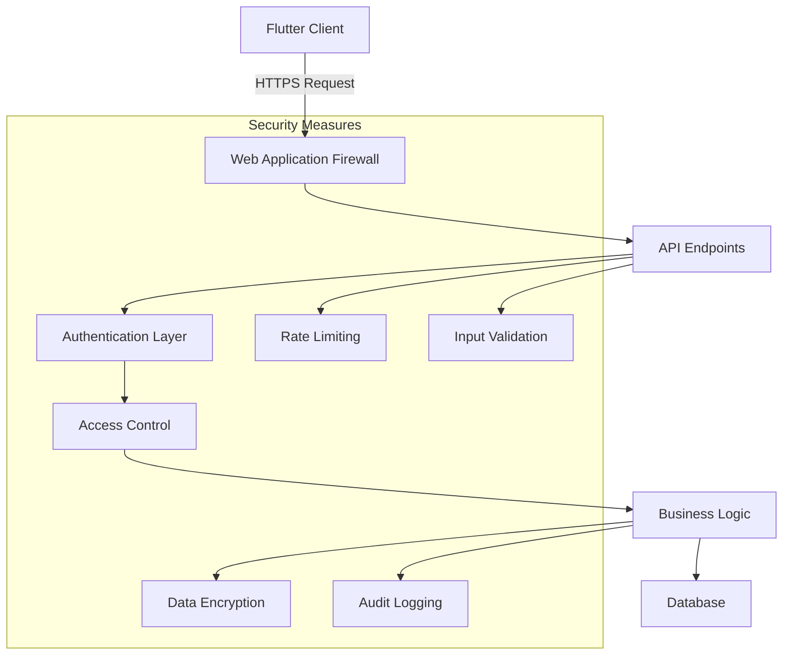

# پیاده‌سازی امنیت - Security Implementation

## 📊 Document Information
- **Created:** 2025-09-01
- **Last Updated:** 2025-09-01
- **Version:** 1.0
- **Maintainer:** DataSave Security Team
- **Related Files:** `/backend/config/security.php`, `/lib/core/security/security_service.dart`

## 🎯 Overview
این مستند روش‌های پیاده‌سازی امنیت در پروژه DataSave را شرح می‌دهد، شامل حفاظت از API، احراز هویت، کنترل دسترسی، امنیت داده‌ها، و بهترین روش‌های امنیتی مورد استفاده در سمت سرور (PHP) و سمت کلاینت (Flutter).

## 📋 Table of Contents
- [معماری امنیتی](#معماری-امنیتی)
- [احراز هویت و مجوزدهی](#احراز-هویت-و-مجوزدهی)
- [امنیت API](#امنیت-api)
- [امنیت داده‌ها](#امنیت-داده‌ها)
- [محافظت در برابر حملات رایج](#محافظت-در-برابر-حملات-رایج)
- [امنیت در Flutter](#امنیت-در-flutter)
- [روش‌های تست امنیت](#روش‌های-تست-امنیت)
- [پروتکل‌های حفظ حریم خصوصی](#پروتکل‌های-حفظ-حریم-خصوصی)

## 🔒 معماری امنیتی

### ساختار امنیتی


### اصول امنیتی
```yaml
Security Principles:
  1. Defense in Depth: چندین لایه حفاظتی
  2. Least Privilege: دسترسی حداقلی
  3. Secure by Default: امنیت پیش‌فرض
  4. Fail Secure: شکست امن
  5. Complete Mediation: بررسی کامل دسترسی‌ها
  6. Open Design: طراحی باز با رمزهای مخفی
  7. Separation of Duties: تفکیک وظایف
  8. Psychological Acceptability: قابل پذیرش بودن از نظر کاربر
```

## 🔑 احراز هویت و مجوزدهی

### پیاده‌سازی JWT
JWT (JSON Web Token) برای احراز هویت و انتقال امن اطلاعات بین طرفین استفاده می‌شود.

```php
// backend/classes/Auth.php

class Auth {
    private static $secretKey = "YourSecretKeyHere"; // در محیط تولید از متغیرهای محیطی استفاده شود
    private static $tokenExpiration = 3600; // یک ساعت

    /**
     * ایجاد توکن JWT
     */
    public static function generateToken($userId, $userRole) {
        $issuedAt = time();
        $expirationTime = $issuedAt + self::$tokenExpiration;
        
        $payload = [
            'iat' => $issuedAt,
            'exp' => $expirationTime,
            'user_id' => $userId,
            'role' => $userRole,
            'jti' => bin2hex(random_bytes(16)) // شناسه یکتای توکن
        ];
        
        return self::encode($payload);
    }
    
    /**
     * اعتبارسنجی توکن JWT
     */
    public static function validateToken($token) {
        try {
            $payload = self::decode($token);
            
            // بررسی انقضا
            if ($payload['exp'] < time()) {
                return false;
            }
            
            // بررسی blacklist
            if (self::isTokenBlacklisted($payload['jti'])) {
                return false;
            }
            
            return $payload;
        } catch (Exception $e) {
            return false;
        }
    }
    
    /**
     * رمزگذاری JWT
     */
    private static function encode($payload) {
        $header = json_encode(['typ' => 'JWT', 'alg' => 'HS256']);
        $header = self::base64UrlEncode($header);
        
        $payload = json_encode($payload);
        $payload = self::base64UrlEncode($payload);
        
        $signature = hash_hmac('sha256', "$header.$payload", self::$secretKey, true);
        $signature = self::base64UrlEncode($signature);
        
        return "$header.$payload.$signature";
    }
    
    /**
     * رمزگشایی JWT
     */
    private static function decode($token) {
        $tokenParts = explode('.', $token);
        if (count($tokenParts) != 3) {
            throw new Exception('Invalid token format');
        }
        
        list($header, $payload, $signature) = $tokenParts;
        
        // بررسی امضا
        $validSignature = hash_hmac('sha256', "$header.$payload", self::$secretKey, true);
        $validSignature = self::base64UrlEncode($validSignature);
        
        if ($signature !== $validSignature) {
            throw new Exception('Invalid signature');
        }
        
        return json_decode(self::base64UrlDecode($payload), true);
    }
    
    /**
     * کدگذاری Base64Url
     */
    private static function base64UrlEncode($data) {
        return rtrim(strtr(base64_encode($data), '+/', '-_'), '=');
    }
    
    /**
     * رمزگشایی Base64Url
     */
    private static function base64UrlDecode($data) {
        return base64_decode(strtr($data, '-_', '+/'));
    }
    
    /**
     * بررسی blacklist توکن
     */
    private static function isTokenBlacklisted($tokenId) {
        // پیاده‌سازی بررسی در دیتابیس یا redis
        // ...
        return false;
    }
    
    /**
     * افزودن توکن به blacklist (برای logout)
     */
    public static function blacklistToken($token) {
        try {
            $payload = self::decode($token);
            
            // افزودن به blacklist در دیتابیس یا redis
            // ...
            
            return true;
        } catch (Exception $e) {
            return false;
        }
    }
}
```

### مجوزدهی دسترسی‌ها
```php
// backend/classes/AccessControl.php

class AccessControl {
    /**
     * بررسی دسترسی کاربر به یک منبع
     */
    public static function checkAccess($userId, $resource, $action) {
        // دریافت نقش کاربر از دیتابیس
        $db = Database::getConnection();
        $stmt = $db->prepare("SELECT role FROM users WHERE user_id = ?");
        $stmt->execute([$userId]);
        $user = $stmt->fetch();
        
        if (!$user) {
            return false;
        }
        
        $role = $user['role'];
        
        // بررسی دسترسی براساس نقش
        return self::hasPermission($role, $resource, $action);
    }
    
    /**
     * بررسی دسترسی براساس نقش
     */
    private static function hasPermission($role, $resource, $action) {
        $permissions = [
            'admin' => [
                'settings' => ['read', 'write', 'delete'],
                'users' => ['read', 'write', 'delete'],
                'forms' => ['read', 'write', 'delete', 'publish'],
                'logs' => ['read', 'delete']
            ],
            'editor' => [
                'settings' => ['read'],
                'users' => ['read'],
                'forms' => ['read', 'write', 'publish'],
                'logs' => ['read']
            ],
            'user' => [
                'settings' => [],
                'users' => [],
                'forms' => ['read', 'write'],
                'logs' => []
            ]
        ];
        
        if (!isset($permissions[$role]) || 
            !isset($permissions[$role][$resource])) {
            return false;
        }
        
        return in_array($action, $permissions[$role][$resource]);
    }
    
    /**
     * ایجاد middleware برای کنترل دسترسی
     */
    public static function middleware($resource, $action) {
        $token = self::getBearerToken();
        
        if (!$token) {
            ApiResponse::authError('توکن احراز هویت یافت نشد');
        }
        
        $payload = Auth::validateToken($token);
        
        if (!$payload) {
            ApiResponse::authError('توکن نامعتبر یا منقضی شده');
        }
        
        $userId = $payload['user_id'];
        
        if (!self::checkAccess($userId, $resource, $action)) {
            ApiResponse::accessDenied();
        }
        
        // ادامه پردازش با اطلاعات کاربر
        return $payload;
    }
    
    /**
     * استخراج توکن Bearer از هدرها
     */
    private static function getBearerToken() {
        $headers = getallheaders();
        
        if (!isset($headers['Authorization'])) {
            return null;
        }
        
        if (!preg_match('/Bearer\s(\S+)/', $headers['Authorization'], $matches)) {
            return null;
        }
        
        return $matches[1];
    }
}
```

## 🔐 امنیت API

### محدودیت نرخ درخواست (Rate Limiting)
```php
// backend/classes/RateLimiter.php

class RateLimiter {
    private static $redis;
    private static $windowSize = 60; // ثانیه
    
    /**
     * اتصال به Redis
     */
    private static function connect() {
        if (!self::$redis) {
            self::$redis = new Redis();
            self::$redis->connect('127.0.0.1', 6379);
        }
        return self::$redis;
    }
    
    /**
     * بررسی محدودیت نرخ درخواست
     */
    public static function check($ip, $endpoint, $limit) {
        $redis = self::connect();
        $key = "rate:{$ip}:{$endpoint}";
        $current = $redis->get($key);
        
        if (!$current) {
            $redis->setex($key, self::$windowSize, 1);
            return true;
        }
        
        if ($current >= $limit) {
            return false;
        }
        
        $redis->incr($key);
        return true;
    }
    
    /**
     * میدلور محدودیت نرخ درخواست
     */
    public static function middleware($limit = 60) {
        $ip = $_SERVER['REMOTE_ADDR'];
        $endpoint = $_SERVER['REQUEST_URI'];
        
        if (!self::check($ip, $endpoint, $limit)) {
            header('Retry-After: ' . self::$windowSize);
            ApiResponse::error(
                'تعداد درخواست‌های شما بیش از حد مجاز است. لطفاً کمی صبر کنید.',
                'ERR_TOO_MANY_REQUESTS',
                null,
                429
            );
        }
    }
}
```

### CORS تنظیمات
```php
// backend/config/cors.php

/**
 * تنظیمات Cross-Origin Resource Sharing
 */
function configureCors() {
    // لیست دامنه‌های مجاز
    $allowedOrigins = [
        'http://localhost:3000',
        'https://datasave.example.com'
    ];
    
    $origin = isset($_SERVER['HTTP_ORIGIN']) ? $_SERVER['HTTP_ORIGIN'] : '';
    
    // بررسی دامنه‌های مجاز
    if (in_array($origin, $allowedOrigins)) {
        header("Access-Control-Allow-Origin: $origin");
        header("Access-Control-Allow-Methods: GET, POST, PUT, DELETE, OPTIONS");
        header("Access-Control-Allow-Headers: Content-Type, Authorization");
        header("Access-Control-Allow-Credentials: true");
        header("Access-Control-Max-Age: 86400"); // 24 ساعت
    }
    
    // پاسخ به درخواست preflight
    if ($_SERVER['REQUEST_METHOD'] == 'OPTIONS') {
        header("HTTP/1.1 200 OK");
        exit;
    }
}

// فراخوانی در ابتدای هر endpoint
configureCors();
```

## 🔒 امنیت داده‌ها

### رمزنگاری داده‌های حساس
```php
// backend/classes/Encryption.php

class Encryption {
    private static $encryptionKey;
    private static $method = 'aes-256-cbc';
    
    /**
     * تنظیم کلید رمزنگاری
     */
    public static function init() {
        // در محیط تولید از متغیرهای محیطی استفاده شود
        self::$encryptionKey = getenv('ENCRYPTION_KEY') ?: 'YourEncryptionKeyHere';
    }
    
    /**
     * رمزنگاری داده
     */
    public static function encrypt($data) {
        if (!self::$encryptionKey) {
            self::init();
        }
        
        $ivlen = openssl_cipher_iv_length(self::$method);
        $iv = openssl_random_pseudo_bytes($ivlen);
        
        $encrypted = openssl_encrypt(
            $data, 
            self::$method, 
            self::$encryptionKey, 
            OPENSSL_RAW_DATA, 
            $iv
        );
        
        return base64_encode($iv . $encrypted);
    }
    
    /**
     * رمزگشایی داده
     */
    public static function decrypt($data) {
        if (!self::$encryptionKey) {
            self::init();
        }
        
        $data = base64_decode($data);
        $ivlen = openssl_cipher_iv_length(self::$method);
        $iv = substr($data, 0, $ivlen);
        $encrypted = substr($data, $ivlen);
        
        return openssl_decrypt(
            $encrypted, 
            self::$method, 
            self::$encryptionKey, 
            OPENSSL_RAW_DATA, 
            $iv
        );
    }
    
    /**
     * هش کردن پسورد
     */
    public static function hashPassword($password) {
        return password_hash($password, PASSWORD_ARGON2ID, [
            'memory_cost' => 65536, // 64MB
            'time_cost' => 4,       // 4 پاس
            'threads' => 3          // 3 رشته پردازش
        ]);
    }
    
    /**
     * بررسی پسورد
     */
    public static function verifyPassword($password, $hash) {
        return password_verify($password, $hash);
    }
    
    /**
     * ایجاد توکن تصادفی
     */
    public static function generateRandomToken($length = 32) {
        return bin2hex(random_bytes($length));
    }
}
```

### امنیت دیتابیس
```php
// backend/classes/Database.php (بخش امنیتی)

class Database {
    // ...
    
    /**
     * اجرای امن کوئری با prepared statements
     */
    public static function safeQuery($sql, $params = []) {
        $db = self::getConnection();
        $stmt = $db->prepare($sql);
        $stmt->execute($params);
        return $stmt;
    }
    
    /**
     * محدود کردن دسترسی کاربر براساس مالکیت
     */
    public static function checkOwnership($table, $recordId, $userId) {
        $sql = "SELECT 1 FROM $table WHERE id = ? AND user_id = ?";
        $stmt = self::safeQuery($sql, [$recordId, $userId]);
        return $stmt->rowCount() > 0;
    }
    
    /**
     * فیلترینگ و پاکسازی ورودی‌ها
     */
    public static function sanitize($input, $type = 'string') {
        switch ($type) {
            case 'int':
                return filter_var($input, FILTER_SANITIZE_NUMBER_INT);
            case 'float':
                return filter_var($input, FILTER_SANITIZE_NUMBER_FLOAT, FILTER_FLAG_ALLOW_FRACTION);
            case 'email':
                return filter_var($input, FILTER_SANITIZE_EMAIL);
            case 'url':
                return filter_var($input, FILTER_SANITIZE_URL);
            case 'string':
            default:
                return htmlspecialchars($input, ENT_QUOTES, 'UTF-8');
        }
    }
    
    // ...
}
```

## 🛡️ محافظت در برابر حملات رایج

### XSS Protection
```php
// backend/classes/Security.php

class Security {
    /**
     * پاکسازی داده برای جلوگیری از XSS
     */
    public static function sanitizeOutput($data) {
        if (is_array($data)) {
            foreach ($data as $key => $value) {
                $data[$key] = self::sanitizeOutput($value);
            }
        } else {
            $data = htmlspecialchars($data, ENT_QUOTES, 'UTF-8');
        }
        
        return $data;
    }
    
    /**
     * تنظیم هدرهای امنیتی
     */
    public static function setSecurityHeaders() {
        // محافظت در برابر XSS
        header("X-XSS-Protection: 1; mode=block");
        
        // جلوگیری از Clickjacking
        header("X-Frame-Options: DENY");
        
        // جلوگیری از MIME Type Sniffing
        header("X-Content-Type-Options: nosniff");
        
        // Content Security Policy
        header("Content-Security-Policy: default-src 'self'; script-src 'self'; connect-src 'self'; img-src 'self'; style-src 'self';");
        
        // Referrer Policy
        header("Referrer-Policy: strict-origin-when-cross-origin");
        
        // Permissions Policy
        header("Permissions-Policy: camera=(), microphone=(), geolocation=()");
    }
    
    /**
     * اعتبارسنجی توکن CSRF
     */
    public static function validateCsrfToken($token) {
        session_start();
        
        if (!isset($_SESSION['csrf_token'])) {
            return false;
        }
        
        return hash_equals($_SESSION['csrf_token'], $token);
    }
    
    /**
     * ایجاد توکن CSRF
     */
    public static function generateCsrfToken() {
        session_start();
        
        if (!isset($_SESSION['csrf_token'])) {
            $_SESSION['csrf_token'] = bin2hex(random_bytes(32));
        }
        
        return $_SESSION['csrf_token'];
    }
}
```

### حفاظت در برابر SQL Injection
```php
// نمونه کد حفاظت شده در برابر SQL Injection

// ❌ روش ناامن
$username = $_POST['username'];
$result = $db->query("SELECT * FROM users WHERE username = '$username'");

// ✅ روش امن با استفاده از Prepared Statements
$username = $_POST['username'];
$stmt = $db->prepare("SELECT * FROM users WHERE username = ?");
$stmt->execute([$username]);
$result = $stmt->fetchAll();
```

## 📱 امنیت در Flutter

### ذخیره‌سازی امن داده‌ها در Flutter
```dart
// lib/core/security/secure_storage.dart

import 'package:flutter_secure_storage/flutter_secure_storage.dart';

class SecureStorage {
  static final _storage = FlutterSecureStorage();
  
  /// ذخیره داده امن
  static Future<void> saveSecure(String key, String value) async {
    await _storage.write(key: key, value: value);
  }
  
  /// خواندن داده امن
  static Future<String?> readSecure(String key) async {
    return await _storage.read(key: key);
  }
  
  /// حذف داده امن
  static Future<void> deleteSecure(String key) async {
    await _storage.delete(key: key);
  }
  
  /// حذف تمام داده‌های امن
  static Future<void> deleteAllSecure() async {
    await _storage.deleteAll();
  }
  
  /// ذخیره‌سازی توکن احراز هویت
  static Future<void> saveAuthToken(String token) async {
    await saveSecure('auth_token', token);
  }
  
  /// خواندن توکن احراز هویت
  static Future<String?> getAuthToken() async {
    return await readSecure('auth_token');
  }
  
  /// حذف توکن (برای logout)
  static Future<void> removeAuthToken() async {
    await deleteSecure('auth_token');
  }
}
```

### میدلور امنیتی در Flutter
```dart
// lib/core/security/auth_interceptor.dart

import 'package:http/http.dart' as http;
import 'package:http_interceptor/http_interceptor.dart';

class AuthInterceptor implements InterceptorContract {
  @override
  Future<RequestData> interceptRequest({required RequestData data}) async {
    final token = await SecureStorage.getAuthToken();
    
    if (token != null) {
      data.headers['Authorization'] = 'Bearer $token';
    }
    
    // اضافه کردن هدرهای امنیتی
    data.headers['X-Requested-With'] = 'XMLHttpRequest';
    
    return data;
  }

  @override
  Future<ResponseData> interceptResponse({required ResponseData data}) async {
    // بررسی وضعیت توکن
    if (data.statusCode == 401) {
      // توکن منقضی شده - عملیات لاگ‌آوت
      await SecureStorage.removeAuthToken();
      // ارسال رویداد برای نمایش صفحه لاگین
      // eventBus.fire(LogoutEvent());
    }
    
    return data;
  }
}

class ApiClient {
  static final _client = InterceptedClient.build(
    interceptors: [AuthInterceptor()],
    retryPolicy: ExpiredTokenRetryPolicy(),
  );
  
  // متدهای API ...
}

class ExpiredTokenRetryPolicy extends RetryPolicy {
  @override
  Future<bool> shouldAttemptRetry(ResponseData response) async {
    // تلاش مجدد فقط برای خطاهای سرور
    return response.statusCode >= 500 && response.statusCode < 600;
  }
}
```

## 🧪 روش‌های تست امنیت

### تست نفوذ و اسکن آسیب‌پذیری
```yaml
Security Testing:
  1. تست نفوذ (Penetration Testing):
     - تست دسترسی غیرمجاز
     - تست احراز هویت و مجوزدهی
     - تست XSS و CSRF
     - تست SQL Injection
     
  2. اسکن آسیب‌پذیری:
     - OWASP ZAP
     - SonarQube
     - Dependency Check
     
  3. تست Code Review:
     - بررسی دستی کد توسط متخصصان امنیت
     - استفاده از ابزارهای Static Application Security Testing
     
  4. فرآیند امنیتی مستمر:
     - ادغام تست امنیت در CI/CD
     - اسکن خودکار پکیج‌ها و وابستگی‌ها
     - آموزش تیم توسعه در زمینه امنیت
```

### چک‌لیست امنیتی
```yaml
Security Checklist:
  Authentication:
    - ✅ استفاده از JWT با امضای امن
    - ✅ مدیریت انقضای توکن
    - ✅ ذخیره‌سازی امن پسوردها با Argon2id
    - ✅ سیاست‌های پیچیدگی پسورد
    - ✅ محدودیت تلاش‌های ناموفق ورود
    
  Authorization:
    - ✅ کنترل دسترسی براساس نقش (RBAC)
    - ✅ اعمال محدودیت‌های دسترسی در هر API
    - ✅ بررسی مالکیت منابع
    
  Data Security:
    - ✅ رمزنگاری داده‌های حساس
    - ✅ اعتبارسنجی تمام ورودی‌ها
    - ✅ استفاده از Prepared Statements برای کوئری‌ها
    
  API Security:
    - ✅ محدودیت نرخ درخواست
    - ✅ هدرهای امنیتی
    - ✅ تنظیمات CORS
    - ✅ پروتکل HTTPS
    
  Client Security:
    - ✅ ذخیره‌سازی امن داده‌ها در Flutter
    - ✅ عدم ذخیره اطلاعات حساس در کد
    - ✅ حفاظت از API Key‌ها
```

## 🔏 پروتکل‌های حفظ حریم خصوصی

### استانداردهای حفظ حریم خصوصی
```yaml
Privacy Standards:
  1. رضایت‌نامه آگاهانه:
     - دریافت رضایت کاربر برای جمع‌آوری داده‌ها
     - امکان لغو رضایت‌نامه
     
  2. حداقل‌سازی داده‌ها:
     - جمع‌آوری فقط داده‌های ضروری
     - حذف خودکار داده‌های غیرضروری
     
  3. شفافیت:
     - سیاست حریم خصوصی واضح
     - اطلاع‌رسانی در مورد نحوه استفاده از داده‌ها
     
  4. حقوق کاربران:
     - حق دسترسی به داده‌ها
     - حق اصلاح داده‌ها
     - حق حذف داده‌ها ("حق فراموش شدن")
     
  5. امنیت داده‌ها:
     - رمزنگاری انتقال و ذخیره‌سازی
     - محدودیت دسترسی به داده‌های حساس
```

### سیاست حفظ حریم خصوصی
سیاست حفظ حریم خصوصی کامل در پوشه `/backend/privacy-policy.html` قرار دارد که در صفحه حریم خصوصی برنامه نمایش داده می‌شود.

## 🔄 Related Documentation
- [Error Handling](error-handling.md)
- [API Endpoints Reference](api-endpoints-reference.md)
- [Database Integration](database-integration.md)
- [Logging System](../05-Services-Integration/logging-system.md)

---
*Last updated: 2025-09-01*  
*File: docs/02-Backend-APIs/security-implementation.md*