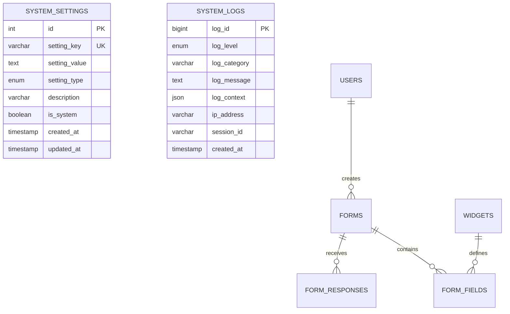
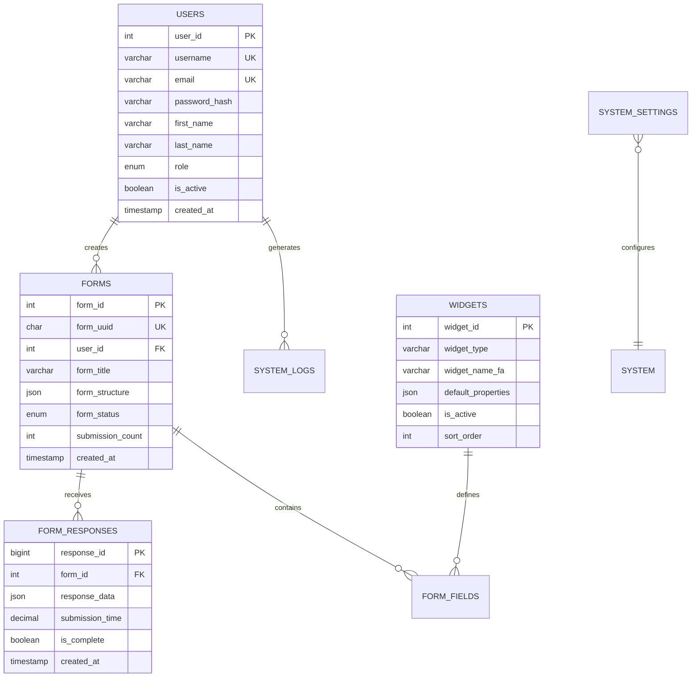

# طراحی کلی دیتابیس - Database Design

## 📊 Document Information
- **Created:** 2025-01-09
- **Last Updated:** 2025-01-09
- **Version:** 1.0
- **Maintainer:** DataSave Development Team
- **Related Files:** `/database_setup.sql`, `/backend/config/database.php`

## 🎯 Overview
طراحی جامع پایگاه داده DataSave با تمرکز بر پشتیبانی کامل از زبان فارسی، مقیاس‌پذیری، و بهینه‌سازی عملکرد.

## 📋 Table of Contents
- [فلسفه طراحی](#فلسفه-طراحی)
- [مشخصات کلی دیتابیس](#مشخصات-کلی-دیتابیس)
- [ساختار جداول فعلی](#ساختار-جداول-فعلی)
- [ساختار جداول آینده](#ساختار-جداول-آینده)
- [روابط و کلیدها](#روابط-و-کلیدها)
- [نمایه‌سازی و بهینه‌سازی](#نمایهسازی-و-بهینهسازی)
- [امنیت داده‌ها](#امنیت-دادهها)

## 🎨 فلسفه طراحی - Design Philosophy

### اصول کلیدی
```yaml
Persian-First Design:
  - کاراکترست: utf8mb4_persian_ci در همه جداول
  - پشتیبانی کامل از متن فارسی
  - فیلدهای توضیحات به فارسی
  - نامگذاری ستون‌ها به انگلیسی (استاندارد)

Scalability:
  - طراحی مدولار برای رشد آینده
  - Partitioning برای جداول حجیم
  - اندیکس‌گذاری هوشمند
  - نرمال‌سازی مناسب

Performance:
  - بهینه‌سازی کوئری‌ها
  - کش کردن داده‌های پرکاربرد
  - پارتیشن‌بندی بر اساس زمان
  - اندیکس‌های ترکیبی
```

### معماری دیتابیس


## 🗄️ مشخصات کلی دیتابیس - Database Specifications

### پیکربندی MySQL
```sql
Database Engine: MySQL 8.0+
Character Set: utf8mb4
Collation: utf8mb4_persian_ci
Storage Engine: InnoDB
Port: 3307 (XAMPP Custom)
Connection: PDO with prepared statements
```

### Connection Configuration
```php
<?php
// Database Configuration
class DatabaseConfig {
    public const HOST = 'localhost';
    public const PORT = 3307;
    public const DATABASE = 'datasave_db';
    public const USERNAME = 'root';
    public const PASSWORD = 'Mojtab@123';
    public const CHARSET = 'utf8mb4';
    public const COLLATION = 'utf8mb4_persian_ci';
}
```

### تنظیمات عملکرد
```sql
-- MySQL Configuration for Persian Support
SET NAMES utf8mb4 COLLATE utf8mb4_persian_ci;
SET character_set_client = utf8mb4;
SET character_set_connection = utf8mb4;
SET character_set_results = utf8mb4;

-- InnoDB Optimizations
SET innodb_file_per_table = ON;
SET innodb_buffer_pool_size = '512M';
SET innodb_log_file_size = '128M';
```

## 📁 ساختار جداول فعلی - Current Table Structure

### 1. جدول system_settings

#### تعریف جدول
```sql
CREATE TABLE `system_settings` (
  `id` INT PRIMARY KEY AUTO_INCREMENT COMMENT 'شناسه یکتا',
  `setting_key` VARCHAR(100) UNIQUE NOT NULL COMMENT 'کلید تنظیمات (یکتا)',
  `setting_value` TEXT COMMENT 'مقدار تنظیمات',
  `setting_type` ENUM('string','json','boolean','number','encrypted') 
                 DEFAULT 'string' COMMENT 'نوع داده',
  `description` VARCHAR(255) COMMENT 'توضیحات تنظیمات',
  `is_system` BOOLEAN DEFAULT FALSE COMMENT 'آیا تنظیمات سیستمی است؟',
  `is_readonly` BOOLEAN DEFAULT FALSE COMMENT 'آیا فقط خواندنی است؟',
  `created_at` TIMESTAMP DEFAULT CURRENT_TIMESTAMP COMMENT 'زمان ایجاد',
  `updated_at` TIMESTAMP DEFAULT CURRENT_TIMESTAMP 
               ON UPDATE CURRENT_TIMESTAMP COMMENT 'زمان آخرین بروزرسانی',
  
  INDEX idx_setting_key (`setting_key`),
  INDEX idx_is_system (`is_system`),
  INDEX idx_setting_type (`setting_type`)
) ENGINE=InnoDB DEFAULT CHARSET=utf8mb4 COLLATE=utf8mb4_persian_ci;
```

#### داده‌های موجود
| ID | Setting Key | Value | Type | Description |
|----|-------------|-------|------|-------------|
| 1 | `openai_api_key` | `sk-proj-...` | encrypted | کلید API سرویس OpenAI |
| 2 | `openai_model` | `gpt-4` | string | مدل پیش‌فرض OpenAI |
| 3 | `openai_max_tokens` | `2048` | number | حداکثر توکن برای پاسخ |
| 4 | `openai_temperature` | `0.7` | number | میزان خلاقیت AI |
| 5 | `app_language` | `fa` | string | زبان پیش‌فرض برنامه |
| 6 | `enable_logging` | `true` | boolean | فعال‌سازی سیستم لاگ |
| 7 | `max_log_entries` | `1000` | number | حداکثر تعداد لاگ |
| 8 | `app_theme` | `light` | string | تم پیش‌فرض |
| 9 | `auto_save` | `true` | boolean | ذخیره خودکار |

#### الگوهای استفاده
```php
// دریافت تنظیمات
$settings = $db->query("
    SELECT setting_key, setting_value, setting_type 
    FROM system_settings 
    WHERE is_system = true
    ORDER BY setting_key
");

// بروزرسانی تنظیمات
$stmt = $db->prepare("
    UPDATE system_settings 
    SET setting_value = ?, updated_at = NOW() 
    WHERE setting_key = ?
");
```

### 2. جدول system_logs

#### تعریف جدول
```sql
CREATE TABLE `system_logs` (
  `log_id` BIGINT PRIMARY KEY AUTO_INCREMENT COMMENT 'شناسه یکتا لاگ',
  `log_level` ENUM('DEBUG','INFO','WARNING','ERROR','CRITICAL') 
              NOT NULL COMMENT 'سطح لاگ',
  `log_category` VARCHAR(50) NOT NULL COMMENT 'دسته‌بندی لاگ',
  `log_message` TEXT NOT NULL COMMENT 'پیام اصلی لاگ',
  `log_context` JSON COMMENT 'اطلاعات تکمیلی به صورت JSON',
  `ip_address` VARCHAR(45) COMMENT 'آدرس IP کاربر',
  `user_agent` TEXT COMMENT 'اطلاعات مرورگر',
  `session_id` VARCHAR(128) COMMENT 'شناسه جلسه کاربر',
  `user_id` INT COMMENT 'شناسه کاربر (آینده)',
  `created_at` TIMESTAMP DEFAULT CURRENT_TIMESTAMP COMMENT 'زمان ثبت',
  
  INDEX idx_log_level (`log_level`),
  INDEX idx_log_category (`log_category`),
  INDEX idx_created_at (`created_at`),
  INDEX idx_level_category (`log_level`, `log_category`)
) ENGINE=InnoDB DEFAULT CHARSET=utf8mb4 COLLATE=utf8mb4_persian_ci;
```

#### الگوهای استفاده
```php
// ثبت لاگ جدید
$stmt = $db->prepare("
    INSERT INTO system_logs 
    (log_level, log_category, log_message, log_context, ip_address) 
    VALUES (?, ?, ?, ?, ?)
");

// دریافت لاگ‌ها با فیلتر
$logs = $db->query("
    SELECT * FROM system_logs 
    WHERE log_level IN ('ERROR', 'CRITICAL') 
    AND created_at >= DATE_SUB(NOW(), INTERVAL 24 HOUR)
    ORDER BY created_at DESC
    LIMIT 100
");
```

#### آمار کاربرد فعلی
```yaml
Current Usage:
  - Total Logs: 500+ entries
  - Categories: API, Database, System, Frontend
  - Levels: Mostly INFO and DEBUG
  - Growth Rate: ~50 logs per day (development)
  - Retention: 30 days (configurable)
```

## 🔮 ساختار جداول آینده - Future Table Structure

### 3. جدول users (برنامه‌ریزی شده)
```sql
CREATE TABLE `users` (
  `user_id` INT PRIMARY KEY AUTO_INCREMENT,
  `username` VARCHAR(50) UNIQUE NOT NULL,
  `email` VARCHAR(255) UNIQUE NOT NULL,
  `password_hash` VARCHAR(255) NOT NULL,
  `first_name` VARCHAR(100),
  `last_name` VARCHAR(100), 
  `phone` VARCHAR(20),
  `avatar_url` VARCHAR(500),
  `language` CHAR(2) DEFAULT 'fa',
  `timezone` VARCHAR(50) DEFAULT 'Asia/Tehran',
  `role` ENUM('admin','user','guest') DEFAULT 'user',
  `email_verified` BOOLEAN DEFAULT FALSE,
  `is_active` BOOLEAN DEFAULT TRUE,
  `last_login` TIMESTAMP NULL,
  `created_at` TIMESTAMP DEFAULT CURRENT_TIMESTAMP,
  `updated_at` TIMESTAMP DEFAULT CURRENT_TIMESTAMP ON UPDATE CURRENT_TIMESTAMP,
  
  INDEX idx_email (`email`),
  INDEX idx_username (`username`),
  INDEX idx_role (`role`),
  INDEX idx_active (`is_active`)
) ENGINE=InnoDB DEFAULT CHARSET=utf8mb4 COLLATE=utf8mb4_persian_ci;
```

### 4. جدول forms (اصلی)
```sql
CREATE TABLE `forms` (
  `form_id` INT PRIMARY KEY AUTO_INCREMENT,
  `form_uuid` CHAR(36) UNIQUE NOT NULL DEFAULT (UUID()),
  `user_id` INT NOT NULL,
  `form_title` VARCHAR(255) NOT NULL,
  `form_description` TEXT,
  `form_structure` JSON NOT NULL COMMENT 'ساختار کامل فرم',
  `form_settings` JSON COMMENT 'تنظیمات فرم (پیش‌نمایش، امنیت، etc)',
  `ai_prompt` TEXT COMMENT 'پرامپت اولیه AI',
  `form_status` ENUM('draft','published','archived') DEFAULT 'draft',
  `form_version` INT DEFAULT 1,
  `view_count` INT DEFAULT 0,
  `submission_count` INT DEFAULT 0,
  `is_public` BOOLEAN DEFAULT FALSE,
  `password_protected` BOOLEAN DEFAULT FALSE,
  `password_hash` VARCHAR(255),
  `expires_at` TIMESTAMP NULL,
  `created_at` TIMESTAMP DEFAULT CURRENT_TIMESTAMP,
  `updated_at` TIMESTAMP DEFAULT CURRENT_TIMESTAMP ON UPDATE CURRENT_TIMESTAMP,
  
  FOREIGN KEY (user_id) REFERENCES users(user_id) ON DELETE CASCADE,
  INDEX idx_user_id (`user_id`),
  INDEX idx_form_status (`form_status`),
  INDEX idx_is_public (`is_public`),
  INDEX idx_created_at (`created_at`)
) ENGINE=InnoDB DEFAULT CHARSET=utf8mb4 COLLATE=utf8mb4_persian_ci;
```

### 5. جدول widgets (کتابخانه ویجت‌ها)
```sql
CREATE TABLE `widgets` (
  `widget_id` INT PRIMARY KEY AUTO_INCREMENT,
  `widget_type` VARCHAR(50) NOT NULL,
  `widget_name_fa` VARCHAR(100) NOT NULL,
  `widget_name_en` VARCHAR(100) NOT NULL,
  `widget_icon` VARCHAR(50),
  `widget_category` VARCHAR(50),
  `default_properties` JSON,
  `validation_schema` JSON,
  `render_template` TEXT,
  `is_active` BOOLEAN DEFAULT TRUE,
  `sort_order` INT DEFAULT 0,
  `created_at` TIMESTAMP DEFAULT CURRENT_TIMESTAMP,
  
  INDEX idx_widget_type (`widget_type`),
  INDEX idx_category (`widget_category`),
  INDEX idx_active (`is_active`)
) ENGINE=InnoDB DEFAULT CHARSET=utf8mb4 COLLATE=utf8mb4_persian_ci;
```

### 6. جدول form_responses (پاسخ‌های فرم)
```sql
CREATE TABLE `form_responses` (
  `response_id` BIGINT PRIMARY KEY AUTO_INCREMENT,
  `form_id` INT NOT NULL,
  `respondent_ip` VARCHAR(45),
  `respondent_agent` TEXT,
  `response_data` JSON NOT NULL COMMENT 'داده‌های پاسخ کامل',
  `submission_time` DECIMAL(8,3) COMMENT 'زمان تکمیل (ثانیه)',
  `is_complete` BOOLEAN DEFAULT TRUE,
  `validation_errors` JSON COMMENT 'خطاهای اعتبارسنجی',
  `created_at` TIMESTAMP DEFAULT CURRENT_TIMESTAMP,
  
  FOREIGN KEY (form_id) REFERENCES forms(form_id) ON DELETE CASCADE,
  INDEX idx_form_id (`form_id`),
  INDEX idx_created_at (`created_at`)
) ENGINE=InnoDB DEFAULT CHARSET=utf8mb4 COLLATE=utf8mb4_persian_ci
PARTITION BY RANGE (YEAR(created_at)) (
    PARTITION p2025 VALUES LESS THAN (2026),
    PARTITION p2026 VALUES LESS THAN (2027),
    PARTITION p_future VALUES LESS THAN MAXVALUE
);
```

## 🔗 روابط و کلیدها - Relationships & Keys

### Entity Relationship Diagram


### Foreign Key Constraints
```sql
-- Form to User relationship
ALTER TABLE forms 
ADD CONSTRAINT fk_forms_user_id 
FOREIGN KEY (user_id) REFERENCES users(user_id) 
ON DELETE CASCADE ON UPDATE CASCADE;

-- Response to Form relationship  
ALTER TABLE form_responses
ADD CONSTRAINT fk_responses_form_id
FOREIGN KEY (form_id) REFERENCES forms(form_id)
ON DELETE CASCADE ON UPDATE CASCADE;

-- Log to User relationship (optional)
ALTER TABLE system_logs
ADD CONSTRAINT fk_logs_user_id
FOREIGN KEY (user_id) REFERENCES users(user_id)
ON DELETE SET NULL ON UPDATE CASCADE;
```

## 📊 نمایه‌سازی و بهینه‌سازی - Indexing & Optimization

### استراتژی Index‌گذاری
```sql
-- Performance Indexes for system_settings
CREATE INDEX idx_settings_type_system ON system_settings(setting_type, is_system);
CREATE INDEX idx_settings_updated ON system_settings(updated_at DESC);

-- Performance Indexes for system_logs  
CREATE INDEX idx_logs_level_time ON system_logs(log_level, created_at DESC);
CREATE INDEX idx_logs_category_time ON system_logs(log_category, created_at DESC);
CREATE INDEX idx_logs_user_time ON system_logs(user_id, created_at DESC);

-- Future Indexes for forms
CREATE INDEX idx_forms_user_status ON forms(user_id, form_status);
CREATE INDEX idx_forms_public_active ON forms(is_public, form_status, created_at);
CREATE INDEX idx_forms_title_search ON forms(form_title);

-- Full-text search indexes
ALTER TABLE forms ADD FULLTEXT(form_title, form_description);
ALTER TABLE system_logs ADD FULLTEXT(log_message);
```

### Query Optimization Examples
```sql
-- Optimized settings query
SELECT setting_key, setting_value 
FROM system_settings 
WHERE is_system = TRUE 
  AND setting_type IN ('string', 'number')
ORDER BY setting_key;

-- Optimized log query with pagination
SELECT log_level, log_category, log_message, created_at
FROM system_logs 
WHERE log_level IN ('ERROR', 'CRITICAL')
  AND created_at >= DATE_SUB(NOW(), INTERVAL 7 DAY)
ORDER BY created_at DESC
LIMIT 50 OFFSET 0;

-- Complex form search query (future)
SELECT f.form_id, f.form_title, f.submission_count, u.username
FROM forms f
JOIN users u ON f.user_id = u.user_id
WHERE f.form_status = 'published'
  AND f.is_public = TRUE
  AND MATCH(f.form_title) AGAINST('نظرسنجی' IN NATURAL LANGUAGE MODE)
ORDER BY f.submission_count DESC, f.created_at DESC;
```

### Partitioning Strategy
```sql
-- Partition system_logs by year
ALTER TABLE system_logs PARTITION BY RANGE (YEAR(created_at)) (
    PARTITION p2024 VALUES LESS THAN (2025),
    PARTITION p2025 VALUES LESS THAN (2026),
    PARTITION p2026 VALUES LESS THAN (2027),
    PARTITION p_future VALUES LESS THAN MAXVALUE
);

-- Partition form_responses by month (future)
ALTER TABLE form_responses PARTITION BY RANGE (TO_DAYS(created_at)) (
    PARTITION p202501 VALUES LESS THAN (TO_DAYS('2025-02-01')),
    PARTITION p202502 VALUES LESS THAN (TO_DAYS('2025-03-01')),
    PARTITION p202503 VALUES LESS THAN (TO_DAYS('2025-04-01'))
);
```

## 🛡️ امنیت داده‌ها - Data Security

### رمزنگاری فیلدها
```sql
-- Encrypted fields in system_settings
UPDATE system_settings 
SET setting_value = AES_ENCRYPT(setting_value, 'DataSave2025Key!')
WHERE setting_type = 'encrypted';

-- Decryption for reading
SELECT setting_key, 
       CASE 
         WHEN setting_type = 'encrypted' 
         THEN AES_DECRYPT(setting_value, 'DataSave2025Key!')
         ELSE setting_value 
       END as setting_value
FROM system_settings;
```

### User Password Security (آینده)
```php
// PHP password hashing
$password_hash = password_hash($password, PASSWORD_ARGON2ID, [
    'memory_cost' => 65536, // 64 MB
    'time_cost' => 4,       // 4 iterations
    'threads' => 3          // 3 threads
]);

// Verification
if (password_verify($password, $stored_hash)) {
    // Valid password
}
```

### Data Anonymization
```sql
-- Anonymize sensitive user data (GDPR compliance)
UPDATE users 
SET email = CONCAT('user_', user_id, '@deleted.com'),
    first_name = 'User',
    last_name = 'Deleted',
    phone = NULL,
    avatar_url = NULL
WHERE user_id = ?;

-- Remove personal data from logs
UPDATE system_logs 
SET ip_address = '0.0.0.0',
    user_agent = 'Anonymized'
WHERE user_id = ?;
```

### Audit Trail
```sql
-- Create audit table for sensitive operations
CREATE TABLE audit_trail (
  audit_id BIGINT PRIMARY KEY AUTO_INCREMENT,
  table_name VARCHAR(50) NOT NULL,
  operation ENUM('INSERT','UPDATE','DELETE'),
  old_values JSON,
  new_values JSON,
  user_id INT,
  ip_address VARCHAR(45),
  created_at TIMESTAMP DEFAULT CURRENT_TIMESTAMP,
  
  INDEX idx_table_operation (table_name, operation),
  INDEX idx_user_time (user_id, created_at)
) ENGINE=InnoDB DEFAULT CHARSET=utf8mb4 COLLATE=utf8mb4_persian_ci;
```

## ⚠️ Important Notes

### نکات مهم طراحی
1. **Character Set**: همیشه utf8mb4_persian_ci استفاده کنید
2. **JSON Fields**: برای داده‌های پیچیده و قابل توسعه
3. **Timestamps**: همیشه created_at و updated_at داشته باشید
4. **Foreign Keys**: CASCADE برای رابطه‌های قوی، SET NULL برای اختیاری

### محدودیت‌های فعلی
- **No User System**: جداول کاربری هنوز پیاده‌سازی نشده
- **Basic Security**: رمزنگاری فقط برای API keys
- **Limited Partitioning**: فقط system_logs پارتیشن‌بندی شده
- **No Replication**: تک سرور MySQL

### برنامه آینده
- **Master-Slave Replication**: پیاده‌سازی کپی‌برداری
- **Redis Caching**: کش کردن تنظیمات و جلسات
- **Database Monitoring**: ابزارهای نظارت بر عملکرد
- **Automated Backup**: پشتیبان‌گیری خودکار

## 🔄 Related Documentation
- [Tables Reference](./tables-reference.md)
- [Database Relationships](./relationships-diagram.md)
- [Performance Optimization](./indexes-performance.md)
- [Migration Scripts](./migration-scripts.md)

---
*Last updated: 2025-01-09*  
*File: /docs/03-Database-Schema/database-design.md*
