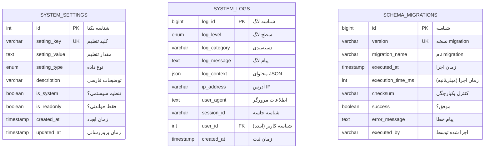
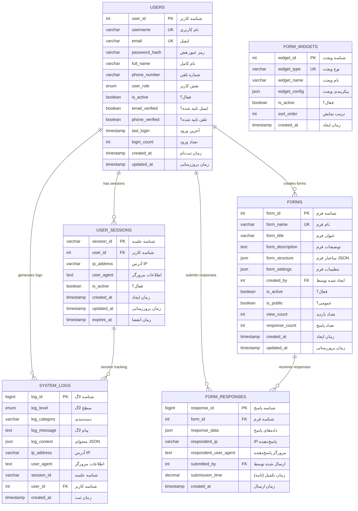
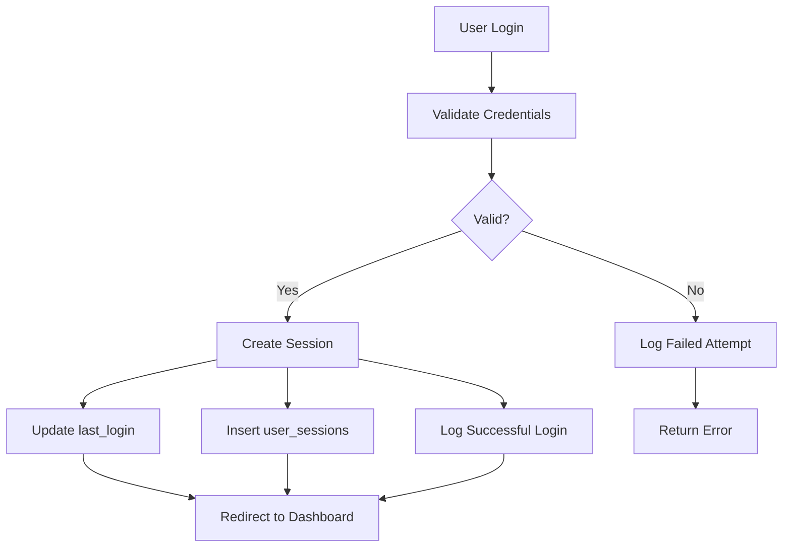
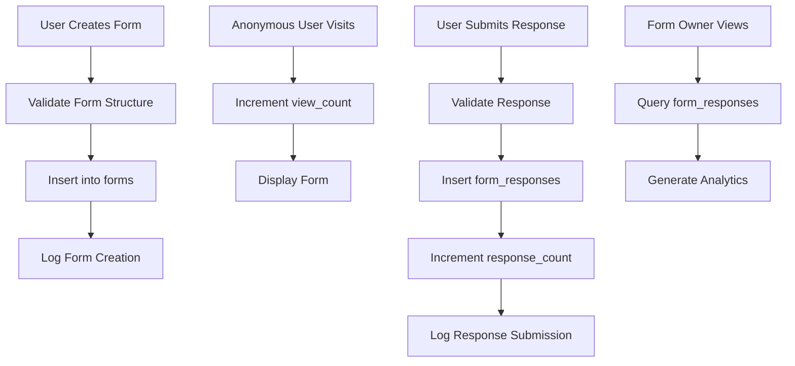
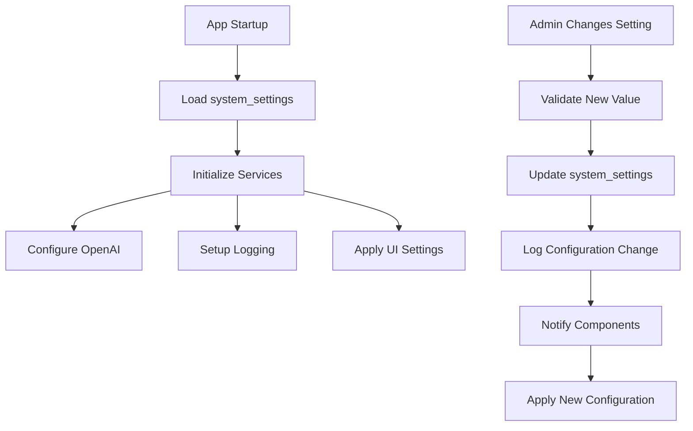

# نمودار روابط دیتابیس - Database Relationships Diagram

## 📊 Document Information
- **Created:** 2025-09-01
- **Last Updated:** 2025-09-01
- **Version:** 1.0
- **Maintainer:** DataSave Development Team
- **Related Files:** `/database_setup.sql`, ERD diagrams, schema files

## 🎯 Overview
نمودار جامع روابط بین جداول DataSave شامل روابط فعلی، جداول آینده، و قوانین referential integrity با تمرکز بر طراحی scalable و Persian-friendly.

## 📋 Table of Contents
- [نمودار کلی روابط](#نمودار-کلی-روابط)
- [روابط جداول فعلی](#روابط-جداول-فعلی)
- [روابط جداول آینده](#روابط-جداول-آینده)
- [قوانین Referential Integrity](#قوانین-referential-integrity)
- [Entity-Relationship Model](#entity-relationship-model)
- [Data Flow Diagrams](#data-flow-diagrams)

## 🗺️ نمودار کلی روابط - Complete Relationship Overview

### Current Database Schema (Phase 1)


### Future Database Schema (Phase 2+)


## 🔗 روابط جداول فعلی - Current Table Relationships

### Phase 1: Independent Tables
```yaml
Current Status (Phase 1):
  Tables: 3 (system_settings, system_logs, schema_migrations)
  Relationships: 0 (جداول مستقل)
  Foreign Keys: 0
  
Table Dependencies:
  - system_settings: مستقل
  - system_logs: مستقل (user_id آماده برای آینده)
  - schema_migrations: مستقل
  
Design Philosophy:
  - Minimal dependencies برای سادگی deployment
  - آماده برای scaling به Phase 2
  - Independence برای easier maintenance
```

### Logical Relationships (Application Level)
```yaml
Logical Connections:
  1. Configuration → Logging:
     - system_settings.enable_logging کنترل logging
     - system_settings.max_log_entries حد نگهداری لاگ‌ها
     
  2. Settings → Application Behavior:
     - OpenAI settings برای AI features
     - Language settings برای UI localization
     - Theme settings برای appearance
     
  3. Logs → System Monitoring:
     - لاگ‌های تغییر تنظیمات
     - audit trail برای تمام operations
     - performance monitoring
```

## 🎯 روابط جداول آینده - Future Table Relationships

### Phase 2: User Management
```sql
-- روابط کاربران و sessions
ALTER TABLE user_sessions 
ADD CONSTRAINT fk_sessions_user 
FOREIGN KEY (user_id) REFERENCES users(user_id) ON DELETE CASCADE;

-- بروزرسانی جدول لاگ‌ها برای ربط با کاربران
ALTER TABLE system_logs 
ADD CONSTRAINT fk_logs_user 
FOREIGN KEY (user_id) REFERENCES users(user_id) ON DELETE SET NULL;

-- Relationship Properties:
-- users → user_sessions: One-to-Many (CASCADE DELETE)
-- users → system_logs: One-to-Many (SET NULL on delete)
```

### Phase 3: Form Builder Core
```sql
-- روابط فرم‌ها و کاربران
ALTER TABLE forms 
ADD CONSTRAINT fk_forms_creator 
FOREIGN KEY (created_by) REFERENCES users(user_id) ON DELETE CASCADE;

-- روابط پاسخ‌ها و فرم‌ها
ALTER TABLE form_responses 
ADD CONSTRAINT fk_responses_form 
FOREIGN KEY (form_id) REFERENCES forms(form_id) ON DELETE CASCADE;

-- روابط پاسخ‌ها و کاربران (اختیاری - برای logged in users)
ALTER TABLE form_responses 
ADD CONSTRAINT fk_responses_user 
FOREIGN KEY (submitted_by) REFERENCES users(user_id) ON DELETE SET NULL;

-- Relationship Properties:
-- users → forms: One-to-Many (CASCADE DELETE)
-- forms → form_responses: One-to-Many (CASCADE DELETE)  
-- users → form_responses: One-to-Many (SET NULL on delete)
```

### Advanced Relationships (Phase 4+)
```sql
-- جداول پیشرفته آینده
CREATE TABLE form_collaborators (
    form_id INT,
    user_id INT,
    permission_level ENUM('view', 'edit', 'admin'),
    added_at TIMESTAMP DEFAULT CURRENT_TIMESTAMP,
    
    PRIMARY KEY (form_id, user_id),
    FOREIGN KEY (form_id) REFERENCES forms(form_id) ON DELETE CASCADE,
    FOREIGN KEY (user_id) REFERENCES users(user_id) ON DELETE CASCADE
);

CREATE TABLE form_analytics (
    analytics_id BIGINT AUTO_INCREMENT PRIMARY KEY,
    form_id INT NOT NULL,
    event_type VARCHAR(50) NOT NULL,
    event_data JSON,
    created_at TIMESTAMP DEFAULT CURRENT_TIMESTAMP,
    
    FOREIGN KEY (form_id) REFERENCES forms(form_id) ON DELETE CASCADE
);

-- Many-to-Many Relationships:
-- forms ↔ users (collaborators): Many-to-Many through form_collaborators
-- forms → analytics: One-to-Many
```

## ⚖️ قوانین Referential Integrity

### Deletion Policies
```yaml
CASCADE DELETE:
  - user_sessions when user deleted
  - forms when creator deleted  
  - form_responses when form deleted
  - form_collaborators when user/form deleted
  
SET NULL:
  - system_logs.user_id when user deleted
  - form_responses.submitted_by when user deleted
  
RESTRICT (No deletions allowed):
  - users with active forms (business rule)
  - forms with responses (configurable)
  
NO ACTION (Default):
  - schema_migrations (never delete)
  - system_settings (critical data)
```

### Data Consistency Rules
```sql
-- Business Logic Constraints
-- 1. فرم‌های فعال باید creator فعال داشته باشند
CREATE TRIGGER ensure_active_form_creator 
BEFORE UPDATE ON forms
FOR EACH ROW
BEGIN
  IF NEW.is_active = TRUE THEN
    IF NOT EXISTS (SELECT 1 FROM users WHERE user_id = NEW.created_by AND is_active = TRUE) THEN
      SIGNAL SQLSTATE '45000' SET MESSAGE_TEXT = 'فرم فعال نمی‌تواند creator غیرفعال داشته باشد';
    END IF;
  END IF;
END;

-- 2. محدودیت تعداد فرم‌های هر کاربر (business rule)
CREATE TRIGGER limit_user_forms
BEFORE INSERT ON forms  
FOR EACH ROW
BEGIN
  DECLARE form_count INT;
  SELECT COUNT(*) INTO form_count FROM forms WHERE created_by = NEW.created_by;
  
  IF form_count >= 50 THEN
    SIGNAL SQLSTATE '45000' SET MESSAGE_TEXT = 'هر کاربر حداکثر 50 فرم می‌تواند داشته باشد';
  END IF;
END;
```

## 🏗️ Entity-Relationship Model Details

### Entity Attributes & Relationships
```yaml
Core Entities:

USER:
  - Primary Key: user_id
  - Natural Keys: username, email
  - Relationships: 
    * ONE-TO-MANY → user_sessions
    * ONE-TO-MANY → forms (as creator)  
    * ONE-TO-MANY → form_responses (as submitter)
    * ONE-TO-MANY → system_logs
    * MANY-TO-MANY → forms (as collaborator)

FORM:
  - Primary Key: form_id
  - Natural Key: form_name (per user)
  - Relationships:
    * MANY-TO-ONE → users (creator)
    * ONE-TO-MANY → form_responses
    * MANY-TO-MANY → users (collaborators)
    * ONE-TO-MANY → form_analytics

FORM_RESPONSE:
  - Primary Key: response_id  
  - Composite Natural Key: (form_id, submitted_by, created_at)
  - Relationships:
    * MANY-TO-ONE → forms
    * MANY-TO-ONE → users (optional)

SYSTEM_LOG:
  - Primary Key: log_id
  - Relationships:
    * MANY-TO-ONE → users (optional)
    * MANY-TO-ONE → user_sessions (optional)
```

### Cardinality Details
```sql
-- Cardinality Constraints
-- یک کاربر → حداکثر 50 فرم فعال
-- یک فرم → نامحدود پاسخ
-- یک کاربر → حداکثر 5 session همزمان
-- یک فرم → حداکثر 10 collaborator

-- Performance Considerations
-- forms.response_count: maintained via triggers (denormalized)
-- forms.view_count: updated asynchronously
-- users.login_count: incremented on each login
```

## 📊 Data Flow Diagrams

### User Authentication Flow


### Form Creation & Response Flow


### System Configuration Flow


## 🔧 Implementation Guidelines

### Foreign Key Best Practices
```sql
-- نامگذاری استاندارد
-- Pattern: fk_[child_table]_[parent_table]
-- Example: fk_forms_users (forms.created_by → users.user_id)

-- Index جداگانه برای performance
-- MySQL automatically creates index for FK columns
-- But explicit naming is better for maintenance:
CREATE INDEX idx_forms_created_by ON forms(created_by);
CREATE INDEX idx_responses_form_id ON form_responses(form_id);
CREATE INDEX idx_responses_submitted_by ON form_responses(submitted_by);
```

### Relationship Validation
```php
<?php
// Model validation برای referential integrity
class FormModel {
    public function create(array $formData): int {
        // Validate creator exists and is active
        $user = UserModel::findActive($formData['created_by']);
        if (!$user) {
            throw new InvalidArgumentException('سازنده فرم یافت نشد یا غیرفعال است');
        }
        
        // Check user form limit
        $formCount = $this->countUserForms($formData['created_by']);
        if ($formCount >= 50) {
            throw new BusinessRuleException('حداکثر تعداد فرم برای این کاربر');
        }
        
        // Create form with proper relationships
        $formId = $this->insert($formData);
        
        // Log creation
        SystemLog::create([
            'level' => 'INFO',
            'category' => 'Forms',
            'message' => "فرم جدید '{$formData['form_title']}' ایجاد شد",
            'user_id' => $formData['created_by'],
            'context' => ['form_id' => $formId]
        ]);
        
        return $formId;
    }
}
?>
```

## ⚠️ Important Notes

### Performance Implications
- هر foreign key constraint overhead اضافی دارد
- CASCADE DELETE operations روی جداول بزرگ کند هستند
- Index maintenance برای FK columns ضروری است
- Circular references باید اجتناب شود

### Persian Data Considerations
- تمام جداول مرتبط باید یکسان collation داشته باشند
- JOIN operations روی Persian text fields نیاز به دقت دارند
- Character set consistency در تمام relationships

### Future Scalability
- Partitioning strategy باید relationships را در نظر بگیرد
- Sharding ممکن است foreign key constraints را پیچیده کند
- Cross-database relationships در آینده نیاز به refactoring دارند

## 🔄 Related Documentation
- [Database Design](database-design.md)
- [Tables Reference](tables-reference.md)
- [Migration Scripts](migration-scripts.md)
- [Indexes Performance](indexes-performance.md)

## 📚 References
- [MySQL Foreign Key Constraints](https://dev.mysql.com/doc/refman/8.0/en/create-table-foreign-keys.html)
- [Database Normalization](https://en.wikipedia.org/wiki/Database_normalization)
- [Entity-Relationship Modeling](https://www.lucidchart.com/pages/er-diagrams)
- [Mermaid ERD Syntax](https://mermaid-js.github.io/mermaid/#/entityRelationshipDiagram)

---
*Last updated: 2025-09-01*
*File: docs/03-Database-Schema/relationships-diagram.md*