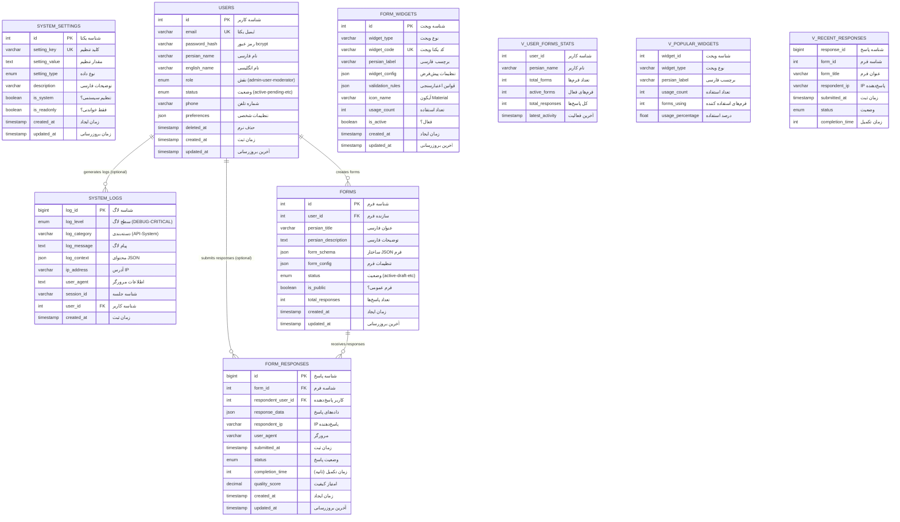
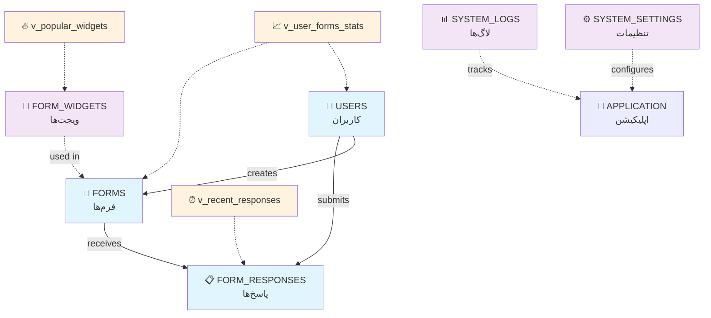
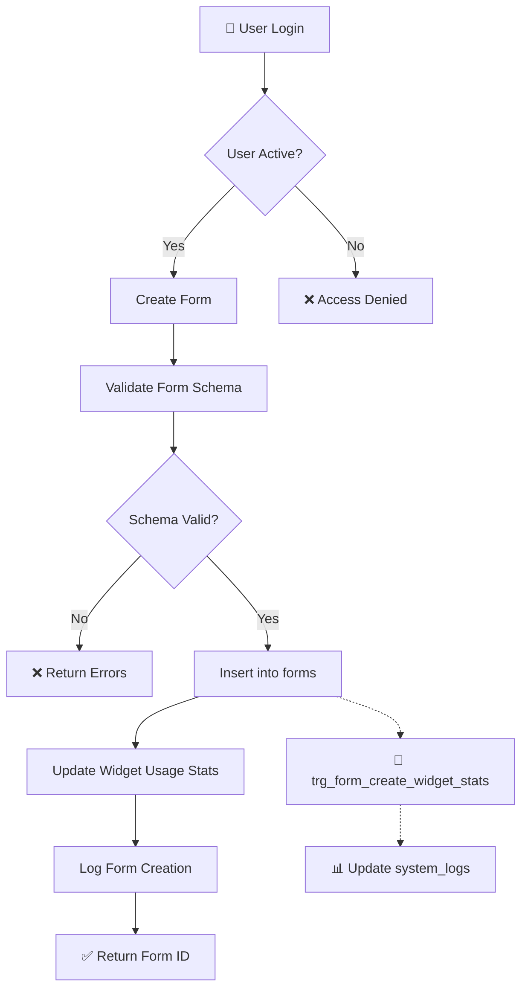
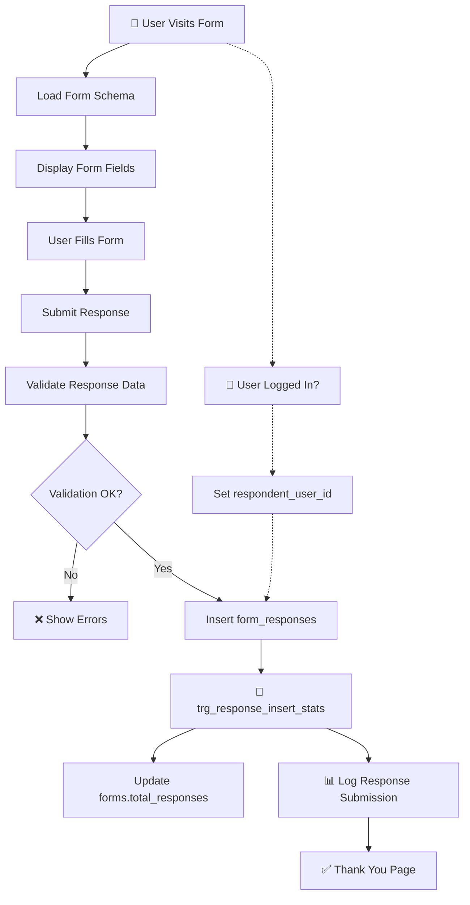
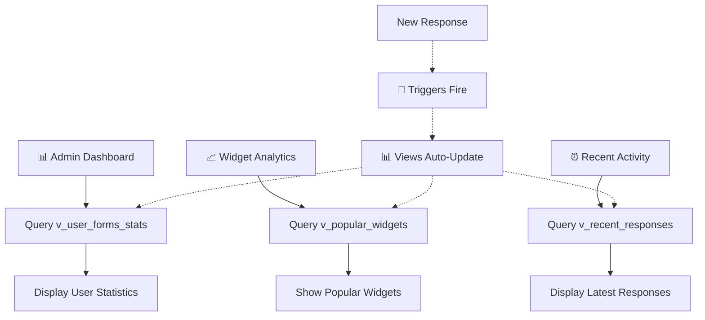

# نمودار روابط دیتابیس - Database Relationships Diagram

## 📊 Document Information
- **Created:** 2025-01-09
- **Last Updated:** 2025-01-09
- **Version:** 2.0 (Phase 5.1 Form Builder Implementation)
- **Maintainer:** DataSave Development Team
- **Related Files:** `/backend/sql/create_tables.sql`, Migration scripts

## 🎯 Overview
نمودار جامع روابط بین جداول DataSave پس از پیاده‌سازی کامل Phase 5.1 Form Builder Core Engine. شامل 6 جدول اصلی، 3 View، و 3 Trigger با تمرکز بر Persian-first design.

## 📋 Table of Contents
- [نمودار کامل دیتابیس](#نمودار-کامل-دیتابیس)
- [روابط جداول فعلی](#روابط-جداول-فعلی)
- [Views و Triggers](#views-و-triggers)
- [Entity-Relationship Diagram](#entity-relationship-diagram)
- [قوانین Referential Integrity](#قوانین-referential-integrity)
- [Data Flow Diagrams](#data-flow-diagrams)

## 🗺️ نمودار کامل دیتابیس - Complete Database Schema

### Current Database Schema (Phase 5.1 ✅ Completed)


## 🔗 روابط جداول فعلی - Current Active Relationships

### Foreign Key Relationships
```sql
-- Foreign Keys در دیتابیس فعلی:

-- 1. forms.user_id → users.id (CASCADE DELETE)
ALTER TABLE forms 
ADD CONSTRAINT fk_forms_user_id 
FOREIGN KEY (user_id) REFERENCES users(id) ON DELETE CASCADE;

-- 2. form_responses.form_id → forms.id (CASCADE DELETE)  
ALTER TABLE form_responses 
ADD CONSTRAINT fk_form_responses_form_id 
FOREIGN KEY (form_id) REFERENCES forms(id) ON DELETE CASCADE;

-- 3. form_responses.respondent_user_id → users.id (SET NULL)
ALTER TABLE form_responses 
ADD CONSTRAINT fk_form_responses_user_id 
FOREIGN KEY (respondent_user_id) REFERENCES users(id) ON DELETE SET NULL;

-- Note: system_logs.user_id آماده است اما FK هنوز اضافه نشده
-- چرا که نیاز به backward compatibility با لاگ‌های موجود داریم
```

### Relationship Properties
| Relationship | Type | Delete Rule | Description |
|--------------|------|-------------|-------------|
| `users → forms` | One-to-Many | CASCADE | کاربر حذف شود، فرم‌هایش هم حذف شوند |
| `users → form_responses` | One-to-Many | SET NULL | کاربر حذف شود، پاسخ‌ها باقی بمانند |
| `forms → form_responses` | One-to-Many | CASCADE | فرم حذف شود، پاسخ‌هایش هم حذف شوند |
| `form_widgets` | Independent | N/A | جدول مستقل - ویجت‌های عمومی |

### Current Data Statistics
```yaml
Current Records (Phase 5.1):
  - users: 2 (1 admin + 1 test user)
  - forms: 1 (تماس با ما)
  - form_widgets: 10 (basic widgets)
  - form_responses: 0 (ready for data)
  - system_settings: 9 (OpenAI config + general)
  - system_logs: 500+ (development logs)

Active Foreign Keys: 3
Active Views: 3  
Active Triggers: 3
```

## 🔄 Views و Triggers

### Database Views (Virtual Tables)
```sql
-- 1. v_user_forms_stats - آمار فرم‌های کاربران
CREATE VIEW v_user_forms_stats AS
SELECT 
    u.id as user_id,
    u.persian_name,
    u.email,
    COUNT(f.id) as total_forms,
    COUNT(CASE WHEN f.status = 'active' THEN 1 END) as active_forms,
    SUM(f.total_responses) as total_responses,
    MAX(f.updated_at) as latest_activity
FROM users u
LEFT JOIN forms f ON u.id = f.user_id  
WHERE u.deleted_at IS NULL
GROUP BY u.id, u.persian_name, u.email;

-- 2. v_popular_widgets - ویجت‌های پرکاربرد  
CREATE VIEW v_popular_widgets AS
SELECT 
    fw.id as widget_id,
    fw.widget_type,
    fw.persian_label,
    fw.usage_count,
    COUNT(DISTINCT f.id) as forms_using,
    (fw.usage_count * 100.0 / (SELECT SUM(usage_count) FROM form_widgets WHERE is_active = 1)) as usage_percentage
FROM form_widgets fw
LEFT JOIN forms f ON JSON_CONTAINS(f.form_schema, JSON_OBJECT('widget_type', fw.widget_type))
WHERE fw.is_active = 1
GROUP BY fw.id, fw.widget_type, fw.persian_label, fw.usage_count
ORDER BY fw.usage_count DESC;

-- 3. v_recent_responses - پاسخ‌های اخیر
CREATE VIEW v_recent_responses AS  
SELECT 
    fr.id as response_id,
    fr.form_id,
    f.persian_title as form_title,
    f.user_id as form_owner_id,
    u.persian_name as form_owner_name,
    fr.respondent_ip,
    fr.submitted_at,
    fr.status,
    fr.completion_time
FROM form_responses fr
JOIN forms f ON fr.form_id = f.id
JOIN users u ON f.user_id = u.id
WHERE fr.submitted_at >= DATE_SUB(NOW(), INTERVAL 30 DAY)
ORDER BY fr.submitted_at DESC;
```

### Database Triggers
```sql  
-- 1. trg_response_insert_stats - بروزرسانی آمار فرم
DELIMITER //
CREATE TRIGGER trg_response_insert_stats 
AFTER INSERT ON form_responses
FOR EACH ROW
BEGIN
    UPDATE forms 
    SET total_responses = total_responses + 1,
        updated_at = NOW()
    WHERE id = NEW.form_id;
    
    -- Log the response submission
    INSERT INTO system_logs (log_level, log_category, log_message, log_context, created_at)
    VALUES ('INFO', 'Forms', 'پاسخ جدید دریافت شد', 
            JSON_OBJECT('form_id', NEW.form_id, 'response_id', NEW.id), NOW());
END//

-- 2. trg_response_delete_stats - کاهش آمار هنگام حذف
CREATE TRIGGER trg_response_delete_stats
AFTER DELETE ON form_responses  
FOR EACH ROW
BEGIN
    UPDATE forms 
    SET total_responses = GREATEST(total_responses - 1, 0),
        updated_at = NOW()
    WHERE id = OLD.form_id;
END//

-- 3. trg_form_create_widget_stats - آمار ویجت‌ها
CREATE TRIGGER trg_form_create_widget_stats
AFTER INSERT ON forms
FOR EACH ROW  
BEGIN
    -- Extract widget types from form_schema and update usage_count
    -- This is a simplified version - real implementation needs JSON parsing
    INSERT INTO system_logs (log_level, log_category, log_message, log_context, created_at)
    VALUES ('INFO', 'Forms', 'فرم جدید ایجاد شد', 
            JSON_OBJECT('form_id', NEW.id, 'user_id', NEW.user_id, 'title', NEW.persian_title), NOW());
END//
DELIMITER ;
```

## 📊 Entity-Relationship Diagram (Simplified)

### Core Entities & Relationships


## ⚖️ قوانین Referential Integrity

### Deletion Cascade Rules
```yaml
CASCADE DELETE (حذف زنجیره‌ای):
  - User deleted → All their forms deleted
  - Form deleted → All responses to that form deleted
  
SET NULL (تنظیم NULL):
  - User deleted → form_responses.respondent_user_id = NULL
  - Optional relationships preserved
  
RESTRICT (عدم حذف):
  - system_settings (critical configuration)
  - form_widgets (shared resources)
  
NO ACTION:
  - system_logs (audit trail must be preserved)
```

### Business Logic Constraints
```sql
-- کنترل وضعیت کاربران و فرم‌ها
CREATE TRIGGER enforce_user_form_status
BEFORE UPDATE ON forms
FOR EACH ROW
BEGIN
    -- فرم فعال نمی‌تواند کاربر غیرفعال داشته باشد
    IF NEW.status IN ('active', 'published') THEN
        IF NOT EXISTS (
            SELECT 1 FROM users 
            WHERE id = NEW.user_id 
            AND status = 'active' 
            AND deleted_at IS NULL
        ) THEN
            SIGNAL SQLSTATE '45000' 
            SET MESSAGE_TEXT = 'فرم فعال نمی‌تواند کاربر غیرفعال داشته باشد';
        END IF;
    END IF;
END;

-- محدودیت تعداد فرم‌های فعال هر کاربر
CREATE TRIGGER limit_active_forms  
BEFORE INSERT ON forms
FOR EACH ROW
BEGIN
    DECLARE active_forms_count INT;
    
    SELECT COUNT(*) INTO active_forms_count
    FROM forms 
    WHERE user_id = NEW.user_id 
    AND status IN ('active', 'published');
    
    -- هر کاربر حداکثر 10 فرم فعال می‌تواند داشته باشد
    IF active_forms_count >= 10 THEN
        SIGNAL SQLSTATE '45000' 
        SET MESSAGE_TEXT = 'حداکثر 10 فرم فعال برای هر کاربر مجاز است';
    END IF;
END;
```

## 📊 Data Flow Diagrams

### Form Creation Flow


### Form Response Submission Flow


### User Statistics & Analytics Flow  


## 🏗️ Implementation Guidelines

### Foreign Key Best Practices
```sql
-- نامگذاری استاندارد FK constraints
-- Pattern: fk_{table}_{referenced_table}_{column}
-- Examples:
ALTER TABLE forms 
ADD CONSTRAINT fk_forms_users_user_id 
FOREIGN KEY (user_id) REFERENCES users(id);

ALTER TABLE form_responses 
ADD CONSTRAINT fk_form_responses_forms_form_id 
FOREIGN KEY (form_id) REFERENCES forms(id);

-- Indexes برای بهبود عملکرد FK  
CREATE INDEX idx_forms_user_id ON forms(user_id);
CREATE INDEX idx_form_responses_form_id ON form_responses(form_id);
CREATE INDEX idx_form_responses_user_id ON form_responses(respondent_user_id);
```

### PHP Model Implementation
```php
<?php
// نمونه پیاده‌سازی روابط در PHP Models

class User {
    // One-to-Many: User -> Forms
    public function getForms(): array {
        $sql = "SELECT * FROM forms WHERE user_id = ? AND deleted_at IS NULL ORDER BY created_at DESC";
        $stmt = $this->db->prepare($sql);
        $stmt->execute([$this->id]);
        return $stmt->fetchAll(PDO::FETCH_ASSOC);
    }
    
    // One-to-Many: User -> Form Responses  
    public function getResponses(): array {
        $sql = "SELECT fr.*, f.persian_title as form_title 
                FROM form_responses fr 
                JOIN forms f ON fr.form_id = f.id 
                WHERE fr.respondent_user_id = ? 
                ORDER BY fr.submitted_at DESC";
        $stmt = $this->db->prepare($sql);
        $stmt->execute([$this->id]);
        return $stmt->fetchAll(PDO::FETCH_ASSOC);
    }
}

class Form {
    // Many-to-One: Form -> User
    public function getCreator(): ?array {
        $sql = "SELECT * FROM users WHERE id = ? AND deleted_at IS NULL";
        $stmt = $this->db->prepare($sql);
        $stmt->execute([$this->user_id]);
        return $stmt->fetch(PDO::FETCH_ASSOC) ?: null;
    }
    
    // One-to-Many: Form -> Responses
    public function getResponses(int $limit = 50, int $offset = 0): array {
        $sql = "SELECT * FROM form_responses 
                WHERE form_id = ? 
                ORDER BY submitted_at DESC 
                LIMIT ? OFFSET ?";
        $stmt = $this->db->prepare($sql);
        $stmt->execute([$this->id, $limit, $offset]);
        return $stmt->fetchAll(PDO::FETCH_ASSOC);
    }
}
?>
```

## 🎯 Performance Considerations

### Index Strategy  
```sql
-- Primary Keys (Automatic)
-- users.id, forms.id, form_responses.id, etc.

-- Foreign Key Indexes (Manual)
CREATE INDEX idx_forms_user_id ON forms(user_id);
CREATE INDEX idx_form_responses_form_id ON form_responses(form_id);  
CREATE INDEX idx_form_responses_user_id ON form_responses(respondent_user_id);

-- Query-Specific Indexes
CREATE INDEX idx_forms_status_user ON forms(status, user_id);
CREATE INDEX idx_responses_submitted_at ON form_responses(submitted_at);
CREATE INDEX idx_users_status_role ON users(status, role);

-- Composite Indexes for Complex Queries
CREATE INDEX idx_forms_user_status_updated ON forms(user_id, status, updated_at);
CREATE INDEX idx_responses_form_status_submitted ON form_responses(form_id, status, submitted_at);
```

### Query Optimization Tips
```sql
-- بهینه: استفاده از JOIN به جای subqueries
SELECT f.persian_title, u.persian_name, COUNT(fr.id) as response_count
FROM forms f
JOIN users u ON f.user_id = u.id  
LEFT JOIN form_responses fr ON f.id = fr.form_id
WHERE f.status = 'active' AND u.status = 'active'
GROUP BY f.id, f.persian_title, u.persian_name;

-- بهینه: استفاده از Views برای queries پیچیده
SELECT * FROM v_user_forms_stats WHERE total_forms > 5;

-- بهینه: محدود کردن نتایج با LIMIT
SELECT * FROM v_recent_responses LIMIT 20;
```

## ⚠️ Important Notes

### Data Integrity & Consistency
✅ **تضمین شده:**
- همه foreign keys با ON DELETE CASCADE/SET NULL
- Triggers برای بروزرسانی خودکار آمارها
- Views برای consistency چک کردن
- Persian charset در تمام جداول

⚠️ **نیاز به توجه:**
- Circular reference ها اجتناب شده  
- Large table ها هنوز partition نشده‌اند
- Backup strategy برای CASCADE deletes
- Performance monitoring در production

### Persian Data Handling
```sql
-- تمام جداول از utf8mb4_persian_ci استفاده می‌کنند
-- مشکلات رایج و راه‌حل:

-- 1. JOIN operations روی Persian text
SELECT * FROM users u 
JOIN forms f ON u.id = f.user_id 
WHERE u.persian_name COLLATE utf8mb4_persian_ci LIKE '%احمد%';

-- 2. Sorting Persian text  
SELECT * FROM forms ORDER BY persian_title COLLATE utf8mb4_persian_ci;

-- 3. Full-text search (آینده)
ALTER TABLE forms ADD FULLTEXT(persian_title, persian_description);
```

### Scalability Considerations
```yaml
Current Limits (Phase 5.1):
  - Max forms per user: محدودیت نرم‌افزاری (10 فعال)
  - Max responses per form: نامحدود
  - Max widgets: نامحدود
  
Future Scaling (Phase 5.2+):
  - Table partitioning for form_responses
  - Read replicas for analytics queries  
  - Caching layer for popular widgets
  - Archive old responses
```

## 🔄 Related Documentation
- [Tables Reference](./tables-reference.md) - جزئیات کامل جداول
- [Database Design](./database-design.md) - طراحی کلی دیتابیس
- [Migration Scripts](./migration-scripts.md) - اسکریپت‌های مهاجرت
- [Performance & Indexes](./indexes-performance.md) - بهینه‌سازی عملکرد

## 📚 External References
- [MySQL Foreign Keys](https://dev.mysql.com/doc/refman/8.0/en/create-table-foreign-keys.html)
- [MySQL Triggers](https://dev.mysql.com/doc/refman/8.0/en/triggers.html)
- [JSON Functions](https://dev.mysql.com/doc/refman/8.0/en/json-functions.html)
- [Mermaid ERD](https://mermaid-js.github.io/mermaid/#/entityRelationshipDiagram)

---
*Last updated: 2025-01-09*  
*Document version: 2.0 (Phase 5.1 Complete)*  
*File: docs/03-Database-Schema/relationships-diagram.md*  
*Maintainer: DataSave Development Team*