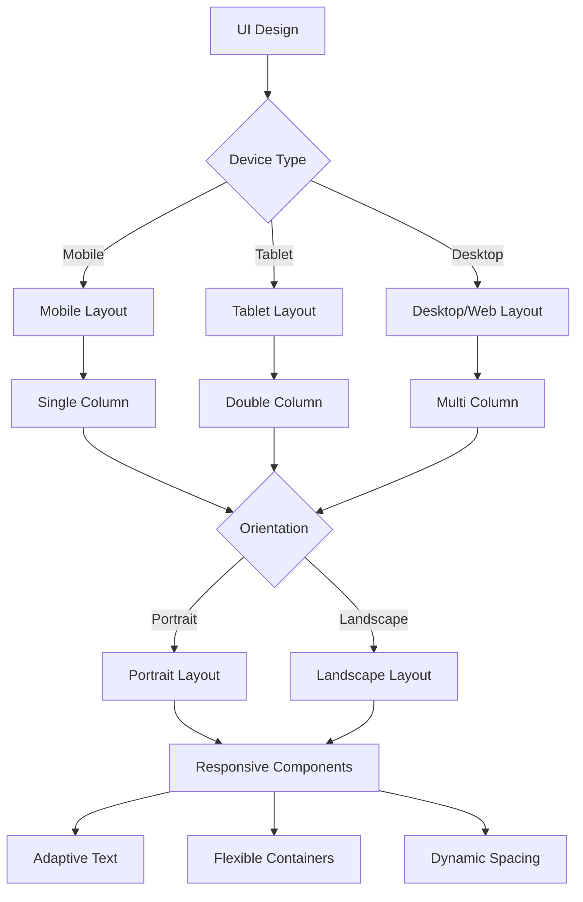

# طراحی واکنش‌گرا - Responsive Design

## 📊 Document Information
- **Created:** 2025-09-01
- **Last Updated:** 2025-09-01
- **Version:** 1.0
- **Maintainer:** DataSave Frontend Team
- **Related Files:** `/lib/core/responsive`, `/lib/presentation/utils/screen_utils.dart`

## 🎯 Overview
این مستند استراتژی طراحی واکنش‌گرا (Responsive Design) در پروژه DataSave را شرح می‌دهد، که شامل روش‌های مقیاس‌پذیری رابط کاربری، پشتیبانی از دستگاه‌های مختلف، و بهینه‌سازی تجربه کاربری در اندازه‌های صفحه متفاوت است.

## 📋 Table of Contents
- [ساختار طراحی واکنش‌گرا](#ساختار-طراحی-واکنش‌گرا)
- [کلاس‌های کمکی Responsive](#کلاس‌های-کمکی-responsive)
- [ویجت‌های واکنش‌گرا](#ویجت‌های-واکنش‌گرا)
- [اندازه‌های صفحه نمایش](#اندازه‌های-صفحه-نمایش)
- [مقیاس‌پذیری فونت و المان‌ها](#مقیاس‌پذیری-فونت-و-المان‌ها)
- [نمونه‌های کاربردی](#نمونه‌های-کاربردی)
- [بهترین شیوه‌ها](#بهترین-شیوه‌ها)

## 📐 ساختار طراحی واکنش‌گرا

### استراتژی طراحی واکنش‌گرا


### رویکرد Mobile First
```yaml
Mobile First Approach:
  1. طراحی ابتدا برای موبایل:
     - اولویت به اندازه صفحه کوچک
     - توجه به محدودیت‌های فضا
     - طراحی بر اساس لمس و تعامل انگشتی
     
  2. گسترش به صفحات بزرگتر:
     - افزودن ویژگی‌ها و اطلاعات بیشتر
     - بازآرایی چیدمان با چند ستون
     - بهره‌گیری از فضای بیشتر
     
  3. مزایا:
     - تمرکز بر محتوای اصلی
     - کارایی بهتر
     - تجربه کاربری بهینه در همه دستگاه‌ها
```

## 🛠️ کلاس‌های کمکی Responsive

### ResponsiveBuilder
```dart
// lib/core/responsive/responsive_builder.dart

import 'package:flutter/material.dart';

enum DeviceScreenType {
  mobile,
  tablet,
  desktop,
}

class ResponsiveBuilder extends StatelessWidget {
  final Widget Function(
    BuildContext context,
    DeviceScreenType deviceType,
    bool isPortrait,
  ) builder;
  
  // راه‌اندازی نقاط شکست برای تشخیص نوع دستگاه
  final double mobileBreakpoint;
  final double tabletBreakpoint;
  
  const ResponsiveBuilder({
    Key? key,
    required this.builder,
    this.mobileBreakpoint = 600, // تا 600 موبایل
    this.tabletBreakpoint = 900, // تا 900 تبلت، بعد از آن دسکتاپ
  }) : super(key: key);
  
  @override
  Widget build(BuildContext context) {
    return LayoutBuilder(
      builder: (context, constraints) {
        // تشخیص نوع دستگاه بر اساس عرض
        DeviceScreenType deviceType;
        if (constraints.maxWidth < mobileBreakpoint) {
          deviceType = DeviceScreenType.mobile;
        } else if (constraints.maxWidth < tabletBreakpoint) {
          deviceType = DeviceScreenType.tablet;
        } else {
          deviceType = DeviceScreenType.desktop;
        }
        
        // تشخیص جهت صفحه
        final mediaQuery = MediaQuery.of(context);
        final isPortrait = mediaQuery.orientation == Orientation.portrait;
        
        return builder(context, deviceType, isPortrait);
      },
    );
  }
}
```

### ScreenUtils
```dart
// lib/core/responsive/screen_utils.dart

import 'package:flutter/material.dart';
import 'dart:ui' as ui;

class ScreenUtils {
  static final ScreenUtils _instance = ScreenUtils._internal();
  factory ScreenUtils() => _instance;
  ScreenUtils._internal();
  
  // اندازه صفحه طراحی (طبق فایل طراحی فیگما)
  static const double designWidth = 375.0; // عرض طراحی (موبایل)
  static const double designHeight = 812.0; // ارتفاع طراحی (موبایل)
  
  // مقادیر نمونه برای دسکتاپ
  static const double designWidthDesktop = 1366.0;
  static const double designHeightDesktop = 768.0;
  
  // اندازه واقعی صفحه
  static late double _screenWidth;
  static late double _screenHeight;
  static late double _pixelRatio;
  static late double _statusBarHeight;
  static late double _bottomBarHeight;
  static late double _textScaleFactor;
  
  // نسبت‌های مقیاس
  static late double _scaleWidth;
  static late double _scaleHeight;
  
  // راه‌اندازی
  static void init(BuildContext context) {
    final mediaQuery = MediaQuery.of(context);
    _screenWidth = mediaQuery.size.width;
    _screenHeight = mediaQuery.size.height;
    _pixelRatio = mediaQuery.devicePixelRatio;
    _statusBarHeight = mediaQuery.padding.top;
    _bottomBarHeight = mediaQuery.padding.bottom;
    _textScaleFactor = mediaQuery.textScaleFactor;
    
    _scaleWidth = _screenWidth / designWidth;
    _scaleHeight = _screenHeight / designHeight;
  }
  
  // متدهای استاتیک برای دسترسی به اطلاعات
  static double get screenWidth => _screenWidth;
  static double get screenHeight => _screenHeight;
  static double get pixelRatio => _pixelRatio;
  static double get statusBarHeight => _statusBarHeight;
  static double get bottomBarHeight => _bottomBarHeight;
  static double get textScaleFactor => _textScaleFactor;
  static double get scaleWidth => _scaleWidth;
  static double get scaleHeight => _scaleHeight;
  static double get scaleText => _scaleWidth;
  
  // تبدیل اندازه طراحی به اندازه واقعی
  static double setWidth(double width) => width * _scaleWidth;
  static double setHeight(double height) => height * _scaleHeight;
  
  // تنظیم اندازه فونت
  static double setSp(double fontSize) => fontSize * _scaleWidth;
  
  // تبدیل به اندازه بر اساس راستای صفحه
  static double getResponsiveWidth(double width) {
    return width * _screenWidth / designWidth;
  }
  
  static double getResponsiveHeight(double height) {
    return height * _screenHeight / designHeight;
  }
  
  // اندازه‌گیری عرض متن
  static double textWidth(String text, TextStyle style) {
    final TextPainter textPainter = TextPainter(
      text: TextSpan(text: text, style: style),
      maxLines: 1,
      textDirection: ui.TextDirection.ltr,
    )..layout(minWidth: 0, maxWidth: double.infinity);
    
    return textPainter.width;
  }
  
  // تشخیص نوع دستگاه
  static bool isMobile(BuildContext context) {
    return MediaQuery.of(context).size.width < 600;
  }
  
  static bool isTablet(BuildContext context) {
    final width = MediaQuery.of(context).size.width;
    return width >= 600 && width < 900;
  }
  
  static bool isDesktop(BuildContext context) {
    return MediaQuery.of(context).size.width >= 900;
  }
}
```

### Responsive Context Extensions
```dart
// lib/core/extensions/responsive_extensions.dart

import 'package:flutter/material.dart';
import 'package:datasave/core/responsive/screen_utils.dart';

extension ResponsiveExtension on BuildContext {
  // بررسی نوع دستگاه
  bool get isMobile => ScreenUtils.isMobile(this);
  bool get isTablet => ScreenUtils.isTablet(this);
  bool get isDesktop => ScreenUtils.isDesktop(this);
  
  // دریافت اندازه صفحه
  Size get screenSize => MediaQuery.of(this).size;
  double get screenWidth => screenSize.width;
  double get screenHeight => screenSize.height;
  
  // وضعیت صفحه
  bool get isPortrait => MediaQuery.of(this).orientation == Orientation.portrait;
  bool get isLandscape => MediaQuery.of(this).orientation == Orientation.landscape;
  
  // مقیاس‌گذاری متناسب با اندازه صفحه
  double wp(double percent) => screenWidth * percent / 100;
  double hp(double percent) => screenHeight * percent / 100;
  
  // تنظیم فاصله‌ها
  EdgeInsets get screenPadding => MediaQuery.of(this).padding;
  double get statusBarHeight => screenPadding.top;
  double get bottomBarHeight => screenPadding.bottom;
  
  // تنظیم مقیاس
  double setWidth(double width) => ScreenUtils.setWidth(width);
  double setHeight(double height) => ScreenUtils.setHeight(height);
  double setSp(double fontSize) => ScreenUtils.setSp(fontSize);
}
```

## 🧩 ویجت‌های واکنش‌گرا

### ResponsiveLayout
```dart
// lib/core/responsive/responsive_layout.dart

import 'package:flutter/material.dart';
import 'package:datasave/core/responsive/responsive_builder.dart';

class ResponsiveLayout extends StatelessWidget {
  final Widget mobile;
  final Widget? tablet;
  final Widget? desktop;
  
  const ResponsiveLayout({
    Key? key,
    required this.mobile,
    this.tablet,
    this.desktop,
  }) : super(key: key);
  
  @override
  Widget build(BuildContext context) {
    return ResponsiveBuilder(
      builder: (context, deviceType, isPortrait) {
        switch (deviceType) {
          case DeviceScreenType.desktop:
            return desktop ?? (tablet ?? mobile);
          case DeviceScreenType.tablet:
            return tablet ?? mobile;
          case DeviceScreenType.mobile:
          default:
            return mobile;
        }
      },
    );
  }
}
```

### OrientationLayout
```dart
// lib/core/responsive/orientation_layout.dart

import 'package:flutter/material.dart';

class OrientationLayout extends StatelessWidget {
  final Widget portrait;
  final Widget? landscape;
  
  const OrientationLayout({
    Key? key,
    required this.portrait,
    this.landscape,
  }) : super(key: key);
  
  @override
  Widget build(BuildContext context) {
    final orientation = MediaQuery.of(context).orientation;
    
    if (orientation == Orientation.landscape) {
      return landscape ?? portrait;
    }
    
    return portrait;
  }
}
```

### ResponsiveGridView
```dart
// lib/core/widgets/responsive_grid_view.dart

import 'package:flutter/material.dart';
import 'package:datasave/core/responsive/screen_utils.dart';

class ResponsiveGridView extends StatelessWidget {
  final List<Widget> children;
  final double spacing;
  final double runSpacing;
  final int mobileCrossAxisCount;
  final int tabletCrossAxisCount;
  final int desktopCrossAxisCount;
  
  const ResponsiveGridView({
    Key? key,
    required this.children,
    this.spacing = 8.0,
    this.runSpacing = 8.0,
    this.mobileCrossAxisCount = 1,
    this.tabletCrossAxisCount = 2,
    this.desktopCrossAxisCount = 4,
  }) : super(key: key);
  
  @override
  Widget build(BuildContext context) {
    int crossAxisCount;
    
    if (ScreenUtils.isMobile(context)) {
      crossAxisCount = mobileCrossAxisCount;
    } else if (ScreenUtils.isTablet(context)) {
      crossAxisCount = tabletCrossAxisCount;
    } else {
      crossAxisCount = desktopCrossAxisCount;
    }
    
    return GridView.builder(
      shrinkWrap: true,
      physics: const NeverScrollableScrollPhysics(),
      gridDelegate: SliverGridDelegateWithFixedCrossAxisCount(
        crossAxisCount: crossAxisCount,
        crossAxisSpacing: spacing,
        mainAxisSpacing: runSpacing,
        childAspectRatio: 1.0, // تنظیم نسبت ابعاد آیتم‌ها
      ),
      itemCount: children.length,
      itemBuilder: (context, index) => children[index],
    );
  }
}
```

### ResponsiveText
```dart
// lib/core/widgets/responsive_text.dart

import 'package:flutter/material.dart';
import 'package:datasave/core/extensions/responsive_extensions.dart';

class ResponsiveText extends StatelessWidget {
  final String text;
  final TextStyle? style;
  final double mobileFontSize;
  final double? tabletFontSize;
  final double? desktopFontSize;
  final TextAlign? textAlign;
  final int? maxLines;
  final TextOverflow? overflow;
  
  const ResponsiveText(
    this.text, {
    Key? key,
    this.style,
    required this.mobileFontSize,
    this.tabletFontSize,
    this.desktopFontSize,
    this.textAlign,
    this.maxLines,
    this.overflow,
  }) : super(key: key);
  
  @override
  Widget build(BuildContext context) {
    double fontSize;
    
    if (context.isDesktop) {
      fontSize = desktopFontSize ?? (tabletFontSize ?? mobileFontSize * 1.3);
    } else if (context.isTablet) {
      fontSize = tabletFontSize ?? (mobileFontSize * 1.15);
    } else {
      fontSize = mobileFontSize;
    }
    
    return Text(
      text,
      style: style?.copyWith(fontSize: fontSize) ?? 
             TextStyle(fontSize: fontSize),
      textAlign: textAlign,
      maxLines: maxLines,
      overflow: overflow,
    );
  }
}
```

## 📱 اندازه‌های صفحه نمایش

### تعریف Breakpoints
```dart
// lib/core/constants/breakpoints.dart

class Breakpoints {
  // نقاط شکست اصلی
  static const double mobile = 600; // حداکثر عرض برای موبایل
  static const double tablet = 900; // حداکثر عرض برای تبلت
  static const double desktop = 1200; // حداکثر عرض برای دسکتاپ متوسط
  static const double largeDesktop = 1800; // حداکثر عرض برای دسکتاپ بزرگ
  
  // نقاط شکست ارتفاع
  static const double smallHeight = 700; // ارتفاع کوچک
  static const double mediumHeight = 900; // ارتفاع متوسط
  
  // نقاط شکست خاص
  static const double navigationBreakpoint = 1100; // نقطه تغییر نوار ناوبری
  static const double sideMenuBreakpoint = 1300; // نقطه نمایش منوی کناری
  
  // محاسبه اندازه فلکس براساس عرض
  static int flexForWidth(double width) {
    if (width < mobile) return 12; // تمام عرض
    if (width < tablet) return 6; // نصف عرض
    if (width < desktop) return 4; // یک سوم عرض
    return 3; // یک چهارم عرض
  }
}
```

### نمونه کاربرد Breakpoints
```dart
// lib/presentation/screens/dashboard/dashboard_screen.dart

import 'package:flutter/material.dart';
import 'package:datasave/core/constants/breakpoints.dart';
import 'package:datasave/core/extensions/responsive_extensions.dart';

class DashboardScreen extends StatelessWidget {
  const DashboardScreen({Key? key}) : super(key: key);
  
  @override
  Widget build(BuildContext context) {
    return Scaffold(
      appBar: AppBar(
        title: Text('داشبورد'),
        // نمایش دکمه منو فقط در موبایل و تبلت
        leading: context.screenWidth < Breakpoints.sideMenuBreakpoint
            ? IconButton(
                icon: Icon(Icons.menu),
                onPressed: () {
                  // نمایش کشوی منو
                  Scaffold.of(context).openDrawer();
                },
              )
            : null,
      ),
      // منوی کناری ثابت فقط در صفحات بزرگ
      drawer: context.screenWidth < Breakpoints.sideMenuBreakpoint
          ? AppDrawer()
          : null,
      body: Row(
        children: [
          // منوی کناری ثابت در دسکتاپ
          if (context.screenWidth >= Breakpoints.sideMenuBreakpoint)
            SizedBox(
              width: 250,
              child: AppDrawer(),
            ),
          
          // محتوای اصلی
          Expanded(
            child: Padding(
              padding: EdgeInsets.all(context.isMobile ? 8.0 : 16.0),
              child: _buildDashboardContent(context),
            ),
          ),
        ],
      ),
    );
  }
  
  Widget _buildDashboardContent(BuildContext context) {
    // تعداد ستون‌ها براساس عرض صفحه
    int crossAxisCount;
    
    if (context.screenWidth < Breakpoints.mobile) {
      crossAxisCount = 1;
    } else if (context.screenWidth < Breakpoints.tablet) {
      crossAxisCount = 2;
    } else if (context.screenWidth < Breakpoints.desktop) {
      crossAxisCount = 3;
    } else {
      crossAxisCount = 4;
    }
    
    return GridView.builder(
      gridDelegate: SliverGridDelegateWithFixedCrossAxisCount(
        crossAxisCount: crossAxisCount,
        childAspectRatio: 1.5,
        crossAxisSpacing: 16,
        mainAxisSpacing: 16,
      ),
      itemCount: 8, // تعداد کارت‌ها
      itemBuilder: (context, index) {
        return DashboardCard(index: index);
      },
    );
  }
}

class DashboardCard extends StatelessWidget {
  final int index;
  
  const DashboardCard({Key? key, required this.index}) : super(key: key);
  
  @override
  Widget build(BuildContext context) {
    return Card(
      elevation: 4,
      child: Padding(
        padding: EdgeInsets.all(context.isMobile ? 8.0 : 16.0),
        child: Column(
          crossAxisAlignment: CrossAxisAlignment.start,
          children: [
            // عنوان با اندازه متفاوت
            ResponsiveText(
              'کارت ${index + 1}',
              mobileFontSize: 16,
              tabletFontSize: 18,
              desktopFontSize: 20,
              style: TextStyle(fontWeight: FontWeight.bold),
            ),
            SizedBox(height: 8),
            // محتوا
            Expanded(
              child: Center(
                child: Icon(
                  Icons.analytics,
                  size: context.isMobile ? 40 : 64,
                  color: Colors.blue,
                ),
              ),
            ),
            // متن توضیحات
            Text(
              'اطلاعات آماری و تحلیلی مربوط به کارت ${index + 1}',
              style: TextStyle(
                fontSize: context.isMobile ? 12 : 14,
              ),
            ),
          ],
        ),
      ),
    );
  }
}
```

## 📏 مقیاس‌پذیری فونت و المان‌ها

### راه‌اندازی مقیاس‌پذیری
```dart
// lib/main.dart (بخش راه‌اندازی)

import 'package:flutter/material.dart';
import 'package:datasave/core/responsive/screen_utils.dart';

void main() {
  runApp(const MyApp());
}

class MyApp extends StatelessWidget {
  const MyApp({Key? key}) : super(key: key);

  @override
  Widget build(BuildContext context) {
    // راه‌اندازی ScreenUtils با اولین دسترسی به context
    return LayoutBuilder(
      builder: (context, constraints) {
        return OrientationBuilder(
          builder: (context, orientation) {
            ScreenUtils.init(context);
            
            return MaterialApp(
              title: 'DataSave',
              theme: ThemeData(
                primarySwatch: Colors.blue,
                fontFamily: 'Vazirmatn',
                // تنظیم اندازه‌های پایه متن به صورت واکنش‌گرا
                textTheme: TextTheme(
                  displayLarge: TextStyle(fontSize: ScreenUtils.setSp(34)),
                  displayMedium: TextStyle(fontSize: ScreenUtils.setSp(28)),
                  displaySmall: TextStyle(fontSize: ScreenUtils.setSp(24)),
                  headlineLarge: TextStyle(fontSize: ScreenUtils.setSp(22)),
                  headlineMedium: TextStyle(fontSize: ScreenUtils.setSp(20)),
                  headlineSmall: TextStyle(fontSize: ScreenUtils.setSp(18)),
                  titleLarge: TextStyle(fontSize: ScreenUtils.setSp(16)),
                  titleMedium: TextStyle(fontSize: ScreenUtils.setSp(14)),
                  bodyLarge: TextStyle(fontSize: ScreenUtils.setSp(14)),
                  bodyMedium: TextStyle(fontSize: ScreenUtils.setSp(12)),
                ),
              ),
              home: HomeScreen(),
            );
          },
        );
      },
    );
  }
}
```

### تم واکنش‌گرا
```dart
// lib/core/theme/responsive_theme.dart

import 'package:flutter/material.dart';
import 'package:datasave/core/responsive/screen_utils.dart';

class ResponsiveTheme {
  // تم‌های مختلف براساس اندازه دستگاه
  static ThemeData getTheme(BuildContext context) {
    if (ScreenUtils.isDesktop(context)) {
      return _getDesktopTheme(context);
    } else if (ScreenUtils.isTablet(context)) {
      return _getTabletTheme(context);
    } else {
      return _getMobileTheme(context);
    }
  }
  
  // تم موبایل
  static ThemeData _getMobileTheme(BuildContext context) {
    return ThemeData(
      primarySwatch: Colors.blue,
      fontFamily: 'Vazirmatn',
      appBarTheme: const AppBarTheme(
        elevation: 2,
        centerTitle: true,
      ),
      cardTheme: CardTheme(
        elevation: 2,
        margin: EdgeInsets.all(ScreenUtils.setWidth(8)),
        shape: RoundedRectangleBorder(
          borderRadius: BorderRadius.circular(ScreenUtils.setWidth(8)),
        ),
      ),
      elevatedButtonTheme: ElevatedButtonThemeData(
        style: ElevatedButton.styleFrom(
          padding: EdgeInsets.symmetric(
            horizontal: ScreenUtils.setWidth(16),
            vertical: ScreenUtils.setHeight(12),
          ),
          shape: RoundedRectangleBorder(
            borderRadius: BorderRadius.circular(ScreenUtils.setWidth(8)),
          ),
        ),
      ),
      textTheme: TextTheme(
        displayLarge: TextStyle(fontSize: ScreenUtils.setSp(28)),
        displayMedium: TextStyle(fontSize: ScreenUtils.setSp(24)),
        displaySmall: TextStyle(fontSize: ScreenUtils.setSp(20)),
        headlineLarge: TextStyle(fontSize: ScreenUtils.setSp(18)),
        headlineMedium: TextStyle(fontSize: ScreenUtils.setSp(16)),
        titleLarge: TextStyle(fontSize: ScreenUtils.setSp(16)),
        titleMedium: TextStyle(fontSize: ScreenUtils.setSp(14)),
        bodyLarge: TextStyle(fontSize: ScreenUtils.setSp(14)),
        bodyMedium: TextStyle(fontSize: ScreenUtils.setSp(12)),
      ),
    );
  }
  
  // تم تبلت
  static ThemeData _getTabletTheme(BuildContext context) {
    return _getMobileTheme(context).copyWith(
      cardTheme: CardTheme(
        elevation: 3,
        margin: EdgeInsets.all(ScreenUtils.setWidth(12)),
        shape: RoundedRectangleBorder(
          borderRadius: BorderRadius.circular(ScreenUtils.setWidth(10)),
        ),
      ),
      textTheme: TextTheme(
        displayLarge: TextStyle(fontSize: ScreenUtils.setSp(32)),
        displayMedium: TextStyle(fontSize: ScreenUtils.setSp(28)),
        displaySmall: TextStyle(fontSize: ScreenUtils.setSp(24)),
        headlineLarge: TextStyle(fontSize: ScreenUtils.setSp(20)),
        headlineMedium: TextStyle(fontSize: ScreenUtils.setSp(18)),
        titleLarge: TextStyle(fontSize: ScreenUtils.setSp(18)),
        titleMedium: TextStyle(fontSize: ScreenUtils.setSp(16)),
        bodyLarge: TextStyle(fontSize: ScreenUtils.setSp(16)),
        bodyMedium: TextStyle(fontSize: ScreenUtils.setSp(14)),
      ),
    );
  }
  
  // تم دسکتاپ
  static ThemeData _getDesktopTheme(BuildContext context) {
    return _getTabletTheme(context).copyWith(
      cardTheme: CardTheme(
        elevation: 4,
        margin: EdgeInsets.all(ScreenUtils.setWidth(16)),
        shape: RoundedRectangleBorder(
          borderRadius: BorderRadius.circular(ScreenUtils.setWidth(12)),
        ),
      ),
      textTheme: TextTheme(
        displayLarge: TextStyle(fontSize: ScreenUtils.setSp(36)),
        displayMedium: TextStyle(fontSize: ScreenUtils.setSp(32)),
        displaySmall: TextStyle(fontSize: ScreenUtils.setSp(28)),
        headlineLarge: TextStyle(fontSize: ScreenUtils.setSp(24)),
        headlineMedium: TextStyle(fontSize: ScreenUtils.setSp(22)),
        titleLarge: TextStyle(fontSize: ScreenUtils.setSp(20)),
        titleMedium: TextStyle(fontSize: ScreenUtils.setSp(18)),
        bodyLarge: TextStyle(fontSize: ScreenUtils.setSp(18)),
        bodyMedium: TextStyle(fontSize: ScreenUtils.setSp(16)),
      ),
    );
  }
}
```

## 📊 نمونه‌های کاربردی

### فرم واکنش‌گرا
```dart
// lib/presentation/screens/forms/responsive_form.dart

import 'package:flutter/material.dart';
import 'package:datasave/core/extensions/responsive_extensions.dart';
import 'package:datasave/core/responsive/responsive_layout.dart';

class ResponsiveFormScreen extends StatelessWidget {
  const ResponsiveFormScreen({Key? key}) : super(key: key);
  
  @override
  Widget build(BuildContext context) {
    return Scaffold(
      appBar: AppBar(title: Text('فرم واکنش‌گرا')),
      body: ResponsiveLayout(
        mobile: _buildMobileForm(context),
        tablet: _buildTabletForm(context),
        desktop: _buildDesktopForm(context),
      ),
    );
  }
  
  // فرم موبایل - یک ستونه با عرض کامل
  Widget _buildMobileForm(BuildContext context) {
    return SingleChildScrollView(
      child: Padding(
        padding: EdgeInsets.all(16.0),
        child: Column(
          crossAxisAlignment: CrossAxisAlignment.stretch,
          children: [
            Text(
              'اطلاعات شخصی',
              style: Theme.of(context).textTheme.headlineMedium,
            ),
            SizedBox(height: 16),
            _buildTextField('نام'),
            SizedBox(height: 12),
            _buildTextField('نام خانوادگی'),
            SizedBox(height: 12),
            _buildTextField('ایمیل', keyboardType: TextInputType.emailAddress),
            SizedBox(height: 12),
            _buildTextField('تلفن همراه', keyboardType: TextInputType.phone),
            SizedBox(height: 20),
            Text(
              'آدرس',
              style: Theme.of(context).textTheme.headlineMedium,
            ),
            SizedBox(height: 16),
            _buildTextField('استان'),
            SizedBox(height: 12),
            _buildTextField('شهر'),
            SizedBox(height: 12),
            _buildTextField('آدرس کامل', maxLines: 3),
            SizedBox(height: 12),
            _buildTextField('کد پستی'),
            SizedBox(height: 24),
            ElevatedButton(
              onPressed: () {},
              child: Text('ثبت اطلاعات'),
              style: ElevatedButton.styleFrom(
                padding: EdgeInsets.symmetric(vertical: 12),
              ),
            ),
          ],
        ),
      ),
    );
  }
  
  // فرم تبلت - دو ستونه
  Widget _buildTabletForm(BuildContext context) {
    return SingleChildScrollView(
      child: Padding(
        padding: EdgeInsets.all(24.0),
        child: Column(
          crossAxisAlignment: CrossAxisAlignment.start,
          children: [
            Text(
              'اطلاعات شخصی',
              style: Theme.of(context).textTheme.headlineLarge,
            ),
            SizedBox(height: 20),
            Row(
              children: [
                Expanded(child: _buildTextField('نام')),
                SizedBox(width: 16),
                Expanded(child: _buildTextField('نام خانوادگی')),
              ],
            ),
            SizedBox(height: 16),
            Row(
              children: [
                Expanded(
                  child: _buildTextField(
                    'ایمیل',
                    keyboardType: TextInputType.emailAddress,
                  ),
                ),
                SizedBox(width: 16),
                Expanded(
                  child: _buildTextField(
                    'تلفن همراه',
                    keyboardType: TextInputType.phone,
                  ),
                ),
              ],
            ),
            SizedBox(height: 24),
            Text(
              'آدرس',
              style: Theme.of(context).textTheme.headlineLarge,
            ),
            SizedBox(height: 20),
            Row(
              children: [
                Expanded(child: _buildTextField('استان')),
                SizedBox(width: 16),
                Expanded(child: _buildTextField('شهر')),
              ],
            ),
            SizedBox(height: 16),
            _buildTextField('آدرس کامل', maxLines: 3),
            SizedBox(height: 16),
            _buildTextField('کد پستی'),
            SizedBox(height: 32),
            Center(
              child: SizedBox(
                width: context.screenWidth * 0.5,
                child: ElevatedButton(
                  onPressed: () {},
                  child: Text('ثبت اطلاعات'),
                  style: ElevatedButton.styleFrom(
                    padding: EdgeInsets.symmetric(vertical: 16),
                  ),
                ),
              ),
            ),
          ],
        ),
      ),
    );
  }
  
  // فرم دسکتاپ - چند ستونه با فاصله بیشتر
  Widget _buildDesktopForm(BuildContext context) {
    return Center(
      child: Container(
        constraints: BoxConstraints(maxWidth: 1200),
        padding: EdgeInsets.all(32.0),
        child: Card(
          elevation: 6,
          shape: RoundedRectangleBorder(
            borderRadius: BorderRadius.circular(16),
          ),
          child: Padding(
            padding: EdgeInsets.all(32.0),
            child: Column(
              crossAxisAlignment: CrossAxisAlignment.start,
              children: [
                Text(
                  'فرم ثبت اطلاعات',
                  style: Theme.of(context).textTheme.displayMedium,
                  textAlign: TextAlign.center,
                ),
                SizedBox(height: 40),
                Row(
                  crossAxisAlignment: CrossAxisAlignment.start,
                  children: [
                    // ستون اول - اطلاعات شخصی
                    Expanded(
                      child: Column(
                        crossAxisAlignment: CrossAxisAlignment.start,
                        children: [
                          Text(
                            'اطلاعات شخصی',
                            style: Theme.of(context).textTheme.headlineLarge,
                          ),
                          SizedBox(height: 24),
                          Row(
                            children: [
                              Expanded(child: _buildTextField('نام')),
                              SizedBox(width: 16),
                              Expanded(child: _buildTextField('نام خانوادگی')),
                            ],
                          ),
                          SizedBox(height: 16),
                          _buildTextField(
                            'ایمیل',
                            keyboardType: TextInputType.emailAddress,
                          ),
                          SizedBox(height: 16),
                          _buildTextField(
                            'تلفن همراه',
                            keyboardType: TextInputType.phone,
                          ),
                        ],
                      ),
                    ),
                    SizedBox(width: 48),
                    // ستون دوم - آدرس
                    Expanded(
                      child: Column(
                        crossAxisAlignment: CrossAxisAlignment.start,
                        children: [
                          Text(
                            'آدرس',
                            style: Theme.of(context).textTheme.headlineLarge,
                          ),
                          SizedBox(height: 24),
                          Row(
                            children: [
                              Expanded(child: _buildTextField('استان')),
                              SizedBox(width: 16),
                              Expanded(child: _buildTextField('شهر')),
                            ],
                          ),
                          SizedBox(height: 16),
                          _buildTextField('آدرس کامل', maxLines: 3),
                          SizedBox(height: 16),
                          _buildTextField('کد پستی'),
                        ],
                      ),
                    ),
                  ],
                ),
                SizedBox(height: 40),
                Center(
                  child: SizedBox(
                    width: context.screenWidth * 0.3,
                    child: ElevatedButton(
                      onPressed: () {},
                      child: Text(
                        'ثبت اطلاعات',
                        style: TextStyle(fontSize: 18),
                      ),
                      style: ElevatedButton.styleFrom(
                        padding: EdgeInsets.symmetric(vertical: 20),
                      ),
                    ),
                  ),
                ),
              ],
            ),
          ),
        ),
      ),
    );
  }
  
  // ساخت فیلد متنی
  Widget _buildTextField(
    String label, {
    TextInputType? keyboardType,
    int maxLines = 1,
  }) {
    return TextField(
      decoration: InputDecoration(
        labelText: label,
        border: OutlineInputBorder(),
      ),
      keyboardType: keyboardType,
      maxLines: maxLines,
    );
  }
}
```

### داشبورد واکنش‌گرا
```dart
// lib/presentation/screens/dashboard/responsive_dashboard.dart

import 'package:flutter/material.dart';
import 'package:datasave/core/extensions/responsive_extensions.dart';
import 'package:datasave/core/constants/breakpoints.dart';

class ResponsiveDashboard extends StatelessWidget {
  const ResponsiveDashboard({Key? key}) : super(key: key);
  
  @override
  Widget build(BuildContext context) {
    return Scaffold(
      appBar: AppBar(
        title: Text('داشبورد'),
        // نمایش دکمه منو فقط در موبایل و تبلت
        leading: context.screenWidth < Breakpoints.navigationBreakpoint
            ? IconButton(
                icon: Icon(Icons.menu),
                onPressed: () => Scaffold.of(context).openDrawer(),
              )
            : null,
      ),
      drawer: context.screenWidth < Breakpoints.navigationBreakpoint
          ? SideMenu()
          : null,
      body: Row(
        crossAxisAlignment: CrossAxisAlignment.start,
        children: [
          // منوی کناری ثابت در دسکتاپ
          if (context.screenWidth >= Breakpoints.navigationBreakpoint)
            SizedBox(
              width: 250,
              child: SideMenu(),
            ),
          
          // محتوای اصلی
          Expanded(
            child: _buildDashboardContent(context),
          ),
        ],
      ),
    );
  }
  
  Widget _buildDashboardContent(BuildContext context) {
    return SingleChildScrollView(
      padding: EdgeInsets.all(context.isMobile ? 16 : 24),
      child: Column(
        crossAxisAlignment: CrossAxisAlignment.start,
        children: [
          // عنوان صفحه
          Text(
            'خلاصه وضعیت',
            style: context.isDesktop
                ? Theme.of(context).textTheme.displaySmall
                : Theme.of(context).textTheme.headlineMedium,
          ),
          SizedBox(height: context.isDesktop ? 32 : 24),
          
          // کارت‌های آمار - تعداد ستون‌ها متغیر
          _buildStatsCards(context),
          SizedBox(height: 32),
          
          // نمودار و جدول - چینش مختلف براساس اندازه صفحه
          context.screenWidth < Breakpoints.tablet
              ? Column(
                  children: [
                    _buildChart(context),
                    SizedBox(height: 24),
                    _buildTable(context),
                  ],
                )
              : Row(
                  crossAxisAlignment: CrossAxisAlignment.start,
                  children: [
                    Expanded(flex: 3, child: _buildChart(context)),
                    SizedBox(width: 24),
                    Expanded(flex: 2, child: _buildTable(context)),
                  ],
                ),
          SizedBox(height: 32),
          
          // فعالیت‌های اخیر
          Text(
            'فعالیت‌های اخیر',
            style: context.isDesktop
                ? Theme.of(context).textTheme.headlineMedium
                : Theme.of(context).textTheme.titleLarge,
          ),
          SizedBox(height: 16),
          _buildActivityList(context),
        ],
      ),
    );
  }
  
  // کارت‌های آمار
  Widget _buildStatsCards(BuildContext context) {
    return GridView.builder(
      shrinkWrap: true,
      physics: NeverScrollableScrollPhysics(),
      gridDelegate: SliverGridDelegateWithFixedCrossAxisCount(
        crossAxisCount: _getStatsCardCount(context),
        childAspectRatio: 1.5,
        crossAxisSpacing: 16,
        mainAxisSpacing: 16,
      ),
      itemCount: 4,
      itemBuilder: (context, index) {
        return _buildStatCard(context, index);
      },
    );
  }
  
  // تعداد ستون‌های کارت‌های آمار براساس اندازه صفحه
  int _getStatsCardCount(BuildContext context) {
    if (context.screenWidth < Breakpoints.mobile) {
      return 1; // موبایل - تک ستونه
    } else if (context.screenWidth < Breakpoints.tablet) {
      return 2; // تبلت کوچک - دو ستونه
    } else if (context.screenWidth < Breakpoints.desktop) {
      return 2; // تبلت بزرگ/دسکتاپ کوچک - دو ستونه
    } else {
      return 4; // دسکتاپ - چهار ستونه
    }
  }
  
  // کارت آمار
  Widget _buildStatCard(BuildContext context, int index) {
    final titles = ['کل فرم‌ها', 'کاربران فعال', 'بازدید امروز', 'تبدیل‌ها'];
    final values = ['۱۲۵', '۴۸', '۳۶۷', '۲۳٪'];
    final icons = [Icons.article, Icons.people, Icons.visibility, Icons.trending_up];
    final colors = [Colors.blue, Colors.green, Colors.orange, Colors.purple];
    
    return Card(
      elevation: 4,
      child: Padding(
        padding: EdgeInsets.all(16),
        child: Column(
          mainAxisAlignment: MainAxisAlignment.center,
          children: [
            Row(
              mainAxisAlignment: MainAxisAlignment.spaceBetween,
              children: [
                Text(
                  titles[index],
                  style: TextStyle(
                    fontSize: context.isMobile ? 14 : 16,
                    fontWeight: FontWeight.w500,
                  ),
                ),
                Icon(
                  icons[index],
                  color: colors[index],
                  size: context.isMobile ? 24 : 32,
                ),
              ],
            ),
            SizedBox(height: 12),
            Align(
              alignment: Alignment.centerRight,
              child: Text(
                values[index],
                style: TextStyle(
                  fontSize: context.isMobile ? 24 : 32,
                  fontWeight: FontWeight.bold,
                  color: colors[index],
                ),
              ),
            ),
          ],
        ),
      ),
    );
  }
  
  // نمودار
  Widget _buildChart(BuildContext context) {
    return Card(
      elevation: 4,
      child: Padding(
        padding: EdgeInsets.all(16),
        child: Column(
          crossAxisAlignment: CrossAxisAlignment.start,
          children: [
            Text(
              'آمار فرم‌ها',
              style: TextStyle(
                fontSize: context.isMobile ? 16 : 18,
                fontWeight: FontWeight.bold,
              ),
            ),
            SizedBox(height: 16),
            Container(
              height: context.isMobile ? 200 : 300,
              child: Center(
                // در اینجا نمودار واقعی با یک کتابخانه مثل fl_chart اضافه می‌شود
                child: Text('نمودار آمار فرم‌ها'),
              ),
            ),
          ],
        ),
      ),
    );
  }
  
  // جدول
  Widget _buildTable(BuildContext context) {
    return Card(
      elevation: 4,
      child: Padding(
        padding: EdgeInsets.all(16),
        child: Column(
          crossAxisAlignment: CrossAxisAlignment.start,
          children: [
            Text(
              'آخرین فرم‌های ایجاد شده',
              style: TextStyle(
                fontSize: context.isMobile ? 16 : 18,
                fontWeight: FontWeight.bold,
              ),
            ),
            SizedBox(height: 16),
            // جدول با داده‌های نمونه
            DataTable(
              columnSpacing: context.isMobile ? 16 : 24,
              columns: [
                DataColumn(label: Text('نام فرم')),
                DataColumn(label: Text('تاریخ')),
                if (!context.isMobile) DataColumn(label: Text('وضعیت')),
              ],
              rows: [
                _buildTableRow(context, 'فرم ثبت‌نام', '۱۴۰۱/۰۶/۲۰', 'فعال'),
                _buildTableRow(context, 'نظرسنجی', '۱۴۰۱/۰۶/۱۸', 'فعال'),
                _buildTableRow(context, 'استخدام', '۱۴۰۱/۰۶/۱۵', 'غیرفعال'),
                _buildTableRow(context, 'تماس با ما', '۱۴۰۱/۰۶/۱۰', 'فعال'),
              ],
            ),
          ],
        ),
      ),
    );
  }
  
  // سطر جدول
  DataRow _buildTableRow(BuildContext context, String name, String date, String status) {
    return DataRow(
      cells: [
        DataCell(Text(name)),
        DataCell(Text(date)),
        if (!context.isMobile)
          DataCell(
            Container(
              padding: EdgeInsets.symmetric(horizontal: 8, vertical: 4),
              decoration: BoxDecoration(
                color: status == 'فعال' ? Colors.green.shade100 : Colors.red.shade100,
                borderRadius: BorderRadius.circular(12),
              ),
              child: Text(
                status,
                style: TextStyle(
                  color: status == 'فعال' ? Colors.green.shade800 : Colors.red.shade800,
                  fontSize: 12,
                ),
              ),
            ),
          ),
      ],
    );
  }
  
  // لیست فعالیت‌ها
  Widget _buildActivityList(BuildContext context) {
    return Card(
      elevation: 4,
      child: ListView.separated(
        shrinkWrap: true,
        physics: NeverScrollableScrollPhysics(),
        itemCount: 5,
        separatorBuilder: (context, index) => Divider(),
        itemBuilder: (context, index) {
          return ListTile(
            leading: CircleAvatar(
              child: Icon(Icons.person),
            ),
            title: Text('کاربر ${index + 1} فرم جدید ایجاد کرد'),
            subtitle: Text('۱۰ دقیقه پیش'),
            trailing: Icon(Icons.arrow_forward_ios, size: 16),
          );
        },
      ),
    );
  }
}

// منوی کناری
class SideMenu extends StatelessWidget {
  @override
  Widget build(BuildContext context) {
    return Drawer(
      child: ListView(
        padding: EdgeInsets.zero,
        children: [
          DrawerHeader(
            decoration: BoxDecoration(
              color: Colors.blue,
            ),
            child: Column(
              crossAxisAlignment: CrossAxisAlignment.start,
              mainAxisAlignment: MainAxisAlignment.end,
              children: [
                CircleAvatar(
                  radius: 30,
                  backgroundColor: Colors.white,
                  child: Icon(Icons.person, size: 40, color: Colors.blue),
                ),
                SizedBox(height: 10),
                Text(
                  'کاربر DataSave',
                  style: TextStyle(color: Colors.white, fontSize: 18),
                ),
              ],
            ),
          ),
          ListTile(
            leading: Icon(Icons.dashboard),
            title: Text('داشبورد'),
            selected: true,
            onTap: () {},
          ),
          ListTile(
            leading: Icon(Icons.article),
            title: Text('فرم‌ها'),
            onTap: () {},
          ),
          ListTile(
            leading: Icon(Icons.people),
            title: Text('کاربران'),
            onTap: () {},
          ),
          ListTile(
            leading: Icon(Icons.analytics),
            title: Text('گزارش‌ها'),
            onTap: () {},
          ),
          ListTile(
            leading: Icon(Icons.settings),
            title: Text('تنظیمات'),
            onTap: () {},
          ),
          Divider(),
          ListTile(
            leading: Icon(Icons.help),
            title: Text('راهنما'),
            onTap: () {},
          ),
          ListTile(
            leading: Icon(Icons.logout),
            title: Text('خروج'),
            onTap: () {},
          ),
        ],
      ),
    );
  }
}
```

## 🏆 بهترین شیوه‌ها

### اصول طراحی واکنش‌گرا
```yaml
Responsive Design Best Practices:
  1. پیروی از رویکرد Mobile First:
     - طراحی ابتدا برای موبایل، سپس گسترش به دستگاه‌های بزرگتر
     - تمرکز بر محتوای اصلی و عملکردهای کلیدی
     
  2. استفاده از ویجت‌های انعطاف‌پذیر:
     - LayoutBuilder و MediaQuery برای دریافت اطلاعات اندازه
     - Expanded و Flexible برای چینش نسبی
     - Row و Column با MainAxisAlignment مناسب
     
  3. طراحی براساس نقاط شکست (Breakpoints):
     - تعریف نقاط شکست استاندارد برای تغییر چیدمان
     - پرهیز از نقاط شکست بیش از حد و پیچیده
     
  4. مقیاس‌پذیری فونت و اندازه‌ها:
     - استفاده از اندازه‌های نسبی به جای مطلق
     - مقیاس‌بندی فونت‌ها براساس اندازه صفحه
     
  5. آزمایش در دستگاه‌های مختلف:
     - تست روی اندازه‌های مختلف صفحه
     - تست در حالت‌های portrait و landscape
     - تست با اندازه‌های مختلف فونت دستگاه
```

### نکات پیاده‌سازی
```yaml
Implementation Tips:
  1. ساختار پروژه:
     - جداسازی منطق واکنش‌گرایی در کلاس‌های مجزا
     - استفاده از الگوی نمایشی برای جداسازی UI از منطق
     
  2. عملکرد:
     - استفاده از LayoutBuilder به جای MediaQuery در ویجت‌های داخلی
     - جلوگیری از بازسازی غیرضروری ویجت‌ها هنگام تغییر اندازه
     
  3. تست:
     - استفاده از DevTools و حالت responsive برای شبیه‌سازی اندازه‌های مختلف
     - شبیه‌سازی دستگاه‌های مختلف در emulator
     
  4. بهینه‌سازی:
     - بارگذاری تنبل (lazy loading) برای محتوای غیرضروری
     - کاهش تعداد rebuild‌ها با استفاده از const و shouldRebuild
     
  5. پشتیبانی از RTL:
     - استفاده از EdgeInsetsDirectional به جای EdgeInsets
     - استفاده از alignment و padding مناسب
```

### مشکلات رایج و راه‌حل‌ها
```yaml
Common Issues and Solutions:
  1. سرریز محتوا (Overflow):
     - مشکل: تکست یا محتوا از مرزهای ویجت خارج می‌شود
     - راه‌حل: استفاده از Expanded، Flexible، FittedBox یا محدودیت maxLines و overflow
     
  2. فاصله‌گذاری نامناسب:
     - مشکل: فاصله‌های ثابت در صفحات کوچک مشکل ایجاد می‌کند
     - راه‌حل: استفاده از فاصله‌های نسبی یا شرطی براساس اندازه صفحه
     
  3. ویجت‌های با اندازه ثابت:
     - مشکل: اندازه‌های ثابت برای صفحات مختلف مناسب نیست
     - راه‌حل: استفاده از مقیاس‌گذاری یا محدودیت‌های نسبی مانند درصد
     
  4. جدول‌های طولانی:
     - مشکل: جدول‌ها در صفحات کوچک نمایش مناسبی ندارند
     - راه‌حل: حذف ستون‌های غیرضروری یا تغییر نمایش به لیست در موبایل
     
  5. ایمیج‌های بزرگ:
     - مشکل: تصاویر بزرگ فضای زیادی در موبایل اشغال می‌کنند
     - راه‌حل: ارائه تصاویر با اندازه‌های مختلف و لود تصویر مناسب براساس دستگاه
```

## 🔄 Related Documentation
- [Persian RTL Implementation](persian-rtl-implementation.md)
- [UI Components Library](../06-UI-UX-Design/ui-components-library.md)
- [Flutter Architecture](flutter-architecture.md)
- [Material Design 3](../06-UI-UX-Design/material-design-3.md)

---
*Last updated: 2025-09-01*  
*File: docs/04-Flutter-Frontend/responsive-design.md*