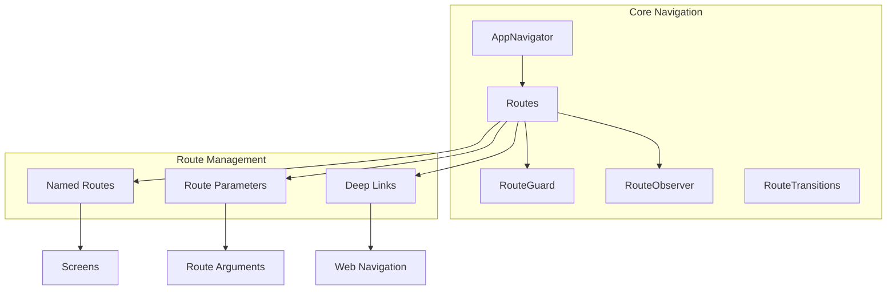

# مسیریابی و پیمایش - Routing & Navigation

## 📊 Document Information
- **Created:** 2025-09-01
- **Last Updated:** 2025-09-01
- **Version:** 1.0
- **Maintainer:** DataSave Frontend Team
- **Related Files:** `/lib/core/navigation/`, `/lib/routes.dart`

## 🎯 Overview
این مستند ساختار مسیریابی و پیمایش (Routing & Navigation) در پروژه DataSave را شرح می‌دهد. این ساختار امکان مدیریت صفحات، انتقال بین آنها، و همچنین پیاده‌سازی مسیریابی عمیق (Deep Linking) را فراهم می‌کند. مستند شامل معماری مسیریابی، تعریف مسیرها، و بهترین شیوه‌های پیاده‌سازی در برنامه Flutter است.

## 📋 Table of Contents
- [معماری مسیریابی](#معماری-مسیریابی)
- [تعریف مسیرها](#تعریف-مسیرها)
- [ناوبری](#ناوبری)
- [پارامترها و آرگومان‌ها](#پارامترها-و-آرگومان‌ها)
- [حفاظت از مسیرها](#حفاظت-از-مسیرها)
- [مسیریابی عمیق](#مسیریابی-عمیق)
- [مسیریابی وب](#مسیریابی-وب)
- [بهترین شیوه‌ها](#بهترین-شیوه‌ها)

## 🗺️ معماری مسیریابی

### ساختار مسیریابی


### ساختار پوشه‌ها و فایل‌ها
```
lib/
  ├── routes.dart               # تعریف مسیرهای اصلی
  ├── core/
  │   ├── navigation/
  │   │   ├── app_navigator.dart       # کلاس مدیریت ناوبری
  │   │   ├── route_guard.dart         # حفاظت از مسیرها
  │   │   ├── route_observer.dart      # ناظر مسیرها
  │   │   └── transitions/             # انیمیشن‌های انتقال
  │   │       ├── fade_transition.dart
  │   │       ├── slide_transition.dart
  │   │       └── scale_transition.dart
  │   └── extensions/
  │       └── context_extensions.dart  # اکستنشن‌های ناوبری
  ├── presentation/
  │   └── screens/                     # صفحات اپلیکیشن
```

## 🛣️ تعریف مسیرها

### فایل مسیرهای اصلی
```dart
// lib/routes.dart

import 'package:flutter/material.dart';
import 'package:datasave/presentation/screens/screens.dart';
import 'package:datasave/core/navigation/route_guard.dart';

class Routes {
  // مسیرهای اصلی
  static const String splash = '/';
  static const String login = '/login';
  static const String register = '/register';
  static const String home = '/home';
  static const String dashboard = '/dashboard';
  static const String settings = '/settings';
  static const String profile = '/profile';
  
  // مسیرهای فرم‌ها
  static const String formsList = '/forms';
  static const String formCreate = '/forms/create';
  static const String formEdit = '/forms/edit';
  static const String formView = '/forms/view';
  static const String formResponses = '/forms/responses';
  
  // مسیرهای تنظیمات
  static const String settingsGeneral = '/settings/general';
  static const String settingsAccount = '/settings/account';
  static const String settingsNotifications = '/settings/notifications';
  static const String settingsAPI = '/settings/api';
  
  // توابع کمکی برای ایجاد مسیرهای پارامتری
  static String formEditPath(String formId) => '$formEdit/$formId';
  static String formViewPath(String formId) => '$formView/$formId';
  static String formResponsesPath(String formId) => '$formResponses/$formId';
  
  // تنظیم مسیرها
  static Map<String, WidgetBuilder> getRoutes() {
    return {
      splash: (context) => const SplashScreen(),
      login: (context) => const LoginScreen(),
      register: (context) => const RegisterScreen(),
      home: (context) => RouteGuard.isAuthenticated(const HomeScreen()),
      dashboard: (context) => RouteGuard.isAuthenticated(const DashboardScreen()),
      settings: (context) => RouteGuard.isAuthenticated(const SettingsScreen()),
      profile: (context) => RouteGuard.isAuthenticated(const ProfileScreen()),
      
      formsList: (context) => RouteGuard.isAuthenticated(const FormsListScreen()),
      formCreate: (context) => RouteGuard.isAuthenticated(const FormCreateScreen()),
      
      settingsGeneral: (context) => RouteGuard.isAuthenticated(const SettingsGeneralScreen()),
      settingsAccount: (context) => RouteGuard.isAuthenticated(const SettingsAccountScreen()),
      settingsNotifications: (context) => RouteGuard.isAuthenticated(const SettingsNotificationsScreen()),
      settingsAPI: (context) => RouteGuard.isAuthenticated(const SettingsAPIScreen()),
    };
  }
  
  // مسیرهای نامشخص و پارامتری
  static Route<dynamic> onGenerateRoute(RouteSettings settings) {
    // دریافت نام مسیر
    final uri = Uri.parse(settings.name!);
    final pathSegments = uri.pathSegments;
    
    // مسیرهای پارامتری
    if (pathSegments.length >= 3 && pathSegments[0] == 'forms') {
      // مسیر ویرایش فرم
      if (pathSegments[1] == 'edit') {
        final formId = pathSegments[2];
        return MaterialPageRoute(
          settings: settings,
          builder: (context) => RouteGuard.isAuthenticated(
            FormEditScreen(formId: formId),
          ),
        );
      }
      
      // مسیر نمایش فرم
      if (pathSegments[1] == 'view') {
        final formId = pathSegments[2];
        return MaterialPageRoute(
          settings: settings,
          builder: (context) => FormViewScreen(formId: formId),
        );
      }
      
      // مسیر پاسخ‌های فرم
      if (pathSegments[1] == 'responses') {
        final formId = pathSegments[2];
        return MaterialPageRoute(
          settings: settings,
          builder: (context) => RouteGuard.isAuthenticated(
            FormResponsesScreen(formId: formId),
          ),
        );
      }
    }
    
    // مسیر یافت نشد
    return MaterialPageRoute(
      settings: settings,
      builder: (context) => const NotFoundScreen(),
    );
  }
  
  // صفحه 404
  static Route<dynamic> onUnknownRoute(RouteSettings settings) {
    return MaterialPageRoute(
      settings: settings,
      builder: (context) => const NotFoundScreen(),
    );
  }
}
```

### پیاده‌سازی در MaterialApp
```dart
// lib/main.dart

import 'package:flutter/material.dart';
import 'package:datasave/routes.dart';
import 'package:datasave/core/navigation/route_observer.dart';

void main() {
  runApp(const MyApp());
}

class MyApp extends StatelessWidget {
  const MyApp({Key? key}) : super(key: key);

  @override
  Widget build(BuildContext context) {
    return MaterialApp(
      title: 'DataSave',
      debugShowCheckedModeBanner: false,
      theme: ThemeData(
        primarySwatch: Colors.blue,
        fontFamily: 'Vazirmatn',
      ),
      
      // تنظیمات مسیریابی
      initialRoute: Routes.splash,
      routes: Routes.getRoutes(),
      onGenerateRoute: Routes.onGenerateRoute,
      onUnknownRoute: Routes.onUnknownRoute,
      
      // ناظر مسیرها برای ردیابی و آنالیتیکس
      navigatorObservers: [
        AppRouteObserver(),
      ],
    );
  }
}
```

## 🧭 ناوبری

### کلاس AppNavigator
```dart
// lib/core/navigation/app_navigator.dart

import 'package:flutter/material.dart';
import 'package:datasave/routes.dart';

class AppNavigator {
  // نگهدارنده کلید navigator اصلی
  static final GlobalKey<NavigatorState> navigatorKey = 
      GlobalKey<NavigatorState>();
  
  // دسترسی به context فعلی
  static BuildContext? get currentContext => navigatorKey.currentContext;
  
  // دسترسی به state فعلی navigator
  static NavigatorState? get navigator => navigatorKey.currentState;
  
  // متدهای ناوبری
  
  // هدایت به مسیر جدید
  static Future<T?> navigateTo<T>(String routeName, {Object? arguments}) {
    return navigator!.pushNamed<T>(routeName, arguments: arguments);
  }
  
  // هدایت به مسیر جدید و حذف مسیرهای قبلی
  static Future<T?> navigateToAndRemoveUntil<T>(
    String routeName, {
    Object? arguments,
    bool preserveRootRoute = true,
  }) {
    return navigator!.pushNamedAndRemoveUntil<T>(
      routeName,
      preserveRootRoute ? ModalRoute.withName(Routes.splash) : (route) => false,
      arguments: arguments,
    );
  }
  
  // هدایت به مسیر جدید و جایگزینی مسیر فعلی
  static Future<T?> navigateToAndReplace<T, TO>(
    String routeName, {
    Object? arguments,
  }) {
    return navigator!.pushReplacementNamed<T, TO>(
      routeName,
      arguments: arguments,
    );
  }
  
  // بازگشت به صفحه قبل
  static void goBack<T>([T? result]) {
    if (navigator!.canPop()) {
      navigator!.pop<T>(result);
    }
  }
  
  // بازگشت به صفحه اصلی
  static void goToHome() {
    navigateToAndRemoveUntil(Routes.home);
  }
  
  // بازگشت به صفحه ورود
  static void goToLogin() {
    navigateToAndRemoveUntil(Routes.login, preserveRootRoute: false);
  }
  
  // ناوبری با انیمیشن سفارشی
  static Future<T?> navigateWithAnimation<T>(
    BuildContext context,
    Widget page, {
    bool fullscreenDialog = false,
    bool opaque = true,
    String? routeName,
  }) {
    return Navigator.of(context).push<T>(
      PageRouteBuilder(
        settings: routeName != null ? RouteSettings(name: routeName) : null,
        fullscreenDialog: fullscreenDialog,
        opaque: opaque,
        pageBuilder: (_, __, ___) => page,
        transitionsBuilder: (context, animation, secondaryAnimation, child) {
          return FadeTransition(
            opacity: animation,
            child: child,
          );
        },
      ),
    );
  }
}
```

### اکستنشن‌های Context برای ناوبری
```dart
// lib/core/extensions/context_extensions.dart

import 'package:flutter/material.dart';

extension NavigationExtension on BuildContext {
  // هدایت به مسیر جدید
  Future<T?> navigateTo<T>(String routeName, {Object? arguments}) {
    return Navigator.of(this).pushNamed<T>(routeName, arguments: arguments);
  }
  
  // هدایت به مسیر جدید و حذف مسیرهای قبلی
  Future<T?> navigateToAndRemoveUntil<T>(
    String routeName,
    RoutePredicate predicate, {
    Object? arguments,
  }) {
    return Navigator.of(this).pushNamedAndRemoveUntil<T>(
      routeName,
      predicate,
      arguments: arguments,
    );
  }
  
  // هدایت به مسیر جدید و جایگزینی مسیر فعلی
  Future<T?> navigateToAndReplace<T, TO>(
    String routeName, {
    Object? arguments,
  }) {
    return Navigator.of(this).pushReplacementNamed<T, TO>(
      routeName,
      arguments: arguments,
    );
  }
  
  // بازگشت به صفحه قبل
  void goBack<T>([T? result]) {
    Navigator.of(this).pop<T>(result);
  }
  
  // بررسی امکان بازگشت
  bool canGoBack() => Navigator.of(this).canPop();
  
  // هدایت به ویجت جدید
  Future<T?> navigateToWidget<T>(Widget widget) {
    return Navigator.of(this).push<T>(
      MaterialPageRoute(builder: (_) => widget),
    );
  }
  
  // هدایت به ویجت جدید با انیمیشن
  Future<T?> navigateToWidgetWithAnimation<T>(
    Widget widget, {
    Duration duration = const Duration(milliseconds: 300),
    bool fullscreenDialog = false,
  }) {
    return Navigator.of(this).push<T>(
      PageRouteBuilder(
        fullscreenDialog: fullscreenDialog,
        pageBuilder: (_, __, ___) => widget,
        transitionDuration: duration,
        transitionsBuilder: (context, animation, secondaryAnimation, child) {
          return SlideTransition(
            position: Tween<Offset>(
              begin: const Offset(1.0, 0.0),
              end: Offset.zero,
            ).animate(animation),
            child: child,
          );
        },
      ),
    );
  }
}
```

## 📝 پارامترها و آرگومان‌ها

### تعریف کلاس‌های آرگومان
```dart
// lib/core/navigation/route_arguments.dart

// آرگومان‌های عمومی
class RouteArguments {
  final String? title;
  final String? message;
  final Map<String, dynamic>? data;
  
  RouteArguments({
    this.title,
    this.message,
    this.data,
  });
}

// آرگومان‌های فرم
class FormArguments {
  final String? formId;
  final bool isEditable;
  final bool isPreview;
  final Map<String, dynamic>? initialData;
  
  FormArguments({
    this.formId,
    this.isEditable = false,
    this.isPreview = false,
    this.initialData,
  });
}

// آرگومان‌های پروفایل کاربر
class ProfileArguments {
  final String? userId;
  final bool isCurrentUser;
  
  ProfileArguments({
    this.userId,
    this.isCurrentUser = true,
  });
}
```

### استفاده از آرگومان‌ها در صفحات
```dart
// lib/presentation/screens/forms/form_edit_screen.dart

import 'package:flutter/material.dart';
import 'package:datasave/core/navigation/route_arguments.dart';

class FormEditScreen extends StatefulWidget {
  final String? formId;
  
  const FormEditScreen({Key? key, this.formId}) : super(key: key);
  
  @override
  _FormEditScreenState createState() => _FormEditScreenState();
}

class _FormEditScreenState extends State<FormEditScreen> {
  late FormArguments _arguments;
  bool _isInitialized = false;
  
  @override
  void didChangeDependencies() {
    super.didChangeDependencies();
    
    if (!_isInitialized) {
      _initializeArguments();
      _isInitialized = true;
    }
  }
  
  void _initializeArguments() {
    // دریافت آرگومان‌ها از مسیر
    final args = ModalRoute.of(context)?.settings.arguments;
    
    if (args != null && args is FormArguments) {
      _arguments = args;
    } else {
      // استفاده از پارامترهای مسیر در صورت عدم وجود آرگومان
      _arguments = FormArguments(
        formId: widget.formId,
        isEditable: true,
      );
    }
    
    // بارگذاری اطلاعات فرم
    _loadFormData();
  }
  
  void _loadFormData() {
    // استفاده از _arguments.formId برای بارگذاری اطلاعات
    print('Loading form data for ID: ${_arguments.formId}');
  }
  
  @override
  Widget build(BuildContext context) {
    return Scaffold(
      appBar: AppBar(
        title: Text(_arguments.formId != null ? 'ویرایش فرم' : 'ایجاد فرم جدید'),
      ),
      body: Center(
        child: Text('ویرایش فرم با شناسه: ${_arguments.formId ?? "جدید"}'),
      ),
    );
  }
}
```

### انتقال و دریافت پارامترها
```dart
// نمونه انتقال پارامتر به صفحه

// روش 1: استفاده از مسیر پارامتری
Navigator.of(context).pushNamed(
  Routes.formEditPath('12345'),
);

// روش 2: استفاده از آرگومان‌ها
Navigator.of(context).pushNamed(
  Routes.formEdit,
  arguments: FormArguments(
    formId: '12345',
    isEditable: true,
    initialData: {'title': 'فرم تست'},
  ),
);

// روش 3: استفاده از کلاس AppNavigator
AppNavigator.navigateTo(
  Routes.formEdit,
  arguments: FormArguments(formId: '12345'),
);

// روش 4: استفاده از اکستنشن Context
context.navigateTo(
  Routes.formEdit,
  arguments: FormArguments(formId: '12345'),
);

// نمونه دریافت پارامتر در صفحه
@override
void didChangeDependencies() {
  super.didChangeDependencies();
  
  // دریافت آرگومان‌ها
  final args = ModalRoute.of(context)?.settings.arguments;
  
  if (args is FormArguments) {
    final formId = args.formId;
    final isEditable = args.isEditable;
    // استفاده از پارامترها
  }
}
```

## 🔒 حفاظت از مسیرها

### کلاس RouteGuard
```dart
// lib/core/navigation/route_guard.dart

import 'package:flutter/material.dart';
import 'package:datasave/core/services/auth_service.dart';
import 'package:datasave/routes.dart';
import 'package:datasave/presentation/screens/auth/login_screen.dart';

class RouteGuard {
  // بررسی احراز هویت برای مسیرهای محافظت شده
  static Widget isAuthenticated(Widget page) {
    return Builder(
      builder: (context) {
        if (AuthService.isAuthenticated) {
          return page;
        } else {
          // در صورت عدم احراز هویت، هدایت به صفحه ورود
          WidgetsBinding.instance.addPostFrameCallback((_) {
            Navigator.of(context).pushReplacementNamed(Routes.login);
          });
          return const LoginScreen();
        }
      },
    );
  }
  
  // بررسی دسترسی ادمین
  static Widget isAdmin(Widget page) {
    return Builder(
      builder: (context) {
        if (AuthService.isAuthenticated && AuthService.currentUser?.isAdmin == true) {
          return page;
        } else {
          // در صورت عدم دسترسی، هدایت به صفحه خطای دسترسی
          WidgetsBinding.instance.addPostFrameCallback((_) {
            Navigator.of(context).pushReplacementNamed(Routes.accessDenied);
          });
          return const AccessDeniedScreen();
        }
      },
    );
  }
  
  // بررسی دسترسی به منبع خاص
  static Widget hasAccessTo(Widget page, String resourceId, {required String resourceType}) {
    return Builder(
      builder: (context) {
        if (AuthService.isAuthenticated && 
            AuthService.hasAccessTo(resourceId, resourceType: resourceType)) {
          return page;
        } else {
          // در صورت عدم دسترسی، هدایت به صفحه خطای دسترسی
          WidgetsBinding.instance.addPostFrameCallback((_) {
            Navigator.of(context).pushReplacementNamed(Routes.accessDenied);
          });
          return const AccessDeniedScreen();
        }
      },
    );
  }
  
  // بررسی عدم احراز هویت (برای صفحات ورود)
  static Widget isNotAuthenticated(Widget page) {
    return Builder(
      builder: (context) {
        if (!AuthService.isAuthenticated) {
          return page;
        } else {
          // در صورت احراز هویت قبلی، هدایت به صفحه اصلی
          WidgetsBinding.instance.addPostFrameCallback((_) {
            Navigator.of(context).pushReplacementNamed(Routes.home);
          });
          return Container(); // Widget موقت تا زمان هدایت
        }
      },
    );
  }
}
```

### نمونه استفاده از RouteGuard
```dart
// در فایل routes.dart

static Map<String, WidgetBuilder> getRoutes() {
  return {
    splash: (context) => const SplashScreen(),
    login: (context) => RouteGuard.isNotAuthenticated(const LoginScreen()),
    register: (context) => RouteGuard.isNotAuthenticated(const RegisterScreen()),
    home: (context) => RouteGuard.isAuthenticated(const HomeScreen()),
    dashboard: (context) => RouteGuard.isAuthenticated(const DashboardScreen()),
    settings: (context) => RouteGuard.isAuthenticated(const SettingsScreen()),
    adminPanel: (context) => RouteGuard.isAdmin(const AdminPanelScreen()),
    userProfile: (context) => RouteGuard.isAuthenticated(const UserProfileScreen()),
    formEdit: (context) => RouteGuard.isAuthenticated(const FormEditScreen()),
  };
}
```

## 🔗 مسیریابی عمیق

### پیاده‌سازی Deep Linking
```dart
// lib/core/navigation/deep_linking.dart

import 'package:flutter/material.dart';
import 'package:datasave/routes.dart';

class DeepLinkHandler {
  // پردازش Deep Link
  static Route<dynamic>? handleDeepLink(Uri uri) {
    // آنالیز مسیر
    final path = uri.path;
    final pathSegments = uri.pathSegments;
    final queryParams = uri.queryParameters;
    
    // مسیرهای Deep Link
    
    // مسیر نمایش فرم
    if (pathSegments.isNotEmpty && pathSegments[0] == 'form' && pathSegments.length > 1) {
      final formId = pathSegments[1];
      return MaterialPageRoute(
        builder: (context) => FormViewScreen(formId: formId),
      );
    }
    
    // مسیر پاسخ به فرم
    if (pathSegments.isNotEmpty && pathSegments[0] == 'respond' && pathSegments.length > 1) {
      final formId = pathSegments[1];
      return MaterialPageRoute(
        builder: (context) => FormRespondScreen(formId: formId),
      );
    }
    
    // مسیر پروفایل کاربر
    if (pathSegments.isNotEmpty && pathSegments[0] == 'user' && pathSegments.length > 1) {
      final userId = pathSegments[1];
      return MaterialPageRoute(
        builder: (context) => UserProfileScreen(userId: userId),
      );
    }
    
    // مسیر تأیید ایمیل
    if (path == '/verify-email' && queryParams.containsKey('token')) {
      final token = queryParams['token'];
      return MaterialPageRoute(
        builder: (context) => EmailVerificationScreen(token: token),
      );
    }
    
    // مسیر بازیابی رمز عبور
    if (path == '/reset-password' && queryParams.containsKey('token')) {
      final token = queryParams['token'];
      return MaterialPageRoute(
        builder: (context) => ResetPasswordScreen(token: token),
      );
    }
    
    // اگر مسیری پیدا نشد، null برگردان تا به onGenerateRoute برود
    return null;
  }
  
  // پیکربندی Deep Link در main.dart
  static Widget configureDeepLinks(Widget app) {
    return Builder(
      builder: (context) {
        return FutureBuilder<Uri?>(
          future: _getInitialLink(),
          builder: (context, snapshot) {
            if (snapshot.hasData && snapshot.data != null) {
              // پردازش لینک اولیه
              WidgetsBinding.instance.addPostFrameCallback((_) {
                final route = handleDeepLink(snapshot.data!);
                if (route != null) {
                  Navigator.of(context).push(route);
                }
              });
            }
            
            return app;
          },
        );
      },
    );
  }
  
  // دریافت لینک اولیه
  static Future<Uri?> _getInitialLink() async {
    // استفاده از package مانند uni_links برای دریافت لینک اولیه
    // برای سادگی، اینجا یک مثال ساده آورده شده است
    
    // مثال استفاده از uni_links:
    // final initialLink = await getInitialLink();
    // return initialLink != null ? Uri.parse(initialLink) : null;
    
    return null; // در حالت واقعی، لینک برگردانده می‌شود
  }
}
```

### پیکربندی Deep Link در AndroidManifest.xml
```xml
<!-- android/app/src/main/AndroidManifest.xml -->

<manifest ...>
  <application ...>
    <activity ...>
      <!-- دیپ لینک پیکربندی -->
      <intent-filter>
        <action android:name="android.intent.action.VIEW" />
        <category android:name="android.intent.category.DEFAULT" />
        <category android:name="android.intent.category.BROWSABLE" />
        <!-- اسکیم و میزبان برنامه -->
        <data
          android:scheme="datasave"
          android:host="app" />
      </intent-filter>
      
      <!-- لینک‌های وب -->
      <intent-filter>
        <action android:name="android.intent.action.VIEW" />
        <category android:name="android.intent.category.DEFAULT" />
        <category android:name="android.intent.category.BROWSABLE" />
        <data
          android:scheme="https"
          android:host="datasave.example.com" />
      </intent-filter>
    </activity>
  </application>
</manifest>
```

### پیکربندی Deep Link در Info.plist
```xml
<!-- ios/Runner/Info.plist -->

<dict>
  <!-- تنظیمات دیگر -->
  
  <!-- پیکربندی URL Types -->
  <key>CFBundleURLTypes</key>
  <array>
    <dict>
      <key>CFBundleTypeRole</key>
      <string>Editor</string>
      <key>CFBundleURLName</key>
      <string>com.example.datasave</string>
      <key>CFBundleURLSchemes</key>
      <array>
        <string>datasave</string>
      </array>
    </dict>
  </array>
  
  <!-- پیکربندی Associated Domains -->
  <key>com.apple.developer.associated-domains</key>
  <array>
    <string>applinks:datasave.example.com</string>
  </array>
</dict>
```

## 🌐 مسیریابی وب

### پیکربندی مسیرهای وب
```dart
// lib/core/navigation/web_navigation.dart

import 'package:flutter/material.dart';
import 'package:datasave/routes.dart';
import 'package:datasave/core/navigation/route_arguments.dart';

class WebNavigation {
  // تبدیل مسیر برنامه به URL وب
  static String getWebUrl(String routeName, {Object? arguments}) {
    String path = routeName;
    
    // پردازش آرگومان‌ها
    if (arguments != null) {
      if (arguments is FormArguments && arguments.formId != null) {
        if (routeName == Routes.formEdit) {
          path = Routes.formEditPath(arguments.formId!);
        } else if (routeName == Routes.formView) {
          path = Routes.formViewPath(arguments.formId!);
        }
      } else if (arguments is ProfileArguments && arguments.userId != null) {
        path = '/user/${arguments.userId}';
      }
    }
    
    // اضافه کردن پارامترهای query در صورت نیاز
    Uri uri = Uri.parse(path);
    Map<String, dynamic> queryParams = {};
    
    if (arguments is RouteArguments && arguments.data != null) {
      arguments.data!.forEach((key, value) {
        if (value != null) {
          queryParams[key] = value.toString();
        }
      });
    }
    
    if (queryParams.isNotEmpty) {
      uri = uri.replace(queryParameters: queryParams);
      path = uri.toString();
    }
    
    return path;
  }
  
  // تبدیل URL وب به مسیر برنامه
  static RouteSettings getRouteFromWebUrl(String url) {
    final uri = Uri.parse(url);
    final path = uri.path;
    final queryParams = uri.queryParameters;
    
    // تبدیل مسیر وب به مسیر برنامه
    String routeName = path;
    Object? arguments;
    
    // پردازش مسیرهای خاص
    final pathSegments = uri.pathSegments;
    
    if (pathSegments.isNotEmpty) {
      // مسیر فرم
      if (pathSegments[0] == 'forms' && pathSegments.length > 2) {
        if (pathSegments[1] == 'edit') {
          routeName = Routes.formEdit;
          arguments = FormArguments(
            formId: pathSegments[2],
            isEditable: true,
          );
        } else if (pathSegments[1] == 'view') {
          routeName = Routes.formView;
          arguments = FormArguments(
            formId: pathSegments[2],
            isEditable: false,
          );
        }
      }
      
      // مسیر کاربر
      else if (pathSegments[0] == 'user' && pathSegments.length > 1) {
        routeName = Routes.profile;
        arguments = ProfileArguments(
          userId: pathSegments[1],
          isCurrentUser: false,
        );
      }
    }
    
    // اضافه کردن پارامترهای query به آرگومان‌ها
    if (queryParams.isNotEmpty) {
      if (arguments == null) {
        arguments = RouteArguments(data: queryParams);
      } else if (arguments is RouteArguments) {
        final routeArgs = arguments as RouteArguments;
        arguments = RouteArguments(
          title: routeArgs.title,
          message: routeArgs.message,
          data: {...(routeArgs.data ?? {}), ...queryParams},
        );
      }
    }
    
    return RouteSettings(name: routeName, arguments: arguments);
  }
}
```

### پیکربندی UrlStrategy
```dart
// lib/main.dart

import 'package:flutter/material.dart';
import 'package:flutter_web_plugins/flutter_web_plugins.dart';
import 'package:datasave/routes.dart';

void main() {
  // تنظیم استراتژی URL برای وب (حذف هش # از URL)
  setUrlStrategy(PathUrlStrategy());
  
  runApp(const MyApp());
}

class MyApp extends StatelessWidget {
  const MyApp({Key? key}) : super(key: key);

  @override
  Widget build(BuildContext context) {
    return MaterialApp(
      title: 'DataSave',
      initialRoute: Routes.splash,
      routes: Routes.getRoutes(),
      onGenerateRoute: Routes.onGenerateRoute,
      onUnknownRoute: Routes.onUnknownRoute,
    );
  }
}
```

## 🏆 بهترین شیوه‌ها

### اصول مسیریابی
```yaml
Routing Best Practices:
  1. مسیرهای استاتیک:
     - تعریف تمام مسیرهای ثابت به صورت ثابت (static)
     - استفاده از onGenerateRoute فقط برای مسیرهای پویا
     
  2. روت‌های محافظت شده:
     - استفاده از میدل‌ور یا RouteGuard برای محافظت از مسیرها
     - بررسی دسترسی قبل از نمایش صفحه
     
  3. پارامترهای مسیر:
     - استفاده از کلاس‌های مخصوص برای آرگومان‌ها
     - مستندسازی پارامترهای مورد نیاز هر مسیر
     
  4. مسیریابی عمیق:
     - پشتیبانی از تمام مسیرهای اصلی در Deep Link
     - تست با لینک‌های مختلف
     
  5. انتقال داده بین صفحات:
     - استفاده از آرگومان‌ها به جای متغیرهای سراسری
     - دریافت نتیجه از صفحات با استفاده از async/await
```

### نکات کاربردی
```yaml
Practical Tips:
  1. ساختار نام‌گذاری:
     - استفاده از مسیرهای خوانا و توصیفی
     - پیروی از الگوی REST-like (/resource/action/id)
     
  2. بهینه‌سازی عملکرد:
     - استفاده از pushReplacement برای صفحات انتقالی
     - مدیریت استک ناوبری برای جلوگیری از مصرف حافظه
     
  3. آنالیتیکس و ردیابی:
     - استفاده از RouteObserver برای ردیابی صفحات
     - ثبت اطلاعات ورود و خروج از صفحات
     
  4. انیمیشن‌های انتقال:
     - استفاده از انیمیشن‌های مناسب برای هر انتقال
     - سازگاری با RTL در انیمیشن‌ها
     
  5. مدیریت خطا:
     - داشتن صفحه 404 برای مسیرهای نامعتبر
     - مدیریت مسیرهای نامعتبر به شکل مناسب
```

### مدیریت مسیرهای پیچیده
```yaml
Complex Routing Management:
  1. ناوبری تودرتو (Nested Navigation):
     - استفاده از Navigator های چندگانه
     - مدیریت سلسله مراتب صفحات
     
  2. مسیریابی براساس وضعیت (State-based Routing):
     - تغییر مسیر براساس تغییرات وضعیت برنامه
     - هماهنگی با مدیریت وضعیت (State Management)
     
  3. استراتژی‌های کش:
     - نگهداری وضعیت صفحات قبلی
     - بازگشت سریع به صفحات بازدید شده
     
  4. نمایش صفحات موقت:
     - صفحات لودینگ، اسپلش، و انتقالی
     - مدیریت زمان نمایش صفحات موقت
     
  5. شخصی‌سازی ناوبری:
     - تغییر رفتار دکمه بازگشت
     - اجرای منطق اضافی هنگام تغییر مسیر
```

## 🔄 Related Documentation
- [Flutter Architecture](flutter-architecture.md)
- [State Management](state-management.md)
- [Persian RTL Implementation](persian-rtl-implementation.md)
- [UI Components Library](../06-UI-UX-Design/ui-components-library.md)

---
*Last updated: 2025-09-01*  
*File: docs/04-Flutter-Frontend/routing-navigation.md*