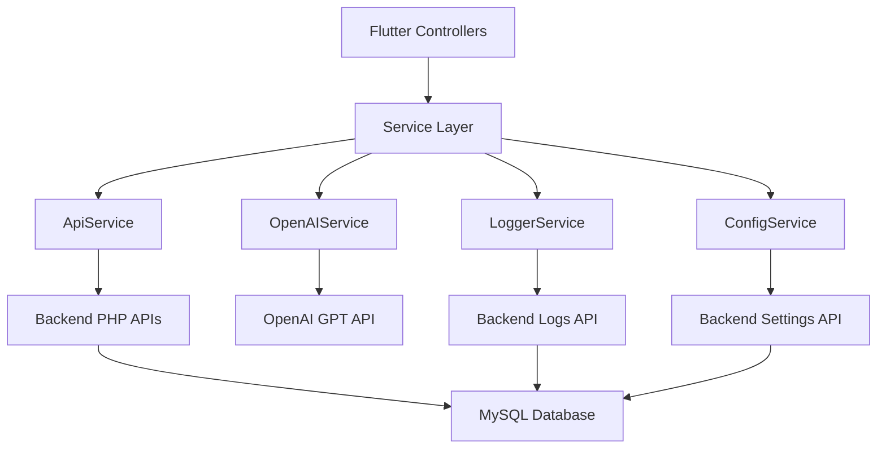

# یکپارچه‌سازی سرویس‌ها - Services Integration Documentation

## 📊 Document Information
- **Created:** 2025-01-09
- **Last Updated:** 2025-01-09  
- **Version:** 1.0
- **Maintainer:** DataSave Development Team

## 🎯 Overview
مستندات کامل یکپارچه‌سازی سرویس‌ها در پروژه DataSave شامل API service layer، OpenAI integration، logging system و configuration management.

## 📚 Documentation Sections

### 🌐 [Services Integration](./services-integration.md)
مستندات جامع یکپارچه‌سازی تمام سرویس‌های پروژه:
- معماری کامل Service Layer و dependencies
- API Service Layer با retry logic و error handling
- OpenAI Integration کامل با chat و form generation
- Logging System مرکزی با buffer management
- Configuration Management با backend sync
- Service Health Check و monitoring

**Key Features:**
- Centralized service architecture
- Comprehensive error handling
- Retry mechanisms
- Persian language support
- Secure API key management

## 🛠️ Technical Architecture

### Service Layer Overview
```yaml
Service Components:
  - ApiService: ارتباط با Backend PHP APIs
  - OpenAIService: یکپارچه‌سازی هوش مصنوعی GPT
  - LoggerService: سیستم لاگینگ مرکزی
  - ConfigService: مدیریت تنظیمات و پیکربندی

Integration Pattern:
  Flutter Controllers → Service Layer → External APIs
  All Services → Logger Service → Backend Logs
  ConfigService ↔ Backend Settings API
```

### Service Dependencies Map


## 🔌 Integration Points

### Backend API Integration
- **Settings Management**: دریافت و بروزرسانی تنظیمات سیستم
- **Logs Management**: ارسال و دریافت لاگ‌ها با آمارگیری
- **System Information**: وضعیت سرور و اطلاعات سیستم
- **Health Checks**: بررسی سلامت تمام سرویس‌ها

### OpenAI API Integration
- **Connection Testing**: تست صحت کلید API و دسترسی
- **Chat Completion**: ارسال پیام و دریافت پاسخ فارسی
- **Form Generation**: تولید فرم‌های پیچیده با AI
- **Model Management**: دریافت لیست مدل‌های موجود

### Logging Integration
- **Multi-Level Logging**: DEBUG, INFO, WARNING, ERROR, SEVERE
- **Backend Sync**: ارسال خودکار لاگ‌ها به بک‌اند
- **Buffer Management**: مدیریت حافظه موقت لاگ‌ها
- **Persian Support**: لاگ‌های فارسی با encoding مناسب

## 🛡️ Error Handling & Resilience

### Centralized Error Management
```yaml
Error Types:
  - ApiException: خطاهای مربوط به API calls
  - NetworkException: مشکلات شبکه و اتصال
  - ConfigException: خطاهای تنظیمات
  - ValidationException: خطاهای اعتبارسنجی

Resilience Patterns:
  - Retry Logic: تلاش مجدد برای عملیات ناموفق
  - Circuit Breaker: جلوگیری از cascade failures
  - Timeout Management: مدیریت زمان انتظار
  - Fallback Mechanisms: گزینه‌های جایگزین
```

### Recovery Strategies
- **API Failures**: Retry with exponential backoff
- **Network Issues**: Local fallback و offline mode
- **Service Unavailability**: Graceful degradation
- **Configuration Errors**: Default values و user notification

## 🔐 Security Implementation

### API Security
- **Secure Headers**: Authorization و User-Agent
- **Input Validation**: اعتبارسنجی تمام ورودی‌ها
- **Error Sanitization**: حذف اطلاعات حساس از خطاها
- **Timeout Protection**: جلوگیری از DoS attacks

### OpenAI Security
- **API Key Validation**: بررسی format و validity
- **Request Sanitization**: پاک‌سازی ورودی‌ها
- **Response Filtering**: فیلتر محتوای نامناسب
- **Usage Monitoring**: نظارت بر استفاده از API

## 📊 Performance Optimization

### API Performance
```yaml
Optimization Techniques:
  - HTTP Connection Reuse: Single client instance
  - Request Batching: گروه‌بندی درخواست‌ها
  - Response Caching: Cache مناسب برای static data
  - Compression: فشرده‌سازی request/response

Monitoring Metrics:
  - Response Times: زمان پاسخ API calls
  - Success Rates: نرخ موفقیت درخواست‌ها
  - Error Rates: میزان خطاها و انواع آنها
  - Throughput: تعداد درخواست در واحد زمان
```

### Resource Management
- **Memory Usage**: مدیریت حافظه service instances
- **Network Usage**: بهینه‌سازی bandwidth مصرفی
- **CPU Usage**: کاهش overhead پردازش
- **Storage Usage**: مدیریت cache و temporary files

## 🧪 Testing Strategy

### Service Testing
```dart
// Unit Test Example
group('ApiService Tests', () {
  test('getSettings returns valid data', () async {
    final settings = await ApiService.getSettings();
    expect(settings.isNotEmpty, true);
    expect(settings.first.containsKey('setting_key'), true);
  });

  test('updateSetting handles errors gracefully', () async {
    final result = await ApiService.updateSetting('invalid_key', '');
    expect(result, false);
  });
});

// Integration Test Example
group('OpenAI Integration Tests', () {
  test('sendMessage with valid API key', () async {
    final response = await OpenAIService.sendMessage(
      apiKey: 'test_key',
      message: 'Hello',
    );
    expect(response, isNotNull);
  });
});
```

### Mock Services
```dart
// Mock API Service for testing
class MockApiService implements ApiService {
  @override
  Future<List<Map<String, dynamic>>> getSettings() async {
    return [
      {'setting_key': 'test_key', 'setting_value': 'test_value'},
    ];
  }
  
  @override
  Future<bool> updateSetting(String key, String value) async {
    return true;
  }
}
```

## 🚀 Deployment Considerations

### Production Setup
```yaml
Configuration:
  - Environment Variables: API keys و URLs
  - Connection Pooling: HTTP client optimization
  - Load Balancing: توزیع بار requests
  - Monitoring: APM و logging setup

Scaling Strategies:
  - Horizontal Scaling: چندین instance
  - Caching Layer: Redis یا Memcached
  - CDN Integration: برای static assets
  - Database Optimization: Connection pooling
```

### Monitoring & Observability
- **Health Endpoints**: وضعیت سرویس‌ها
- **Metrics Collection**: آمارگیری عملکرد
- **Log Aggregation**: جمع‌آوری لاگ‌ها
- **Alert System**: هشدار برای مشکلات

## 📚 Usage Examples

### Basic Service Integration
```dart
// Initialize services
await ConfigService.initialize();
await LoggerService.initialize();

// Test all services health
final healthCheck = await ServiceHealthCheck.checkAllServices();
print('Services Health: $healthCheck');

// Use OpenAI service
final response = await OpenAIService.sendMessage(
  apiKey: ConfigService.openaiApiKey,
  message: 'سلام، یک فرم ساده برای من بساز',
  model: ConfigService.openaiModel,
);
```

### Advanced Error Handling
```dart
Future<String?> safeApiCall() async {
  try {
    return await ApiRetry.withRetry(() async {
      final result = await ApiService.getSomeData();
      return result;
    });
  } catch (error) {
    final userMessage = ApiErrorHandler.handleError(error);
    LoggerService.error('SafeApiCall', userMessage, error);
    return null;
  }
}
```

## 🔧 Configuration

### Service Configuration
```yaml
# config.yaml
services:
  api:
    base_url: "http://localhost/datasave/backend/api"
    timeout: 30
    retry_attempts: 3
    
  openai:
    base_url: "https://api.openai.com/v1"
    timeout: 60
    default_model: "gpt-4"
    max_tokens: 2048
    
  logging:
    level: "DEBUG"
    console_enabled: true
    backend_enabled: true
    buffer_size: 100
    flush_interval: 10
```

## ⚠️ Important Notes

### Best Practices
1. **Service Initialization**: همه services در app startup initialize شوند
2. **Error Handling**: تمام خطاها به صورت مناسب handle شوند
3. **Logging**: عملیات مهم به صورت کامل log شوند
4. **Configuration**: تنظیمات از ConfigService دریافت شوند
5. **Testing**: تمام services دارای unit tests باشند

### Common Issues
1. **Network Timeouts**: تنظیم timeout مناسب برای هر service
2. **Memory Leaks**: proper disposal از service instances
3. **API Rate Limits**: مدیریت محدودیت نرخ درخواست‌ها
4. **Error Cascading**: جلوگیری از انتشار خطاها

### Future Enhancements
- **Service Mesh**: استفاده از service mesh برای microservices
- **GraphQL Integration**: جایگزینی REST با GraphQL
- **Real-time Communication**: WebSocket یا Server-Sent Events
- **Advanced Caching**: Redis یا distributed caching
- **API Gateway**: centralized API management

## 🔄 Related Documentation
- [Flutter Architecture](../04-Flutter-Frontend/README.md)
- [Backend APIs](../02-Backend-APIs/README.md)  
- [Database Schema](../03-Database-Schema/README.md)
- [Development Workflow](../07-Development-Workflow/README.md)

---
*این مستندات بخشی از مجموعه مستندات فنی پروژه DataSave است*  
*Last updated: 2025-01-09*  
*File: /docs/05-Services-Integration/README.md*
