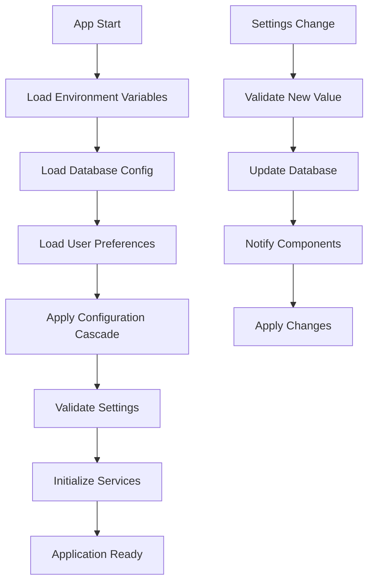

# مدیریت تنظیمات - Configuration Management

## 📊 Document Information
- **Created:** 2025-09-01
- **Last Updated:** 2025-09-01
- **Version:** 1.0
- **Maintainer:** DataSave Development Team
- **Related Files:** `backend/config/`, `lib/core/config/`, `system_settings` table

## 🎯 Overview
سیستم جامع مدیریت تنظیمات DataSave شامل تنظیمات database، application config، environment variables، و user preferences با پشتیبانی کامل از زبان فارسی.

## 📋 Table of Contents
- [معماری مدیریت تنظیمات](#معماری-مدیریت-تنظیمات)
- [Database Configuration](#database-configuration)
- [Application Settings](#application-settings)
- [Environment Variables](#environment-variables)
- [User Preferences](#user-preferences)
- [Security & Encryption](#security--encryption)
- [Configuration Validation](#configuration-validation)

## 🏗️ معماری مدیریت تنظیمات - Configuration Architecture

### Configuration Layers
```yaml
Configuration Hierarchy:
  1. Environment Variables (Highest Priority)
     - Database credentials
     - API keys
     - Debug flags
     
  2. Database Settings (Dynamic)
     - Application configuration
     - Feature toggles
     - User preferences
     
  3. Config Files (Static)
     - Default values
     - Structure definitions
     - Validation rules
     
  4. Hardcoded Defaults (Lowest Priority)
     - Fallback values
     - System constants
```

### Configuration Flow


## 🗄️ Database Configuration

### system_settings Table Structure
```sql
-- جدول اصلی تنظیمات
CREATE TABLE system_settings (
    id INT AUTO_INCREMENT PRIMARY KEY,
    setting_key VARCHAR(100) NOT NULL UNIQUE,
    setting_value TEXT,
    setting_type ENUM('string', 'json', 'boolean', 'number', 'encrypted') DEFAULT 'string',
    description VARCHAR(255) COMMENT 'توضیحات فارسی',
    is_system BOOLEAN DEFAULT FALSE COMMENT 'تنظیمات سیستمی؟',
    is_readonly BOOLEAN DEFAULT FALSE COMMENT 'فقط خواندنی؟',
    created_at TIMESTAMP DEFAULT CURRENT_TIMESTAMP,
    updated_at TIMESTAMP DEFAULT CURRENT_TIMESTAMP ON UPDATE CURRENT_TIMESTAMP
) ENGINE=InnoDB DEFAULT CHARSET=utf8mb4 COLLATE=utf8mb4_persian_ci;
```

### Current Configuration Settings
```sql
-- تنظیمات فعلی (9 رکورد)
INSERT INTO system_settings VALUES 
(1, 'openai_api_key', 'sk-proj-VCZeP...', 'encrypted', 'کلید API سرویس OpenAI', 1, 1),
(2, 'openai_model', 'gpt-4', 'string', 'مدل پیش‌فرض OpenAI', 1, 0),
(3, 'openai_max_tokens', '2048', 'number', 'حداکثر توکن برای پاسخ', 1, 0),
(4, 'openai_temperature', '0.7', 'number', 'میزان خلاقیت AI', 1, 0),
(5, 'app_language', 'fa', 'string', 'زبان پیش‌فرض برنامه', 0, 0),
(6, 'enable_logging', 'true', 'boolean', 'فعال‌سازی سیستم لاگ', 0, 0),
(7, 'max_log_entries', '1000', 'number', 'حداکثر تعداد لاگ', 0, 0),
(8, 'app_theme', 'light', 'string', 'تم پیش‌فرض اپلیکیشن', 0, 0),
(9, 'auto_save', 'true', 'boolean', 'ذخیره خودکار فرم‌ها', 0, 0);
```

### Database Configuration Class
```php
<?php
// backend/config/database.php
class DatabaseConfig {
    private static $instance = null;
    private $pdo;
    private $cache = [];
    
    public static function getInstance(): self {
        if (self::$instance === null) {
            self::$instance = new self();
        }
        return self::$instance;
    }
    
    public function __construct() {
        $this->pdo = new PDO(
            "mysql:host=localhost;port=3307;dbname=datasave;charset=utf8mb4",
            "root",
            "Mojtab@123",
            [
                PDO::ATTR_ERRMODE => PDO::ERRMODE_EXCEPTION,
                PDO::MYSQL_ATTR_INIT_COMMAND => "SET NAMES utf8mb4 COLLATE utf8mb4_persian_ci"
            ]
        );
    }
    
    public function getSetting(string $key, $default = null) {
        // Check cache first
        if (isset($this->cache[$key])) {
            return $this->cache[$key];
        }
        
        $sql = "SELECT setting_value, setting_type FROM system_settings WHERE setting_key = ?";
        $stmt = $this->pdo->prepare($sql);
        $stmt->execute([$key]);
        $result = $stmt->fetch(PDO::FETCH_ASSOC);
        
        if (!$result) {
            return $default;
        }
        
        $value = $this->castValue($result['setting_value'], $result['setting_type']);
        $this->cache[$key] = $value;
        return $value;
    }
    
    public function setSetting(string $key, $value, string $type = 'string'): bool {
        $processedValue = $this->processValue($value, $type);
        
        $sql = "INSERT INTO system_settings (setting_key, setting_value, setting_type, updated_at) 
                VALUES (?, ?, ?, NOW()) 
                ON DUPLICATE KEY UPDATE 
                setting_value = VALUES(setting_value), 
                setting_type = VALUES(setting_type),
                updated_at = NOW()";
                
        $stmt = $this->pdo->prepare($sql);
        $result = $stmt->execute([$key, $processedValue, $type]);
        
        // Update cache
        if ($result) {
            $this->cache[$key] = $value;
        }
        
        return $result;
    }
    
    private function castValue($value, string $type) {
        switch ($type) {
            case 'boolean':
                return filter_var($value, FILTER_VALIDATE_BOOLEAN);
            case 'number':
                return is_numeric($value) ? (float)$value : 0;
            case 'json':
                return json_decode($value, true);
            case 'encrypted':
                return $this->decrypt($value);
            default:
                return $value;
        }
    }
    
    private function processValue($value, string $type): string {
        switch ($type) {
            case 'boolean':
                return $value ? 'true' : 'false';
            case 'number':
                return (string)$value;
            case 'json':
                return json_encode($value);
            case 'encrypted':
                return $this->encrypt($value);
            default:
                return (string)$value;
        }
    }
}
?>
```

## 📱 Flutter Configuration Management

### App Configuration Service
```dart
// lib/core/config/app_config.dart
class AppConfig {
  static AppConfig? _instance;
  static AppConfig get instance => _instance ??= AppConfig._();
  AppConfig._();
  
  // Configuration cache
  final Map<String, dynamic> _cache = {};
  bool _isInitialized = false;
  
  // Configuration keys
  static const String openaiApiKey = 'openai_api_key';
  static const String openaiModel = 'openai_model';
  static const String appLanguage = 'app_language';
  static const String enableLogging = 'enable_logging';
  static const String appTheme = 'app_theme';
  static const String autoSave = 'auto_save';
  
  Future<void> initialize() async {
    if (_isInitialized) return;
    
    try {
      await _loadFromServer();
      await _loadFromLocal();
      _isInitialized = true;
      LoggerService.info('AppConfig', 'Configuration initialized successfully');
    } catch (e) {
      LoggerService.error('AppConfig', 'Failed to initialize configuration: $e');
      _loadDefaults();
    }
  }
  
  Future<void> _loadFromServer() async {
    final response = await ApiService.getSettings();
    if (response != null && response['success'] == true) {
      final List<dynamic> settings = response['data'];
      for (var setting in settings) {
        _cache[setting['setting_key']] = _castValue(
          setting['setting_value'],
          setting['setting_type']
        );
      }
    }
  }
  
  Future<void> _loadFromLocal() async {
    final prefs = await SharedPreferences.getInstance();
    
    // User preferences override server settings
    final userTheme = prefs.getString('user_theme');
    if (userTheme != null) {
      _cache[appTheme] = userTheme;
    }
    
    final userLanguage = prefs.getString('user_language');
    if (userLanguage != null) {
      _cache[appLanguage] = userLanguage;
    }
  }
  
  void _loadDefaults() {
    _cache.addAll({
      openaiModel: 'gpt-4',
      appLanguage: 'fa',
      enableLogging: true,
      appTheme: 'light',
      autoSave: true,
    });
  }
  
  T get<T>(String key, T defaultValue) {
    if (!_isInitialized) {
      LoggerService.warning('AppConfig', 'Configuration not initialized, using default');
      return defaultValue;
    }
    return (_cache[key] as T?) ?? defaultValue;
  }
  
  Future<bool> set<T>(String key, T value, {bool syncToServer = true}) async {
    _cache[key] = value;
    
    // Save to local preferences
    final prefs = await SharedPreferences.getInstance();
    if (value is String) {
      await prefs.setString('user_$key', value);
    } else if (value is bool) {
      await prefs.setBool('user_$key', value);
    } else if (value is int) {
      await prefs.setInt('user_$key', value);
    } else if (value is double) {
      await prefs.setDouble('user_$key', value);
    }
    
    // Sync to server if requested
    if (syncToServer) {
      return await _syncToServer(key, value);
    }
    
    return true;
  }
  
  Future<bool> _syncToServer(String key, dynamic value) async {
    try {
      final response = await ApiService.updateSetting(key, value);
      return response != null && response['success'] == true;
    } catch (e) {
      LoggerService.error('AppConfig', 'Failed to sync $key to server: $e');
      return false;
    }
  }
  
  dynamic _castValue(String value, String type) {
    switch (type) {
      case 'boolean':
        return value.toLowerCase() == 'true';
      case 'number':
        return double.tryParse(value) ?? 0;
      case 'json':
        try {
          return jsonDecode(value);
        } catch (e) {
          return {};
        }
      default:
        return value;
    }
  }
}
```

### Configuration Validation
```dart
// lib/core/config/config_validator.dart
class ConfigValidator {
  static bool validateConfiguration(Map<String, dynamic> config) {
    final validations = <String, bool Function(dynamic)>{
      AppConfig.openaiModel: (value) => _validOpenAIModels.contains(value),
      AppConfig.appLanguage: (value) => _validLanguages.contains(value),
      AppConfig.appTheme: (value) => _validThemes.contains(value),
      AppConfig.enableLogging: (value) => value is bool,
      AppConfig.autoSave: (value) => value is bool,
    };
    
    for (final entry in validations.entries) {
      if (config.containsKey(entry.key)) {
        if (!entry.value(config[entry.key])) {
          LoggerService.error('ConfigValidator', 
            'Invalid value for ${entry.key}: ${config[entry.key]}');
          return false;
        }
      }
    }
    
    return true;
  }
  
  static const List<String> _validOpenAIModels = [
    'gpt-4',
    'gpt-4-turbo',
    'gpt-3.5-turbo'
  ];
  
  static const List<String> _validLanguages = ['fa', 'en'];
  static const List<String> _validThemes = ['light', 'dark', 'auto'];
}
```

## 🔒 Security & Encryption

### Sensitive Data Encryption
```php
<?php
// backend/classes/ConfigSecurity.php
class ConfigSecurity {
    private const ENCRYPTION_METHOD = 'AES-256-CBC';
    private const KEY_LENGTH = 32;
    private const IV_LENGTH = 16;
    
    private static function getEncryptionKey(): string {
        $key = getenv('ENCRYPTION_KEY');
        if (!$key) {
            throw new Exception('Encryption key not found in environment');
        }
        return substr(hash('sha256', $key), 0, self::KEY_LENGTH);
    }
    
    private static function getIV(): string {
        $iv = getenv('ENCRYPTION_IV');
        if (!$iv) {
            throw new Exception('Encryption IV not found in environment');
        }
        return substr($iv, 0, self::IV_LENGTH);
    }
    
    public static function encrypt(string $data): string {
        $encrypted = openssl_encrypt(
            $data, 
            self::ENCRYPTION_METHOD, 
            self::getEncryptionKey(), 
            0, 
            self::getIV()
        );
        
        if ($encrypted === false) {
            throw new Exception('Encryption failed');
        }
        
        return base64_encode($encrypted);
    }
    
    public static function decrypt(string $encryptedData): string {
        $data = base64_decode($encryptedData);
        $decrypted = openssl_decrypt(
            $data, 
            self::ENCRYPTION_METHOD, 
            self::getEncryptionKey(), 
            0, 
            self::getIV()
        );
        
        if ($decrypted === false) {
            throw new Exception('Decryption failed');
        }
        
        return $decrypted;
    }
}
?>
```

## 🌍 Environment Configuration

### Environment Variables Setup
```bash
# .env file (development)
# Database Configuration
DB_HOST=localhost
DB_PORT=3307
DB_NAME=datasave
DB_USER=root
DB_PASS=Mojtab@123
DB_CHARSET=utf8mb4

# Security
ENCRYPTION_KEY=your-secret-encryption-key-here
ENCRYPTION_IV=your-initialization-vector

# External Services
OPENAI_API_KEY=sk-proj-your-key-here
OPENAI_MODEL=gpt-4

# Application
APP_ENV=development
APP_DEBUG=true
APP_LANGUAGE=fa
APP_TIMEZONE=Asia/Tehran

# Logging
LOG_LEVEL=DEBUG
LOG_MAX_FILES=10
LOG_RETENTION_DAYS=30
```

### Environment Configuration Loader
```dart
// lib/core/config/env_config.dart
class EnvConfig {
  static const String _envFile = 'assets/config/.env';
  static Map<String, String>? _variables;
  
  static Future<void> load() async {
    if (_variables != null) return;
    
    try {
      final content = await rootBundle.loadString(_envFile);
      _variables = _parseEnvContent(content);
      LoggerService.info('EnvConfig', 'Environment variables loaded');
    } catch (e) {
      LoggerService.error('EnvConfig', 'Failed to load environment: $e');
      _variables = {};
    }
  }
  
  static String get(String key, [String? defaultValue]) {
    return _variables?[key] ?? defaultValue ?? '';
  }
  
  static bool getBool(String key, [bool defaultValue = false]) {
    final value = get(key).toLowerCase();
    return value == 'true' || value == '1';
  }
  
  static int getInt(String key, [int defaultValue = 0]) {
    return int.tryParse(get(key)) ?? defaultValue;
  }
  
  static Map<String, String> _parseEnvContent(String content) {
    final Map<String, String> variables = {};
    final lines = content.split('
');
    
    for (final line in lines) {
      final trimmed = line.trim();
      if (trimmed.isEmpty || trimmed.startsWith('#')) continue;
      
      final parts = trimmed.split('=');
      if (parts.length >= 2) {
        final key = parts[0].trim();
        final value = parts.sublist(1).join('=').trim();
        variables[key] = value;
      }
    }
    
    return variables;
  }
}
```

## ⚙️ Configuration Management APIs

### Backend Configuration API
```php
<?php
// backend/api/config/get.php
header('Content-Type: application/json; charset=utf-8');
header('Access-Control-Allow-Origin: *');

require_once '../../../config/database.php';

try {
    $db = DatabaseConfig::getInstance();
    
    // Filter system/user settings based on request
    $includeSystem = $_GET['include_system'] ?? 'true';
    $category = $_GET['category'] ?? null;
    
    $whereClause = '';
    $params = [];
    
    if ($includeSystem === 'false') {
        $whereClause = 'WHERE is_system = FALSE';
    }
    
    if ($category) {
        $whereClause .= $whereClause ? ' AND ' : 'WHERE ';
        $whereClause .= 'setting_key LIKE ?';
        $params[] = $category . '_%';
    }
    
    $sql = "SELECT setting_key, setting_value, setting_type, description, 
                   is_system, is_readonly, created_at, updated_at 
            FROM system_settings 
            $whereClause
            ORDER BY setting_key";
            
    $stmt = $db->prepare($sql);
    $stmt->execute($params);
    $settings = $stmt->fetchAll(PDO::FETCH_ASSOC);
    
    // Process values for JSON response
    foreach ($settings as &$setting) {
        $setting['setting_value'] = $db->castValue($setting['setting_value'], $setting['setting_type']);
        
        // Don't expose encrypted values
        if ($setting['setting_type'] === 'encrypted') {
            $setting['setting_value'] = '***';
        }
    }
    
    echo json_encode([
        'success' => true,
        'data' => $settings,
        'count' => count($settings),
        'timestamp' => date('c')
    ], JSON_UNESCAPED_UNICODE);

} catch (Exception $e) {
    http_response_code(500);
    echo json_encode([
        'success' => false,
        'error' => 'خطا در دریافت تنظیمات: ' . $e->getMessage()
    ], JSON_UNESCAPED_UNICODE);
}
?>
```

## 📊 Configuration Monitoring

### Configuration Change Tracking
```sql
-- جدول tracking تغییرات تنظیمات
CREATE TABLE config_changes (
    id BIGINT AUTO_INCREMENT PRIMARY KEY,
    setting_key VARCHAR(100) NOT NULL,
    old_value TEXT,
    new_value TEXT,
    changed_by VARCHAR(100),
    change_reason VARCHAR(255),
    ip_address VARCHAR(45),
    user_agent TEXT,
    created_at TIMESTAMP DEFAULT CURRENT_TIMESTAMP,
    
    KEY idx_setting_time (setting_key, created_at),
    KEY idx_changed_by (changed_by),
    FOREIGN KEY (setting_key) REFERENCES system_settings(setting_key) ON DELETE CASCADE
) ENGINE=InnoDB DEFAULT CHARSET=utf8mb4 COLLATE=utf8mb4_persian_ci;
```

### Configuration Health Check
```dart
class ConfigHealthCheck {
  static Future<Map<String, dynamic>> performHealthCheck() async {
    final results = <String, dynamic>{
      'database_connection': await _checkDatabaseConnection(),
      'required_settings': await _checkRequiredSettings(),
      'environment_variables': await _checkEnvironmentVariables(),
      'external_services': await _checkExternalServices(),
      'encryption_keys': await _checkEncryptionKeys(),
    };
    
    final overallHealth = results.values.every((check) => check['status'] == 'healthy');
    
    return {
      'overall_status': overallHealth ? 'healthy' : 'unhealthy',
      'checks': results,
      'timestamp': DateTime.now().toIso8601String(),
    };
  }
  
  static Future<Map<String, dynamic>> _checkRequiredSettings() async {
    final requiredSettings = [
      AppConfig.openaiModel,
      AppConfig.appLanguage,
      AppConfig.enableLogging,
    ];
    
    final missingSettings = <String>[];
    
    for (final setting in requiredSettings) {
      try {
        final value = AppConfig.instance.get(setting, null);
        if (value == null) {
          missingSettings.add(setting);
        }
      } catch (e) {
        missingSettings.add(setting);
      }
    }
    
    return {
      'status': missingSettings.isEmpty ? 'healthy' : 'unhealthy',
      'missing_settings': missingSettings,
      'checked_count': requiredSettings.length,
    };
  }
}
```

## ⚠️ Important Notes

### Development vs Production
- Development: کلیدهای API تست، logging verbose
- Production: کلیدهای واقعی، encryption فعال، minimal logging

### Performance Considerations
- Configuration caching در memory
- Lazy loading برای تنظیمات کم‌استفاده
- Database indexing برای جستجوی سریع

### Persian Language Support
- همه توضیحات به زبان فارسی
- Persian collation در database
- RTL support در UI تنظیمات

## 🔄 Related Documentation
- [Database Design](../03-Database-Schema/database-design.md)
- [API Endpoints Reference](../02-Backend-APIs/api-endpoints-reference.md)
- [External Services](external-services.md)
- [Security Implementation](../02-Backend-APIs/security-implementation.md)

## 📚 References
- [PHP PDO Documentation](https://www.php.net/manual/en/book.pdo.php)
- [Flutter SharedPreferences](https://pub.dev/packages/shared_preferences)
- [MySQL utf8mb4 Collation](https://dev.mysql.com/doc/refman/8.0/en/charset-unicode-utf8mb4.html)

---
*Last updated: 2025-09-01*
*File: docs/05-Services-Integration/configuration-management.md*