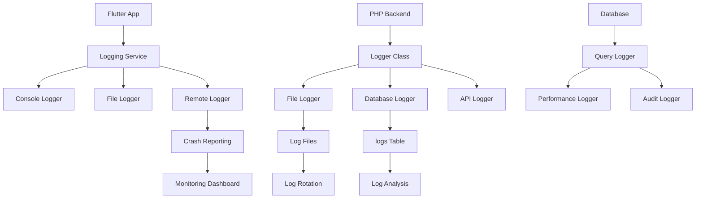

# سیستم لاگینگ - Logging System

## 📊 Document Information
- **Created:** 2025-09-01
- **Last Updated:** 2025-09-01
- **Version:** 1.0
- **Maintainer:** DataSave Development Team
- **Related Files:** `backend/classes/Logger.php`, `lib/core/services/logging_service.dart`

## 🎯 Overview
سیستم جامع لاگینگ برای پروژه DataSave شامل logging در Flutter frontend، PHP backend، database operations، و monitoring در production با پشتیبانی از متن فارسی.

## 📋 Table of Contents
- [معماری سیستم لاگینگ](#معماری-سیستم-لاگینگ)
- [PHP Backend Logging](#php-backend-logging)
- [Flutter Frontend Logging](#flutter-frontend-logging)
- [Database Logging](#database-logging)
- [Log Levels و Categories](#log-levels-و-categories)
- [Persian Text Logging](#persian-text-logging)
- [Log Rotation و Management](#log-rotation-و-management)
- [Monitoring و Alerting](#monitoring-و-alerting)
- [Performance Logging](#performance-logging)

---

## 🏗️ معماری سیستم لاگینگ - Logging Architecture

### Overall Structure
```yaml
Logging Architecture:
  Frontend (Flutter):
    - Console logging (development)
    - File logging (production)
    - Remote logging (crash reports)
    - User action tracking
    
  Backend (PHP):
    - File-based logging
    - Database logging (critical events)
    - API request/response logging
    - Error logging
    
  Database:
    - Query logging
    - Performance monitoring
    - Audit trail
    - Persian text logging
    
  Infrastructure:
    - Web server logs (Apache)
    - System logs
    - Security logs
    - Monitoring dashboards
```

### Log Flow Diagram


---

## 🐘 PHP Backend Logging

### Logger Class Implementation
```php
<?php
declare(strict_types=1);

namespace DataSave\Core\Logger;

/**
 * فارسی: کلاس اصلی لاگینگ
 * English: Main logging class
 */
class Logger
{
    // Log levels
    public const EMERGENCY = 'emergency';
    public const ALERT = 'alert';
    public const CRITICAL = 'critical';
    public const ERROR = 'error';
    public const WARNING = 'warning';
    public const NOTICE = 'notice';
    public const INFO = 'info';
    public const DEBUG = 'debug';
    
    private const LOG_LEVELS = [
        self::EMERGENCY => 0,
        self::ALERT => 1,
        self::CRITICAL => 2,
        self::ERROR => 3,
        self::WARNING => 4,
        self::NOTICE => 5,
        self::INFO => 6,
        self::DEBUG => 7,
    ];
    
    private string $logPath;
    private int $minLogLevel;
    private bool $logToDatabase;
    private DatabaseConnection $db;
    private string $requestId;
    
    public function __construct(
        string $logPath = '../backend/api/logs/',
        int $minLogLevel = 6, // INFO level
        bool $logToDatabase = false,
        ?DatabaseConnection $db = null
    ) {
        $this->logPath = $logPath;
        $this->minLogLevel = $minLogLevel;
        $this->logToDatabase = $logToDatabase;
        $this->db = $db;
        $this->requestId = $this->generateRequestId();
        
        // Create logs directory if not exists
        if (!is_dir($this->logPath)) {
            mkdir($this->logPath, 0755, true);
        }
    }
    
    /**
     * فارسی: لاگ اضطراری - بالاترین سطح
     * English: Emergency log - highest level
     */
    public function emergency(string $message, array $context = []): void
    {
        $this->log(self::EMERGENCY, $message, $context);
    }
    
    /**
     * فارسی: لاگ هشدار
     * English: Alert log
     */
    public function alert(string $message, array $context = []): void
    {
        $this->log(self::ALERT, $message, $context);
    }
    
    /**
     * فارسی: لاگ بحرانی
     * English: Critical log
     */
    public function critical(string $message, array $context = []): void
    {
        $this->log(self::CRITICAL, $message, $context);
    }
    
    /**
     * فارسی: لاگ خطا
     * English: Error log
     */
    public function error(string $message, array $context = []): void
    {
        $this->log(self::ERROR, $message, $context);
    }
    
    /**
     * فارسی: لاگ هشدار
     * English: Warning log
     */
    public function warning(string $message, array $context = []): void
    {
        $this->log(self::WARNING, $message, $context);
    }
    
    /**
     * فارسی: لاگ اطلاع
     * English: Notice log
     */
    public function notice(string $message, array $context = []): void
    {
        $this->log(self::NOTICE, $message, $context);
    }
    
    /**
     * فارسی: لاگ اطلاعات
     * English: Info log
     */
    public function info(string $message, array $context = []): void
    {
        $this->log(self::INFO, $message, $context);
    }
    
    /**
     * فارسی: لاگ دیباگ
     * English: Debug log
     */
    public function debug(string $message, array $context = []): void
    {
        $this->log(self::DEBUG, $message, $context);
    }
    
    /**
     * فارسی: تابع اصلی لاگینگ
     * English: Main logging function
     */
    public function log(string $level, string $message, array $context = []): void
    {
        // Check if should log this level
        if (!$this->shouldLog($level)) {
            return;
        }
        
        $logEntry = $this->formatLogEntry($level, $message, $context);
        
        // Write to file
        $this->writeToFile($level, $logEntry);
        
        // Write to database if enabled
        if ($this->logToDatabase && $this->db !== null) {
            $this->writeToDatabase($level, $message, $context);
        }
    }
    
    /**
     * فارسی: بررسی اینکه آیا باید این سطح لاگ ثبت شود
     * English: Check if this log level should be logged
     */
    private function shouldLog(string $level): bool
    {
        return self::LOG_LEVELS[$level] <= $this->minLogLevel;
    }
    
    /**
     * فارسی: فرمت کردن ورودی لاگ
     * English: Format log entry
     */
    private function formatLogEntry(string $level, string $message, array $context): string
    {
        $timestamp = date('Y-m-d H:i:s');
        $contextJson = !empty($context) ? json_encode($context, JSON_UNESCAPED_UNICODE) : '';
        
        $logEntry = "[$timestamp] [$this->requestId] [" . strtoupper($level) . "] $message";
        
        if ($contextJson) {
            $logEntry .= " Context: $contextJson";
        }
        
        // Add stack trace for error and above
        if (self::LOG_LEVELS[$level] <= self::LOG_LEVELS[self::ERROR]) {
            $backtrace = debug_backtrace(DEBUG_BACKTRACE_IGNORE_ARGS, 5);
            $logEntry .= " Trace: " . json_encode($backtrace, JSON_UNESCAPED_UNICODE);
        }
        
        return $logEntry . "\n";
    }
    
    /**
     * فارسی: نوشتن در فایل
     * English: Write to file
     */
    private function writeToFile(string $level, string $logEntry): void
    {
        $filename = $this->getLogFilename($level);
        
        // Use file locking to prevent corruption
        file_put_contents($filename, $logEntry, FILE_APPEND | LOCK_EX);
    }
    
    /**
     * فارسی: نوشتن در دیتابیس
     * English: Write to database
     */
    private function writeToDatabase(string $level, string $message, array $context): void
    {
        try {
            $this->db->insert('logs', [
                'level' => $level,
                'message' => $message,
                'context' => json_encode($context, JSON_UNESCAPED_UNICODE),
                'request_id' => $this->requestId,
                'user_id' => $_SESSION['user_id'] ?? null,
                'ip_address' => $_SERVER['REMOTE_ADDR'] ?? null,
                'user_agent' => $_SERVER['HTTP_USER_AGENT'] ?? null,
                'created_at' => date('Y-m-d H:i:s')
            ]);
        } catch (\Exception $e) {
            // Don't throw exception in logger, just write to file
            $this->writeToFile('error', "Database logging failed: " . $e->getMessage() . "\n");
        }
    }
    
    /**
     * فارسی: دریافت نام فایل لاگ
     * English: Get log filename
     */
    private function getLogFilename(string $level): string
    {
        $date = date('Y-m-d');
        
        // Separate files for different log levels
        if (self::LOG_LEVELS[$level] <= self::LOG_LEVELS[self::ERROR]) {
            return $this->logPath . "error-{$date}.log";
        } elseif ($level === self::DEBUG) {
            return $this->logPath . "debug-{$date}.log";
        } else {
            return $this->logPath . "app-{$date}.log";
        }
    }
    
    /**
     * فارسی: تولید شناسه درخواست
     * English: Generate request ID
     */
    private function generateRequestId(): string
    {
        return uniqid('req_', true);
    }
    
    /**
     * فارسی: لاگ درخواست API
     * English: Log API request
     */
    public function logApiRequest(string $method, string $endpoint, ?array $data = null): void
    {
        $this->info("API Request: $method $endpoint", [
            'method' => $method,
            'endpoint' => $endpoint,
            'data' => $data,
            'timestamp' => microtime(true)
        ]);
    }
    
    /**
     * فارسی: لاگ پاسخ API
     * English: Log API response
     */
    public function logApiResponse(string $endpoint, bool $success, ?array $data = null, float $executionTime = 0): void
    {
        $level = $success ? 'info' : 'warning';
        
        $this->log($level, "API Response: $endpoint", [
            'endpoint' => $endpoint,
            'success' => $success,
            'execution_time' => $executionTime,
            'data_size' => is_array($data) ? count($data) : 0
        ]);
    }
    
    /**
     * فارسی: لاگ کوئری دیتابیس
     * English: Log database query
     */
    public function logDatabaseQuery(string $query, array $params = [], float $executionTime = 0): void
    {
        $this->debug("Database Query", [
            'query' => $query,
            'params' => $params,
            'execution_time' => $executionTime
        ]);
    }
    
    /**
     * فارسی: لاگ فعالیت کاربر
     * English: Log user activity
     */
    public function logUserActivity(string $action, int $userId, array $details = []): void
    {
        $this->info("User Activity: $action", [
            'user_id' => $userId,
            'action' => $action,
            'details' => $details,
            'ip' => $_SERVER['REMOTE_ADDR'] ?? 'unknown'
        ]);
    }
}
```

### Database Schema for Logs
```sql
-- جدول لاگ‌ها
CREATE TABLE logs (
    id BIGINT UNSIGNED AUTO_INCREMENT PRIMARY KEY,
    level VARCHAR(20) NOT NULL COMMENT 'سطح لاگ',
    message TEXT NOT NULL COMMENT 'پیام لاگ',
    context JSON NULL COMMENT 'متن زمینه لاگ',
    request_id VARCHAR(50) NULL COMMENT 'شناسه درخواست',
    user_id INT UNSIGNED NULL COMMENT 'شناسه کاربر',
    ip_address VARCHAR(45) NULL COMMENT 'آدرس IP',
    user_agent TEXT NULL COMMENT 'User Agent مرورگر',
    created_at TIMESTAMP DEFAULT CURRENT_TIMESTAMP COMMENT 'زمان ایجاد',
    
    INDEX idx_level (level),
    INDEX idx_created_at (created_at),
    INDEX idx_user_id (user_id),
    INDEX idx_request_id (request_id),
    
    FOREIGN KEY (user_id) REFERENCES users(id) ON DELETE SET NULL
) ENGINE=InnoDB CHARSET=utf8mb4 COLLATE=utf8mb4_persian_ci COMMENT='جدول لاگ‌های سیستم';

-- جدول لاگ فعالیت‌های کاربر
CREATE TABLE user_activity_logs (
    id BIGINT UNSIGNED AUTO_INCREMENT PRIMARY KEY,
    user_id INT UNSIGNED NOT NULL,
    action VARCHAR(100) NOT NULL COMMENT 'نوع فعالیت',
    resource_type VARCHAR(50) NULL COMMENT 'نوع منبع',
    resource_id INT UNSIGNED NULL COMMENT 'شناسه منبع',
    details JSON NULL COMMENT 'جزئیات فعالیت',
    ip_address VARCHAR(45) NULL,
    user_agent TEXT NULL,
    created_at TIMESTAMP DEFAULT CURRENT_TIMESTAMP,
    
    INDEX idx_user_id (user_id),
    INDEX idx_action (action),
    INDEX idx_created_at (created_at),
    INDEX idx_resource (resource_type, resource_id),
    
    FOREIGN KEY (user_id) REFERENCES users(id) ON DELETE CASCADE
) ENGINE=InnoDB CHARSET=utf8mb4 COLLATE=utf8mb4_persian_ci COMMENT='لاگ فعالیت‌های کاربران';

-- جدول لاگ عملکرد
CREATE TABLE performance_logs (
    id BIGINT UNSIGNED AUTO_INCREMENT PRIMARY KEY,
    endpoint VARCHAR(255) NOT NULL COMMENT 'نقطه پایانی API',
    method VARCHAR(10) NOT NULL COMMENT 'متد HTTP',
    execution_time DECIMAL(10,3) NOT NULL COMMENT 'زمان اجرا (میلی‌ثانیه)',
    memory_usage INT UNSIGNED NULL COMMENT 'استفاده حافظه (بایت)',
    query_count INT UNSIGNED DEFAULT 0 COMMENT 'تعداد کوئری',
    response_size INT UNSIGNED NULL COMMENT 'اندازه پاسخ (بایت)',
    status_code SMALLINT UNSIGNED NOT NULL,
    created_at TIMESTAMP DEFAULT CURRENT_TIMESTAMP,
    
    INDEX idx_endpoint (endpoint),
    INDEX idx_execution_time (execution_time),
    INDEX idx_created_at (created_at)
) ENGINE=InnoDB CHARSET=utf8mb4 COLLATE=utf8mb4_persian_ci COMMENT='لاگ عملکرد API';
```

---

## 📱 Flutter Frontend Logging

### Logging Service Implementation
```dart
// lib/core/services/logging_service.dart

import 'dart:developer' as developer;
import 'dart:io';
import 'package:flutter/foundation.dart';
import 'package:logger/logger.dart';
import 'package:path_provider/path_provider.dart';

/// فارسی: سرویس لاگینگ Flutter
/// English: Flutter logging service
@singleton
class LoggingService {
  late Logger _logger;
  late File? _logFile;
  
  static const int maxFileSize = 10 * 1024 * 1024; // 10MB
  static const int maxLogFiles = 5;
  
  /// فارسی: مقداردهی اولیه سرویس لاگینگ
  /// English: Initialize logging service
  Future<void> initialize() async {
    // Setup file logging in production
    if (kReleaseMode) {
      await _setupFileLogging();
    }
    
    _logger = Logger(
      filter: kReleaseMode ? ProductionFilter() : DevelopmentFilter(),
      printer: DataSavePrinter(),
      output: kReleaseMode 
          ? MultiOutput([ConsoleOutput(), FileOutput(_logFile)])
          : ConsoleOutput(),
    );
    
    info('سرویس لاگینگ راه‌اندازی شد - Logging service initialized');
  }
  
  /// فارسی: راه‌اندازی لاگینگ فایل
  /// English: Setup file logging
  Future<void> _setupFileLogging() async {
    try {
      final directory = await getApplicationDocumentsDirectory();
      final logDirectory = Directory('${directory.path}/logs');
      
      if (!await logDirectory.exists()) {
        await logDirectory.create(recursive: true);
      }
      
      _logFile = File('${logDirectory.path}/app_${DateTime.now().millisecondsSinceEpoch}.log');
      
      // Clean old log files
      await _cleanOldLogFiles(logDirectory);
    } catch (e) {
      // Fallback to console only
      debugPrint('خطا در راه‌اندازی لاگینگ فایل: $e');
    }
  }
  
  /// فارسی: پاک کردن فایل‌های لاگ قدیمی
  /// English: Clean old log files
  Future<void> _cleanOldLogFiles(Directory logDirectory) async {
    try {
      final files = await logDirectory
          .list()
          .where((entity) => entity is File && entity.path.endsWith('.log'))
          .cast<File>()
          .toList();
      
      if (files.length > maxLogFiles) {
        files.sort((a, b) => b.statSync().modified.compareTo(a.statSync().modified));
        
        for (int i = maxLogFiles; i < files.length; i++) {
          await files[i].delete();
        }
      }
    } catch (e) {
      debugPrint('خطا در پاک کردن فایل‌های لاگ قدیمی: $e');
    }
  }
  
  /// فارسی: لاگ اطلاعات
  /// English: Info log
  void info(String message, {Map<String, dynamic>? data}) {
    _logger.i(message, data);
  }
  
  /// فارسی: لاگ هشدار
  /// English: Warning log
  void warning(String message, {Map<String, dynamic>? data}) {
    _logger.w(message, data);
  }
  
  /// فارسی: لاگ خطا
  /// English: Error log
  void error(String message, {dynamic error, StackTrace? stackTrace, Map<String, dynamic>? data}) {
    _logger.e(message, [error, stackTrace], data);
  }
  
  /// فارسی: لاگ دیباگ
  /// English: Debug log
  void debug(String message, {Map<String, dynamic>? data}) {
    _logger.d(message, data);
  }
  
  /// فارسی: لاگ فعالیت کاربر
  /// English: Log user activity
  void logUserActivity(String action, {Map<String, dynamic>? details}) {
    info('فعالیت کاربر - User Activity: $action', data: {
      'action': action,
      'timestamp': DateTime.now().toIso8601String(),
      'details': details,
    });
  }
  
  /// فارسی: لاگ درخواست API
  /// English: Log API request
  void logApiRequest(String method, String url, {Map<String, dynamic>? data}) {
    debug('درخواست API - API Request: $method $url', data: {
      'method': method,
      'url': url,
      'data': data,
      'timestamp': DateTime.now().toIso8601String(),
    });
  }
  
  /// فارسی: لاگ پاسخ API
  /// English: Log API response
  void logApiResponse(String url, bool success, {int? statusCode, Duration? duration}) {
    final level = success ? 'info' : 'warning';
    final message = 'پاسخ API - API Response: $url';
    
    final logData = {
      'url': url,
      'success': success,
      'status_code': statusCode,
      'duration_ms': duration?.inMilliseconds,
      'timestamp': DateTime.now().toIso8601String(),
    };
    
    if (level == 'info') {
      info(message, data: logData);
    } else {
      warning(message, data: logData);
    }
  }
  
  /// فارسی: لاگ خطای شبکه
  /// English: Log network error
  void logNetworkError(String url, String error, {StackTrace? stackTrace}) {
    this.error('خطای شبکه - Network Error: $url', 
      error: error,
      stackTrace: stackTrace,
      data: {
        'url': url,
        'error_type': 'network',
        'timestamp': DateTime.now().toIso8601String(),
      }
    );
  }
  
  /// فارسی: لاگ خطای کاربر
  /// English: Log user error
  void logUserError(String action, String error) {
    warning('خطای کاربر - User Error: $action', data: {
      'action': action,
      'error': error,
      'timestamp': DateTime.now().toIso8601String(),
    });
  }
  
  /// فارسی: لاگ عملکرد
  /// English: Log performance
  void logPerformance(String operation, Duration duration, {Map<String, dynamic>? metrics}) {
    debug('عملکرد - Performance: $operation', data: {
      'operation': operation,
      'duration_ms': duration.inMilliseconds,
      'metrics': metrics,
      'timestamp': DateTime.now().toIso8601String(),
    });
  }
}

/// فارسی: کلاس چاپ سفارشی لاگ
/// English: Custom log printer
class DataSavePrinter extends LogPrinter {
  @override
  List<String> log(LogEvent event) {
    final color = PrettyPrinter.levelColors[event.level];
    final emoji = PrettyPrinter.levelEmojis[event.level];
    final timestamp = DateTime.now().toString().substring(0, 19);
    
    return [color!('$emoji [$timestamp] ${event.message}')];
  }
}

/// فارسی: خروجی فایل سفارشی
/// English: Custom file output
class FileOutput extends LogOutput {
  final File? file;
  
  FileOutput(this.file);
  
  @override
  void output(OutputEvent event) {
    if (file != null) {
      final logString = event.lines.join('\n');
      file!.writeAsStringSync('$logString\n', mode: FileMode.append);
      
      // Check file size and rotate if needed
      if (file!.lengthSync() > LoggingService.maxFileSize) {
        _rotateLogFile();
      }
    }
  }
  
  void _rotateLogFile() {
    // Implementation for log rotation
    // Create new file with timestamp
  }
}
```

### Performance Logging
```dart
// lib/core/services/performance_logger.dart

/// فارسی: لاگ عملکرد
/// English: Performance logger
@singleton
class PerformanceLogger {
  final LoggingService _loggingService;
  final Map<String, Stopwatch> _stopwatches = {};
  
  PerformanceLogger(this._loggingService);
  
  /// فارسی: شروع اندازه‌گیری زمان
  /// English: Start timing
  void startTiming(String operation) {
    final stopwatch = Stopwatch()..start();
    _stopwatches[operation] = stopwatch;
  }
  
  /// فارسی: پایان اندازه‌گیری زمان
  /// English: End timing
  void endTiming(String operation, {Map<String, dynamic>? additionalData}) {
    final stopwatch = _stopwatches[operation];
    if (stopwatch != null) {
      stopwatch.stop();
      
      _loggingService.logPerformance(
        operation,
        stopwatch.elapsed,
        metrics: {
          'elapsed_ms': stopwatch.elapsedMilliseconds,
          ...?additionalData,
        },
      );
      
      _stopwatches.remove(operation);
    }
  }
  
  /// فارسی: اندازه‌گیری زمان تابع
  /// English: Time function execution
  Future<T> timeAsync<T>(
    String operation,
    Future<T> Function() function, {
    Map<String, dynamic>? additionalData,
  }) async {
    startTiming(operation);
    try {
      final result = await function();
      endTiming(operation, additionalData: additionalData);
      return result;
    } catch (e) {
      endTiming(operation, additionalData: {
        'error': e.toString(),
        ...?additionalData,
      });
      rethrow;
    }
  }
  
  /// فارسی: اندازه‌گیری زمان تابع همزمان
  /// English: Time synchronous function
  T timeSync<T>(
    String operation,
    T Function() function, {
    Map<String, dynamic>? additionalData,
  }) {
    startTiming(operation);
    try {
      final result = function();
      endTiming(operation, additionalData: additionalData);
      return result;
    } catch (e) {
      endTiming(operation, additionalData: {
        'error': e.toString(),
        ...?additionalData,
      });
      rethrow;
    }
  }
}
```

---

## 🗄️ Database Logging

### Query Logger Implementation
```php
<?php
declare(strict_types=1);

namespace DataSave\Core\Database;

/**
 * فارسی: لاگ کوئری‌های دیتابیس
 * English: Database query logger
 */
class QueryLogger
{
    private Logger $logger;
    private array $queries = [];
    private bool $logSlowQueries;
    private float $slowQueryThreshold;
    
    public function __construct(
        Logger $logger,
        bool $logSlowQueries = true,
        float $slowQueryThreshold = 0.1 // 100ms
    ) {
        $this->logger = $logger;
        $this->logSlowQueries = $logSlowQueries;
        $this->slowQueryThreshold = $slowQueryThreshold;
    }
    
    /**
     * فارسی: لاگ کوئری قبل از اجرا
     * English: Log query before execution
     */
    public function logQueryStart(string $queryId, string $query, array $params = []): void
    {
        $this->queries[$queryId] = [
            'query' => $query,
            'params' => $params,
            'start_time' => microtime(true),
            'start_memory' => memory_get_usage(true)
        ];
        
        $this->logger->debug("شروع کوئری - Query Start: $queryId", [
            'query' => $query,
            'params' => $params
        ]);
    }
    
    /**
     * فارسی: لاگ کوئری بعد از اجرا
     * English: Log query after execution
     */
    public function logQueryEnd(string $queryId, bool $success = true, ?string $error = null): void
    {
        if (!isset($this->queries[$queryId])) {
            return;
        }
        
        $queryInfo = $this->queries[$queryId];
        $executionTime = microtime(true) - $queryInfo['start_time'];
        $memoryUsed = memory_get_usage(true) - $queryInfo['start_memory'];
        
        $logData = [
            'query' => $queryInfo['query'],
            'params' => $queryInfo['params'],
            'execution_time' => $executionTime,
            'memory_used' => $memoryUsed,
            'success' => $success
        ];
        
        if ($error) {
            $logData['error'] = $error;
            $this->logger->error("خطای کوئری - Query Error: $queryId", $logData);
        } elseif ($this->logSlowQueries && $executionTime > $this->slowQueryThreshold) {
            $this->logger->warning("کوئری کند - Slow Query: $queryId", $logData);
        } else {
            $this->logger->debug("پایان کوئری - Query End: $queryId", $logData);
        }
        
        unset($this->queries[$queryId]);
    }
    
    /**
     * فارسی: دریافت آمار کوئری‌ها
     * English: Get query statistics
     */
    public function getQueryStats(): array
    {
        $totalQueries = count($this->queries);
        $totalTime = 0;
        $slowQueries = 0;
        
        foreach ($this->queries as $query) {
            $executionTime = microtime(true) - $query['start_time'];
            $totalTime += $executionTime;
            
            if ($executionTime > $this->slowQueryThreshold) {
                $slowQueries++;
            }
        }
        
        return [
            'total_queries' => $totalQueries,
            'total_time' => $totalTime,
            'slow_queries' => $slowQueries,
            'average_time' => $totalQueries > 0 ? $totalTime / $totalQueries : 0
        ];
    }
}
```

### Enhanced Database Connection with Logging
```php
<?php
declare(strict_types=1);

namespace DataSave\Core\Database;

/**
 * فارسی: اتصال دیتابیس با قابلیت لاگینگ
 * English: Database connection with logging capability
 */
class DatabaseConnection
{
    private PDO $pdo;
    private QueryLogger $queryLogger;
    private Logger $logger;
    
    public function __construct(array $config, Logger $logger)
    {
        $this->logger = $logger;
        $this->queryLogger = new QueryLogger($logger);
        $this->connect($config);
    }
    
    private function connect(array $config): void
    {
        try {
            $dsn = "mysql:host={$config['host']};port={$config['port']};dbname={$config['database']};charset=utf8mb4";
            
            $this->pdo = new PDO($dsn, $config['username'], $config['password'], [
                PDO::ATTR_ERRMODE => PDO::ERRMODE_EXCEPTION,
                PDO::ATTR_DEFAULT_FETCH_MODE => PDO::FETCH_ASSOC,
                PDO::ATTR_EMULATE_PREPARES => false,
                PDO::MYSQL_ATTR_INIT_COMMAND => "SET NAMES utf8mb4 COLLATE utf8mb4_persian_ci"
            ]);
            
            $this->logger->info("اتصال دیتابیس برقرار شد - Database connected successfully");
        } catch (PDOException $e) {
            $this->logger->critical("خطا در اتصال دیتابیس - Database connection failed: " . $e->getMessage());
            throw $e;
        }
    }
    
    /**
     * فارسی: اجرای کوئری با لاگینگ
     * English: Execute query with logging
     */
    public function query(string $sql, array $params = []): PDOStatement
    {
        $queryId = uniqid('query_');
        $this->queryLogger->logQueryStart($queryId, $sql, $params);
        
        try {
            $stmt = $this->pdo->prepare($sql);
            $success = $stmt->execute($params);
            
            $this->queryLogger->logQueryEnd($queryId, $success);
            
            return $stmt;
        } catch (PDOException $e) {
            $this->queryLogger->logQueryEnd($queryId, false, $e->getMessage());
            throw $e;
        }
    }
    
    /**
     * فارسی: درج داده با لاگینگ
     * English: Insert data with logging
     */
    public function insert(string $table, array $data): int
    {
        $columns = implode(', ', array_keys($data));
        $placeholders = ':' . implode(', :', array_keys($data));
        $sql = "INSERT INTO $table ($columns) VALUES ($placeholders)";
        
        $this->query($sql, $data);
        $insertId = (int)$this->pdo->lastInsertId();
        
        $this->logger->info("درج داده جدید - Data inserted into $table", [
            'table' => $table,
            'insert_id' => $insertId,
            'data' => $data
        ]);
        
        return $insertId;
    }
    
    /**
     * فارسی: بروزرسانی داده با لاگینگ
     * English: Update data with logging
     */
    public function update(string $table, array $data, string $where, array $whereParams = []): int
    {
        $setClause = [];
        foreach (array_keys($data) as $key) {
            $setClause[] = "$key = :$key";
        }
        $setClause = implode(', ', $setClause);
        
        $sql = "UPDATE $table SET $setClause WHERE $where";
        $params = array_merge($data, $whereParams);
        
        $stmt = $this->query($sql, $params);
        $affectedRows = $stmt->rowCount();
        
        $this->logger->info("بروزرسانی داده - Data updated in $table", [
            'table' => $table,
            'affected_rows' => $affectedRows,
            'data' => $data,
            'where' => $where
        ]);
        
        return $affectedRows;
    }
    
    /**
     * فارسی: حذف داده با لاگینگ
     * English: Delete data with logging
     */
    public function delete(string $table, string $where, array $params = []): int
    {
        $sql = "DELETE FROM $table WHERE $where";
        $stmt = $this->query($sql, $params);
        $affectedRows = $stmt->rowCount();
        
        $this->logger->warning("حذف داده - Data deleted from $table", [
            'table' => $table,
            'affected_rows' => $affectedRows,
            'where' => $where,
            'params' => $params
        ]);
        
        return $affectedRows;
    }
}
```

---

## 📊 Log Levels و Categories

### Log Level Configuration
```yaml
# تنظیمات سطح لاگ
Log Levels:
  Production:
    PHP: INFO (6)
    Flutter: WARNING (4)
    Database: ERROR (3)
    
  Development:
    PHP: DEBUG (7)
    Flutter: DEBUG (7)
    Database: DEBUG (7)
    
  Testing:
    PHP: WARNING (4)
    Flutter: INFO (6)
    Database: WARNING (4)

# دسته‌بندی لاگ‌ها
Log Categories:
  System:
    - Application startup/shutdown
    - Configuration changes
    - Service initialization
    
  Security:
    - Authentication attempts
    - Authorization failures
    - Suspicious activities
    
  API:
    - Request/response logging
    - Rate limiting
    - Validation errors
    
  Database:
    - Query performance
    - Connection issues
    - Data integrity
    
  User Activity:
    - User actions
    - Form submissions
    - Navigation patterns
    
  Performance:
    - Response times
    - Memory usage
    - Resource utilization
```

---

## 🌍 Persian Text Logging

### Persian Log Formatter
```php
<?php
declare(strict_types=1);

namespace DataSave\Core\Logger;

/**
 * فارسی: فرمت‌کننده لاگ فارسی
 * English: Persian log formatter
 */
class PersianLogFormatter
{
    /**
     * فارسی: فرمت کردن پیام لاگ با پشتیبانی فارسی
     * English: Format log message with Persian support
     */
    public static function format(string $level, string $message, array $context = []): string
    {
        $timestamp = jdate('Y-m-d H:i:s'); // Persian date
        $persianLevel = self::getPersianLevel($level);
        
        $formatted = "[$timestamp] [$persianLevel] $message";
        
        if (!empty($context)) {
            $contextStr = self::formatContext($context);
            $formatted .= " | زمینه: $contextStr";
        }
        
        return $formatted;
    }
    
    /**
     * فارسی: ترجمه سطح لاگ به فارسی
     * English: Translate log level to Persian
     */
    private static function getPersianLevel(string $level): string
    {
        $levels = [
            'emergency' => 'اضطراری',
            'alert' => 'هشدار',
            'critical' => 'بحرانی',
            'error' => 'خطا',
            'warning' => 'اخطار',
            'notice' => 'اطلاع',
            'info' => 'اطلاعات',
            'debug' => 'دیباگ'
        ];
        
        return $levels[$level] ?? $level;
    }
    
    /**
     * فارسی: فرمت کردن زمینه لاگ
     * English: Format log context
     */
    private static function formatContext(array $context): string
    {
        $formatted = [];
        
        foreach ($context as $key => $value) {
            if (is_array($value) || is_object($value)) {
                $value = json_encode($value, JSON_UNESCAPED_UNICODE);
            }
            
            $formatted[] = "$key=$value";
        }
        
        return implode(', ', $formatted);
    }
    
    /**
     * فارسی: تبدیل تاریخ میلادی به شمسی
     * English: Convert Gregorian to Persian date
     */
    private static function jdate(string $format): string
    {
        // Persian date conversion implementation
        // This is a simplified version - use a proper Persian date library
        return date($format); // Fallback to Gregorian
    }
}
```

---

## 🔄 Log Rotation و Management

### Log Rotation Script
```bash
#!/bin/bash
# فایل: scripts/log_rotation.sh
# فارسی: اسکریپت چرخش لاگ‌ها
# English: Log rotation script

LOG_DIR="/Applications/XAMPP/xamppfiles/htdocs/datasave/backend/api/logs"
MAX_SIZE="100M"
MAX_AGE="30" # days
COMPRESS_AGE="7" # days

echo "🔄 شروع چرخش لاگ‌ها - Starting log rotation..."

# Rotate PHP logs
for log_file in "$LOG_DIR"/*.log; do
    if [ -f "$log_file" ]; then
        # Check file size
        size=$(du -m "$log_file" | cut -f1)
        
        if [ $size -gt 100 ]; then
            echo "📁 چرخش فایل $log_file (اندازه: ${size}M)"
            
            # Rotate the file
            timestamp=$(date +%Y%m%d_%H%M%S)
            mv "$log_file" "${log_file}.${timestamp}"
            
            # Compress old file after 7 days
            find "$LOG_DIR" -name "*.log.*" -mtime +$COMPRESS_AGE -exec gzip {} \;
        fi
    fi
done

# Clean old compressed logs
find "$LOG_DIR" -name "*.log.*.gz" -mtime +$MAX_AGE -delete

# Clean Flutter logs
FLUTTER_LOG_DIR="~/Documents/datasave_logs"
if [ -d "$FLUTTER_LOG_DIR" ]; then
    find "$FLUTTER_LOG_DIR" -name "*.log" -mtime +$MAX_AGE -delete
fi

echo "✅ چرخش لاگ‌ها تکمیل شد - Log rotation completed"
```

### Automated Cleanup Service
```php
<?php
declare(strict_types=1);

namespace DataSave\Core\Services;

/**
 * فارسی: سرویس پاک‌سازی خودکار لاگ‌ها
 * English: Automatic log cleanup service
 */
class LogCleanupService
{
    private Logger $logger;
    private string $logDirectory;
    private int $maxLogAge; // days
    private int $maxLogSize; // bytes
    
    public function __construct(
        Logger $logger,
        string $logDirectory,
        int $maxLogAge = 30,
        int $maxLogSize = 104857600 // 100MB
    ) {
        $this->logger = $logger;
        $this->logDirectory = $logDirectory;
        $this->maxLogAge = $maxLogAge;
        $this->maxLogSize = $maxLogSize;
    }
    
    /**
     * فارسی: پاک‌سازی لاگ‌های قدیمی
     * English: Cleanup old logs
     */
    public function cleanup(): void
    {
        $this->logger->info("شروع پاک‌سازی لاگ‌ها - Starting log cleanup");
        
        $cleanedFiles = 0;
        $freedSpace = 0;
        
        $iterator = new \RecursiveIteratorIterator(
            new \RecursiveDirectoryIterator($this->logDirectory)
        );
        
        foreach ($iterator as $file) {
            if ($file->isFile() && $this->shouldCleanup($file)) {
                $size = $file->getSize();
                
                if (unlink($file->getPathname())) {
                    $cleanedFiles++;
                    $freedSpace += $size;
                }
            }
        }
        
        $this->logger->info("پاک‌سازی لاگ‌ها تکمیل شد - Log cleanup completed", [
            'cleaned_files' => $cleanedFiles,
            'freed_space_mb' => round($freedSpace / 1024 / 1024, 2)
        ]);
    }
    
    /**
     * فارسی: بررسی نیاز به پاک‌سازی فایل
     * English: Check if file should be cleaned up
     */
    private function shouldCleanup(\SplFileInfo $file): bool
    {
        // Check age
        $age = time() - $file->getMTime();
        $maxAgeSeconds = $this->maxLogAge * 24 * 3600;
        
        if ($age > $maxAgeSeconds) {
            return true;
        }
        
        // Check size
        if ($file->getSize() > $this->maxLogSize) {
            return true;
        }
        
        return false;
    }
    
    /**
     * فارسی: فشرده‌سازی لاگ‌های قدیمی
     * English: Compress old logs
     */
    public function compressOldLogs(): void
    {
        $compressAge = 7; // days
        $iterator = new \RecursiveIteratorIterator(
            new \RecursiveDirectoryIterator($this->logDirectory)
        );
        
        foreach ($iterator as $file) {
            if ($file->isFile() && $file->getExtension() === 'log') {
                $age = time() - $file->getMTime();
                $compressAgeSeconds = $compressAge * 24 * 3600;
                
                if ($age > $compressAgeSeconds) {
                    $this->compressFile($file->getPathname());
                }
            }
        }
    }
    
    /**
     * فارسی: فشرده‌سازی فایل
     * English: Compress file
     */
    private function compressFile(string $filepath): void
    {
        $compressedFile = $filepath . '.gz';
        
        if (file_exists($compressedFile)) {
            return; // Already compressed
        }
        
        $data = file_get_contents($filepath);
        $compressed = gzencode($data, 9);
        
        if (file_put_contents($compressedFile, $compressed)) {
            unlink($filepath);
            
            $this->logger->info("فایل لاگ فشرده شد - Log file compressed", [
                'original' => $filepath,
                'compressed' => $compressedFile
            ]);
        }
    }
}
```

---

## 📈 Monitoring و Alerting

### Log Monitoring Service
```php
<?php
declare(strict_types=1);

namespace DataSave\Core\Services;

/**
 * فارسی: سرویس نظارت بر لاگ‌ها
 * English: Log monitoring service
 */
class LogMonitoringService
{
    private Logger $logger;
    private array $alertRules;
    private NotificationService $notificationService;
    
    public function __construct(
        Logger $logger,
        NotificationService $notificationService
    ) {
        $this->logger = $logger;
        $this->notificationService = $notificationService;
        $this->setupAlertRules();
    }
    
    /**
     * فارسی: تنظیم قوانین هشدار
     * English: Setup alert rules
     */
    private function setupAlertRules(): void
    {
        $this->alertRules = [
            'high_error_rate' => [
                'condition' => 'error_rate > 5%',
                'threshold' => 0.05,
                'time_window' => 300, // 5 minutes
                'message' => 'نرخ خطا بالا است - High error rate detected'
            ],
            'slow_queries' => [
                'condition' => 'avg_query_time > 1s',
                'threshold' => 1.0,
                'time_window' => 600, // 10 minutes
                'message' => 'کوئری‌های کند شناسایی شد - Slow queries detected'
            ],
            'memory_usage' => [
                'condition' => 'memory_usage > 80%',
                'threshold' => 0.8,
                'message' => 'استفاده بالا از حافظه - High memory usage'
            ]
        ];
    }
    
    /**
     * فارسی: بررسی و ارسال هشدارها
     * English: Check and send alerts
     */
    public function checkAlerts(): void
    {
        foreach ($this->alertRules as $ruleName => $rule) {
            if ($this->evaluateRule($rule)) {
                $this->sendAlert($ruleName, $rule);
            }
        }
    }
    
    /**
     * فارسی: ارزیابی قانون هشدار
     * English: Evaluate alert rule
     */
    private function evaluateRule(array $rule): bool
    {
        // Implementation depends on specific metrics
        // This is a simplified example
        return false; // Placeholder
    }
    
    /**
     * فارسی: ارسال هشدار
     * English: Send alert
     */
    private function sendAlert(string $ruleName, array $rule): void
    {
        $this->logger->alert("هشدار سیستم - System Alert: $ruleName", [
            'rule' => $ruleName,
            'condition' => $rule['condition'],
            'message' => $rule['message']
        ]);
        
        // Send notification
        $this->notificationService->sendAlert(
            $rule['message'],
            ['rule' => $ruleName, 'timestamp' => date('Y-m-d H:i:s')]
        );
    }
}
```

### Real-time Log Dashboard
```dart
// lib/features/admin/screens/log_dashboard_screen.dart

/// فارسی: داشبورد نظارت بر لاگ‌ها
/// English: Log monitoring dashboard
class LogDashboardScreen extends StatefulWidget {
  @override
  _LogDashboardScreenState createState() => _LogDashboardScreenState();
}

class _LogDashboardScreenState extends State<LogDashboardScreen> {
  final LoggingService _loggingService = ServiceLocator.get<LoggingService>();
  Timer? _refreshTimer;
  
  @override
  void initState() {
    super.initState();
    _startAutoRefresh();
  }
  
  @override
  void dispose() {
    _refreshTimer?.cancel();
    super.dispose();
  }
  
  void _startAutoRefresh() {
    _refreshTimer = Timer.periodic(Duration(seconds: 30), (timer) {
      _loadLogMetrics();
    });
  }
  
  void _loadLogMetrics() {
    _loggingService.info('بروزرسانی داشبورد لاگ - Log dashboard refreshed');
    // Load and display log metrics
  }
  
  @override
  Widget build(BuildContext context) {
    return Scaffold(
      appBar: AppBar(
        title: Text('داشبورد لاگ‌ها'),
        actions: [
          IconButton(
            icon: Icon(Icons.refresh),
            onPressed: _loadLogMetrics,
          ),
        ],
      ),
      body: Column(
        children: [
          _buildMetricsCards(),
          _buildLogLevelChart(),
          _buildRecentLogs(),
        ],
      ),
    );
  }
  
  Widget _buildMetricsCards() {
    return Row(
      children: [
        Expanded(
          child: Card(
            child: Padding(
              padding: EdgeInsets.all(16),
              child: Column(
                children: [
                  Icon(Icons.error, color: Colors.red),
                  Text('خطاها'),
                  Text('12', style: Theme.of(context).textTheme.headlineMedium),
                ],
              ),
            ),
          ),
        ),
        // More metric cards...
      ],
    );
  }
  
  Widget _buildLogLevelChart() {
    // Chart implementation
    return Container();
  }
  
  Widget _buildRecentLogs() {
    // Recent logs list
    return Expanded(
      child: ListView.builder(
        itemCount: 10,
        itemBuilder: (context, index) {
          return ListTile(
            leading: _getLogIcon('info'),
            title: Text('نمونه لاگ $index'),
            subtitle: Text('جزئیات لاگ'),
            trailing: Text('12:34'),
          );
        },
      ),
    );
  }
  
  Widget _getLogIcon(String level) {
    switch (level) {
      case 'error':
        return Icon(Icons.error, color: Colors.red);
      case 'warning':
        return Icon(Icons.warning, color: Colors.orange);
      case 'info':
        return Icon(Icons.info, color: Colors.blue);
      default:
        return Icon(Icons.bug_report, color: Colors.grey);
    }
  }
}
```

---

## 🔄 Related Documentation
- [Development Environment](../07-Development-Workflow/development-environment.md)
- [Error Handling](../02-Backend-APIs/error-handling.md)
- [Testing Strategy](../07-Development-Workflow/testing-strategy.md)
- [API Service Layer](api-service-layer.md)
- [Performance Monitoring](../99-Quick-Reference/troubleshooting-guide.md)

---
*Last updated: 2025-09-01*  
*File: docs/05-Services-Integration/logging-system.md* 