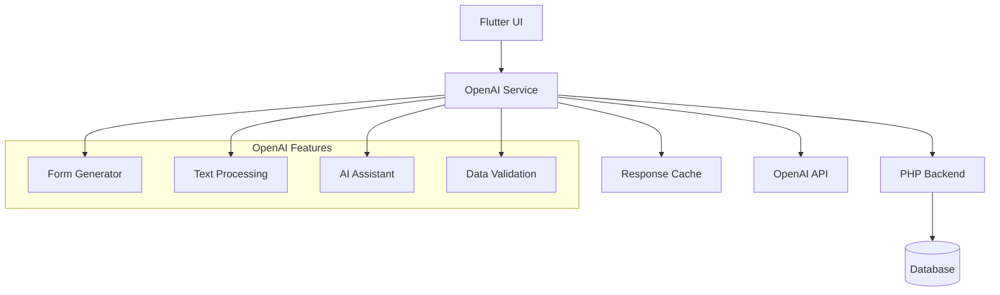

# ادغام OpenAI API - OpenAI API Integration

## 📊 Document Information
- **Created:** 2025-09-01
- **Last Updated:** 2025-09-01
- **Version:** 1.0
- **Maintainer:** DataSave Development Team
- **Related Files:** `/lib/core/services/openai_service.dart`, `/backend/api/openai/`

## 🎯 Overview
راه‌اندازی کامل و ادغام OpenAI API در DataSave برای قابلیت‌های هوش مصنوعی شامل تولید فرم، پردازش متن، و دستیار هوشمند.

## 📋 Table of Contents
- [پیکربندی OpenAI](#پیکربندی-openai)
- [Architecture Overview](#architecture-overview)
- [API Configuration](#api-configuration)
- [Service Implementation](#service-implementation)
- [Error Handling](#error-handling)
- [Usage Examples](#usage-examples)
- [Performance Optimization](#performance-optimization)
- [Security Guidelines](#security-guidelines)

## ⚙️ پیکربندی OpenAI - OpenAI Configuration

### API Settings in Database
```sql
-- Current OpenAI Settings in system_settings table
INSERT INTO system_settings VALUES
(1, 'openai_api_key', 'sk-proj-VCZeP...', 'encrypted', 'کلید API سرویس OpenAI', true, false),
(2, 'openai_model', 'gpt-4', 'string', 'مدل پیش‌فرض OpenAI', true, false),
(3, 'openai_max_tokens', '2048', 'number', 'حداکثر توکن برای پاسخ', true, false),
(4, 'openai_temperature', '0.7', 'number', 'میزان خلاقیت AI (0.0-2.0)', true, false);
```

### Environment Configuration
```yaml
# .env configuration
OPENAI_API_KEY=sk-proj-VCZeP...
OPENAI_MODEL=gpt-4
OPENAI_MAX_TOKENS=2048
OPENAI_TEMPERATURE=0.7
OPENAI_BASE_URL=https://api.openai.com/v1
```

---

## 🏗️ Architecture Overview

### Integration Architecture


### Data Flow
```yaml
Request Flow:
  1. UI Component (Flutter)
  2. OpenAI Service (Dart)
  3. HTTP Request (dio/http)
  4. OpenAI API (External)
  5. Response Processing
  6. Cache Storage (optional)
  7. UI Update

Error Flow:
  1. API Error Detection
  2. Error Classification
  3. Fallback Strategy
  4. User Notification
  5. Logging & Monitoring
```

---

## 🔧 API Configuration

### OpenAI API Client Setup
```dart
// lib/core/services/openai_service.dart
import 'package:dio/dio.dart';
import '../config/app_config.dart';
import '../logger/logger_service.dart';

class OpenAIService {
  static const String baseUrl = 'https://api.openai.com/v1';
  static const Duration timeout = Duration(seconds: 30);
  
  late final Dio _dio;
  late final String _apiKey;
  late final String _model;
  late final int _maxTokens;
  late final double _temperature;

  OpenAIService._();
  static final OpenAIService _instance = OpenAIService._();
  static OpenAIService get instance => _instance;

  /// راه‌اندازی سرویس OpenAI
  Future<void> initialize() async {
    try {
      // دریافت تنظیمات از دیتابیس
      await _loadSettings();
      
      // راه‌اندازی HTTP client
      _dio = Dio(BaseOptions(
        baseUrl: baseUrl,
        connectTimeout: timeout,
        receiveTimeout: timeout,
        headers: {
          'Authorization': 'Bearer $_apiKey',
          'Content-Type': 'application/json',
        },
      ));

      // اضافه کردن Interceptor برای لاگ
      _dio.interceptors.add(LogInterceptor(
        requestBody: true,
        responseBody: true,
        logPrint: (obj) => LoggerService.info('OpenAI', obj.toString()),
      ));

      LoggerService.info('OpenAI', 'سرویس OpenAI با موفقیت راه‌اندازی شد');
    } catch (e) {
      LoggerService.error('OpenAI', 'خطا در راه‌اندازی OpenAI', e);
      rethrow;
    }
  }

  /// دریافت تنظیمات OpenAI از دیتابیس
  Future<void> _loadSettings() async {
    final settings = await ApiService.getSettings();
    
    _apiKey = _getSettingValue(settings, 'openai_api_key');
    _model = _getSettingValue(settings, 'openai_model') ?? 'gpt-4';
    _maxTokens = int.parse(_getSettingValue(settings, 'openai_max_tokens') ?? '2048');
    _temperature = double.parse(_getSettingValue(settings, 'openai_temperature') ?? '0.7');
    
    if (_apiKey.isEmpty) {
      throw Exception('OpenAI API Key تنظیم نشده است');
    }
  }

  String? _getSettingValue(List<dynamic>? settings, String key) {
    if (settings == null) return null;
    
    for (var setting in settings) {
      if (setting['setting_key'] == key) {
        return setting['setting_value'];
      }
    }
    return null;
  }
}
```

---

## 🔨 Service Implementation

### Chat Completion API
```dart
/// ارسال درخواست Chat Completion به OpenAI
Future<String?> chatCompletion({
  required String message,
  List<Map<String, String>>? conversationHistory,
  String? systemPrompt,
}) async {
  try {
    LoggerService.info('OpenAI', 'ارسال درخواست Chat Completion');

    // ساخت پیام‌های conversation
    List<Map<String, String>> messages = [];
    
    // اضافه کردن System Prompt
    if (systemPrompt != null) {
      messages.add({
        'role': 'system',
        'content': systemPrompt,
      });
    }
    
    // اضافه کردن تاریخچه مکالمه
    if (conversationHistory != null) {
      messages.addAll(conversationHistory);
    }
    
    // اضافه کردن پیام جدید
    messages.add({
      'role': 'user',
      'content': message,
    });

    // ارسال درخواست
    final response = await _dio.post('/chat/completions', data: {
      'model': _model,
      'messages': messages,
      'max_tokens': _maxTokens,
      'temperature': _temperature,
      'top_p': 1.0,
      'frequency_penalty': 0.0,
      'presence_penalty': 0.0,
    });

    if (response.statusCode == 200) {
      final responseData = response.data;
      final content = responseData['choices'][0]['message']['content'];
      
      LoggerService.info('OpenAI', 'پاسخ OpenAI دریافت شد');
      return content as String;
    } else {
      throw Exception('OpenAI API Error: ${response.statusCode}');
    }
    
  } catch (e) {
    LoggerService.error('OpenAI', 'خطا در Chat Completion', e);
    return null;
  }
}
```

### Form Generation Service
```dart
/// تولید فرم بر اساس توصیف کاربر
Future<Map<String, dynamic>?> generateForm({
  required String description,
  String? formType,
  List<String>? requiredFields,
}) async {
  try {
    String systemPrompt = '''
شما یک متخصص طراحی فرم هستید. وظیفه شما تولید فرم‌های HTML/JSON بر اساس توصیف کاربر است.

قوانین:
1. فرم باید به زبان فارسی باشد
2. از راست به چپ (RTL) پشتیبانی کند  
3. شامل validation مناسب باشد
4. طراحی responsive داشته باشد
5. از Material Design 3 پیروی کند

خروجی باید JSON باشد با ساختار:
{
  "title": "عنوان فرم",
  "description": "توضیحات فرم", 
  "fields": [
    {
      "id": "field_id",
      "type": "text|email|number|select|radio|checkbox|textarea",
      "label": "برچسب فیلد",
      "placeholder": "متن راهنما",
      "required": true|false,
      "validation": {...},
      "options": [...] // برای select, radio, checkbox
    }
  ],
  "submitButton": "متن دکمه ارسال",
  "styling": {...}
}
''';

    String userMessage = '''
لطفا یک فرم با مشخصات زیر تولید کن:

توصیف: $description
${formType != null ? 'نوع فرم: $formType' : ''}
${requiredFields != null ? 'فیلدهای اجباری: ${requiredFields!.join(', ')}' : ''}

فرم باید کاملا فارسی و RTL باشد.
''';

    final response = await chatCompletion(
      message: userMessage,
      systemPrompt: systemPrompt,
    );

    if (response != null) {
      // تبدیل JSON response به Map
      try {
        final jsonResponse = jsonDecode(response);
        LoggerService.info('OpenAI', 'فرم با موفقیت تولید شد');
        return jsonResponse as Map<String, dynamic>;
      } catch (e) {
        LoggerService.error('OpenAI', 'خطا در پارس کردن JSON فرم', e);
        return null;
      }
    }
    
    return null;
  } catch (e) {
    LoggerService.error('OpenAI', 'خطا در تولید فرم', e);
    return null;
  }
}
```

### Text Processing Service
```dart
/// پردازش و بهبود متن فارسی
Future<String?> processText({
  required String text,
  required String operation, // 'improve', 'summarize', 'translate', 'grammar'
}) async {
  try {
    String systemPrompt = '';
    
    switch (operation) {
      case 'improve':
        systemPrompt = '''
شما یک ویراستار متخصص فارسی هستید. وظیفه شما بهبود متن‌های فارسی است.
متن را از نظر دستور زبان، املا، و روان‌نویسی بهبود دهید.
فقط متن بهبود یافته را برگردانید، بدون توضیحات اضافی.
''';
        break;
        
      case 'summarize':
        systemPrompt = '''
شما یک متخصص خلاصه‌نویسی فارسی هستید.
متن داده شده را به صورت مختصر و مفید خلاصه کنید.
خلاصه باید حاوی نکات کلیدی و مهم باشد.
''';
        break;
        
      case 'grammar':
        systemPrompt = '''
شما یک متخصص دستور زبان فارسی هستید.
خطاهای املایی و گرامری متن را تصحیح کنید.
فقط متن تصحیح شده را برگردانید.
''';
        break;
        
      default:
        systemPrompt = 'لطفا متن داده شده را پردازش کنید.';
    }

    final response = await chatCompletion(
      message: text,
      systemPrompt: systemPrompt,
    );

    if (response != null) {
      LoggerService.info('OpenAI', 'متن با موفقیت پردازش شد');
      return response;
    }
    
    return null;
  } catch (e) {
    LoggerService.error('OpenAI', 'خطا در پردازش متن', e);
    return null;
  }
}
```

---

## ⚠️ Error Handling

### Error Types & Responses
```dart
enum OpenAIError {
  invalidApiKey,
  rateLimitExceeded,
  tokenLimitExceeded,
  modelNotFound,
  networkError,
  serverError,
  unknownError,
}

class OpenAIException implements Exception {
  final OpenAIError errorType;
  final String message;
  final int? statusCode;
  
  const OpenAIException({
    required this.errorType,
    required this.message,
    this.statusCode,
  });

  @override
  String toString() => 'OpenAI Error: $message';
}

/// مدیریت خطاهای OpenAI API
OpenAIException _handleApiError(DioError error) {
  switch (error.response?.statusCode) {
    case 401:
      return OpenAIException(
        errorType: OpenAIError.invalidApiKey,
        message: 'کلید API نامعتبر است',
        statusCode: 401,
      );
      
    case 429:
      return OpenAIException(
        errorType: OpenAIError.rateLimitExceeded,
        message: 'محدودیت درخواست به اتمام رسید',
        statusCode: 429,
      );
      
    case 500:
    case 502:
    case 503:
      return OpenAIException(
        errorType: OpenAIError.serverError,
        message: 'خطا در سرور OpenAI',
        statusCode: error.response?.statusCode,
      );
      
    default:
      return OpenAIException(
        errorType: OpenAIError.unknownError,
        message: 'خطای نامشخص: ${error.message}',
        statusCode: error.response?.statusCode,
      );
  }
}
```

### Retry Logic
```dart
/// سیستم retry برای درخواست‌های ناموفق
Future<T?> _retryRequest<T>(
  Future<T> Function() request, {
  int maxRetries = 3,
  Duration delay = const Duration(seconds: 2),
}) async {
  for (int i = 0; i < maxRetries; i++) {
    try {
      return await request();
    } catch (e) {
      LoggerService.warning('OpenAI', 'تلاش ${i + 1} ناموفق بود: $e');
      
      if (i < maxRetries - 1) {
        await Future.delayed(delay * (i + 1)); // Exponential backoff
      } else {
        rethrow;
      }
    }
  }
  return null;
}
```

---

## 💻 Usage Examples

### Basic Chat Implementation
```dart
class ChatPage extends StatefulWidget {
  @override
  _ChatPageState createState() => _ChatPageState();
}

class _ChatPageState extends State<ChatPage> {
  final TextEditingController _messageController = TextEditingController();
  final List<Map<String, String>> _conversation = [];
  bool _isLoading = false;

  @override
  void initState() {
    super.initState();
    OpenAIService.instance.initialize();
  }

  Future<void> _sendMessage() async {
    if (_messageController.text.trim().isEmpty) return;

    final userMessage = _messageController.text.trim();
    _messageController.clear();

    setState(() {
      _conversation.add({
        'role': 'user',
        'content': userMessage,
      });
      _isLoading = true;
    });

    try {
      final response = await OpenAIService.instance.chatCompletion(
        message: userMessage,
        conversationHistory: _conversation,
      );

      if (response != null) {
        setState(() {
          _conversation.add({
            'role': 'assistant',
            'content': response,
          });
        });
      }
    } catch (e) {
      ScaffoldMessenger.of(context).showSnackBar(
        SnackBar(content: Text('خطا در ارتباط با AI: $e')),
      );
    } finally {
      setState(() => _isLoading = false);
    }
  }

  @override
  Widget build(BuildContext context) {
    return Scaffold(
      appBar: CustomAppBar(title: 'چت با AI'),
      body: Column(
        children: [
          Expanded(
            child: ListView.builder(
              itemCount: _conversation.length,
              itemBuilder: (context, index) {
                final message = _conversation[index];
                final isUser = message['role'] == 'user';
                
                return ChatBubble(
                  message: message['content']!,
                  isUser: isUser,
                );
              },
            ),
          ),
          if (_isLoading) LinearProgressIndicator(),
          ChatInput(
            controller: _messageController,
            onSend: _sendMessage,
          ),
        ],
      ),
    );
  }
}
```

### Form Generation Example
```dart
class FormGeneratorPage extends StatefulWidget {
  @override
  _FormGeneratorPageState createState() => _FormGeneratorPageState();
}

class _FormGeneratorPageState extends State<FormGeneratorPage> {
  final TextEditingController _descriptionController = TextEditingController();
  Map<String, dynamic>? _generatedForm;
  bool _isGenerating = false;

  Future<void> _generateForm() async {
    if (_descriptionController.text.trim().isEmpty) return;

    setState(() => _isGenerating = true);

    try {
      final form = await OpenAIService.instance.generateForm(
        description: _descriptionController.text.trim(),
        formType: 'contact', // or dynamic
      );

      if (form != null) {
        setState(() => _generatedForm = form);
      } else {
        throw Exception('فرم تولید نشد');
      }
    } catch (e) {
      ScaffoldMessenger.of(context).showSnackBar(
        SnackBar(content: Text('خطا در تولید فرم: $e')),
      );
    } finally {
      setState(() => _isGenerating = false);
    }
  }

  @override
  Widget build(BuildContext context) {
    return Scaffold(
      appBar: CustomAppBar(title: 'تولید فرم با AI'),
      body: Padding(
        padding: EdgeInsets.all(16),
        child: Column(
          children: [
            PersianTextField(
              label: 'توضیحات فرم',
              hint: 'فرم مورد نظر خود را شرح دهید...',
              controller: _descriptionController,
              maxLines: 3,
            ),
            SizedBox(height: 16),
            ElevatedButton(
              onPressed: _isGenerating ? null : _generateForm,
              child: _isGenerating 
                ? CircularProgressIndicator()
                : Text('تولید فرم'),
            ),
            SizedBox(height: 24),
            if (_generatedForm != null)
              Expanded(
                child: FormPreview(formData: _generatedForm!),
              ),
          ],
        ),
      ),
    );
  }
}
```

---

## 🚀 Performance Optimization

### Response Caching
```dart
class OpenAICache {
  static final Map<String, CacheEntry> _cache = {};
  static const Duration cacheTimeout = Duration(hours: 1);

  static String? getCachedResponse(String key) {
    final entry = _cache[key];
    if (entry != null && DateTime.now().difference(entry.timestamp) < cacheTimeout) {
      return entry.response;
    }
    return null;
  }

  static void cacheResponse(String key, String response) {
    _cache[key] = CacheEntry(response: response, timestamp: DateTime.now());
  }
}

class CacheEntry {
  final String response;
  final DateTime timestamp;

  CacheEntry({required this.response, required this.timestamp});
}
```

### Token Management
```dart
/// محاسبه تعداد توکن‌های تقریبی
int estimateTokens(String text) {
  // روش ساده: هر کلمه تقریبا 1.3 توکن
  final words = text.split(' ').length;
  return (words * 1.3).ceil();
}

/// مدیریت محدودیت توکن
String truncateForTokenLimit(String text, int maxTokens) {
  final estimatedTokens = estimateTokens(text);
  
  if (estimatedTokens <= maxTokens) {
    return text;
  }
  
  // کاهش متن تا رسیدن به حد مجاز
  final ratio = maxTokens / estimatedTokens;
  final targetLength = (text.length * ratio * 0.9).round(); // 90% for safety
  
  return text.substring(0, targetLength) + '...';
}
```

---

## 🔒 Security Guidelines

### API Key Protection
```dart
/// ذخیره امن API Key
class SecureStorage {
  static Future<void> storeApiKey(String apiKey) async {
    // رمزگذاری API Key قبل از ذخیره
    final encrypted = await _encrypt(apiKey);
    await _storeInDatabase('openai_api_key', encrypted);
  }

  static Future<String?> getApiKey() async {
    final encrypted = await _getFromDatabase('openai_api_key');
    if (encrypted != null) {
      return await _decrypt(encrypted);
    }
    return null;
  }

  static Future<String> _encrypt(String data) async {
    // پیاده‌سازی رمزگذاری
    // استفاده از کتابخانه encrypt یا AES
    return data; // Placeholder
  }

  static Future<String> _decrypt(String encryptedData) async {
    // پیاده‌سازی رمزگشایی  
    return encryptedData; // Placeholder
  }
}
```

### Request Validation
```dart
/// اعتبارسنجی درخواست‌ها
bool validateRequest({
  required String message,
  int? maxLength = 10000,
}) {
  // بررسی طول پیام
  if (message.length > maxLength!) {
    throw ValidationException('پیام خیلی طولانی است');
  }

  // بررسی محتوای مناسب
  if (message.trim().isEmpty) {
    throw ValidationException('پیام نمی‌تواند خالی باشد');
  }

  // بررسی کلمات غیرمجاز (در صورت نیاز)
  final blockedWords = ['spam', 'inappropriate']; // مثال
  for (final word in blockedWords) {
    if (message.toLowerCase().contains(word.toLowerCase())) {
      throw ValidationException('محتوای نامناسب شناسایی شد');
    }
  }

  return true;
}
```

### Rate Limiting
```dart
class RateLimiter {
  static final Map<String, List<DateTime>> _requests = {};
  static const int maxRequestsPerMinute = 60;
  static const Duration timeWindow = Duration(minutes: 1);

  static bool canMakeRequest(String userId) {
    final now = DateTime.now();
    final userRequests = _requests[userId] ?? [];

    // حذف درخواست‌های قدیمی
    userRequests.removeWhere((time) => 
      now.difference(time) > timeWindow);

    // بررسی محدودیت
    if (userRequests.length >= maxRequestsPerMinute) {
      return false;
    }

    // اضافه کردن درخواست جدید
    userRequests.add(now);
    _requests[userId] = userRequests;

    return true;
  }
}
```

---

## ⚠️ Important Notes

### Best Practices
- همیشه API Key را رمزگذاری کنید
- از Cache برای پاسخ‌های تکراری استفاده کنید  
- محدودیت‌های Rate Limit را رعایت کنید
- خطاها را به درستی مدیریت کنید
- لاگ کامل برای debugging نگهداری کنید

### Cost Management
- تعداد توکن‌ها را نظارت کنید
- از مدل‌های مناسب استفاده کنید (GPT-3.5 vs GPT-4)
- پاسخ‌های طولانی را محدود کنید
- از Stream API برای پاسخ‌های realtime استفاده کنید

### Monitoring & Analytics
- تعداد درخواست‌ها
- میانگین زمان پاسخ
- نرخ خطا
- هزینه API
- رضایت کاربران

---

## 🔄 Related Documentation
- [API Service Layer](api-service-layer.md)
- [Configuration Management](configuration-management.md)
- [External Services](external-services.md)
- [Logging System](logging-system.md)
- [Security Implementation](../02-Backend-APIs/security-implementation.md)

## 📚 References
- [OpenAI API Documentation](https://platform.openai.com/docs/)
- [OpenAI Dart Package](https://pub.dev/packages/openai)
- [Flutter HTTP Client (Dio)](https://pub.dev/packages/dio)
- [Encryption in Flutter](https://pub.dev/packages/encrypt)

---
*Last updated: 2025-09-01*  
*File: docs/05-Services-Integration/openai-integration.md*