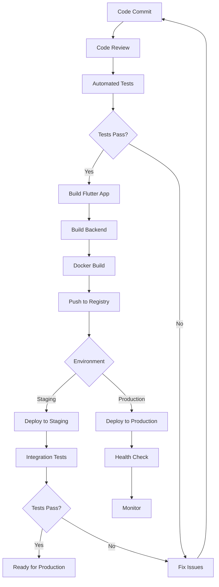

# Build و Deployment - ساخت و استقرار

## 📊 Document Information
- **Created:** 2025-09-01
- **Last Updated:** 2025-09-01
- **Version:** 1.0
- **Maintainer:** DataSave DevOps Team
- **Related Files:** `pubspec.yaml`, `docker-compose.yml`, deployment scripts

## 🎯 Overview
این مستند فرآیند کامل build و deployment پروژه DataSave را شرح می‌دهد. شامل build برای پلتفرم‌های مختلف، تنظیمات production، Docker containerization، و استراتژی‌های deployment با تمرکز بر بهترین شیوه‌های DevOps است.

## 📋 Table of Contents
- [معماری Build](#معماری-build)
- [Flutter Build Process](#flutter-build-process)
- [Backend Deployment](#backend-deployment)
- [Docker Configuration](#docker-configuration)
- [Environment Management](#environment-management)
- [CI/CD Pipeline](#cicd-pipeline)
- [Monitoring و Logging](#monitoring-و-logging)

## 🏗️ معماری Build

### استراتژی Build
```yaml
Build Strategy:
  Development:
    - Local development server
    - Hot reload برای توسعه سریع
    - Debug mode با logging کامل
    - Mock data و test environment
    
  Staging:
    - شبیه‌سازی environment تولید
    - تست integration
    - Performance testing
    - Security testing
    
  Production:
    - بهینه‌سازی کامل برای عملکرد
    - Code obfuscation
    - Asset optimization
    - CDN integration
    - Load balancing
```

### نقشه Build Pipeline


## 📱 Flutter Build Process

### Build Commands
```bash
# Build برای Development
flutter run --debug
flutter run --debug --device-id chrome # برای وب

# Build برای Release
flutter build apk --release
flutter build ipa --release  # iOS
flutter build web --release
flutter build windows --release
flutter build linux --release
flutter build macos --release
```

### تنظیمات Build
```yaml
# pubspec.yaml - Production Build Configuration

name: datasave
description: AI-Powered Persian Form Builder
version: 1.0.0+1

environment:
  sdk: '>=3.0.0 <4.0.0'
  flutter: '>=3.10.0'

dependencies:
  flutter:
    sdk: flutter
  
  # State Management
  flutter_bloc: ^8.1.3
  equatable: ^2.0.5
  
  # Networking
  dio: ^5.3.2
  retrofit: ^4.0.3
  json_annotation: ^4.8.1
  
  # Storage
  shared_preferences: ^2.2.2
  hive: ^2.2.3
  hive_flutter: ^1.1.0
  
  # Persian/RTL Support
  persian_tools: ^3.0.0
  intl: ^0.18.1
  
  # UI
  material_color_utilities: ^0.8.0
  flutter_staggered_grid_view: ^0.6.2

dev_dependencies:
  flutter_test:
    sdk: flutter
    
  # Build Tools
  build_runner: ^2.4.7
  json_serializable: ^6.7.1
  retrofit_generator: ^8.0.4
  hive_generator: ^2.0.1
  
  # Analysis
  flutter_lints: ^3.0.1
  very_good_analysis: ^5.1.0

flutter:
  uses-material-design: true
  generate: true
  
  assets:
    - assets/images/
    - assets/icons/
    - assets/fonts/
    - assets/config/
  
  fonts:
    - family: Vazirmatn
      fonts:
        - asset: assets/fonts/Vazirmatn-Regular.ttf
          weight: 400
        - asset: assets/fonts/Vazirmatn-Medium.ttf
          weight: 500
        - asset: assets/fonts/Vazirmatn-Bold.ttf
          weight: 700
```

### Build Scripts
```bash
#!/bin/bash
# build_scripts/build_all_platforms.sh

echo "🚀 شروع Build برای همه پلتفرم‌ها"

# پاک کردن فایل‌های قبلی
flutter clean
flutter pub get

echo "📱 Building Android APK..."
flutter build apk --release --target-platform android-arm64 --split-per-abi
if [ $? -eq 0 ]; then
    echo "✅ Android build موفقیت‌آمیز"
else
    echo "❌ خطا در Android build"
    exit 1
fi

echo "🌐 Building Web..."
flutter build web --release --web-renderer html
if [ $? -eq 0 ]; then
    echo "✅ Web build موفقیت‌آمیز"
else
    echo "❌ خطا در Web build"
    exit 1
fi

echo "🖥️ Building Desktop (Linux)..."
flutter build linux --release
if [ $? -eq 0 ]; then
    echo "✅ Linux build موفقیت‌آمیز"
else
    echo "❌ خطا در Linux build"
    exit 1
fi

echo "🎉 تمام build ها با موفقیت انجام شد!"

# ایجاد فایل‌های آماده برای deployment
mkdir -p dist/
cp -r build/app/outputs/flutter-apk/ dist/android/
cp -r build/web/ dist/web/
cp -r build/linux/x64/release/bundle/ dist/linux/

echo "📦 فایل‌های نهایی در پوشه dist/ قرار گرفتند"
```

### بهینه‌سازی Build
```dart
// lib/main_production.dart
import 'package:flutter/foundation.dart';
import 'package:flutter/material.dart';
import 'package:datasave/app.dart';
import 'package:datasave/core/config/app_config.dart';

void main() async {
  WidgetsFlutterBinding.ensureInitialized();
  
  // تنظیمات Production
  if (kReleaseMode) {
    // غیرفعال کردن debug prints
    debugPrint = (String? message, {int? wrapWidth}) {};
    
    // تنظیمات error reporting
    FlutterError.onError = (FlutterErrorDetails details) {
      // ارسال خطاها به service monitoring
      FirebaseCrashlytics.instance.recordFlutterError(details);
    };
  }
  
  // تنظیمات app
  await AppConfig.initialize(environment: Environment.production);
  
  runApp(const DataSaveApp());
}
```

## 🖥️ Backend Deployment

### PHP Backend Configuration
```php
<?php
// backend/config/production.php

return [
    'database' => [
        'host' => env('DB_HOST', 'localhost'),
        'database' => env('DB_DATABASE', 'datasave_prod'),
        'username' => env('DB_USERNAME'),
        'password' => env('DB_PASSWORD'),
        'charset' => 'utf8mb4',
        'collation' => 'utf8mb4_persian_ci',
        'options' => [
            PDO::ATTR_ERRMODE => PDO::ERRMODE_EXCEPTION,
            PDO::ATTR_DEFAULT_FETCH_MODE => PDO::FETCH_ASSOC,
            PDO::ATTR_EMULATE_PREPARES => false,
        ],
    ],
    
    'app' => [
        'debug' => false,
        'url' => env('APP_URL', 'https://api.datasave.app'),
        'timezone' => 'Asia/Tehran',
        'locale' => 'fa',
        'fallback_locale' => 'en',
    ],
    
    'security' => [
        'jwt_secret' => env('JWT_SECRET'),
        'jwt_ttl' => 3600 * 24, // 24 hours
        'bcrypt_rounds' => 12,
        'rate_limit' => [
            'api' => 1000, // per hour
            'auth' => 5, // per minute
        ],
    ],
    
    'logging' => [
        'level' => 'info',
        'path' => '/var/log/datasave/app.log',
        'max_files' => 30,
    ],
    
    'cache' => [
        'default' => 'redis',
        'redis' => [
            'host' => env('REDIS_HOST', '127.0.0.1'),
            'port' => env('REDIS_PORT', 6379),
            'password' => env('REDIS_PASSWORD'),
            'database' => 0,
        ],
    ],
    
    'openai' => [
        'api_key' => env('OPENAI_API_KEY'),
        'model' => 'gpt-4',
        'max_tokens' => 2000,
        'temperature' => 0.7,
    ],
];
```

### Apache/Nginx Configuration
```nginx
# /etc/nginx/sites-available/datasave-api
server {
    listen 80;
    listen 443 ssl http2;
    server_name api.datasave.app;
    
    # SSL Configuration
    ssl_certificate /etc/letsencrypt/live/api.datasave.app/fullchain.pem;
    ssl_certificate_key /etc/letsencrypt/live/api.datasave.app/privkey.pem;
    ssl_protocols TLSv1.2 TLSv1.3;
    ssl_ciphers ECDHE+AESGCM:ECDHE+CHACHA20:DHE+AESGCM:DHE+CHACHA20:!aNULL:!MD5:!DSS;
    ssl_prefer_server_ciphers off;
    
    # Security Headers
    add_header X-Frame-Options DENY;
    add_header X-Content-Type-Options nosniff;
    add_header X-XSS-Protection "1; mode=block";
    add_header Strict-Transport-Security "max-age=31536000; includeSubDomains";
    
    root /var/www/datasave/backend;
    index index.php;
    
    # Rate Limiting
    limit_req_zone $binary_remote_addr zone=api:10m rate=10r/s;
    limit_req zone=api burst=20 nodelay;
    
    # Gzip Compression
    gzip on;
    gzip_vary on;
    gzip_min_length 1024;
    gzip_types application/json application/javascript text/css text/xml;
    
    location / {
        try_files $uri $uri/ /index.php?$query_string;
    }
    
    location ~ \.php$ {
        fastcgi_pass unix:/var/run/php/php8.2-fpm.sock;
        fastcgi_index index.php;
        fastcgi_param SCRIPT_FILENAME $realpath_root$fastcgi_script_name;
        include fastcgi_params;
        
        # Security
        fastcgi_param PHP_VALUE "expose_php=0";
        fastcgi_hide_header X-Powered-By;
    }
    
    # Block access to sensitive files
    location ~ /\.(ht|git|env) {
        deny all;
    }
    
    location ~ /config/ {
        deny all;
    }
    
    # Caching static assets
    location ~* \.(jpg|jpeg|png|gif|ico|css|js|woff2?)$ {
        expires 1M;
        add_header Cache-Control "public, immutable";
    }
}

# Frontend (Flutter Web)
server {
    listen 80;
    listen 443 ssl http2;
    server_name datasave.app www.datasave.app;
    
    ssl_certificate /etc/letsencrypt/live/datasave.app/fullchain.pem;
    ssl_certificate_key /etc/letsencrypt/live/datasave.app/privkey.pem;
    
    root /var/www/datasave/web;
    index index.html;
    
    # SPA Configuration
    location / {
        try_files $uri $uri/ /index.html;
    }
    
    # Caching
    location ~* \.(js|css|png|jpg|jpeg|gif|ico|svg|woff2?)$ {
        expires 1y;
        add_header Cache-Control "public, immutable";
    }
    
    location /index.html {
        add_header Cache-Control "no-cache, no-store, must-revalidate";
    }
}
```

## 🐳 Docker Configuration

### Dockerfile برای Backend
```dockerfile
# docker/backend/Dockerfile
FROM php:8.2-fpm-alpine

# Install dependencies
RUN apk add --no-cache \
    nginx \
    supervisor \
    curl \
    zip \
    unzip \
    git \
    mysql-client

# Install PHP extensions
RUN docker-php-ext-install \
    pdo \
    pdo_mysql \
    mysqli \
    json \
    curl \
    openssl

# Install Redis extension
RUN apk add --no-cache pcre-dev $PHPIZE_DEPS \
    && pecl install redis \
    && docker-php-ext-enable redis

# Copy application
COPY backend/ /var/www/html/
COPY docker/backend/nginx.conf /etc/nginx/nginx.conf
COPY docker/backend/supervisord.conf /etc/supervisor/conf.d/supervisord.conf

# Set permissions
RUN chown -R www-data:www-data /var/www/html \
    && chmod -R 755 /var/www/html/storage \
    && chmod -R 755 /var/www/html/logs

# Health check
HEALTHCHECK --interval=30s --timeout=3s --start-period=5s --retries=3 \
    CMD curl -f http://localhost/health || exit 1

EXPOSE 80

CMD ["/usr/bin/supervisord", "-c", "/etc/supervisor/conf.d/supervisord.conf"]
```

### Dockerfile برای Flutter Web
```dockerfile
# docker/frontend/Dockerfile
FROM nginx:alpine

# Copy Flutter web build
COPY build/web/ /usr/share/nginx/html/

# Copy nginx configuration
COPY docker/frontend/nginx.conf /etc/nginx/nginx.conf

# Create nginx user and set permissions
RUN chown -R nginx:nginx /usr/share/nginx/html

EXPOSE 80

CMD ["nginx", "-g", "daemon off;"]
```

### Docker Compose
```yaml
# docker-compose.prod.yml
version: '3.8'

services:
  # Database
  mysql:
    image: mysql:8.0
    container_name: datasave_mysql
    environment:
      MYSQL_ROOT_PASSWORD: ${DB_ROOT_PASSWORD}
      MYSQL_DATABASE: ${DB_DATABASE}
      MYSQL_USER: ${DB_USERNAME}
      MYSQL_PASSWORD: ${DB_PASSWORD}
    volumes:
      - mysql_data:/var/lib/mysql
      - ./database_setup.sql:/docker-entrypoint-initdb.d/init.sql:ro
    ports:
      - "3306:3306"
    restart: unless-stopped
    command: --character-set-server=utf8mb4 --collation-server=utf8mb4_persian_ci

  # Redis Cache
  redis:
    image: redis:7-alpine
    container_name: datasave_redis
    ports:
      - "6379:6379"
    volumes:
      - redis_data:/data
    restart: unless-stopped
    command: redis-server --appendonly yes --requirepass ${REDIS_PASSWORD}

  # Backend API
  backend:
    build:
      context: .
      dockerfile: docker/backend/Dockerfile
    container_name: datasave_backend
    environment:
      DB_HOST: mysql
      DB_DATABASE: ${DB_DATABASE}
      DB_USERNAME: ${DB_USERNAME}
      DB_PASSWORD: ${DB_PASSWORD}
      REDIS_HOST: redis
      REDIS_PASSWORD: ${REDIS_PASSWORD}
      JWT_SECRET: ${JWT_SECRET}
      OPENAI_API_KEY: ${OPENAI_API_KEY}
    volumes:
      - ./backend/logs:/var/www/html/logs
      - ./backend/storage:/var/www/html/storage
    ports:
      - "8080:80"
    depends_on:
      - mysql
      - redis
    restart: unless-stopped

  # Frontend Web App
  frontend:
    build:
      context: .
      dockerfile: docker/frontend/Dockerfile
    container_name: datasave_frontend
    ports:
      - "80:80"
      - "443:443"
    volumes:
      - ./docker/frontend/ssl:/etc/nginx/ssl:ro
    restart: unless-stopped

  # Reverse Proxy
  nginx-proxy:
    image: nginxproxy/nginx-proxy
    container_name: datasave_proxy
    ports:
      - "80:80"
      - "443:443"
    volumes:
      - /var/run/docker.sock:/tmp/docker.sock:ro
      - ./docker/nginx/certs:/etc/nginx/certs:ro
      - ./docker/nginx/vhost.d:/etc/nginx/vhost.d
      - ./docker/nginx/html:/usr/share/nginx/html
    restart: unless-stopped

  # Let's Encrypt
  letsencrypt:
    image: nginxproxy/acme-companion
    container_name: datasave_letsencrypt
    volumes:
      - /var/run/docker.sock:/var/run/docker.sock:ro
      - ./docker/nginx/certs:/etc/nginx/certs:rw
      - ./docker/nginx/vhost.d:/etc/nginx/vhost.d
      - ./docker/nginx/html:/usr/share/nginx/html
    environment:
      NGINX_PROXY_CONTAINER: datasave_proxy
    restart: unless-stopped

volumes:
  mysql_data:
  redis_data:

networks:
  default:
    name: datasave_network
```

## 🌍 Environment Management

### Environment Variables
```bash
# .env.production
# Database
DB_HOST=datasave-mysql
DB_DATABASE=datasave_prod
DB_USERNAME=datasave_user
DB_PASSWORD=secure_password_here
DB_ROOT_PASSWORD=secure_root_password_here

# Redis
REDIS_HOST=datasave-redis
REDIS_PASSWORD=secure_redis_password_here

# Application
APP_URL=https://api.datasave.app
APP_ENV=production
APP_DEBUG=false
JWT_SECRET=your_jwt_secret_key_here

# OpenAI
OPENAI_API_KEY=your_openai_api_key_here

# SSL
LETSENCRYPT_HOST=datasave.app,www.datasave.app,api.datasave.app
LETSENCRYPT_EMAIL=admin@datasave.app

# Monitoring
SENTRY_DSN=your_sentry_dsn_here
```

### Environment Configuration
```dart
// lib/core/config/environment.dart

enum Environment {
  development,
  staging,
  production,
}

class EnvironmentConfig {
  static Environment get current {
    const String env = String.fromEnvironment('ENV', defaultValue: 'development');
    
    switch (env.toLowerCase()) {
      case 'staging':
        return Environment.staging;
      case 'production':
        return Environment.production;
      default:
        return Environment.development;
    }
  }
  
  static String get apiBaseUrl {
    switch (current) {
      case Environment.development:
        return 'http://localhost:8080/api';
      case Environment.staging:
        return 'https://staging-api.datasave.app/api';
      case Environment.production:
        return 'https://api.datasave.app/api';
    }
  }
  
  static bool get enableLogging {
    return current != Environment.production;
  }
  
  static String get appName {
    switch (current) {
      case Environment.development:
        return 'DataSave DEV';
      case Environment.staging:
        return 'DataSave STAGING';
      case Environment.production:
        return 'DataSave';
    }
  }
}
```

## 🚀 CI/CD Pipeline

### GitHub Actions Workflow
```yaml
# .github/workflows/deploy.yml
name: Build and Deploy

on:
  push:
    branches: [main, develop]
  pull_request:
    branches: [main]

env:
  FLUTTER_VERSION: '3.16.0'
  PHP_VERSION: '8.2'

jobs:
  # Test Stage
  test:
    runs-on: ubuntu-latest
    steps:
      - uses: actions/checkout@v4
      
      - name: Setup Flutter
        uses: subosito/flutter-action@v2
        with:
          flutter-version: ${{ env.FLUTTER_VERSION }}
          
      - name: Install dependencies
        run: flutter pub get
        
      - name: Run tests
        run: flutter test
        
      - name: Setup PHP
        uses: shivammathur/setup-php@v2
        with:
          php-version: ${{ env.PHP_VERSION }}
          
      - name: Install PHP dependencies
        run: |
          cd backend
          composer install --no-dev --optimize-autoloader
          
      - name: Run PHP tests
        run: |
          cd backend
          ./vendor/bin/phpunit

  # Build Stage
  build:
    needs: test
    runs-on: ubuntu-latest
    if: github.ref == 'refs/heads/main'
    
    steps:
      - uses: actions/checkout@v4
      
      - name: Setup Flutter
        uses: subosito/flutter-action@v2
        with:
          flutter-version: ${{ env.FLUTTER_VERSION }}
          
      - name: Build Flutter Web
        run: |
          flutter pub get
          flutter build web --release --web-renderer html
          
      - name: Build Android APK
        run: flutter build apk --release
        
      - name: Upload artifacts
        uses: actions/upload-artifact@v3
        with:
          name: app-builds
          path: |
            build/web/
            build/app/outputs/flutter-apk/

  # Deploy to Staging
  deploy-staging:
    needs: build
    runs-on: ubuntu-latest
    if: github.ref == 'refs/heads/develop'
    environment: staging
    
    steps:
      - uses: actions/checkout@v4
      
      - name: Download artifacts
        uses: actions/download-artifact@v3
        with:
          name: app-builds
          
      - name: Deploy to staging
        run: |
          echo "Deploying to staging environment"
          # Add staging deployment commands

  # Deploy to Production
  deploy-production:
    needs: build
    runs-on: ubuntu-latest
    if: github.ref == 'refs/heads/main'
    environment: production
    
    steps:
      - uses: actions/checkout@v4
      
      - name: Download artifacts
        uses: actions/download-artifact@v3
        with:
          name: app-builds
          
      - name: Setup Docker Buildx
        uses: docker/setup-buildx-action@v3
        
      - name: Login to Container Registry
        uses: docker/login-action@v3
        with:
          registry: ghcr.io
          username: ${{ github.actor }}
          password: ${{ secrets.GITHUB_TOKEN }}
          
      - name: Build and push Docker images
        run: |
          docker build -t ghcr.io/${{ github.repository }}/backend:latest -f docker/backend/Dockerfile .
          docker build -t ghcr.io/${{ github.repository }}/frontend:latest -f docker/frontend/Dockerfile .
          docker push ghcr.io/${{ github.repository }}/backend:latest
          docker push ghcr.io/${{ github.repository }}/frontend:latest
          
      - name: Deploy to production
        uses: appleboy/ssh-action@v1.0.0
        with:
          host: ${{ secrets.PROD_HOST }}
          username: ${{ secrets.PROD_USER }}
          key: ${{ secrets.PROD_SSH_KEY }}
          script: |
            cd /var/www/datasave
            git pull origin main
            docker-compose -f docker-compose.prod.yml down
            docker-compose -f docker-compose.prod.yml pull
            docker-compose -f docker-compose.prod.yml up -d
```

## 📊 Monitoring و Logging

### Application Monitoring
```dart
// lib/core/monitoring/app_monitor.dart

import 'package:flutter/foundation.dart';
import 'package:sentry_flutter/sentry_flutter.dart';

class AppMonitor {
  static Future<void> initialize() async {
    if (kReleaseMode) {
      await SentryFlutter.init(
        (options) {
          options.dsn = EnvironmentConfig.sentryDsn;
          options.tracesSampleRate = 1.0;
          options.environment = EnvironmentConfig.current.name;
          options.beforeSend = (SentryEvent event, {Hint? hint}) {
            // Filter sensitive information
            return event;
          };
        },
      );
    }
  }
  
  static void logError(dynamic exception, StackTrace? stackTrace) {
    if (kReleaseMode) {
      Sentry.captureException(exception, stackTrace: stackTrace);
    } else {
      debugPrint('Error: $exception\n$stackTrace');
    }
  }
  
  static void logEvent(String name, Map<String, dynamic>? parameters) {
    if (kReleaseMode) {
      Sentry.addBreadcrumb(
        Breadcrumb(
          message: name,
          data: parameters,
          timestamp: DateTime.now(),
        ),
      );
    } else {
      debugPrint('Event: $name - $parameters');
    }
  }
}
```

### Performance Monitoring
```php
<?php
// backend/monitoring/PerformanceMonitor.php

class PerformanceMonitor {
    private static $startTime;
    private static $memoryUsage;
    
    public static function startRequest() {
        self::$startTime = microtime(true);
        self::$memoryUsage = memory_get_usage();
    }
    
    public static function endRequest() {
        $executionTime = microtime(true) - self::$startTime;
        $memoryPeak = memory_get_peak_usage();
        $memoryUsed = memory_get_usage() - self::$memoryUsage;
        
        $metrics = [
            'execution_time' => $executionTime,
            'memory_peak' => $memoryPeak,
            'memory_used' => $memoryUsed,
            'timestamp' => date('Y-m-d H:i:s'),
            'endpoint' => $_SERVER['REQUEST_URI'] ?? '',
            'method' => $_SERVER['REQUEST_METHOD'] ?? '',
        ];
        
        // Log metrics
        error_log('PERFORMANCE: ' . json_encode($metrics, JSON_UNESCAPED_UNICODE));
        
        // Send to monitoring service if needed
        if ($executionTime > 1.0) { // Log slow requests
            self::logSlowRequest($metrics);
        }
    }
    
    private static function logSlowRequest($metrics) {
        // Send alert for slow requests
        // Could integrate with services like New Relic, DataDog, etc.
    }
}
```

### Health Check Endpoint
```php
<?php
// backend/health.php

header('Content-Type: application/json; charset=utf-8');
header('Cache-Control: no-cache, must-revalidate');

$health = [
    'status' => 'healthy',
    'timestamp' => date('c'),
    'version' => '1.0.0',
    'checks' => []
];

try {
    // Database check
    $pdo = new PDO(
        "mysql:host={$config['database']['host']};dbname={$config['database']['database']};charset=utf8mb4",
        $config['database']['username'],
        $config['database']['password'],
        [PDO::ATTR_TIMEOUT => 5]
    );
    $health['checks']['database'] = 'ok';
} catch (Exception $e) {
    $health['checks']['database'] = 'error';
    $health['status'] = 'unhealthy';
}

try {
    // Redis check
    $redis = new Redis();
    $redis->connect($config['cache']['redis']['host'], $config['cache']['redis']['port'], 5);
    if ($config['cache']['redis']['password']) {
        $redis->auth($config['cache']['redis']['password']);
    }
    $redis->ping();
    $health['checks']['redis'] = 'ok';
} catch (Exception $e) {
    $health['checks']['redis'] = 'error';
    $health['status'] = 'degraded';
}

// Disk space check
$diskFree = disk_free_space('/');
$diskTotal = disk_total_space('/');
$diskUsagePercent = (($diskTotal - $diskFree) / $diskTotal) * 100;

if ($diskUsagePercent > 90) {
    $health['checks']['disk_space'] = 'critical';
    $health['status'] = 'unhealthy';
} else {
    $health['checks']['disk_space'] = 'ok';
}

$health['checks']['disk_usage_percent'] = round($diskUsagePercent, 2);

http_response_code($health['status'] === 'healthy' ? 200 : 503);
echo json_encode($health, JSON_PRETTY_PRINT | JSON_UNESCAPED_UNICODE);
?>
```

## 🔄 Related Documentation
- [Development Environment](development-environment.md)
- [Testing Strategy](testing-strategy.md)
- [Version Control](version-control.md)
- [Code Standards](code-standards.md)

---
*Last updated: 2025-09-01*  
*File: docs/07-Development-Workflow/build-deployment.md*