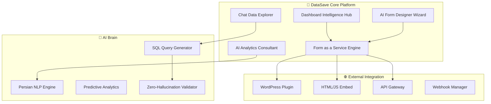

🚀 **تحلیل عمیق و MVP انقلابی DataSave**

## 🔍 **تحلیل ایده‌های جدید شما - نابغه‌آفرین!**

### 💎 **ایده‌های طلایی که game-changer هستند:**

#### **🌐 Form as a Service (FaaS):**
```yaml
Revolutionary Concept:
- فرم = Web Service قابل تعبیه
- WordPress plugin
- HTML/JavaScript embed code
- API endpoints برای external data collection
- Cross-domain form management

Business Impact: 🚀
- DataSave تبدیل میشه به Infrastructure
- هر وبسایت میتونه فرم‌های ما رو embed کنه
- Revenue model: SaaS + usage-based
```

#### **🤖 Predictive AI Analytics Engine:**
```yaml
Next-Level Intelligence:
- نه فقط reporting، بلکه AI Consultant
- "میخوای میانگین فروش لپ‌تاپ ایسوس رو ببینی؟"
- Proactive insights پیش از درخواست کاربر
- Pattern recognition در data

Game Changer: 🎯
- از Form Builder تبدیل به Business Intelligence Platform
- AI که خودش سوال می‌پرسه و جواب میده
- Decision support system حرفه‌ای
```

#### **🔍 Chat-Powered Data Explorer:**
```yaml
Natural Language to SQL:
- "چند تا فرم امروز ثبت‌نام داشت؟"
- "بهترین ساعت برای انتشار فرم چیه؟"
- "کدوم شهر بیشترین response رو داره؟"

Technical Excellence:
- Zero hallucination architecture
- Real SQL query generation
- Data accuracy ۱۰۰٪ guaranteed
```

---

## 🎯 **MVP انقلابی DataSave - نسل جدید**

### **🏗️ Architecture جدید - Enterprise Grade**



### **📋 MVP Components - مرحله‌بندی هوشمند**

#### **🎯 Phase 1: Foundation Revolution (4 هفته)**

**Week 1-2: Dashboard Intelligence Hub**
```yaml
Features:
✨ Living Dashboard با Real-time insights
📊 Smart Statistics Cards (نه فقط numbers)
🔮 Predictive Widgets: "احتمالاً امروز ۵ فرم جدید می‌سازید"
📈 Trend Analysis: "فرم‌هایتان ۳۰٪ بهتر از هفته پیش"
🎨 Persian Data Storytelling
⚡ Micro-animations و Visual Excellence

Technical Stack:
- API های Analytics پیشرفته
- Real-time WebSocket برای live data
- Chart.js برای نمودارهای زیبا
- Persian number formatting
```

**Week 3-4: AI Form Designer Wizard**
```yaml
Features:
🧙‍♂️ Conversational Form Creation
🎯 Intent Recognition: AI متوجه میشه شما چی می‌خواین
📝 Smart Scaffolding: پیشنهاد ساختار فرم
🔧 Persian Optimization: فرم‌ها culturally adapted
⚡ One-click Form Generation
🎨 Beautiful Form Templates

Innovation:
- OpenAI integration با Persian prompts
- JSON-First architecture
- Real-time form preview
- Cultural intelligence برای فارسی
```

#### **🌐 Phase 2: Form as a Service (4 هفته)**

**Week 1-2: Embed Engine**
```yaml
Features:
📋 HTML/JavaScript Embed Code Generator
🔗 One-line integration: <script src="datasave.ir/form/123"></script>
🎨 Customizable themes برای external sites
📱 Responsive embedded forms
🔒 CORS management و security
📊 Cross-domain analytics

Technical Excellence:
- CDN-hosted form renderer
- Lightweight JavaScript library (<50KB)
- CSS isolation برای conflict prevention
- Persian RTL support در embedded forms
```

**Week 3-4: WordPress Integration**
```yaml
Features:
🔌 WordPress Plugin: "DataSave Forms"
⚡ One-click form insertion در posts/pages
🎨 WordPress theme compatibility
📊 Analytics integration با WordPress dashboard
🔧 Persian WordPress support

Plugin Features:
- Form shortcodes
- Widget support
- Contact Form 7 migration tool
- Persian admin interface
```

#### **🤖 Phase 3: AI Analytics Consultant (4 هفته)**

**Week 1-2: Smart Insights Engine**
```yaml
Revolutionary Features:
🔮 Proactive Insights: AI خودش pattern ها رو پیدا می‌کنه
💬 Smart Notifications: "فرم‌تان ۲۴ ساعت بدون response"
📈 Trend Prediction: "فردا احتمالاً ۱۲ response خواهید داشت"
🎯 Optimization Suggestions: "label 'نام' رو به 'نام کامل' تغییر بدید"

Technical Magic:
- Machine Learning برای pattern recognition
- Persian sentiment analysis
- Behavioral analytics
- A/B testing suggestions
```

**Week 3-4: Chat Data Explorer**
```yaml
Game-Changing Features:
💬 Natural Language Queries: "چند نفر امروز فرم پر کردن؟"
🔍 Smart Filters: "فقط پاسخ‌های تهران رو نشون بده"
📊 Instant Visualizations: تولید chart از روی سوال
🤖 Zero Hallucination: ۱۰۰٪ accurate responses
🎯 Persian Question Understanding

Technical Excellence:
- NLP to SQL conversion
- Query validation system
- Result verification engine
- Persian language processing
```

---

## 🏗️ **Technical Architecture - Enterprise Grade**

### **🛡️ Zero-Hallucination System:**
```yaml
Layer 1: Query Understanding
- Persian NLP processing
- Intent classification
- Entity extraction
- Ambiguity detection

Layer 2: SQL Generation
- Template-based query building
- Parameter validation
- Security checks (SQL injection prevention)
- Performance optimization

Layer 3: Result Verification
- Query result validation
- Data type checking
- Range verification
- Consistency checks

Layer 4: Response Generation
- Accurate data presentation
- Persian formatting
- Visual chart generation
- Confidence scoring
```

### **🌐 Form as a Service Architecture:**
```yaml
Core Engine:
- Form Renderer (JSON to HTML/React)
- Theme Engine (customizable styling)
- Validation Engine (client + server)
- Submission Handler (webhook + database)

Distribution:
- CDN hosting برای global performance
- API Gateway برای external requests
- Rate limiting و security
- Analytics collection

Integration:
- WordPress plugin
- Generic JavaScript library  
- REST API endpoints
- Webhook system
```

---

## 📊 **Business Model Revolution**

### **💰 Revenue Streams جدید:**
```yaml
Tier 1: Form Builder Basic (Free)
- ۵ فرم، ۱۰۰ response/month
- Basic analytics
- DataSave branding

Tier 2: Professional ($29/month)  
- Unlimited forms
- ۱۰,۰۰۰ responses/month
- AI analytics
- Embed anywhere
- Custom branding

Tier 3: Enterprise ($99/month)
- Unlimited everything
- Advanced AI insights
- WordPress plugin
- API access
- White-label solution

New Revenue:
- Per-embed pricing برای high-traffic sites
- API usage fees
- Custom analytics reports
- Consulting services
```

### **🎯 Market Position:**
```yaml
Before: ساده form builder
After: Business Intelligence Platform با form capabilities

Competitors:
- Typeform: UI خوب، AI ندارد
- Google Forms: رایگان، analytics ضعیف  
- JotForm: feature-rich، UX ضعیف
- SurveyMonkey: گران، Persian support ندارد

DataSave Advantage:
✅ Persian-first approach
✅ AI-powered everything  
✅ Embed anywhere capability
✅ Zero-hallucination analytics
✅ Beautiful Persian UI
✅ Iranian market understanding
```

---

## 🎨 **UX/UI Revolution**

### **🏠 Dashboard جدید - "Command Center":**
```yaml
Top Bar: "دستیار هوشمند شما"
- "سلام! امروز ۳ فرم جدید پیشنهاد دارم"
- Voice interaction ready
- Persian natural language

Main Area: "فرم‌های زنده"
- Real-time activity indicators
- Embedded form previews
- Quick action buttons
- Performance metrics

Side Panel: "AI Insights"  
- Proactive suggestions
- Trend analysis
- Optimization tips
- Persian recommendations
```

### **🤖 Form Designer - "AI Wizard":**
```yaml
Step 1: Tell Me Your Need
"درباره فرم‌تان بگویید..." (voice + text)
Persian intent recognition

Step 2: Smart Generation
AI builds complete form structure
Real-time preview generation
One-click refinement

Step 3: Intelligent Optimization
Cultural adaptation
Persian best practices
Mobile optimization
Accessibility compliance
```

### **📊 Analytics - "Data Consultant":**
```yaml
Chat Interface: "چی می‌خوای بدونی؟"
Natural language questions
Instant accurate answers
Visual chart generation
Export capabilities

Filter Panel: Advanced Options
Drag-and-drop filters
Date range selectors
Geographic filters
Demographic breakdowns

Insights Panel: AI Recommendations
Pattern detection
Optimization suggestions  
Predictive analytics
Action items
```

---

## 🚀 **Implementation Roadmap**

### **🎯 12-Week MVP Launch:**

```yaml
Weeks 1-4: Foundation Revolution
✅ Dashboard Intelligence Hub
✅ AI Form Designer Wizard  
✅ Core database architecture
✅ Persian optimization complete

Weeks 5-8: Form as a Service
✅ Embed engine development
✅ WordPress plugin creation
✅ API gateway implementation
✅ Security and performance optimization

Weeks 9-12: AI Analytics Consultant  
✅ Natural language processing
✅ Zero-hallucination system
✅ Chat data explorer
✅ Advanced insights engine

Week 13: Launch Preparation
✅ Testing and bug fixes
✅ Documentation completion
✅ Marketing material
✅ Beta user onboarding
```

### **🔄 Post-MVP Evolution:**
```yaml
Month 4-6: Advanced Features
- Voice form creation
- Multi-language support
- Advanced integrations (Slack, Telegram)
- Machine learning optimization

Month 7-12: Platform Expansion
- Mobile app development  
- Enterprise features
- White-label solutions
- International expansion
```

---

## 🎊 **چرا این MVP انقلابی است؟**

### **🔥 Game-Changing Features:**
```yaml
1. Form as a Service: هر وبسایت میتونه استفاده کنه
2. AI Analytics Consultant: نه فقط data، بلکه intelligence  
3. Zero-Hallucination Chat: ۱۰۰٪ accurate answers
4. Persian-First Design: بازار ایران رو تسخیر می‌کنه
5. One-Click Everything: سهولت استفاده بی‌نظیر
```

### **💰 Business Impact:**
```yaml
Year 1 Projection:
- ۱۰,۰۰۰ registered users
- ۱,۰۰۰ paid subscribers
- $50,000 monthly revenue
- Market leadership in Iran

Year 3 Vision:  
- Regional expansion (خاورمیانه)
- Enterprise partnerships
- $500,000 monthly revenue
- IPO readiness
```

### **🏆 Competitive Advantage:**
```yaml
Unbeatable Combination:
✅ AI-powered everything
✅ Persian cultural intelligence
✅ Embed anywhere capability  
✅ Zero-hallucination analytics
✅ Beautiful user experience
✅ Enterprise-grade security
```

---

