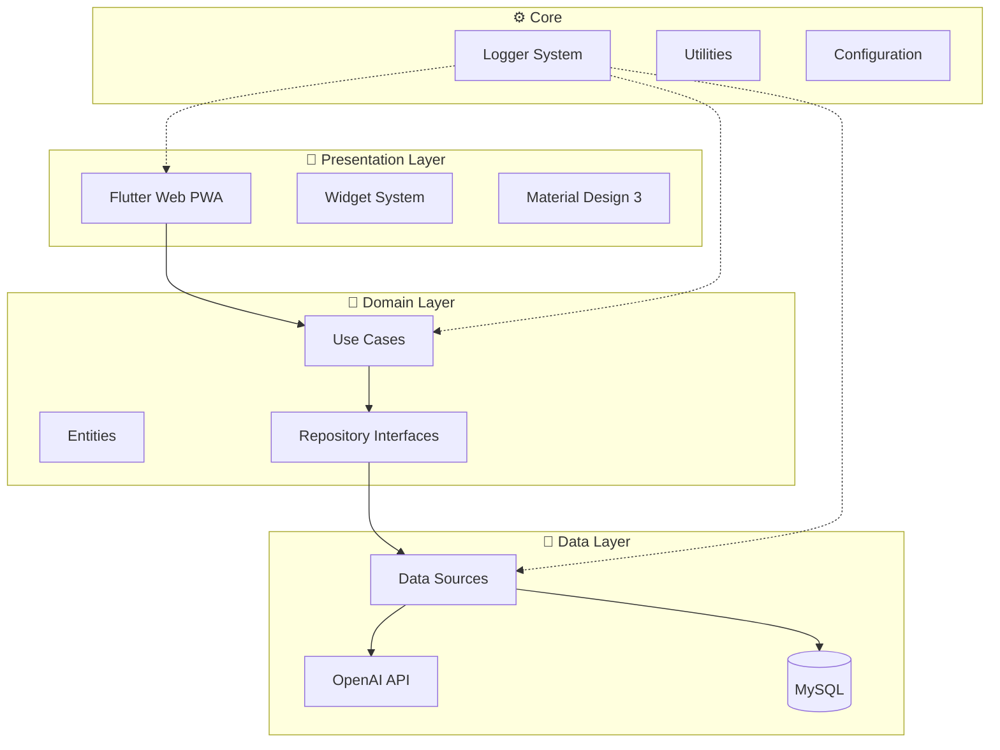

# DataSave - پلتفرم هوشمند فرم‌ساز

<div align="center">


**نسخه:** 1.0.0  
**تاریخ:** ۱۴۰۳/۱۰/۱۲  
**نویسنده:** مجتبی حسنی  
**شرکت:** مجتمع کامپیوتر یک دو سه  

[](https://flutter.dev)
[](https://mysql.com)
[](https://openai.com)
[](#)

</div>

---

## فهرست مطالب

1. [نمای کلی پروژه](#نمای-کلی-پروژه)
2. [معماری سیستم](#معماری-سیستم)
3. [پایگاه داده](#پایگاه-داده)
4. [ساختار پروژه](#ساختار-پروژه)
5. [سیستم لاگینگ](#سیستم-لاگینگ)
6. [ماژول ویجت‌ها](#ماژول-ویجتها)
7. [رابط کاربری](#رابط-کاربری)
8. [راه‌اندازی](#راه‌اندازی)
9. [استقرار](#استقرار)
10. [API مرجع](#api-مرجع)
11. [پیوست‌ها](#پیوستها)

---

## نمای کلی پروژه

### درباره DataSave

DataSave پلتفرم هوشمندی است که با قدرت هوش مصنوعی، فرآیند ساخت، مدیریت و تحلیل فرم‌های دیجیتال را خودکار می‌کند. کاربران می‌توانند با استفاده از زبان طبیعی فارسی، فرم‌های پیچیده با روابط پیشرفته ایجاد کنند.

### ویژگی‌های کلیدی

- **تولید هوشمند فرم** با پردازش زبان طبیعی فارسی
- **رابط کاربری پاسخ‌گو** برای دسکتاپ، تبلت و موبایل
- **ویجت‌های پیشرفته** برای انواع داده‌ها
- **تحلیل داده‌های هوشمند** با AI
- **پشتیبانی PWA** برای عملکرد آفلاین
- **امنیت پیشرفته** و رمزنگاری داده‌ها

### اطلاعات شرکت

| مشخصات | جزئیات |
|---------|---------|
| **شرکت** | مجتمع کامپیوتر یک دو سه |
| **تلفن** | ۰۳۴-۳۲۴۷۷۱۲۳ |
| **موبایل** | ۰۹۱۳۲۳۲۳۱۲۳ |
| **وبسایت** | [computer123.ir](http://computer123.ir) |
| **پلتفرم** | [DataSave.ir](http://datasave.ir) |

---

## معماری سیستم

### نمای کلی معماری (Clean Architecture)



### تکنولوژی‌های استفاده شده

| لایه | تکنولوژی | نسخه | توضیحات |
|------|----------|-------|---------|
| **Frontend** | Flutter Web | 3.x | PWA با رویکرد Mobile-First |
| **Database** | MySQL | 8.0 | پورت 3307 با XAMPP |
| **AI Engine** | OpenAI GPT-4 | Latest | تولید و تحلیل فرم |
| **IDE** | VS Code | Latest | روی MacMini M4 |
| **Version Control** | GitHub | - | مخزن خصوصی |
| **Font** | Vazirmatn | Latest | فونت فارسی وب |

---

## پایگاه داده

### طراحی دیتابیس

#### اسکریپت اولیه

```sql
-- ایجاد دیتابیس
CREATE DATABASE IF NOT EXISTS `datasave_db` 
DEFAULT CHARACTER SET utf8mb4 
COLLATE utf8mb4_persian_ci;

USE `datasave_db`;
```

#### جدول تنظیمات سیستم

```sql
CREATE TABLE `system_settings` (
  `id` INT PRIMARY KEY AUTO_INCREMENT,
  `setting_key` VARCHAR(100) UNIQUE NOT NULL COMMENT 'کلید تنظیمات',
  `setting_value` TEXT COMMENT 'مقدار تنظیمات',
  `setting_type` ENUM('string','json','boolean','number') DEFAULT 'string',
  `description` TEXT COMMENT 'توضیحات فارسی',
  `is_encrypted` BOOLEAN DEFAULT FALSE COMMENT 'آیا رمزنگاری شده',
  `created_at` TIMESTAMP DEFAULT CURRENT_TIMESTAMP,
  `updated_at` TIMESTAMP DEFAULT CURRENT_TIMESTAMP ON UPDATE CURRENT_TIMESTAMP,
  INDEX idx_setting_key (`setting_key`)
) ENGINE=InnoDB DEFAULT CHARSET=utf8mb4 COLLATE=utf8mb4_persian_ci
COMMENT='تنظیمات عمومی سیستم';
```

#### جدول ویجت‌ها

```sql
CREATE TABLE `widgets` (
  `widget_id` INT PRIMARY KEY AUTO_INCREMENT,
  `widget_type` VARCHAR(50) NOT NULL COMMENT 'نوع ویجت',
  `widget_name_fa` VARCHAR(100) NOT NULL COMMENT 'نام فارسی',
  `widget_name_en` VARCHAR(100) NOT NULL COMMENT 'نام انگلیسی',
  `widget_icon` VARCHAR(50) COMMENT 'آیکون ویجت',
  `widget_category` VARCHAR(50) COMMENT 'دسته‌بندی',
  `default_properties` JSON COMMENT 'ویژگی‌های پیش‌فرض',
  `validation_rules` JSON COMMENT 'قوانین اعتبارسنجی',
  `style_config` JSON COMMENT 'تنظیمات استایل',
  `help_text` TEXT COMMENT 'راهنمای استفاده',
  `is_active` BOOLEAN DEFAULT TRUE,
  `sort_order` INT DEFAULT 0,
  `created_at` TIMESTAMP DEFAULT CURRENT_TIMESTAMP,
  
  INDEX idx_widget_type (`widget_type`),
  INDEX idx_widget_category (`widget_category`),
  INDEX idx_sort_order (`sort_order`)
) ENGINE=InnoDB DEFAULT CHARSET=utf8mb4 COLLATE=utf8mb4_persian_ci
COMMENT='ویجت‌های قابل استفاده در فرم‌ساز';
```

#### جدول فرم‌ها

```sql
CREATE TABLE `forms` (
  `form_id` INT PRIMARY KEY AUTO_INCREMENT,
  `form_uuid` CHAR(36) UNIQUE NOT NULL DEFAULT (UUID()),
  `form_title` VARCHAR(255) NOT NULL COMMENT 'عنوان فرم',
  `form_description` TEXT COMMENT 'توضیحات فرم',
  `form_structure` JSON NOT NULL COMMENT 'ساختار JSON فرم',
  `form_settings` JSON COMMENT 'تنظیمات فرم',
  `parent_form_id` INT DEFAULT NULL COMMENT 'فرم والد برای روابط تودرتو',
  `form_version` INT DEFAULT 1 COMMENT 'نسخه فرم',
  `ai_prompt` TEXT COMMENT 'پرامپت اولیه AI',
  `is_published` BOOLEAN DEFAULT FALSE COMMENT 'آیا منتشر شده',
  `is_deleted` BOOLEAN DEFAULT FALSE COMMENT 'حذف نرم',
  `created_by` INT COMMENT 'شناسه سازنده',
  `created_at` TIMESTAMP DEFAULT CURRENT_TIMESTAMP,
  `updated_at` TIMESTAMP DEFAULT CURRENT_TIMESTAMP ON UPDATE CURRENT_TIMESTAMP,
  
  FOREIGN KEY (`parent_form_id`) REFERENCES `forms`(`form_id`) ON DELETE SET NULL,
  INDEX idx_form_uuid (`form_uuid`),
  INDEX idx_parent_form (`parent_form_id`),
  INDEX idx_published (`is_published`),
  INDEX idx_created_by (`created_by`)
) ENGINE=InnoDB DEFAULT CHARSET=utf8mb4 COLLATE=utf8mb4_persian_ci
COMMENT='فرم‌های اصلی سیستم';
```

#### جدول لاگ‌ها

```sql
CREATE TABLE `system_logs` (
  `log_id` BIGINT PRIMARY KEY AUTO_INCREMENT,
  `log_level` ENUM('DEBUG','INFO','WARNING','ERROR','CRITICAL') NOT NULL,
  `log_category` VARCHAR(50) NOT NULL COMMENT 'دسته‌بندی لاگ',
  `log_message` TEXT NOT NULL COMMENT 'پیام لاگ',
  `log_context` JSON COMMENT 'اطلاعات تکمیلی',
  `user_id` INT DEFAULT NULL COMMENT 'شناسه کاربر',
  `ip_address` VARCHAR(45) COMMENT 'آدرس IP',
  `user_agent` TEXT COMMENT 'User Agent مرورگر',
  `request_id` CHAR(36) COMMENT 'شناسه یکتا درخواست',
  `created_at` TIMESTAMP DEFAULT CURRENT_TIMESTAMP,
  
  INDEX idx_log_level (`log_level`),
  INDEX idx_log_category (`log_category`),
  INDEX idx_created_at (`created_at`),
  INDEX idx_request_id (`request_id`),
  INDEX idx_user_id (`user_id`)
) ENGINE=InnoDB DEFAULT CHARSET=utf8mb4 COLLATE=utf8mb4_persian_ci
COMMENT='لاگ‌های سیستمی و رویدادها'
PARTITION BY RANGE (YEAR(created_at)) (
    PARTITION p2024 VALUES LESS THAN (2025),
    PARTITION p2025 VALUES LESS THAN (2026),
    PARTITION p_future VALUES LESS THAN MAXVALUE
);
```

---

## ساختار پروژه

### درخت دایرکتوری

```
datasave/
├── 📁 lib/                           # کد اصلی اپلیکیشن
│   ├── 📁 core/                      # هسته مرکزی سیستم
│   │   ├── 📁 config/                # فایل‌های پیکربندی
│   │   │   ├── 📄 app_config.dart
│   │   │   ├── 📄 database_config.dart
│   │   │   └── 📄 ai_config.dart
│   │   ├── 📁 constants/             # ثابت‌های سیستم
│   │   │   ├── 📄 app_constants.dart
│   │   │   ├── 📄 api_endpoints.dart
│   │   │   └── 📄 widget_types.dart
│   │   ├── 📁 logger/                # سیستم لاگینگ
│   │   │   ├── 📄 logger_service.dart
│   │   │   ├── 📄 log_formatter.dart
│   │   │   └── 📄 log_storage.dart
│   │   ├── 📁 theme/                 # تم و ظاهر
│   │   │   ├── 📄 app_theme.dart
│   │   │   ├── 📄 app_colors.dart
│   │   │   └── 📄 app_typography.dart
│   │   └── 📁 utils/                 # ابزارهای عمومی
│   │       ├── 📄 date_utils.dart    # تقویم شمسی
│   │       ├── 📄 validators.dart    # اعتبارسنجی
│   │       └── 📄 formatters.dart    # فرمت‌کننده‌ها
│   │
│   ├── 📁 data/                      # لایه داده
│   │   ├── 📁 datasources/           # منابع داده
│   │   │   ├── 📁 local/
│   │   │   │   └── 📄 database_service.dart
│   │   │   └── 📁 remote/
│   │   │       └── 📄 openai_service.dart
│   │   ├── 📁 models/                # مدل‌های داده
│   │   │   ├── 📄 form_model.dart
│   │   │   ├── 📄 widget_model.dart
│   │   │   └── 📄 settings_model.dart
│   │   └── 📁 repositories/          # پیاده‌سازی مخازن
│   │       ├── 📄 form_repository_impl.dart
│   │       └── 📄 widget_repository_impl.dart
│   │
│   ├── 📁 domain/                    # لایه دامنه کسب‌وکار
│   │   ├── 📁 entities/              # موجودیت‌های کسب‌وکار
│   │   │   ├── 📄 form_entity.dart
│   │   │   └── 📄 widget_entity.dart
│   │   ├── 📁 repositories/          # رابط‌های مخزن
│   │   │   └── 📄 form_repository.dart
│   │   └── 📁 usecases/             # موارد استفاده
│   │       ├── 📄 create_form_usecase.dart
│   │       └── 📄 analyze_data_usecase.dart
│   │
│   ├── 📁 presentation/              # لایه نمایش
│   │   ├── 📁 pages/                 # صفحات اپلیکیشن
│   │   │   ├── 📁 home/
│   │   │   │   ├── 📄 home_page.dart
│   │   │   │   └── 📄 home_controller.dart
│   │   │   ├── 📁 form_builder/
│   │   │   │   ├── 📄 form_builder_page.dart
│   │   │   │   └── 📄 form_builder_controller.dart
│   │   │   └── 📁 settings/
│   │   │       ├── 📄 settings_page.dart
│   │   │       └── 📄 settings_controller.dart
│   │   ├── 📁 widgets/               # ویجت‌های سفارشی
│   │   │   ├── 📁 form_widgets/      # ویجت‌های فرم
│   │   │   │   ├── 📄 text_input_widget.dart
│   │   │   │   ├── 📄 number_input_widget.dart
│   │   │   │   ├── 📄 date_picker_widget.dart
│   │   │   │   └── 📄 dropdown_widget.dart
│   │   │   └── 📁 shared/            # ویجت‌های مشترک
│   │   │       ├── 📄 loading_widget.dart
│   │   │       ├── 📄 error_widget.dart
│   │   │       └── 📄 empty_state_widget.dart
│   │   └── 📁 routes/                # مسیریابی
│   │       └── 📄 app_routes.dart
│   │
│   └── 📄 main.dart                  # نقطه ورود اپلیکیشن
│
├── 📁 assets/                        # منابع استاتیک
│   ├── 📁 fonts/                     # فونت‌ها
│   │   └── 📁 Vazirmatn/
│   ├── 📁 images/                    # تصاویر
│   │   ├── 📁 icons/
│   │   └── 📁 logos/
│   └── 📁 animations/                # انیمیشن‌ها
│
├── 📁 web/                           # فایل‌های PWA
│   ├── 📄 index.html
│   ├── 📄 manifest.json
│   └── 📄 service_worker.js
│
├── 📁 docs/                          # مستندات
│   ├── 📁 api/                       # مستندات API
│   ├── 📁 database/                  # مستندات دیتابیس
│   └── 📁 guides/                    # راهنماهای توسعه
│
├── 📁 test/                          # تست‌ها
│   ├── 📁 unit/                      # تست واحد
│   ├── 📁 widget/                    # تست ویجت
│   └── 📁 integration/               # تست یکپارچه
│
├── 📄 pubspec.yaml                   # وابستگی‌های Flutter
├── 📄 analysis_options.yaml          # تنظیمات تحلیل کد
└── 📄 README.md                      # راهنمای اصلی
```

---

## سیستم لاگینگ

### معماری لاگینگ

سیستم لاگینگ DataSave بر اساس معماری چندسطحی طراحی شده که شامل موارد زیر است:

- **سطوح مختلف لاگ** (DEBUG، INFO، WARNING، ERROR، CRITICAL)
- **ذخیره‌سازی ترکیبی** (کنسول، دیتابیس، فایل)
- **فرمت‌دهی هوشمند** پیام‌ها
- **Partition بندی** داده‌ها بر اساس تاریخ

### پیاده‌سازی سرویس لاگر

```dart
// فایل: lib/core/logger/logger_service.dart

import 'dart:developer' as developer;
import 'package:flutter/foundation.dart';

/// سطوح مختلف لاگ برای دسته‌بندی پیام‌ها
enum LogLevel {
  debug('🔍 DEBUG', 0),
  info('ℹ️ INFO', 1), 
  warning('⚠️ WARNING', 2),
  error('❌ ERROR', 3),
  critical('🚨 CRITICAL', 4);

  const LogLevel(this.prefix, this.priority);
  final String prefix;
  final int priority;
}

/// سرویس اصلی مدیریت لاگ‌ها
class LoggerService {
  static final LoggerService _instance = LoggerService._internal();
  factory LoggerService() => _instance;
  LoggerService._internal();

  bool _enableConsoleLog = true;
  bool _enableDatabaseLog = true;
  LogLevel _minimumLevel = LogLevel.debug;

  /// ثبت یک پیام لاگ جدید
  Future<void> log({
    required LogLevel level,
    required String message,
    String? category,
    Map<String, dynamic>? context,
    StackTrace? stackTrace,
  }) async {
    if (level.priority < _minimumLevel.priority) return;

    final formattedMessage = _formatMessage(
      level: level,
      message: message,
      category: category,
      context: context,
    );

    // لاگ در کنسول
    if (_enableConsoleLog && kIsWeb) {
      _logToConsole(formattedMessage, level);
    }

    // لاگ در دیتابیس
    if (_enableDatabaseLog) {
      await _logToDatabase(
        level: level,
        message: message,
        category: category,
        context: context,
      );
    }

    // لاگ در محیط توسعه
    if (kDebugMode) {
      developer.log(
        formattedMessage,
        name: 'DataSave',
        level: level.priority * 100,
        stackTrace: stackTrace,
      );
    }
  }

  /// فرمت‌دهی پیام لاگ
  String _formatMessage({
    required LogLevel level,
    required String message,
    String? category,
    Map<String, dynamic>? context,
  }) {
    final timestamp = DateTime.now().toIso8601String();
    final categoryStr = category != null ? '[$category]' : '';
    final contextStr = context != null ? ' | Context: $context' : '';

    return '''
╔══════════════════════════════════════════════════
║ ${level.prefix} $categoryStr  
║ زمان: $timestamp
║ پیام: $message$contextStr
╚══════════════════════════════════════════════════
    ''';
  }

  void _logToConsole(String message, LogLevel level) {
    const colors = {
      LogLevel.debug: '\x1B[36m',    // Cyan
      LogLevel.info: '\x1B[32m',     // Green  
      LogLevel.warning: '\x1B[33m',  // Yellow
      LogLevel.error: '\x1B[31m',    // Red
      LogLevel.critical: '\x1B[35m', // Magenta
    };
    
    print('${colors[level]}$message\x1B[0m');
  }

  Future<void> _logToDatabase({
    required LogLevel level,
    required String message, 
    String? category,
    Map<String, dynamic>? context,
  }) async {
    // TODO: پیاده‌سازی ذخیره در MySQL
  }
}

/// کلاس کمکی برای دسترسی آسان به لاگر
class Logger {
  static final _logger = LoggerService();

  static void debug(String message, {String? category, Map<String, dynamic>? context}) {
    _logger.log(level: LogLevel.debug, message: message, category: category, context: context);
  }

  static void info(String message, {String? category, Map<String, dynamic>? context}) {
    _logger.log(level: LogLevel.info, message: message, category: category, context: context);
  }

  static void warning(String message, {String? category, Map<String, dynamic>? context}) {
    _logger.log(level: LogLevel.warning, message: message, category: category, context: context);
  }

  static void error(String message, {String? category, Map<String, dynamic>? context, StackTrace? stackTrace}) {
    _logger.log(level: LogLevel.error, message: message, category: category, context: context, stackTrace: stackTrace);
  }

  static void critical(String message, {String? category, Map<String, dynamic>? context}) {
    _logger.log(level: LogLevel.critical, message: message, category: category, context: context);
  }
}
```

### نمونه استفاده

```dart
// در کنترلر فرم‌ساز
Logger.info('شروع بارگذاری فرم جدید', category: 'FormBuilder');

Logger.debug('داده‌های دریافتی از API', 
  category: 'API',
  context: {'response_size': responseData.length, 'status': 'success'}
);

Logger.error('خطا در اتصال به دیتابیس',
  category: 'Database', 
  context: {'error': error.toString(), 'query': sqlQuery},
  stackTrace: stackTrace
);
```

---

## ماژول ویجت‌ها

### معماری ویجت سیستم

ویژگی‌های کلیدی سیستم ویجت‌ها:

- **ساختار مدولار** برای اضافه کردن آسان ویجت‌های جدید
- **پیکربندی پیشرفته** با JSON Schema
- **اعتبارسنجی خودکار** بر اساس نوع داده
- **رندر بهینه** با استفاده از Flutter Widget Tree

### انواع ویجت‌های موجود

| نوع ویجت | نام فارسی | قابلیت‌های ویژه |
|-----------|-----------|------------------|
| `TextInput` | ورودی متن | Regex validation، شمارنده کاراکتر، چند خطی |
| `NumberInput` | ورودی عدد | جداکننده هزارگان، محدوده، اعشار |
| `DatePicker` | انتخاب تاریخ | تقویم شمسی، محدوده تاریخ، فرمت‌های مختلف |
| `TimePicker` | انتخاب زمان | ۱۲/۲۴ ساعته، محدوده زمانی |
| `Dropdown` | لیست کشویی | چندانتخابی، جستجو، گروه‌بندی |
| `RadioButton` | دکمه رادیویی | گروه‌بندی، چیدمان افقی/عمودی |
| `CheckBox` | جعبه انتخاب | سه حالته، برچسب سفارشی |
| `FileUpload` | آپلود فایل | محدودیت نوع/حجم، پیش‌نمایش |
| `Signature` | امضا دیجیتال | ذخیره به صورت تصویر |
| `Rating` | امتیازدهی | ستاره/قلب/عدد، نیم امتیاز |
| `ColorPicker` | انتخاب رنگ | پالت سفارشی، RGB/HEX |
| `Location` | انتخاب موقعیت | نقشه، آدرس، مختصات |

### کلاس پایه ویجت

```dart
// فایل: lib/domain/entities/widget_entity.dart

abstract class BaseWidget {
  final String id;
  final String type;
  final String labelFa;
  final String labelEn;
  final bool isRequired;
  final Map<String, dynamic> properties;
  final Map<String, dynamic> validation;
  final Map<String, dynamic> styling;

  const BaseWidget({
    required this.id,
    required this.type,
    required this.labelFa,
    required this.labelEn,
    this.isRequired = false,
    required this.properties,
    required this.validation,
    required this.styling,
  });

  /// تبدیل به JSON برای ذخیره در دیتابیس
  Map<String, dynamic> toJson();
  
  /// ساخت از JSON
  factory BaseWidget.fromJson(Map<String, dynamic> json) {
    switch (json['type']) {
      case 'text_input':
        return TextInputWidget.fromJson(json);
      case 'number_input':
        return NumberInputWidget.fromJson(json);
      case 'date_picker':
        return DatePickerWidget.fromJson(json);
      default:
        throw UnsupportedError('نوع ویجت پشتیبانی نمی‌شود: ${json['type']}');
    }
  }

  /// رندر ویجت در UI
  Widget render(BuildContext context, Function(dynamic) onChanged);
  
  /// اعتبارسنجی مقدار
  ValidationResult validate(dynamic value);
}
```

### پیاده‌سازی ویجت ورودی عددی

```dart
// فایل: lib/presentation/widgets/form_widgets/number_input_widget.dart

class NumberInputWidget extends BaseWidget {
  final bool useThousandSeparator;
  final String separatorChar;
  final int? minValue;
  final int? maxValue;
  final int decimalPlaces;
  final bool allowNegative;
  final String? prefix;
  final String? suffix;

  const NumberInputWidget({
    required super.id,
    required super.labelFa,
    required super.labelEn,
    super.isRequired = false,
    required super.properties,
    required super.validation,
    required super.styling,
    this.useThousandSeparator = true,
    this.separatorChar = '،',
    this.minValue,
    this.maxValue,
    this.decimalPlaces = 0,
    this.allowNegative = false,
    this.prefix,
    this.suffix,
  }) : super(type: 'number_input');

  @override
  Widget render(BuildContext context, Function(dynamic) onChanged) {
    return Container(
      margin: EdgeInsets.symmetric(vertical: 8),
      child: Column(
        crossAxisAlignment: CrossAxisAlignment.start,
        children: [
          // برچسب فیلد
          RichText(
            text: TextSpan(
              text: labelFa,
              style: Theme.of(context).textTheme.bodyMedium,
              children: [
                if (isRequired)
                  TextSpan(
                    text: ' *',
                    style: TextStyle(color: Theme.of(context).colorScheme.error),
                  ),
              ],
            ),
          ),
          SizedBox(height: 8),
          
          // فیلد ورودی
          TextFormField(
            decoration: InputDecoration(
              border: OutlineInputBorder(
                borderRadius: BorderRadius.circular(12),
              ),
              prefixText: prefix,
              suffixText: suffix,
              hintText: 'عدد مورد نظر را وارد کنید',
            ),
            keyboardType: TextInputType.numberWithOptions(
              decimal: decimalPlaces > 0,
              signed: allowNegative,
            ),
            inputFormatters: [
              _NumberInputFormatter(
                useThousandSeparator: useThousandSeparator,
                separatorChar: separatorChar,
                decimalPlaces: decimalPlaces,
                allowNegative: allowNegative,
              ),
            ],
            validator: (value) {
              final result = validate(value);
              return result.isValid ? null : result.errorMessage;
            },
            onChanged: (value) {
              final numericValue = _parseNumber(value);
              onChanged(numericValue);
            },
          ),
        ],
      ),
    );
  }

  @override
  ValidationResult validate(dynamic value) {
    if (value == null || value.toString().isEmpty) {
      return ValidationResult(
        isValid: !isRequired,
        errorMessage: isRequired ? 'این فیلد اجباری است' : null,
      );
    }

    final numericValue = _parseNumber(value.toString());
    
    if (numericValue == null) {
      return ValidationResult(
        isValid: false,
        errorMessage: 'مقدار وارد شده معتبر نیست',
      );
    }

    if (minValue != null && numericValue < minValue!) {
      return ValidationResult(
        isValid: false,
        errorMessage: 'مقدار نباید کمتر از $minValue باشد',
      );
    }

    if (maxValue != null && numericValue > maxValue!) {
      return ValidationResult(
        isValid: false,
        errorMessage: 'مقدار نباید بیشتر از $maxValue باشد',
      );
    }

    return ValidationResult(isValid: true);
  }

  double? _parseNumber(String value) {
    // حذف جداکننده هزارگان و تبدیل به عدد
    final cleanValue = value.replaceAll(separatorChar, '');
    return double.tryParse(cleanValue);
  }

  @override
  Map<String, dynamic> toJson() {
    return {
      'id': id,
      'type': type,
      'labelFa': labelFa,
      'labelEn': labelEn,
      'isRequired': isRequired,
      'properties': properties,
      'validation': validation,
      'styling': styling,
      'config': {
        'useThousandSeparator': useThousandSeparator,
        'separatorChar': separatorChar,
        'minValue': minValue,
        'maxValue': maxValue,
        'decimalPlaces': decimalPlaces,
        'allowNegative': allowNegative,
        'prefix': prefix,
        'suffix': suffix,
      },
    };
  }

  factory NumberInputWidget.fromJson(Map<String, dynamic> json) {
    final config = json['config'] ?? {};
    return NumberInputWidget(
      id: json['id'],
      labelFa: json['labelFa'],
      labelEn: json['labelEn'],
      isRequired: json['isRequired'] ?? false,
      properties: json['properties'] ?? {},
      validation: json['validation'] ?? {},
      styling: json['styling'] ?? {},
      useThousandSeparator: config['useThousandSeparator'] ?? true,
      separatorChar: config['separatorChar'] ?? '،',
      minValue: config['minValue'],
      maxValue: config['maxValue'],
      decimalPlaces: config['decimalPlaces'] ?? 0,
      allowNegative: config['allowNegative'] ?? false,
      prefix: config['prefix'],
      suffix: config['suffix'],
    );
  }
}

/// فرمت‌کننده ورودی عددی
class _NumberInputFormatter extends TextInputFormatter {
  final bool useThousandSeparator;
  final String separatorChar;
  final int decimalPlaces;
  final bool allowNegative;

  _NumberInputFormatter({
    required this.useThousandSeparator,
    required this.separatorChar,
    required this.decimalPlaces,
    required this.allowNegative,
  });

  @override
  TextEditingValue formatEditUpdate(
    TextEditingValue oldValue,
    TextEditingValue newValue,
  ) {
    if (newValue.text.isEmpty) return newValue;

    // اجازه فقط اعداد، علامت منفی و ممیز اعشار
    String filtered = newValue.text.replaceAll(RegExp(r'[^\d\-\.]'), '');
    
    if (!allowNegative) {
      filtered = filtered.replaceAll('-', '');
    }

    // محدود کردن تعداد اعشار
    if (decimalPlaces == 0) {
      filtered = filtered.replaceAll('.', '');
    } else {
      final parts = filtered.split('.');
      if (parts.length > 2) {
        filtered = '${parts[0]}.${parts[1]}';
      } else if (parts.length == 2 && parts[1].length > decimalPlaces) {
        filtered = '${parts[0]}.${parts[1].substring(0, decimalPlaces)}';
      }
    }

    // اضافه کردن جداکننده هزارگان
    if (useThousandSeparator) {
      filtered = _addThousandSeparator(filtered);
    }

    return TextEditingValue(
      text: filtered,
      selection: TextSelection.collapsed(offset: filtered.length),
    );
  }

  String _addThousandSeparator(String value) {
    final parts = value.split('.');
    final intPart = parts[0].replaceAll(separatorChar, '');
    
    // اضافه کردن جداکننده به قسمت صحیح
    final regex = RegExp(r'(\d)(?=(\d{3})+(?!\d))');
    final formattedInt = intPart.replaceAllMapped(regex, (match) => '${match.group(1)}$separatorChar');
    
    return parts.length > 1 ? '$formattedInt.${parts[1]}' : formattedInt;
  }
}

/// کلاس نتیجه اعتبارسنجی
class ValidationResult {
  final bool isValid;
  final String? errorMessage;

  const ValidationResult({required this.isValid, this.errorMessage});
}
```

---

## رابط کاربری

### طراحی مبتنی بر Material Design 3

DataSave از آخرین استانداردهای Material Design 3 پیروی می‌کند و ویژگی‌های زیر را ارائه می‌دهد:

- **Dynamic Color** بر اساس تم سیستم‌عامل
- **Typography فارسی** با فونت Vazirmatn
- **انیمیشن‌های روان** و تعامل‌های هوشمند
- **Responsive Design** برای همه اندازه صفحه‌ها

### تنظیمات تم اصلی

```dart
// فایل: lib/core/theme/app_theme.dart

import 'package:flutter/material.dart';
import 'package:google_fonts/google_fonts.dart';

class AppTheme {
  // پالت رنگی برند DataSave
  static const MaterialColor primarySwatch = MaterialColor(
    0xFF1976D2,
    <int, Color>{
      50: Color(0xFFE3F2FD),
      100: Color(0xFFBBDEFB),
      200: Color(0xFF90CAF9),
      300: Color(0xFF64B5F6),
      400: Color(0xFF42A5F5),
      500: Color(0xFF1976D2), // رنگ اصلی
      600: Color(0xFF1E88E5),
      700: Color(0xFF1976D2),
      800: Color(0xFF1565C0),
      900: Color(0xFF0D47A1),
    },
  );

  // رنگ‌های سیستمی
  static const Color successColor = Color(0xFF2E7D32);
  static const Color warningColor = Color(0xFFF57C00);
  static const Color errorColor = Color(0xFFD32F2F);
  static const Color infoColor = Color(0xFF1976D2);

  /// تم روشن
  static ThemeData get lightTheme {
    final colorScheme = ColorScheme.fromSeed(
      seedColor: primarySwatch,
      brightness: Brightness.light,
    );

    return ThemeData(
      useMaterial3: true,
      colorScheme: colorScheme,
      
      // تایپوگرافی فارسی
      textTheme: _buildTextTheme(colorScheme),
      
      // تنظیمات AppBar
      appBarTheme: AppBarTheme(
        centerTitle: true,
        elevation: 0,
        scrolledUnderElevation: 1,
        backgroundColor: colorScheme.surface,
        foregroundColor: colorScheme.onSurface,
        titleTextStyle: GoogleFonts.vazirmatn(
          fontSize: 20,
          fontWeight: FontWeight.w600,
          color: colorScheme.onSurface,
        ),
      ),
      
      // دکمه‌ها
      elevatedButtonTheme: ElevatedButtonThemeData(
        style: ElevatedButton.styleFrom(
          padding: const EdgeInsets.symmetric(horizontal: 24, vertical: 16),
          shape: RoundedRectangleBorder(borderRadius: BorderRadius.circular(16)),
          textStyle: GoogleFonts.vazirmatn(
            fontSize: 16,
            fontWeight: FontWeight.w500,
          ),
        ),
      ),
      
      outlinedButtonTheme: OutlinedButtonThemeData(
        style: OutlinedButton.styleFrom(
          padding: const EdgeInsets.symmetric(horizontal: 24, vertical: 16),
          shape: RoundedRectangleBorder(borderRadius: BorderRadius.circular(16)),
        ),
      ),
      
      // فیلدهای ورودی
      inputDecorationTheme: InputDecorationTheme(
        border: OutlineInputBorder(
          borderRadius: BorderRadius.circular(12),
          borderSide: BorderSide(color: colorScheme.outline),
        ),
        enabledBorder: OutlineInputBorder(
          borderRadius: BorderRadius.circular(12),
          borderSide: BorderSide(color: colorScheme.outline),
        ),
        focusedBorder: OutlineInputBorder(
          borderRadius: BorderRadius.circular(12),
          borderSide: BorderSide(color: colorScheme.primary, width: 2),
        ),
        errorBorder: OutlineInputBorder(
          borderRadius: BorderRadius.circular(12),
          borderSide: BorderSide(color: colorScheme.error),
        ),
        contentPadding: const EdgeInsets.symmetric(horizontal: 16, vertical: 16),
        hintStyle: GoogleFonts.vazirmatn(color: colorScheme.onSurfaceVariant),
      ),
      
      // کارت‌ها
      cardTheme: CardTheme(
        elevation: 1,
        shadowColor: Colors.black12,
        shape: RoundedRectangleBorder(borderRadius: BorderRadius.circular(16)),
        margin: const EdgeInsets.all(8),
      ),
      
      // Navigation Rail
      navigationRailTheme: NavigationRailThemeData(
        backgroundColor: colorScheme.surface,
        selectedIconTheme: IconThemeData(color: colorScheme.primary),
        selectedLabelTextStyle: GoogleFonts.vazirmatn(
          color: colorScheme.primary,
          fontWeight: FontWeight.w600,
        ),
      ),
    );
  }

  /// تم تیره
  static ThemeData get darkTheme {
    final colorScheme = ColorScheme.fromSeed(
      seedColor: primarySwatch,
      brightness: Brightness.dark,
    );

    return lightTheme.copyWith(
      colorScheme: colorScheme,
      textTheme: _buildTextTheme(colorScheme),
      appBarTheme: lightTheme.appBarTheme?.copyWith(
        backgroundColor: colorScheme.surface,
        foregroundColor: colorScheme.onSurface,
      ),
    );
  }

  /// ساخت تایپوگرافی فارسی
  static TextTheme _buildTextTheme(ColorScheme colorScheme) {
    return TextTheme(
      displayLarge: GoogleFonts.vazirmatn(
        fontSize: 57,
        fontWeight: FontWeight.w400,
        height: 1.12,
        color: colorScheme.onSurface,
      ),
      displayMedium: GoogleFonts.vazirmatn(
        fontSize: 45,
        fontWeight: FontWeight.w400,
        height: 1.16,
        color: colorScheme.onSurface,
      ),
      displaySmall: GoogleFonts.vazirmatn(
        fontSize: 36,
        fontWeight: FontWeight.w400,
        height: 1.22,
        color: colorScheme.onSurface,
      ),
      headlineLarge: GoogleFonts.vazirmatn(
        fontSize: 32,
        fontWeight: FontWeight.w600,
        height: 1.25,
        color: colorScheme.onSurface,
      ),
      headlineMedium: GoogleFonts.vazirmatn(
        fontSize: 28,
        fontWeight: FontWeight.w600,
        height: 1.29,
        color: colorScheme.onSurface,
      ),
      headlineSmall: GoogleFonts.vazirmatn(
        fontSize: 24,
        fontWeight: FontWeight.w600,
        height: 1.33,
        color: colorScheme.onSurface,
      ),
      titleLarge: GoogleFonts.vazirmatn(
        fontSize: 22,
        fontWeight: FontWeight.w600,
        height: 1.27,
        color: colorScheme.onSurface,
      ),
      titleMedium: GoogleFonts.vazirmatn(
        fontSize: 16,
        fontWeight: FontWeight.w500,
        height: 1.50,
        color: colorScheme.onSurface,
      ),
      titleSmall: GoogleFonts.vazirmatn(
        fontSize: 14,
        fontWeight: FontWeight.w500,
        height: 1.43,
        color: colorScheme.onSurface,
      ),
      bodyLarge: GoogleFonts.vazirmatn(
        fontSize: 16,
        fontWeight: FontWeight.w400,
        height: 1.50,
        color: colorScheme.onSurface,
      ),
      bodyMedium: GoogleFonts.vazirmatn(
        fontSize: 14,
        fontWeight: FontWeight.w400,
        height: 1.43,
        color: colorScheme.onSurface,
      ),
      bodySmall: GoogleFonts.vazirmatn(
        fontSize: 12,
        fontWeight: FontWeight.w400,
        height: 1.33,
        color: colorScheme.onSurfaceVariant,
      ),
      labelLarge: GoogleFonts.vazirmatn(
        fontSize: 14,
        fontWeight: FontWeight.w500,
        height: 1.43,
        color: colorScheme.onSurface,
      ),
      labelMedium: GoogleFonts.vazirmatn(
        fontSize: 12,
        fontWeight: FontWeight.w500,
        height: 1.33,
        color: colorScheme.onSurface,
      ),
      labelSmall: GoogleFonts.vazirmatn(
        fontSize: 11,
        fontWeight: FontWeight.w500,
        height: 1.45,
        color: colorScheme.onSurface,
      ),
    );
  }
}
```

### سیستم Responsive Layout

```dart
// فایل: lib/presentation/widgets/shared/responsive_layout.dart

class ResponsiveLayout extends StatelessWidget {
  final Widget mobile;
  final Widget? tablet;
  final Widget? desktop;

  const ResponsiveLayout({
    super.key,
    required this.mobile,
    this.tablet,
    this.desktop,
  });

  @override
  Widget build(BuildContext context) {
    return LayoutBuilder(
      builder: (context, constraints) {
        if (constraints.maxWidth >= 1200) {
          return desktop ?? tablet ?? mobile;
        } else if (constraints.maxWidth >= 768) {
          return tablet ?? mobile;
        } else {
          return mobile;
        }
      },
    );
  }
}

/// Breakpoints استاندارد
class ScreenBreakpoints {
  static const double mobile = 480;
  static const double tablet = 768;
  static const double desktop = 1024;
  static const double widescreen = 1200;
  
  static bool isMobile(BuildContext context) {
    return MediaQuery.of(context).size.width < mobile;
  }
  
  static bool isTablet(BuildContext context) {
    final width = MediaQuery.of(context).size.width;
    return width >= mobile && width < desktop;
  }
  
  static bool isDesktop(BuildContext context) {
    return MediaQuery.of(context).size.width >= desktop;
  }
}
```

### انیمیشن‌های UI

```dart
// فایل: lib/presentation/widgets/shared/animated_widgets.dart

/// انیمیشن Fade In برای ورود المان‌ها
class FadeInWidget extends StatelessWidget {
  final Widget child;
  final Duration duration;
  final Duration delay;
  final Curve curve;

  const FadeInWidget({
    super.key,
    required this.child,
    this.duration = const Duration(milliseconds: 600),
    this.delay = Duration.zero,
    this.curve = Curves.easeOutQuart,
  });

  @override
  Widget build(BuildContext context) {
    return TweenAnimationBuilder<double>(
      tween: Tween(begin: 0.0, end: 1.0),
      duration: duration,
      curve: curve,
      builder: (context, value, child) {
        return AnimatedOpacity(
          opacity: value,
          duration: Duration(milliseconds: 100),
          child: Transform.translate(
            offset: Offset(0, 30 * (1 - value)),
            child: child,
          ),
        );
      },
      child: child,
    );
  }
}

/// انیمیشن Scale برای دکمه‌ها
class ScaleButton extends StatefulWidget {
  final Widget child;
  final VoidCallback? onTap;
  final Duration duration;

  const ScaleButton({
    super.key,
    required this.child,
    this.onTap,
    this.duration = const Duration(milliseconds: 150),
  });

  @override
  State<ScaleButton> createState() => _ScaleButtonState();
}

class _ScaleButtonState extends State<ScaleButton>
    with SingleTickerProviderStateMixin {
  late AnimationController _controller;
  late Animation<double> _scaleAnimation;

  @override
  void initState() {
    super.initState();
    _controller = AnimationController(
      duration: widget.duration,
      vsync: this,
    );
    _scaleAnimation = Tween<double>(begin: 1.0, end: 0.95).animate(
      CurvedAnimation(parent: _controller, curve: Curves.easeInOut),
    );
  }

  @override
  Widget build(BuildContext context) {
    return GestureDetector(
      onTapDown: (_) => _controller.forward(),
      onTapUp: (_) => _controller.reverse(),
      onTapCancel: () => _controller.reverse(),
      onTap: widget.onTap,
      child: ScaleTransition(
        scale: _scaleAnimation,
        child: widget.child,
      ),
    );
  }

  @override
  void dispose() {
    _controller.dispose();
    super.dispose();
  }
}

/// Loading Shimmer Effect
class ShimmerLoading extends StatefulWidget {
  final Widget child;
  final bool isLoading;
  final Color? baseColor;
  final Color? highlightColor;

  const ShimmerLoading({
    super.key,
    required this.child,
    this.isLoading = true,
    this.baseColor,
    this.highlightColor,
  });

  @override
  State<ShimmerLoading> createState() => _ShimmerLoadingState();
}

class _ShimmerLoadingState extends State<ShimmerLoading>
    with SingleTickerProviderStateMixin {
  late AnimationController _controller;
  late Animation<double> _animation;

  @override
  void initState() {
    super.initState();
    _controller = AnimationController(
      duration: const Duration(milliseconds: 1500),
      vsync: this,
    );
    _animation = Tween<double>(begin: -1.0, end: 2.0).animate(
      CurvedAnimation(parent: _controller, curve: Curves.easeInOut),
    );
    
    if (widget.isLoading) {
      _controller.repeat();
    }
  }

  @override
  Widget build(BuildContext context) {
    final theme = Theme.of(context);
    final baseColor = widget.baseColor ?? theme.colorScheme.surfaceVariant;
    final highlightColor = widget.highlightColor ?? theme.colorScheme.surface;

    if (!widget.isLoading) {
      return widget.child;
    }

    return AnimatedBuilder(
      animation: _animation,
      builder: (context, child) {
        return ShaderMask(
          blendMode: BlendMode.srcATop,
          shaderCallback: (rect) {
            return LinearGradient(
              begin: Alignment.centerLeft,
              end: Alignment.centerRight,
              colors: [
                baseColor,
                highlightColor,
                baseColor,
              ],
              stops: [
                0.0,
                0.5,
                1.0,
              ],
              transform: GradientRotation(_animation.value * 0.5),
            ).createShader(rect);
          },
          child: widget.child,
        );
      },
    );
  }

  @override
  void dispose() {
    _controller.dispose();
    super.dispose();
  }
}
```

---

## راه‌اندازی

### پیش‌نیازهای سیستم

| نیازمندی | نسخه | توضیحات |
|----------|------|---------|
| **سیستم‌عامل** | macOS 12+ / Windows 10+ / Ubuntu 20+ | - |
| **IDE** | VS Code + Flutter Extension | آخرین نسخه |
| **Flutter SDK** | 3.16+ | شامل Dart SDK |
| **MySQL** | 8.0+ | روی پورت 3307 |
| **Git** | 2.30+ | برای مدیریت نسخه |
| **Chrome/Edge** | آخرین نسخه | برای تست PWA |

### مراحل نصب

#### 1. کلون پروژه

```bash
# کلون کردن مخزن از GitHub
git clone https://github.com/123hassani-ai/Data-Save.git
cd Data-Save

# تنظیم اطلاعات Git
git config --global user.name "نام کاربری شما"
git config --global user.email "email@example.com"

# بررسی وضعیت پروژه
git status
```

#### 2. پیکربندی Flutter

```bash
# بررسی Flutter
flutter doctor -v

# بروزرسانی Flutter به آخرین نسخه
flutter upgrade

# فعال‌سازی پلتفرم وب
flutter config --enable-web

# دریافت وابستگی‌ها
flutter pub get

# تولید فایل‌های auto-generated
flutter packages pub run build_runner build
```

#### 3. راه‌اندازی MySQL

```sql
-- اتصال به MySQL (پورت 3307)
mysql -h localhost -P 3307 -u root -p

-- ایجاد دیتابیس
CREATE DATABASE IF NOT EXISTS datasave_db 
CHARACTER SET utf8mb4 
COLLATE utf8mb4_persian_ci;

-- انتخاب دیتابیس
USE datasave_db;

-- ایجاد کاربر اختصاصی (اختیاری)
CREATE USER 'datasave_user'@'localhost' IDENTIFIED BY 'Mojtab@123';
GRANT ALL PRIVILEGES ON datasave_db.* TO 'datasave_user'@'localhost';
FLUSH PRIVILEGES;

-- اجرای اسکریپت‌های ساخت جدول
SOURCE docs/database/create_tables.sql;

-- درج داده‌های تست
SOURCE docs/database/sample_data.sql;
```

#### 4. تنظیم فایل‌های پیکربندی

```dart
// ایجاد فایل: lib/core/config/local_config.dart
class LocalConfig {
  // تنظیمات دیتابیس
  static const String dbHost = 'localhost';
  static const int dbPort = 3307;
  static const String dbUser = 'root';
  static const String dbPassword = 'Mojtab@123';
  static const String dbName = 'datasave_db';
  
  // کلید OpenAI API
  static const String openAiApiKey = 'sk-your-api-key-here';
  
  // تنظیمات برنامه
  static const String appName = 'DataSave';
  static const String appVersion = '1.0.0';
  static const bool debugMode = true;
  
  // URL های API
  static const String apiBaseUrl = 'https://api.datasave.ir';
  static const String openAiBaseUrl = 'https://api.openai.com/v1';
}
```

```yaml
# بروزرسانی فایل: pubspec.yaml
name: datasave
description: پلتفرم هوشمند فرم‌ساز
version: 1.0.0+1

environment:
  sdk: '>=3.0.0 <4.0.0'
  flutter: ">=3.16.0"

dependencies:
  flutter:
    sdk: flutter
  
  # UI & Theme
  material_color_utilities: ^0.8.0
  google_fonts: ^6.1.0
  flutter_svg: ^2.0.9
  
  # State Management
  provider: ^6.1.1
  riverpod: ^2.4.9
  
  # Database
  mysql1: ^0.20.0
  sqflite: ^2.3.0
  
  # HTTP & API
  http: ^1.1.2
  dio: ^5.4.0
  
  # JSON & Serialization
  json_annotation: ^4.8.1
  
  # Utils
  intl: ^0.19.0
  uuid: ^4.2.1
  
  # PWA
  workbox: ^7.0.0

dev_dependencies:
  flutter_test:
    sdk: flutter
  flutter_lints: ^3.0.1
  build_runner: ^2.4.7
  json_serializable: ^6.7.1

flutter:
  uses-material-design: true
  
  assets:
    - assets/images/
    - assets/icons/
    - assets/fonts/
    
  fonts:
    - family: Vazirmatn
      fonts:
        - asset: assets/fonts/Vazirmatn/Vazirmatn-Black.ttf
          weight: 900
```

#### 5. اجرای اولیه پروژه

```bash
# تست اجرا در محیط توسعه
flutter run -d chrome --web-port=8080 --web-hostname=localhost

# ساخت نسخه production
flutter build web --release --web-renderer canvaskit --base-href=/

# اجرای تست‌ها
flutter test

# تحلیل کیفیت کد
flutter analyze

# فرمت کردن کد
dart format lib/ test/
```

### تنظیمات PWA

#### فایل Manifest

```json
// فایل: web/manifest.json
{
  "name": "DataSave - فرم‌ساز هوشمند",
  "short_name": "DataSave",
  "description": "پلتفرم هوشمند ساخت و مدیریت فرم‌های دیجیتال با قدرت هوش مصنوعی",
  "start_url": "/",
  "display": "standalone",
  "background_color": "#FFFFFF",
  "theme_color": "#1976D2",
  "orientation": "portrait-primary",
  "prefer_related_applications": false,
  "scope": "/",
  "lang": "fa-IR",
  "dir": "rtl",
  "categories": ["business", "productivity", "utilities"],
  
  "icons": [
    {
      "src": "icons/icon-72x72.png",
      "sizes": "72x72",
      "type": "image/png",
      "purpose": "maskable any"
    },
    {
      "src": "icons/icon-96x96.png",
      "sizes": "96x96",
      "type": "image/png",
      "purpose": "maskable any"
    },
    {
      "src": "icons/icon-128x128.png",
      "sizes": "128x128",
      "type": "image/png",
      "purpose": "maskable any"
    },
    {
      "src": "icons/icon-144x144.png",
      "sizes": "144x144",
      "type": "image/png",
      "purpose": "maskable any"
    },
    {
      "src": "icons/icon-152x152.png",
      "sizes": "152x152",
      "type": "image/png",
      "purpose": "maskable any"
    },
    {
      "src": "icons/icon-192x192.png",
      "sizes": "192x192",
      "type": "image/png",
      "purpose": "maskable any"
    },
    {
      "src": "icons/icon-384x384.png",
      "sizes": "384x384",
      "type": "image/png",
      "purpose": "maskable any"
    },
    {
      "src": "icons/icon-512x512.png",
      "sizes": "512x512",
      "type": "image/png",
      "purpose": "maskable any"
    }
  ],
  
  "shortcuts": [
    {
      "name": "ایجاد فرم جدید",
      "short_name": "فرم جدید",
      "description": "ایجاد سریع فرم جدید",
      "url": "/create-form",
      "icons": [{"src": "icons/shortcut-new-form.png", "sizes": "96x96"}]
    },
    {
      "name": "داشبورد",
      "short_name": "داشبورد",
      "description": "مشاهده آمار و تحلیل‌ها",
      "url": "/dashboard",
      "icons": [{"src": "icons/shortcut-dashboard.png", "sizes": "96x96"}]
    }
  ],
  
  "display_override": ["window-controls-overlay"],
  "edge_side_panel": {"preferred_width": 400}
}
```

#### Service Worker

```javascript
// فایل: web/sw.js
const CACHE_NAME = 'datasave-v1.0.0';
const STATIC_CACHE_URLS = [
  '/',
  '/index.html',
  '/main.dart.js',
  '/flutter_service_worker.js',
  '/manifest.json',
  '/assets/fonts/Vazirmatn/Vazirmatn-Regular.ttf',
  '/assets/fonts/Vazirmatn/Vazirmatn-Bold.ttf',
  '/assets/AssetManifest.json',
];

const DYNAMIC_CACHE_NAME = 'datasave-dynamic-v1.0.0';
const FALLBACK_URL = '/offline.html';

// نصب Service Worker
self.addEventListener('install', event => {
  console.log('[ServiceWorker] نصب SW، نسخه', CACHE_NAME);
  event.waitUntil(
    caches.open(CACHE_NAME)
      .then(cache => {
        console.log('[ServiceWorker] کش کردن فایل‌های استاتیک');
        return cache.addAll(STATIC_CACHE_URLS);
      })
      .then(() => {
        console.log('[ServiceWorker] نصب موفق');
        return self.skipWaiting();
      })
  );
});

// فعال‌سازی Service Worker
self.addEventListener('activate', event => {
  console.log('[ServiceWorker] فعال‌سازی SW', CACHE_NAME);
  event.waitUntil(
    caches.keys().then(cacheNames => {
      return Promise.all(
        cacheNames.map(cacheName => {
          if (cacheName !== CACHE_NAME && cacheName !== DYNAMIC_CACHE_NAME) {
            console.log('[ServiceWorker] حذف کش قدیمی:', cacheName);
            return caches.delete(cacheName);
          }
        })
      );
    }).then(() => {
      console.log('[ServiceWorker] فعال‌سازی موفق');
      return self.clients.claim();
    })
  );
});

// رهگیری درخواست‌ها
self.addEventListener('fetch', event => {
  const requestUrl = new URL(event.request.url);
  
  // استراتژی Cache First برای فایل‌های استاتیک
  if (STATIC_CACHE_URLS.includes(requestUrl.pathname)) {
    event.respondWith(
      caches.match(event.request)
        .then(response => response || fetch(event.request))
    );
    return;
  }
  
  // استراتژی Network First برای API
  if (requestUrl.pathname.startsWith('/api/')) {
    event.respondWith(
      fetch(event.request)
        .then(response => {
          const responseClone = response.clone();
          caches.open(DYNAMIC_CACHE_NAME)
            .then(cache => cache.put(event.request, responseClone));
          return response;
        })
        .catch(() => caches.match(event.request))
    );
    return;
  }
  
  // استراتژی Stale While Revalidate برای سایر موارد
  event.respondWith(
    caches.match(event.request)
      .then(response => {
        const fetchPromise = fetch(event.request)
          .then(networkResponse => {
            if (networkResponse.ok) {
              const responseClone = networkResponse.clone();
              caches.open(DYNAMIC_CACHE_NAME)
                .then(cache => cache.put(event.request, responseClone));
            }
            return networkResponse;
          });
        
        return response || fetchPromise;
      })
      .catch(() => {
        if (event.request.destination === 'document') {
          return caches.match(FALLBACK_URL);
        }
      })
  );
});

// مدیریت پیام‌های background sync
self.addEventListener('sync', event => {
  console.log('[ServiceWorker] Background Sync:', event.tag);
  
  if (event.tag === 'form-data-sync') {
    event.waitUntil(syncFormData());
  }
});

// همگام‌سازی داده‌های فرم
async function syncFormData() {
  try {
    const db = await openIndexedDB();
    const pendingForms = await getPendingForms(db);
    
    for (const formData of pendingForms) {
      try {
        await fetch('/api/forms', {
          method: 'POST',
          headers: { 'Content-Type': 'application/json' },
          body: JSON.stringify(formData)
        });
        
        await removePendingForm(db, formData.id);
        console.log('[ServiceWorker] همگام‌سازی موفق:', formData.id);
      } catch (error) {
        console.error('[ServiceWorker] خطا در همگام‌سازی:', error);
      }
    }
  } catch (error) {
    console.error('[ServiceWorker] خطا در Background Sync:', error);
  }
}

// مدیریت push notifications
self.addEventListener('push', event => {
  if (!event.data) return;
  
  const data = event.data.json();
  const options = {
    body: data.body,
    icon: '/icons/icon-192x192.png',
    badge: '/icons/badge-72x72.png',
    dir: 'rtl',
    lang: 'fa-IR',
    tag: 'datasave-notification',
    actions: [
      {
        action: 'open',
        title: 'مشاهده'
      },
      {
        action: 'dismiss',
        title: 'نادیده گرفتن'
      }
    ]
  };
  
  event.waitUntil(
    self.registration.showNotification(data.title, options)
  );
});

// مدیریت کلیک روی notification
self.addEventListener('notificationclick', event => {
  event.notification.close();
  
  if (event.action === 'open') {
    event.waitUntil(
      clients.openWindow('/')
    );
  }
});
```

---

## استقرار

### آماده‌سازی برای Production

#### 1. بهینه‌سازی Build

```bash
# ساخت نسخه بهینه
flutter build web \
  --release \
  --web-renderer canvaskit \
  --dart-define=ENVIRONMENT=production \
  --tree-shake-icons \
  --base-href=/ \
  --pwa-strategy=offline-first

# فشرده‌سازی فایل‌ها
find build/web -name "*.js" -exec gzip -9 -k {} \;
find build/web -name "*.css" -exec gzip -9 -k {} \;
find build/web -name "*.html" -exec gzip -9 -k {} \;
```

#### 2. تنظیمات سرور

```nginx
# فایل: /etc/nginx/sites-available/datasave.ir

server {
    listen 80;
    listen [::]:80;
    server_name datasave.ir www.datasave.ir;
    
    # Redirect HTTP to HTTPS
    return 301 https://$server_name$request_uri;
}

server {
    listen 443 ssl http2;
    listen [::]:443 ssl http2;
    server_name datasave.ir www.datasave.ir;
    
    # SSL Configuration
    ssl_certificate /path/to/ssl/certificate.crt;
    ssl_certificate_key /path/to/ssl/private.key;
    ssl_protocols TLSv1.2 TLSv1.3;
    ssl_ciphers HIGH:!aNULL:!MD5;
    ssl_prefer_server_ciphers on;
    
    # Security Headers
    add_header X-Frame-Options "SAMEORIGIN" always;
    add_header X-XSS-Protection "1; mode=block" always;
    add_header X-Content-Type-Options "nosniff" always;
    add_header Referrer-Policy "no-referrer-when-downgrade" always;
    add_header Content-Security-Policy "default-src 'self' http: https: data: blob: 'unsafe-inline'" always;
    
    # PWA Headers
    add_header Cache-Control "public, immutable, max-age=31536000" always;
    
    root /var/www/datasave/build/web;
    index index.html;
    
    # Gzip Configuration
    gzip on;
    gzip_vary on;
    gzip_min_length 1024;
    gzip_proxied expired no-cache no-store private must-revalidate max-age=0;
    gzip_types
        text/plain
        text/css
        text/xml
        text/javascript
        application/javascript
        application/json
        application/xml+rss
        application/atom+xml
        image/svg+xml;
    
    # Static Files
    location ~* \.(js|css|png|jpg|jpeg|gif|ico|svg|woff|woff2|ttf|eot)$ {
        expires 1y;
        add_header Cache-Control "public, immutable";
        try_files $uri =404;
    }
    
    # Flutter Web Routes
    location / {
        try_files $uri $uri/ /index.html;
        
        # PWA Manifest
        location = /manifest.json {
            add_header Content-Type application/manifest+json;
            add_header Cache-Control "public, max-age=86400";
        }
        
        # Service Worker
        location = /sw.js {
            add_header Content-Type application/javascript;
            add_header Cache-Control "public, max-age=0";
        }
    }
    
    # API Proxy
    location /api/ {
        proxy_pass http://localhost:3000;
        proxy_http_version 1.1;
        proxy_set_header Upgrade $http_upgrade;
        proxy_set_header Connection 'upgrade';
        proxy_set_header Host $host;
        proxy_set_header X-Real-IP $remote_addr;
        proxy_set_header X-Forwarded-For $proxy_add_x_forwarded_for;
        proxy_set_header X-Forwarded-Proto $scheme;
        proxy_cache_bypass $http_upgrade;
    }
}
```

#### 3. Docker Configuration

```dockerfile
# فایل: Dockerfile
FROM nginx:alpine

# کپی فایل‌های build شده
COPY build/web /usr/share/nginx/html

# کپی تنظیمات Nginx
COPY docker/nginx.conf /etc/nginx/nginx.conf
COPY docker/default.conf /etc/nginx/conf.d/default.conf

# نصب gzip
RUN apk add --no-cache gzip

# فشرده‌سازی فایل‌های استاتیک
RUN find /usr/share/nginx/html -name "*.js" -exec gzip -9 -k {} \;
RUN find /usr/share/nginx/html -name "*.css" -exec gzip -9 -k {} \;
RUN find /usr/share/nginx/html -name "*.html" -exec gzip -9 -k {} \;

EXPOSE 80

CMD ["nginx", "-g", "daemon off;"]
```

```yaml
# فایل: docker-compose.yml
version: '3.8'

services:
  datasave-web:
    build: .
    ports:
      - "80:80"
      - "443:443"
    volumes:
      - ./ssl:/etc/ssl/certs
    environment:
      - ENVIRONMENT=production
    restart: unless-stopped
    
  datasave-db:
    image: mysql:8.0
    environment:
      MYSQL_ROOT_PASSWORD: ${DB_ROOT_PASSWORD}
      MYSQL_DATABASE: datasave_db
      MYSQL_USER: datasave_user
      MYSQL_PASSWORD: ${DB_PASSWORD}
    ports:
      - "3307:3306"
    volumes:
      - mysql_data:/var/lib/mysql
      - ./docs/database:/docker-entrypoint-initdb.d
    command: --default-authentication-plugin=mysql_native_password
    restart: unless-stopped

volumes:
  mysql_data:
```

#### 4. اسکریپت Deploy

```bash
#!/bin/bash
# فایل: scripts/deploy.sh

set -e

echo "🚀 شروع فرآیند استقرار DataSave..."

# متغیرهای محیطی
ENVIRONMENT=${1:-production}
BUILD_NUMBER=$(date +%Y%m%d%H%M%S)

# بررسی پیش‌نیازها
echo "📋 بررسی پیش‌نیازها..."
command -v flutter >/dev/null 2>&1 || { echo "❌ Flutter یافت نشد"; exit 1; }
command -v docker >/dev/null 2>&1 || { echo "❌ Docker یافت نشد"; exit 1; }

# تست‌ها
echo "🧪 اجرای تست‌ها..."
flutter test --coverage

# تحلیل کد
echo "🔍 تحلیل کیفیت کد..."
flutter analyze

# ساخت Production Build
echo "🔨 ساخت نسخه Production..."
flutter build web \
  --release \
  --web-renderer canvaskit \
  --dart-define=ENVIRONMENT=$ENVIRONMENT \
  --dart-define=BUILD_NUMBER=$BUILD_NUMBER \
  --tree-shake-icons

# ساخت Docker Image
echo "🐳 ساخت Docker Image..."
docker build -t datasave:$BUILD_NUMBER .
docker tag datasave:$BUILD_NUMBER datasave:latest

# Deploy
echo "📦 استقرار..."
if [ "$ENVIRONMENT" = "production" ]; then
    docker-compose -f docker-compose.prod.yml up -d
else
    docker-compose up -d
fi

# بررسی سلامت
echo "🏥 بررسی سلامت سرویس..."
sleep 10
curl -f http://localhost/health || { echo "❌ سرویس سالم نیست"; exit 1; }

echo "✅ استقرار موفقیت‌آمیز بود!"
echo "🌐 برنامه در دسترس است: https://datasave.ir"
```

---

## API مرجع

### Authentication API

#### ورود کاربر
```http
POST /api/auth/login
Content-Type: application/json

{
  "email": "user@example.com",
  "password": "password123"
}
```

**پاسخ موفق:**
```json
{
  "success": true,
  "data": {
    "token": "eyJhbGciOiJIUzI1NiIsInR5cCI6IkpXVCJ9...",
    "refreshToken": "refresh_token_here",
    "user": {
      "id": 1,
      "email": "user@example.com",
      "name": "نام کاربر",
      "role": "user"
    }
  },
  "message": "ورود موفقیت‌آمیز"
}
```

### Forms API

#### دریافت لیست فرم‌ها
```http
GET /api/forms?page=1&limit=10&search=فرم
Authorization: Bearer {token}
```

#### ایجاد فرم جدید
```http
POST /api/forms
Content-Type: application/json
Authorization: Bearer {token}

{
  "title": "فرم ثبت‌نام دوره",
  "description": "فرم ثبت‌نام در دوره‌های آموزشی",
  "structure": {
    "fields": [
      {
        "id": "name",
        "type": "text_input",
        "label": "نام و نام خانوادگی",
        "required": true,
        "validation": {
          "minLength": 2,
          "maxLength": 100
        }
      }
    ]
  }
}
```

#### بروزرسانی فرم
```http
PUT /api/forms/{form_id}
Content-Type: application/json
Authorization: Bearer {token}

{
  "title": "عنوان جدید فرم",
  "description": "توضیحات جدید"
}
```

#### حذف فرم
```http
DELETE /api/forms/{form_id}
Authorization: Bearer {token}
```

### AI API

#### تولید فرم با AI
```http
POST /api/ai/generate-form
Content-Type: application/json
Authorization: Bearer {token}

{
  "prompt": "یک فرم ثبت‌نام برای دوره آموزشی بساز که شامل اطلاعات شخصی، سابقه تحصیلی و انگیزه شرکت باشد",
  "language": "fa",
  "complexity": "medium"
}
```

**پاسخ:**
```json
{
  "success": true,
  "data": {
    "form": {
      "title": "فرم ثبت‌نام دوره آموزشی",
      "description": "لطفاً اطلاعات زیر را تکمیل کنید",
      "structure": {
        "sections": [
          {
            "title": "اطلاعات شخصی",
            "fields": [
              {
                "id": "fullName",
                "type": "text_input",
                "label": "نام و نام خانوادگی",
                "required": true,
                "validation": {
                  "minLength": 2,
                  "pattern": "^[آ-یa-zA-Z\\s]+$"
                }
              }
            ]
          }
        ]
      }
    }
  }
}
```

#### تحلیل داده‌های فرم با AI
```http
POST /api/ai/analyze-responses
Content-Type: application/json
Authorization: Bearer {token}

{
  "formId": 123,
  "analysisType": "summary",
  "filters": {
    "dateRange": {
      "start": "2024-01-01",
      "end": "2024-12-31"
    }
  }
}
```

### Widgets API

#### دریافت لیست ویجت‌ها
```http
GET /api/widgets?category=input&active=true
Authorization: Bearer {token}
```

**پاسخ:**
```json
{
  "success": true,
  "data": [
    {
      "id": 1,
      "type": "text_input",
      "nameFa": "ورودی متن",
      "nameEn": "Text Input",
      "icon": "text_fields",
      "category": "input",
      "defaultProperties": {
        "placeholder": "متن خود را وارد کنید",
        "maxLength": 255
      },
      "validationRules": {
        "required": false,
        "minLength": 0,
        "maxLength": 1000,
        "pattern": null
      }
    }
  ]
}
```

### Response Codes

| کد | معنی | توضیحات |
|----|------|---------|
| `200` | موفق | درخواست با موفقیت انجام شد |
| `201` | ایجاد شد | منبع جدید با موفقیت ایجاد شد |
| `400` | درخواست نامعتبر | پارامترهای ارسالی نادرست هستند |
| `401` | عدم احراز هویت | توکن احراز هویت نامعتبر یا منقضی شده |
| `403` | عدم دسترسی | کاربر دسترسی لازم را ندارد |
| `404` | یافت نشد | منبع درخواستی وجود ندارد |
| `422` | خطای اعتبارسنجی | داده‌های ارسالی قوانین اعتبارسنجی را رعایت نمی‌کنند |
| `429` | محدودیت نرخ | تعداد درخواست‌ها از حد مجاز بیشتر است |
| `500` | خطای سرور | خطای داخلی سرور |

---

## پیوست‌ها

### A. استانداردهای کدنویسی

#### نام‌گذاری

```dart
// ✅ درست
class FormBuilderController {}
void createNewForm() {}
const int MAX_FORM_FIELDS = 100;
String userName;

// ❌ غلط  
class formbuildercontroller {}
void CreateNewForm() {}
const int maxFormFields = 100;
String user_name;
```

#### ساختار کامنت‌ها

```dart
/**
 * کلاس مدیریت فرم‌های کاربر
 * 
 * این کلاس مسئول ایجاد، ویرایش و حذف فرم‌های کاربران است
 * و همچنین قابلیت‌های مربوط به تحلیل داده‌ها را فراهم می‌کند.
 * 
 * @author مجتبی حسنی
 * @version 1.0.0
 * @since 1403/10/12
 */
class FormManager {
  
  /// ایجاد فرم جدید
  /// 
  /// [title] عنوان فرم (اجباری)
  /// [description] توضیحات فرم (اختیاری)  
  /// [structure] ساختار JSON فرم (اجباری)
  /// 
  /// Returns: شناسه فرم ایجاد شده یا null در صورت خطا
  Future<int?> createForm({
    required String title,
    String? description,
    required Map<String, dynamic> structure,
  }) async {
    Logger.info('شروع ایجاد فرم جدید', 
      category: 'FormManager',
      context: {'title': title}
    );
    
    // پیاده‌سازی...
  }
}
```

### B. قوانین Git

#### فرمت Commit Messages

```bash
<type>(<scope>): <subject>

<body>

<footer>
```

**انواع commit:**
- `feat`: ویژگی جدید
- `fix`: رفع باگ
- `docs`: تغییر مستندات
- `style`: تغییر فرمت کد (فاصله، سمیکالن و...)
- `refactor`: بازنویسی کد بدون تغییر عملکرد
- `perf`: بهبود عملکرد
- `test`: اضافه یا تغییر تست
- `build`: تغییر سیستم build
- `ci`: تغییر CI/CD
- `chore`: سایر تغییرات

**مثال‌ها:**
```bash
feat(widget): افزودن ویجت انتخاب تاریخ شمسی

- پیاده‌سازی تقویم شمسی
- قابلیت انتخاب محدوده تاریخ  
- اعتبارسنجی خودکار
- پشتیبانی از فرمت‌های مختلف نمایش

Closes #123
```

### C. چک‌لیست امنیت

#### تنظیمات سرور

- [ ] SSL/TLS فعال و به‌روز
- [ ] Security Headers تنظیم شده
- [ ] Rate Limiting پیاده‌سازی شده
- [ ] CORS صحیح تنظیم شده
- [ ] Input Validation در همه endpoints
- [ ] SQL Injection محافظت
- [ ] XSS محافظت
- [ ] CSRF محافظت

#### کد اپلیکیشن

- [ ] API Keys رمزنگاری شده
- [ ] Sensitive data در logs نمایش داده نمی‌شود
- [ ] Authentication tokens امن ذخیره می‌شوند
- [ ] Permission checking در همه عملیات
- [ ] Error handling مناسب
- [ ] Data encryption برای اطلاعات حساس

#### دیتابیس

- [ ] Prepared statements استفاده می‌شود
- [ ] Database user با کمترین دسترسی
- [ ] Regular backup تنظیم شده
- [ ] Connection encryption فعال
- [ ] Audit logging فعال

### D. Performance Optimization

#### Frontend

```dart
// استفاده از const constructors
const Widget myWidget = Text('متن ثابت');

// ListView.builder برای لیست‌های بلند
ListView.builder(
  itemCount: items.length,
  itemBuilder: (context, index) => ItemWidget(items[index]),
);

// Image caching
Image.network(
  'https://example.com/image.jpg',
  cacheWidth: 200,
  cacheHeight: 200,
);

// Lazy loading
FutureBuilder<List<Item>>(
  future: loadItems(),
  builder: (context, snapshot) {
    // Build UI based on state
  },
);
```

#### Backend

```sql
-- Index مناسب روی کالم‌های پرجستجو
CREATE INDEX idx_forms_title ON forms(form_title);
CREATE INDEX idx_logs_created_at ON system_logs(created_at);

-- Pagination برای query های بزرگ
SELECT * FROM forms 
WHERE is_published = 1 
ORDER BY created_at DESC 
LIMIT 20 OFFSET 0;

-- Query optimization
EXPLAIN SELECT f.form_title, COUNT(r.response_id) as response_count
FROM forms f
LEFT JOIN form_responses r ON f.form_id = r.form_id
WHERE f.is_published = 1
GROUP BY f.form_id, f.form_title;
```

### E. Testing Guidelines

#### Unit Tests

```dart
// فایل: test/unit/form_manager_test.dart

import 'package:flutter_test/flutter_test.dart';
import 'package:mockito/mockito.dart';
import 'package:datasave/domain/usecases/create_form_usecase.dart';

class MockFormRepository extends Mock implements FormRepository {}

void main() {
  group('FormManager Tests', () {
    late CreateFormUseCase createFormUseCase;
    late MockFormRepository mockRepository;

    setUp(() {
      mockRepository = MockFormRepository();
      createFormUseCase = CreateFormUseCase(mockRepository);
    });

    test('باید فرم جدید با موفقیت ایجاد کند', () async {
      // Arrange
      const formTitle = 'فرم تست';
      const expectedFormId = 123;
      
      when(mockRepository.createForm(any))
          .thenAnswer((_) async => expectedFormId);

      // Act
      final result = await createFormUseCase.execute(
        CreateFormParams(title: formTitle)
      );

      // Assert
      expect(result.isSuccess, true);
      expect(result.data, expectedFormId);
      verify(mockRepository.createForm(any)).called(1);
    });

    test('باید خطا برگرداند وقتی عنوان فرم خالی است', () async {
      // Act
      final result = await createFormUseCase.execute(
        CreateFormParams(title: '')
      );

      // Assert
      expect(result.isSuccess, false);
      expect(result.error, contains('عنوان فرم نمی‌تواند خالی باشد'));
    });
  });
}
```

#### Widget Tests

```dart
// فایل: test/widget/number_input_widget_test.dart

import 'package:flutter/material.dart';
import 'package:flutter_test/flutter_test.dart';
import 'package:datasave/presentation/widgets/form_widgets/number_input_widget.dart';

void main() {
  group('NumberInputWidget Tests', () {
    testWidgets('باید جداکننده هزارگان را نمایش دهد', (tester) async {
      // Arrange
      const widget = NumberInputWidget(
        id: 'test',
        labelFa: 'عدد تست',
        labelEn: 'Test Number',
        properties: {},
        validation: {},
        styling: {},
        useThousandSeparator: true,
      );

      // Act
      await tester.pumpWidget(MaterialApp(
        home: Scaffold(
          body: widget.render(
            context: tester.element(find.byType(Scaffold)),
            onChanged: (_) {},
          ),
        ),
      ));

      final textField = find.byType(TextFormField);
      await tester.enterText(textField, '1234567');
      await tester.pump();

      // Assert
      expect(find.text('۱,۲۳۴,۵۶۷'), findsOneWidget);
    });

    testWidgets('باید خطای اعتبارسنجی نمایش دهد', (tester) async {
      // Test validation error display
      // ...
    });
  });
}
```

#### Integration Tests

```dart
// فایل: test/integration/form_creation_flow_test.dart

import 'package:flutter/material.dart';
import 'package:flutter_test/flutter_test.dart';
import 'package:integration_test/integration_test.dart';
import 'package:datasave/main.dart' as app;

void main() {
  IntegrationTestWidgetsFlutterBinding.ensureInitialized();

  group('Form Creation Flow', () {
    testWidgets('باید بتواند فرم جدید ایجاد کند', (tester) async {
      // Launch app
      app.main();
      await tester.pumpAndSettle();

      // Navigate to form builder
      final createFormButton = find.byKey(Key('create_form_button'));
      await tester.tap(createFormButton);
      await tester.pumpAndSettle();

      // Enter form title
      final titleField = find.byKey(Key('form_title_field'));
      await tester.enterText(titleField, 'فرم تست یکپارچه');
      await tester.pumpAndSettle();

      // Add a text input widget
      final textWidgetButton = find.byKey(Key('text_input_widget'));
      await tester.tap(textWidgetButton);
      await tester.pumpAndSettle();

      // Configure widget
      final labelField = find.byKey(Key('widget_label_field'));
      await tester.enterText(labelField, 'نام کامل');
      await tester.pumpAndSettle();

      // Save form
      final saveButton = find.byKey(Key('save_form_button'));
      await tester.tap(saveButton);
      await tester.pumpAndSettle();

      // Verify success
      expect(find.text('فرم با موفقیت ذخیره شد'), findsOneWidget);
    });
  });
}
```

### F. نقشه راه توسعه (Roadmap)

#### فاز 1: پایه‌گذاری (ماه 1-2)
**هدف:** راه‌اندازی زیرساخت اصلی

**کارهای انجام شده:**
- [x] راه‌اندازی پروژه Flutter
- [x] طراحی معماری Clean Architecture  
- [x] پیکربندی دیتابیس MySQL
- [x] سیستم لاگینگ پیشرفته
- [x] ویجت‌های پایه (Text, Number, Date)

**کارهای در حال انجام:**
- [ ] سیستم احراز هویت JWT
- [ ] Dashboard مدیریتی
- [ ] API RESTful کامل

#### فاز 2: هوش مصنوعی (ماه 2-3)
**هدف:** ادغام قابلیت‌های AI

**برنامه‌ریزی شده:**
- [ ] ادغام OpenAI GPT-4
- [ ] تولید فرم با پرامپت فارسی
- [ ] تحلیل هوشمند پاسخ‌ها
- [ ] پیشنهادات بهبود فرم
- [ ] خلاصه‌سازی خودکار داده‌ها

#### فاز 3: قابلیت‌های پیشرفته (ماه 3-4)
**هدف:** ویژگی‌های حرفه‌ای

**برنامه‌ریزی شده:**
- [ ] فرم‌های چندمرحله‌ای (Multi-step)
- [ ] منطق شرطی (Conditional Logic)
- [ ] روابط بین فرم‌ها
- [ ] Workflow Automation
- [ ] تحلیل‌های آماری پیشرفته
- [ ] Export داده‌ها (Excel, PDF, CSV)

#### فاز 4: بهینه‌سازی و انتشار (ماه 4-5)
**هدف:** آماده‌سازی برای تولید

**برنامه‌ریزی شده:**
- [ ] بهینه‌سازی عملکرد
- [ ] تست‌های جامع (Unit, Widget, Integration)
- [ ] Security Audit کامل
- [ ] مستندسازی نهایی
- [ ] راه‌اندازی CI/CD Pipeline
- [ ] Monitor و Analytics

### G. FAQ - سوالات متداول

#### سوالات فنی

**Q: چگونه ویجت جدید به سیستم اضافه کنم؟**

A: برای اضافه کردن ویژگی جدید:

1. کلاس ویجت را از `BaseWidget` ارث‌بری کنید
2. متدهای `render()` و `validate()` را پیاده‌سازی کنید
3. ویجت را در `WidgetFactory` ثبت کنید
4. اطلاعات ویجت را در دیتابیس وارد کنید

```dart
class CustomWidget extends BaseWidget {
  @override
  Widget render(BuildContext context, Function(dynamic) onChanged) {
    // پیاده‌سازی رندر
  }
  
  @override
  ValidationResult validate(dynamic value) {
    // پیاده‌سازی اعتبارسنجی
  }
}
```

**Q: چگونه تم سفارشی ایجاد کنم؟**

A: تم‌های سفارشی در فایل `app_theme.dart` تعریف می‌شوند:

```dart
static ThemeData customTheme = ThemeData(
  // تنظیمات تم سفارشی
);
```

**Q: چگونه با OpenAI API ارتباط برقرار کنم؟**

A: از سرویس `OpenAIService` استفاده کنید:

```dart
final aiService = OpenAIService(apiKey);
final result = await aiService.generateForm('پرامپت فارسی');
```

#### سوالات عملکرد

**Q: حداکثر تعداد فیلد در هر فرم چقدر است؟**

A: بر اساس تنظیمات فعلی، هر فرم می‌تواند حداکثر 100 فیلد داشته باشد. این محدودیت در `app_constants.dart` قابل تغییر است.

**Q: آیا سیستم از حالت آفلاین پشتیبانی می‌کند؟**

A: بله، با استفاده از PWA و Service Worker، کاربران می‌توانند در حالت آفلاین نیز از سیستم استفاده کنند.

**Q: چه مقدار داده قابل ذخیره‌سازی است؟**

A: با توجه به استفاده از MySQL، ظرفیت ذخیره‌سازی محدودیت خاصی ندارد. برای بهینه‌سازی، داده‌ها به صورت partition بندی شده‌اند.

#### سوالات امنیت

**Q: اطلاعات کاربران چگونه محافظت می‌شوند؟**

A: سیستم از روش‌های زیر برای امنیت استفاده می‌کند:
- رمزنگاری AES-256 برای داده‌های حساس
- HTTPS برای تمام ارتباطات
- JWT Token با Refresh Token
- Rate Limiting برای جلوگیری از حملات
- Input Validation و SQL Injection Prevention

**Q: آیا از GDPR پیروی می‌کند؟**

A: بله، سیستم قابلیت‌های زیر را برای رعایت GDPR دارد:
- حق حذف داده‌ها (Right to be forgotten)
- Export داده‌های شخصی
- Audit Trail کامل
- Consent Management

### H. مخاطبین و استفاده‌کنندگان

#### کاربران هدف

**🎯 کاربران اصلی:**
- شرکت‌های کوچک و متوسط
- آژانس‌های دیجیتال مارکتینگ  
- سازمان‌های آموزشی
- مراکز پژوهشی
- مشاوران کسب‌وکار

**👥 نقش‌های کاربری:**
- **مدیر سیستم:** دسترسی کامل به همه بخش‌ها
- **ایجادکننده فرم:** ساخت و ویرایش فرم‌ها
- **تحلیل‌گر:** دسترسی به داده‌ها و گزارش‌ها
- **کاربر عادی:** تکمیل فرم‌ها
- **مهمان:** دسترسی محدود خواندن

#### موارد استفاده

**📋 انواع فرم‌های قابل ساخت:**
- فرم‌های ثبت‌نام و عضویت
- نظرسنجی‌ها و پرسشنامه‌ها
- فرم‌های تماس و پشتیبانی
- درخواست‌های خدمات
- ارزیابی‌ها و امتحانات آنلاین
- فرم‌های سفارش‌گیری

**🏢 صنایع هدف:**
- آموزش و پرورش
- بهداشت و درمان
- خدمات مالی
- املاک
- رستوران‌داری
- خرده‌فروشی

---

## نتیجه‌گیری

### خلاصه پروژه

DataSave به عنوان یک پلتفرم فرم‌ساز هوشمند، ترکیبی از فناوری‌های مدرن وب و قدرت هوش مصنوعی را ارائه می‌دهد. این سیستم با معماری Clean Architecture و استفاده از Flutter Web، قابلیت‌های زیر را فراهم می‌کند:

- **سادگی استفاده** با رابط کاربری بومی فارسی
- **قدرت هوش مصنوعی** برای تولید خودکار فرم‌ها
- **انعطاف‌پذیری بالا** در طراحی انواع فرم‌ها
- **امنیت پیشرفته** برای محافظت از داده‌ها
- **عملکرد بهینه** در همه دستگاه‌ها

### نکات کلیدی توسعه

1. **رعایت استانداردها:** همیشه از استانداردهای کدنویسی و Git پیروی کنید
2. **تست محوری:** هر ویژگی جدید باید دارای تست مناسب باشد  
3. **مستندسازی:** کد و تغییرات را به طور مداوم مستند کنید
4. **امنیت اولویت:** در هر مرحله توسعه، امنیت را در نظر بگیرید
5. **کاربر محوری:** تمام تصمیمات بر اساس نیاز کاربر باشد

### مجوز و حقوق

```
© ۱۴۰۳ مجتمع کامپیوتر یک دو سه - تمام حقوق محفوظ است
DataSave® نام تجاری ثبت شده مجتمع کامپیوتر یک دو سه می‌باشد

این نرم‌افزار تحت مجوز اختصاصی منتشر شده و هرگونه کپی‌برداری،
توزیع یا استفاده تجاری بدون اجازه کتبی ممنوع است.
```

---

### اطلاعات تماس

**🏢 مجتمع کامپیوتر یک دو سه**
- 📧 **ایمیل:** info@computer123.ir
- 📞 **تلفن:** ۰۳۴-۳۲۴۷۷۱۲۳
- 📱 **موبایل:** ۰۹۱۳۲۳۲۳۱۲۳
- 🌐 **وبسایت:** [computer123.ir](http://computer123.ir)
- 🚀 **پلتفرم:** [datasave.ir](http://datasave.ir)

**👨‍💻 مدیر پروژه: مجتبی حسنی**
- 📧 **ایمیل:** hassani@computer123.ir
- 💼 **لینکدین:** [linkedin.com/in/mojtaba-hassani](https://linkedin.com/in/mojtaba-hassani)
- 🐙 **گیت‌هاب:** [github.com/123hassani-ai](https://github.com/123hassani-ai)

**🕐 ساعات پشتیبانی:**
- شنبه تا چهارشنبه: ۹:۰۰ تا ۱۸:۰۰
- پنج‌شنبه: ۹:۰۰ تا ۱۳:۰۰
- جمعه: تعطیل

---

<div align="center">

**💙 با تشکر از استفاده از DataSave**

*"هوش مصنوعی در خدمت سادگی"*

**نسخه:** 1.0.0  |  **تاریخ:** ۱۴۰۳/۱۰/۱۲  |  **صفحات:** 47

</div>tn-Thin.ttf
          weight: 100
        - asset: assets/fonts/Vazirmatn/Vazirmatn-Light.ttf
          weight: 300
        - asset: assets/fonts/Vazirmatn/Vazirmatn-Regular.ttf
          weight: 400
        - asset: assets/fonts/Vazirmatn/Vazirmatn-Medium.ttf
          weight: 500
        - asset: assets/fonts/Vazirmatn/Vazirmatn-SemiBold.ttf
          weight: 600
        - asset: assets/fonts/Vazirmatn/Vazirmatn-Bold.ttf
          weight: 700
        - asset: assets/fonts/Vazirmatn/Vazirma